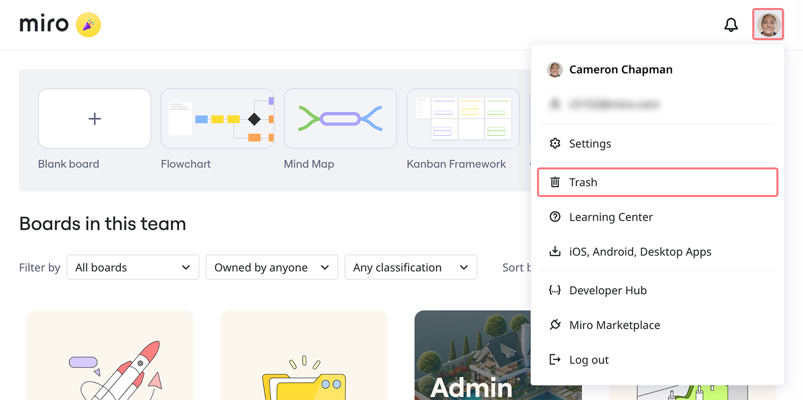

ゴミ箱管理の機能が向上すると、管理者は、Miro ボードのライフサイクルをより可視化し、コントロールできるようになり、一定期間後にコンテンツを削除する必要がある、より制限の厳しいコンプライアンス規則にも対応できるようになります。

:::warning
ゴミ箱の管理は、有料プランでのみ利用できます。Free プランのお客様は、ボードのリンクをたどってボードを復元することができます。これらのボードは、削除後 90 日以内であれば復元できます。
:::

## ゴミ箱にアクセスする方法

ゴミ箱は、削除されたすべてのボードを表示し、管理できる一般的なバケットです。**ボード名**、**チーム**、**プロジェクト**、**所有者**、ボードの**削除者**、**削除日**ごとに、ゴミ箱に移動されたボードを表示することができます。ゴミ箱はボード名で検索することもできます。

:::note
ゴミ箱にあるボードを確認することができるのは、ボードの所有者だけです。コンテンツ管理者権限を持つ会社の管理者は、ゴミ箱にある組織全体のすべてのボードを確認できます。
:::

1. ダッシュボード **miro.com/app/dashboard** に移動します
2. 右上のプロフィールアバターをクリックしてください。
3. ゴミ箱アイコンをクリックします
   
   *Miro ダッシュボードのゴミ箱*

## ボードを削除する方法

:::note
ボードの所有者と会社の管理者のみがボードを削除できます。
:::

1. ダッシュボードで、削除したいボードがあるチームに移動します
2. 削除したいボードを見つけ、右端の**三点**リーダー（**...**）メニューをクリックし、**削除を**選択します。
3. ボードを削除するかどうかを確認するよう求められます。**[削除]** ボタンをクリックします
4. ボードはゴミ箱に移動されます

情報カードを使用してボードそのものから直接ボードを削除することもできます。情報カードからボードを削除する方法については、[こちら](07-how-to-delete-a-board.md)をご覧ください。

## ボードを完全に削除する方法

1. ゴミ箱に移動します
2. 完全に削除したいボードを見つけ、右端の**三点**リーダー(**...**)メニューをクリックし、**Delete permanentlyを**選択します。
3. ボードを完全削除するかどうかを確認するよう求められます。「1 つのボードを完全削除する」にチェックを入れ、**[完全に削除]** ボタンをクリックします

:::warning
ボードを完全に削除すると、検索することはできません。
:::

## ゴミ箱からボードを復元する方法

1. ゴミ箱に移動します
2. 復元したいボードを見つけ、右端の**三点**リーダー(**...)**メニューをクリックし、**復元を**選択します。
3. ボードを復元するかどうかを確認するよう求められます。**[ボードを復元]** ボタンをクリックします
4. ボードは、削除したチームに戻されます

## よくある質問

私は Miro の会社の管理者です。ユーザーから、ボードを誤って削除してしまったと連絡がありました。このボードを復元する方法を教えてください。

上記の「ボードを復元する方法」の手順に従ってください。ボードの所有者と「コンテンツ管理者権限」を持つ会社の管理者のみがボードを復元できます。

ボードを一括削除 / 復元できますか？

一括操作は、現時点ではサポートされていませんが、将来的にリリースを予定しています。

ボードの削除はチームメンバーに通知されますか？

ボードの削除やボードの完全削除が、チームメンバーに通知されることはありません。

削除 / 復元用の公開 API を利用できますか？

公開 API は、現時点ではサポートされていませんが、将来的にリリースを予定しています。
