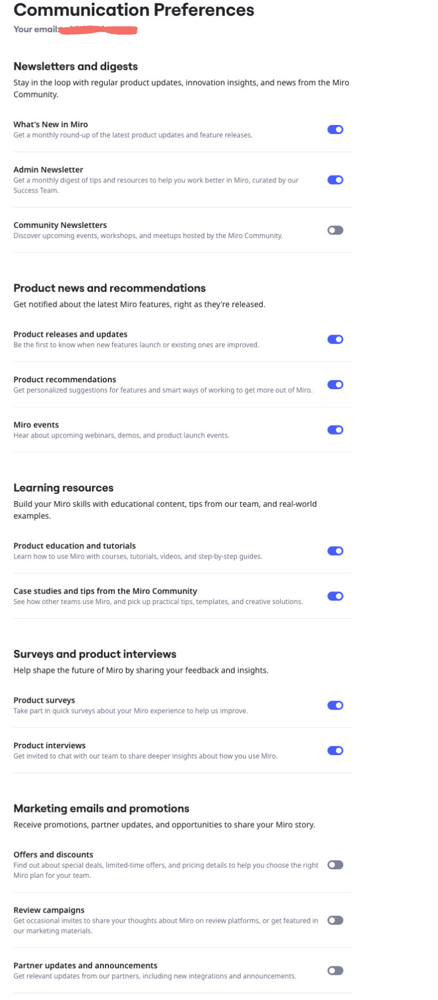

**プロファイル設定**で、Miroから受け取る通知とメールを更新できます。

 ***プロファイル設定**で通知とメールの設定メニューを設定します。*

> **注意:** チームの他のメンバーの通知およびメール設定を変更することはできません。各メンバーが自分自身でプロフィール設定を行います。

### 通知設定を更新する

ボードのアクティビティや会話、テーブル、スペース、チームのアクティビティに関する通知設定を、メール、モバイル、Slack で更新できます。

以下の手順に従ってください：

1. Miro の**ホーム**ダッシュボードから、右上のアバターをクリックします。
2. **プロフィール**をクリックします。
    **プロフィール設定**が表示されます。
3. **通知**タブをクリックします。
4. （オプション）**Slack に接続**をクリックして、Slack で通知を受け取ります。
5. 各行ごとに、メール、モバイル、および Slack で通知を受け取りたいかを選択します。
   設定は自動的に保存されます。
6. **自分のボードにおける変更の概要**を選択した場合、開始時間と通知期間を指定することが可能です。

   > **注意:** タイムゾーンはあなたの位置に基づいて設定されます。

すべての通知を無効にするには、下部の**これらすべての通知を購読解除**をクリックしてください。

> **注意:** Miro の通知は [Microsoft Teams](../../integrations-apps/microsoft/microsoft-teams/10-miro-notifications-in-microsoft-teams.md) や [Google Chat](../../integrations-apps/google/01-miro-for-google-chat.md) でも受け取ることができます。これらのインテグレーションは別途設定が必要です。

> **ヒント:** 各ボードやコメントスレッドの通知を設定できます。ボードの場合は、[ボードバー](../../getting-started/start-here/your-first-board/05-toolbars.md)から縦の三点リーダーをクリックし、**設定**をクリックします。コメントの場合は、コメントをクリックしてからベルアイコンをクリックします。詳細は[コメント](../facilitation-tools/asynchronous-tools/01-comments.md)をご覧ください。

### メールの受信設定を更新する

Miroからのメールの受信について、以下のカテゴリごとに管理できます:

- **ニュースレターとダイジェスト**
  定期的な製品アップデート、管理者向けニュースレター、またはコミュニティーニュースレターで最新情報を得ましょう。
- **製品ニュースとおすすめ情報**
  最新のMiro機能についての情報を取得しましょう。
- **学習リソース**
  チームからのヒントや実例を通じて、Miro のスキルを磨きましょう。
- **アンケートと製品インタビュー**
  Miroの未来を共に形作るためのフィードバックとインサイトを共有してください。
- **マーケティングメールとプロモーション**
  プロモーションやパートナーのアップデートを受け取りましょう。

以下の手順を実施してください：

1. Miro の**ホーム**ダッシュボードから、右上の自分のアバターをクリックします。
2. **プロフィール**をクリックします。
   **プロフィール設定**画面が開きます。
3. **通知**タブをクリックします。
4. 下にスクロールして、**メール設定を管理**をクリックします。
   **コミュニケーション設定**画面が開きます。
5. すべてのメールを受信するかしないかを、それぞれの行で切り替えます。

 ***プロフィール設定** > **メールの受信設定を管理** にある通信設定メニュー。*

すべてのメール通信を無効にするには、下部の**すべての購読を解除**をクリックします。

:::tip
Miro のメール下部にある**購読解除**または**設定を管理**リンクを使用して、メールの受信設定を管理することもできます。
:::
