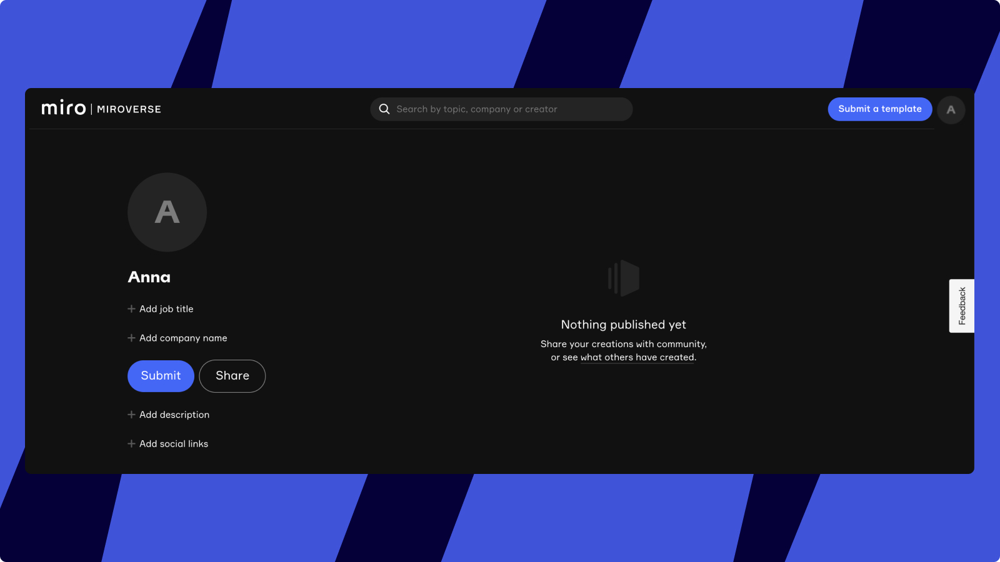
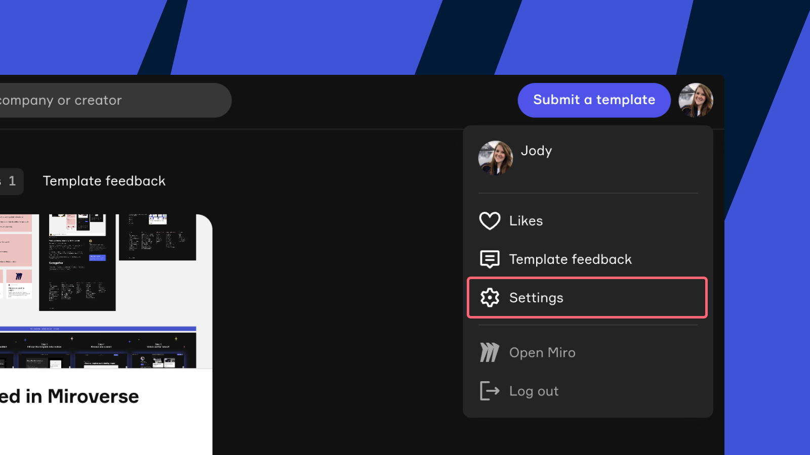
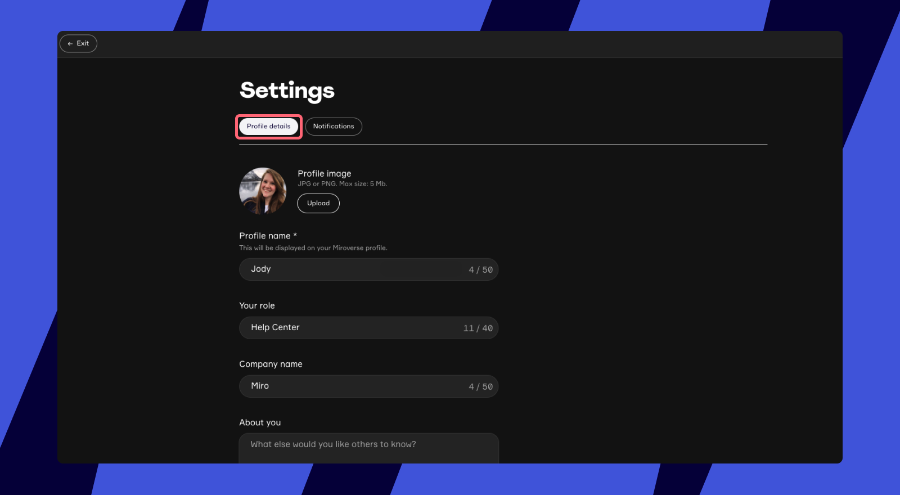
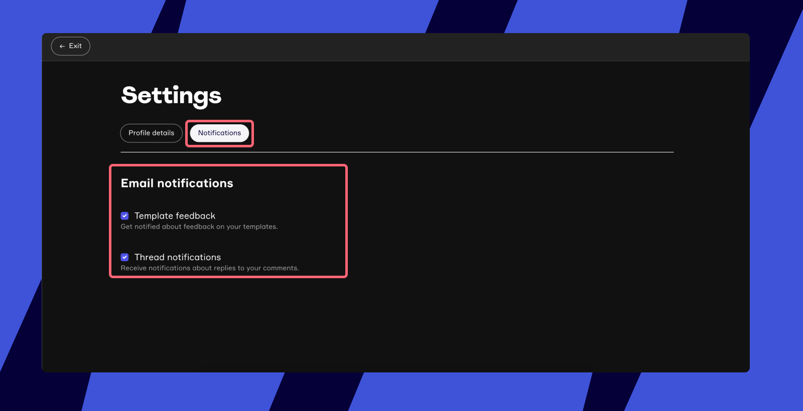
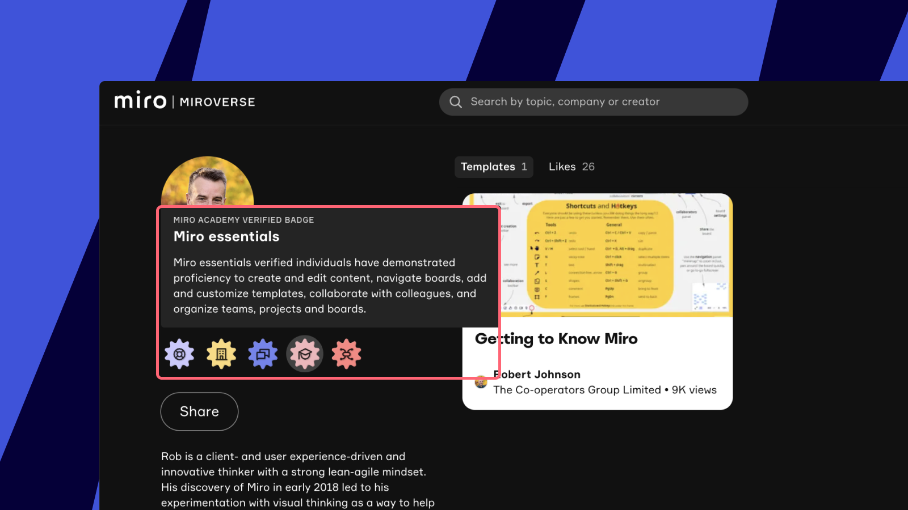
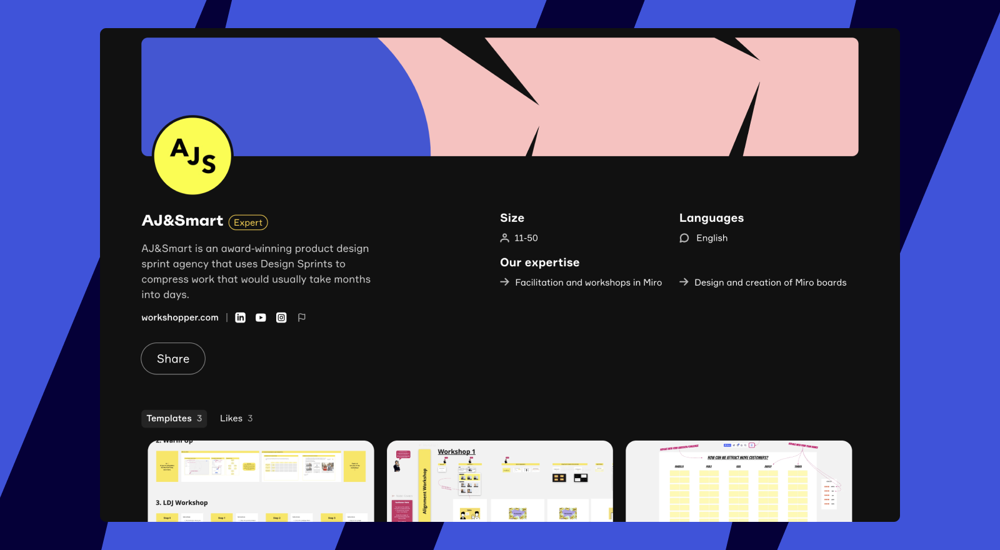
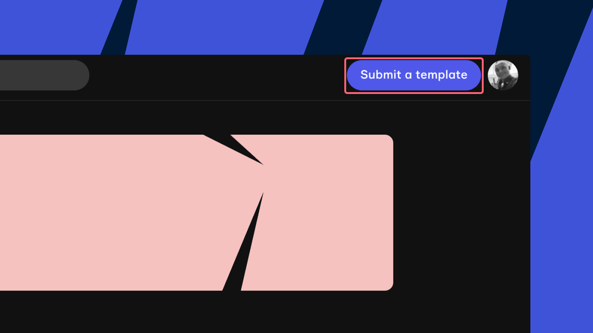

専門性をアピールし、自分の作品を紹介しましょう。プロフィールページでは、誰でもユーザーに関する情報を知り、ユーザーが公開したボードをすべて見ることができます。ここからは、保存されたドラフトや最新の投稿状況など、投稿したすべてのテンプレートを確認することもできます。/span>

## Miroverse のプロフィールの作成

1. Miroverse に移動する
2. 右上の**ログインを**クリックします。Miroのユーザー名とパスワードでログインします。
3. ログインしたら、右上のアバターをクリックしてドロップダウンを開き、以下を選択します。 **プロフィールを作成**.
4. プロフィール名と**ユーザー名**を更新し、**[プロフィールを作成]** をクリックします。

*Miroverseプロファイルを作成するオプション。*

Creating_a_Miroverse_profile.jpg
*Miroverseプロフィール詳細の追加*

Miroverseのプロフィールページにアクセスし、編集することができます。Miroverseのプロフィールを開くには、右上のプロフィール画像またはアバターをクリックしてください。
 
*プロフィールページです。*

:::note
Miroverse のプロフィール情報は、Miro のプロフィールとは接続されていません。Miroverse の公開プロフィールで更新された情報は、Miro のユーザープロフィールに反映されず、またその逆も反映されません。
:::

> ️✏️  Miroverse のプロフィールにテンプレートが公開されるまで、Miroverse でユーザープロフィールを検索することはできません。

## Miroverseの設定

Miroverseの設定は、右上のプロフィール画像またはアバターをクリックし、「**設定**」をクリックします。

Miroverseの設定では、プロフィールの詳細を編集したり、通知の設定を管理することができます。

*Miroverseのプロファイル設定を開きます。*

### プロフィールの編集

以下の Miroverse のプロフィール詳細を更新することができます。

- **プロフィール画像**あなたのプロフィール画像は、表示されるたびにあなたの名前と一緒に表示されます。 JPG または PNG。最大サイズ：5MB
- **プロフィール名**あなたの名前は公開プロフィールページとボードの横に表示されます。これは、ボードが紐づけられているユーザーを示します
- **職種** ：例：ビジュアルコラボレーションプラットフォームこの情報は、ユーザー名とともに表示されます
- 会社名 この情報は役職名と一緒に表示されます。
- **概要：**ここには、あなた自身に関する情報を書き込むことができます。
- **ソーシャルリンク**これらのリンクは、あなたの公開プロフィールページに表示されます。

*ミロバースのプロファイルを。*

### Miroverse通知の管理

受信したいメール通知を選択します。**テンプレートに関するフィードバックの**更新や、**スレッド通知を**受信するかどうかを選択できます。

*Miroverse通知設定*

## Miro アカデミーバッジの表示

[Miro アカデミー](https://academy.miro.com/)でコースを修了すると、バッジを獲得できます。これらのバッジはあなたのMiroverseプロフィールに表示されます。

*MiroverseのMiroアカデミーのバッジです。*

## Miro エキスパートの Miroverse プロフィールページ

Miro のエキスパート専用にデザインされた独自のプロフィールを使用して、最高品質のテンプレートと共にカスタムメイドのサービスをご紹介します。

Miro エキスパートのプロフィールページには、専門知識、規模、サポート言語、ソーシャルメディアへのリンク、テンプレート、「いいね！」など、貴社に関する主要な情報が表示されます。

ユーザーはあなたのプロフィールにある「連絡を**取る**」ボタンから直接連絡を取ることができます。

> ️✏️ 自分のプロフィールを見ると、**[連絡を取る]** ボタンの代わりに **[投稿]** ボタンが表示されます。他のユーザーに自分のプロフィールがどのように表示されているかをプレビューするには、ログアウトするか、シークレットモードでプロフィールを開きます。

:::tip
詳しく知り、[Miro エキスパート](../../plans-billing/miro-special-pricing/07-miro-experts.md)プログラムに応募してください。
:::

*Miro エキスパートのプロフィールです。*

:::note
専門家ディレクトリはそのまま残りますが、各専門家のランディングページはMiroverseのプロフィールページにリダイレクトされます。
:::

### Miro エキスパートの Miroverse のプロフィールの編集

Miro エキスパートは、標準のプロフィール項目に加え、Miroverse プロフィールをさらに編集し、以下の詳細を含めることができます：

- カバー画像
- ヘッドライン
- 連絡先メールアドレス（**お問い合わせ** ボタン用）
- 会社の規模
- 言語
- 専門知識

## Miroverseにテンプレートを投稿します。

新しいテンプレートを投稿するには、 Miroverseプロフィール の右上にある「**テンプレートを投稿** 」をクリックします 。Miroverse テンプレートの投稿の詳細については、こちらをご覧ください。

*新しいテンプレートを投稿します。*

## よくある質問

**Miroverse プロフィールを削除するにはどうすればよいですか？**

Miroverse プロフィールを削除するには、miroverse@miro.com 宛にリクエストをメールしてください。Miroverse プロフィールを削除しても、Miro プロフィールや既存のボードは削除されません。

**Miroverse プロフィールの所有権を譲渡することはできますか？**

はい、Miroverse プロフィール所有者は、プライマリー所有権を別の Miro ユーザーに譲渡することができます。新しいプロフィール所有者の名前とメールアドレスを記載し、譲渡のリクエストを miroverse@miro.com 宛にメールしてください。
