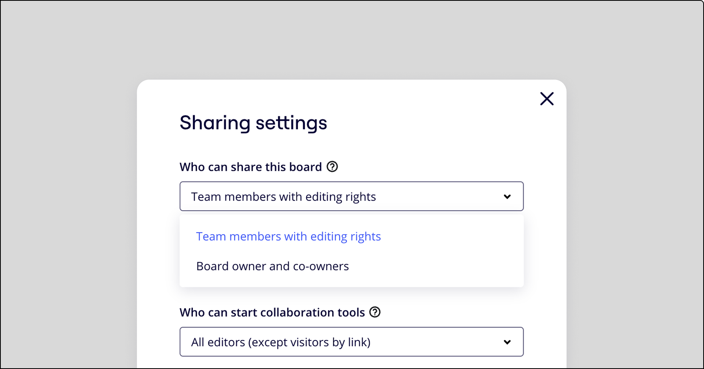
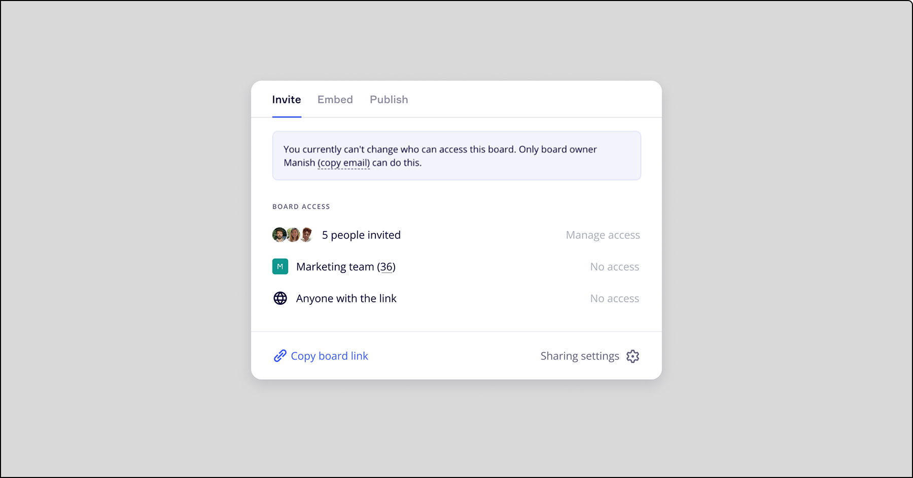

ボード**編集**者として招待された**チームメンバー**は、デフォルトで、[ボードの共有設定の変更](03-sharing-boards-and-inviting-collaborators.md)、新規メンバーの招待、既存のコラボレーターのアクセス権（閲覧、コメント、編集）の変更を行うことも可能です。有料プランおよび Education プランでは、高度なボードの共有アクセス権限をご利用いただけるため、より安心して Miro のボードでコラボレーションできます。

### 高度なボードの共有許可

> 利用可能なプラン：**Starter、Business、Education、Enterprise
> **設定者**：[ボード所有者](06-co-owners-of-boards-and-spaces.md)、**共同所有者/span>

ボードの所有者と共同所有者は、高度なボードの共有アクセス権限の設定で、以下の編集者のアクセス権限を取り消すことができます。

- ボードの共有設定の変更
- 他のユーザーの招待またはボード上の他のユーザーのアクセス権の変更

この方法により、ボードの所有者と共同所有者は、ボードを共有する相手を主体的に管理（必要に応じて制限）することができます。

ボードの**共有**ダイアログを開いて **権限**タブ をクリックします。 **共有設定**をクリックし、適切なオプションを選択します：

- **ボードの所有者と共同所有者**：ボードの共有設定とコラボレーターの招待を、ボードの所有者と共同所有者だけに許可する場合に選択します。
- **編集権限があるチームメンバー**：ボードの共有設定の変更と新しいコラボレーターの招待を、すべてのボード編集者に許可する場合に選択します。

3-1.png
/span>ボードの共有アクセス権限の変更

ボードのアクセス設定を管理し、新しいコラボレーターを招待できるアカウントをボードの所有者と共同所有者のみとした場合、他のボード編集者が共有ウィンドウを開くと、以下のメッセージが表示されます。

 *ボードの共有が許可されていない場合に編集者に表示される通知*
