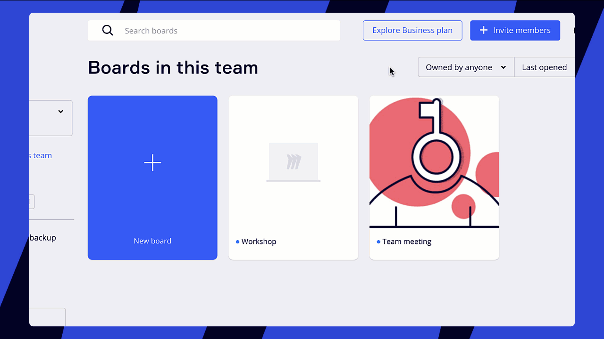

[Miro ボードを画像、PDF、または CSV ファイルとしてエクスポート](../../import-and-export/export/03-how-to-export-your-board.md)できます。Miro ボードをエクスポートする際に問題が発生した場合は、以下のソリューションをお試しください。

## ボードをエクスポートできない

**ボードにエクスポートボタンが表示されない**

エクスポートボタンは、**三点リーダー**（**...**）メニューの内、**ボード**サブメニューの下にあります。

エクスポートオプションが[ボードメニュー](../../../getting-started/start-here/your-first-board/05-toolbars.md)にない場合：

1. ボードコンテンツの設定で、ボードの所有者 / 共同所有者がユーザーにボードのエクスポートを許可していることを確認します。

   ボード所有者の名前を確認するには、左上のボード名をクリックしてボード情報カードを開きます。この情報が表示できない場合は、招待メールでボードに招待したユーザーの名前を確認できます。

   ボードの所有者に連絡し、**[共有]** 画面 > **[共有設定]** でオプションの有効化を依頼します。 > **権限**。所有者/共同所有者は、どのカテゴリのユーザーが[ボードのコンテンツをコピー](../../sharing-boards/14-how-to-allow-or-restrict-copying-and-exporting-boards-and-content.md)できるかを選択する必要があります。
   
   *ボードのコピー対象を設定する*
2. ご利用のブラウザー、プラン、デバイスがエクスポートにサポートしていることを確認します。以下で利用可能かどうかを確認できます。ご利用のブラウザー、プラン、デバイスがエクスポートのオプションにサポートしていない場合は、別のブラウザーやデバイスに切り替えるか、[チームをアップグレード](../../../plans-billing/manage-your-subscription-and-plan/03-upgrade-your-plan.md)することをお勧めします。

   |  |  |  |  |  |  |
   | --- | --- | --- | --- | --- | --- |
   |  | Free プラン | | Starter、Business、Enterprise、Education プラン | | CSV にエクスポート（すべてのプラン） |
   |  | 低解像度 | 透かし無しの高解像度 透かしなし | 低解像度 | 透かし無しの高解像度 |
   | Google Chrome | ✔ | ✘ | ✔ | ✔ | ✔ |
   | Safari | ✔ | ✘ | ✔ | ✔ | ✔ |
   | Firefox | ✔ | ✘ | ✔ | ✔ | ✔ |
   | Opera | ✔ | ✘ | ✔ | ✔ | ✘ |
   | Edge 79 未満 | ✘ | ✘ | ✘ | ✔ | ✘ |
   | [デスクトップアプリ](../../../getting-started/apps-for-devices/05-desktop-app.md) | ✔ | ✘ | ✔ | ✔ | ✔ |
   | タブレット | ✔ | ✘ | ✔ | ✔ | ✘ |
   | モバイル | ✘ | ✘ | ✘ | ✘ | ✘ |

**低品質のエクスポートの場合**

トラブルシューティングするには、ブラウザのタブおよびバックグラウンドのタブを閉じてください。また、別のブラウザに切り替えてみることもできます。

高品質のエクスポートを行うには、以下を試してください:

- エクスポートしたくないフレームを非表示にします。非表示のフレームのコンテンツはエクスポートされません。
- ボードを小さなボードに分割してエクスポートします。

**一般的なヒント**

- エクスポートしたいすべてのものをフレームに入れてください。フレーム内のウィジェットのみがエクスポートされます。
- PDF内のPDFを避けましょう。ボード上のPDFを低品質の画像に置き換えてください。
- 高解像度の画像はJPEGに変換するか、外部ツールでサイズを小さくしてください。
- Miroステータスのページで関連するインシデントを確認してください。
- ボードをフレームに分割し、フレームごとにエクスポートしてください。別々のPDFは後に外部ツールで再結合できます。
- 大きなボードを小さなボードに分割し、[スペース](../../spaces/01-spaces.md)を使用して、関連するボードを整理し、グループ化するのに役立ててください。

**「PDF ドキュメントを生成する際に問題が発生しました」**

ボードをフレームに分割し、フレームごとに別々にエクスポートしてください。この問題は、ボードのサイズが原因である可能性があります。

それでも解決しない場合は、[ブラウザのコンソールログ](../../tools/troubleshooting/07-how-to-troubleshoot-and-report-a-bug.md)を確認してください。ログに以下のメッセージが含まれる場合:

```
ERR_CONNECTION_ABORTED
```

*where:*

エクスポートはお使いのデバイスのセキュリティーソフトウェアやネットワーク内のファイアウォールによってブロックされています。

ユーザーまたはシステム管理者が、Miroがエクスポート手順を実行できるように、ウィルス対策プログラムやファイアウォールの設定を変更する必要があります。

不明点がある場合は、[Miroサポート](../../tools/troubleshooting/06-contacting-miro-support.md)にお問い合わせください。

**ボードをPDFにエクスポートしようとすると何も起こらず、Miroにはエラーが表示されない**

この既知の問題は、主にSafariブラウザーで発生します。原因はポップアップウィンドウが無効化されていることです。Safariの問題を解決するには、[これらの手順](https://support.apple.com/en-gb/guide/safari/sfri40696/mac)をフォローしてください。miro.comまたはすべてのウェブサイトでポップアップウィンドウを有効にしてください。Miroに戻り、再度ボードのエクスポートを試みてください。

Chromeの場合は、[これらの手順](https://support.google.com/chrome/answer/95472?hl=en&co=GENIE.Platform%3DDesktop)に従ってください。

## エクスポートしたファイル（PDF、画像、CSV）に問題が発生した

**エクスポートしたドキュメントの画像 / PDF がぼやけている**

保存したファイルにアップロードした画像または PDF がぼやけている場合：

1. ボードをエクスポートする前に、ボードを 100％にズームして、画像 / PDF ファイルをレンダリングする
2. アップロードした画像 / PDF が複雑すぎる、または大きすぎてエクスポートできないことがあります。ファイルのサイズを縮小するには、画像 / PDF を PNG 形式に変換し、ボード上で置き換えます。その後、ボードを再度エクスポートします。

Free プランでは、低品質でのエクスポートにのみ対応しています。ボードを高品質でエクスポートする必要がある場合は、[有料プランに移行](../../managing-boards/04-how-to-move-a-board.md)するか、[アカウントをアップグレード](../../../plans-billing/manage-your-subscription-and-plan/03-upgrade-your-plan.md)することをお勧めします。

**ボード上のフレームの順序とエクスポートしたページの順序が同じにならない**

PDF にエクスポートしたフレームの順序は、フレームパネルと同じになります。フレームの順序を変更するには:

1. 左下にあるボードの概要を開きます
2. フレームをドラッグして、リスト上の位置を変更します。[Magic organize](../../essential-tools/07-frames.md)を使って、ボード上に配置されている順番でフレームを素早く整列することもできます。
   
   *フレームの順番を変更する*

**エクスポートしたファイルが切り取られる**

ボードを**画像としてエクスポート**する場合は、選択したエクスポートエリアにエクスポートするすべてのコンテンツが含まれていることを確認してください。


*ボードを画像としてエクスポートする*

ボードを**PDFとしてエクスポート**する場合は、エクスポートするコンテンツをすべて含むフレームを必ず作成し、その後[フレームをエクスポート](../../import-and-export/export/03-how-to-export-your-board.md)してください。

**エクスポートした PDF ファイルにフレーム名が含まれていない**

ボードを PDF ファイルとしてエクスポートすると、フレームのタイトルはエクスポートに含まれません。 [テキストツール](../../essential-tools/16-text.md)を使用してフレーム上にテキストを配置することで、タイトルを置き換えることができます。このタイトルが PDF 上に表示されます。

**エクスポートした CSV ファイルのデータが構造化されていない**

現時点では、CSV エクスポートにボードの構造や関係は反映されません。ただし、[テーブル](../../advanced-tools/05-grid.md)を CSV ファイルとしてエクスポートする場合、構造は保存されます。

もし[マインドマップ](../../advanced-tools/03-mind-map.md)をインテリジェントデータとしてエクスポートしたい場合、[Mindmap downloader](https://miro.com/marketplace/mindmapdownloader/?backUrl=%2Fmarketplace%2F)を使用してください。

**ボード上のフォントが、エクスポートしたファイルのフォントと異なる**

Miro のエクスポートでは、デバイスのオペレーティング システムにインストールされているフォントを使用します。OS にフォントがない場合、システムの同様のフォントが代わりに使用されます。Miro ボードと同じフォントが必要な場合は、ボード上で別のフォントを選択するか、デバイスに必要なフォントをインストールしてください。

## エクスポートしたファイルが見つからない

**デバイス上でエクスポートしたファイルが見つからない**

**ブラウザーで Miro を使用している場合**

ファイルはブラウザーのダウンロードファイルがデフォルトで保存されるフォルダーに保存されます。ブラウザーの設定で、ダウンロード オプションを確認することができます。

**Miro デスクトップアプリまたはタブレットアプリを使用している場合**

デバイス上のダウンロード フォルダーを確認してください。ボード名を使用してファイルを検索することもできます。

**Miro でボードをエクスポートするたびに新しいフォルダーが作成される**

> **該当プラン**: [Windows デスクトップアプリ](../../../getting-started/apps-for-devices/05-desktop-app.md)

Miro のアプリ設定にそのパスが保存されている可能性があります。このパスを削除するには、

1. Miro のデスクトップアプリを削除する
2. Windows の左下（検索バー）で **%AppData%** を入力し、フォルダー **Local,** を開いて、フォルダー **RealTimeBoard** を削除する
3. 再度 **%AppData%** を開き、フォルダー **Roaming,** に移動して、フォルダー **RealTimeBoard** を削除する

最新の [Miro アプリケーション](https://miro.com/apps/)を再インストールする.

もしどの解決策も役に立たない場合は、[Miro サポート](../../tools/troubleshooting/06-contacting-miro-support.md)にお問い合わせください。
