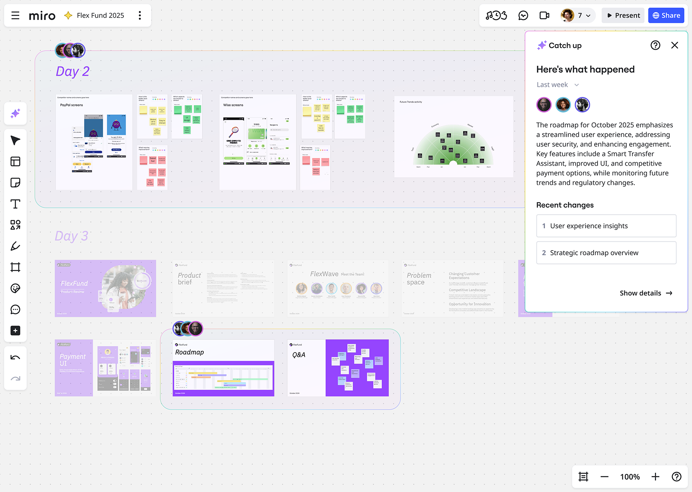

進捗キャッチアップでは、ボードを最後に閲覧してから更新された変更内容を AI が整理し、概要にして提供します。

> ***利用可能なプラン:** すべてのプラン*
> ***利用環境:** デスクトップアプリ、デスクトップブラウザ*
> ***利用する方:** すべてのユーザー*

## 主な機能

進捗キャッチアップの主な機能は次の通りです：

- **ビジュアルハイライトを見る**
  ボードの重要な更新がハイライトされます。
- **変更のクイックサマリー**
  何が変更されたか、どのような対処が必要かをすぐに確認できます。
- **ステップバイステップのウォークスルー**
  編集や変更箇所を順を追って解説し、ボードのセクション別に整理します。

## 進捗キャッチアップの使い方

以下の手順で進捗キャッチアップを利用できます。

1. 右上のツールバーで**アクティビティー** () アイコンをクリックします。
   アクティビティー メニューが開きます。
2. **進捗キャッチアップ**ボタンをクリックします。
   進捗キャッチアップの画面がボード上に開きます。

   *ボード上の進捗キャッチアップダイアログ*
3. **最近の変更内容**が概要とともに表示されます。
4. 最近の変更内容をクリックして、そのパネルに直接移動します。
5. **詳細を表示**をクリックして、変更内容を確認してください。
6. ダイアログにある前後の**矢印**ボタンを使用して、進捗キャッチアップを行き来できます。
7. 数字が書かれたリンクをクリックすると、ボード内の関連するセクションを閲覧できます。
8. ドロップダウンメニューにある「先週、直近 2 週間、先月」から、表示する期間を選択します。

### 進捗キャッチアップを利用する別の手順

他にも次の手順で、進捗キャッチアップを利用できます。

1. ボードの**メインメニュー** ()アイコンをクリックします。
   メインメニューが開きます。
2. **ボード**ボタンにカーソルを合わせます。
   ボードのサブメニューが開きます。
3. **進捗キャッチアップ**ボタンをクリックします。
   進捗キャッチアップのダイアログが開きます。

## よくある質問

**進捗キャッチアップを利用できないのはなぜですか？**

進捗キャッチアップは、Miro AI が有効なユーザーのみご利用いただけます。管理者が Miro AI を無効化している場合、進捗キャッチアップを利用するには、有効にしてもらう必要があります。手順は、次を参照してください：[機能の有効化](../../enterprise-administration/managing-enterprise-teams-and-content/06-feature-activation.md)。
