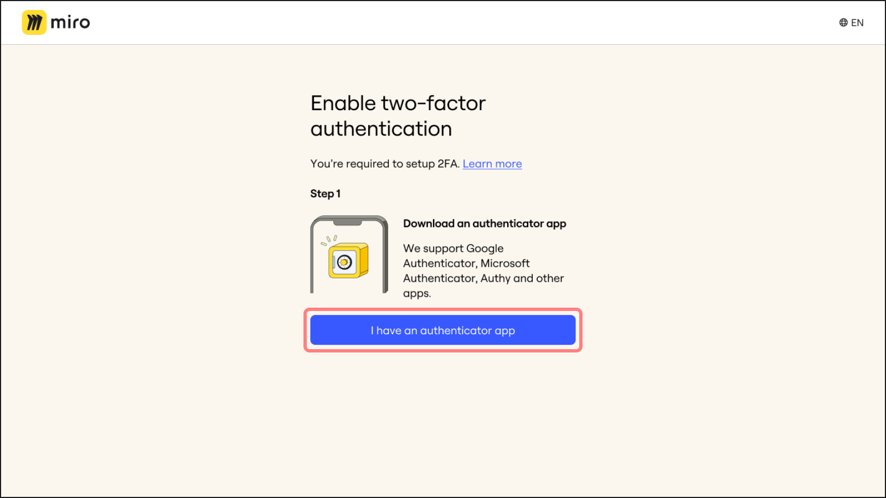
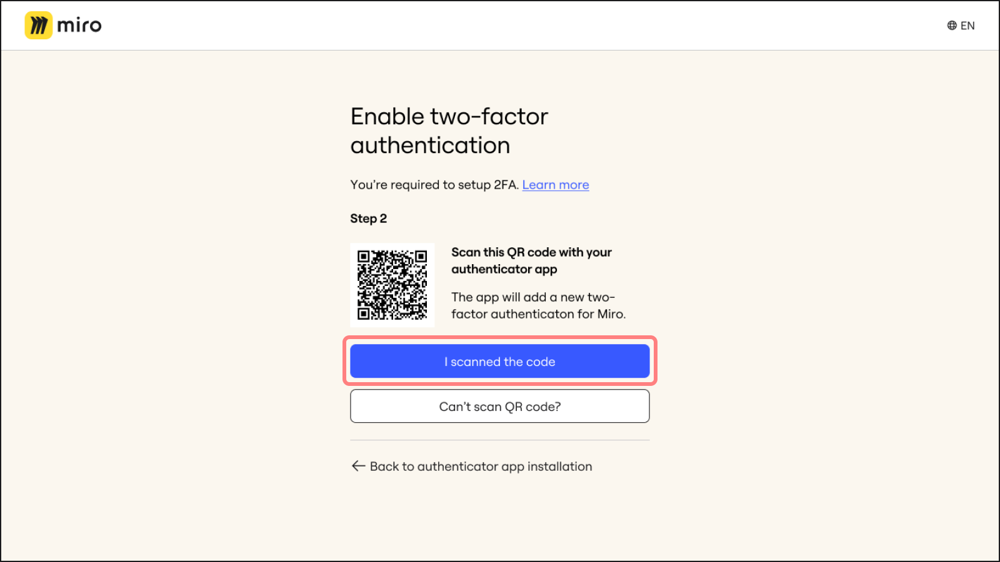
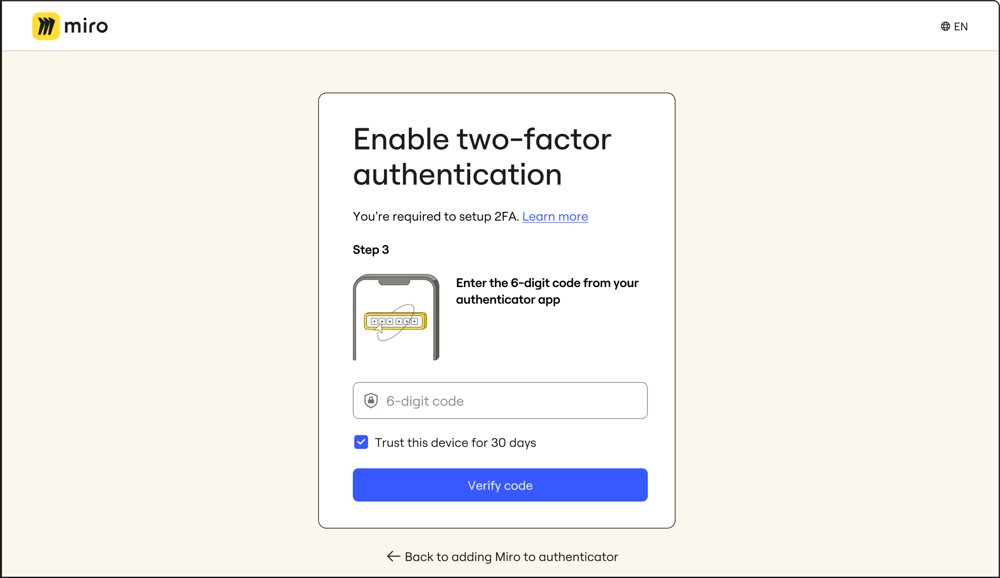
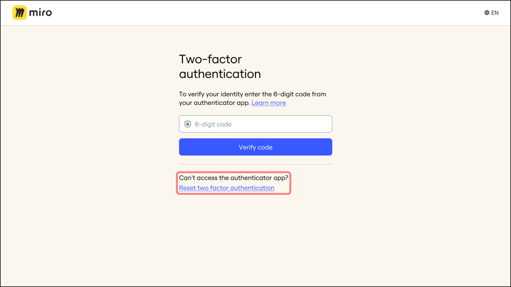

## 이중 인증(2FA)이란 무엇인가요

이중 인증(2FA)은 온라인 계정의 보안을 강화하는 방법입니다. 회사의 관리자가 이중 인증(2FA)을 활성화하면, 이메일과 비밀번호로 Miro에 로그인할 때 추가적인 보안 단계가 따르게 됩니다. 이 추가 단계는 계정을 더 안전하게 보호하며, 정규 로그인 정보 외에 추가 확인을 요구합니다.

:::tip
[Enterprise 플랜](../../enterprise-administration/security-integrations/two-factor-authentication-2fa/01-enterprise-two-factor-authentication-2fa-–-admin-guide.md) 및 [다른 모든 플랜](01-two-factor-authentication-2fa.md)에서 조직을 위한 2단계 인증을 활성화하는 방법을 알아보세요.
:::

## 2단계 인증 설정 방법

**신규 사용자:** 회사 이메일 주소로 [가입](https://miro.com/signup/) 절차를 진행하는 동안 2FA를 활성화하라는 프롬프트를 받게 됩니다.
**기존 사용자:** 다음 번 [로그인](https://miro.com/login/) 시, 조직에서 2FA가 요구되고 SSO(통합로그인)를 사용하지 않는 경우, 2FA를 설정하라는 프롬프트를 받게 됩니다.

1. 모바일 기기에 인증 앱을 다운로드하세요. Google Authenticator, Microsoft Authenticator, Authy와 같은 인증 앱은 Miro 로그인 시 보안을 위한 일회용 비밀번호(TOTP)를 생성합니다. 어떤 인증 앱을 선택할지에 대한 가이드는 회사 관리자나 IT 관리자에게 문의하세요.

2. Miro 2FA 설정 화면에서 **인증 앱이 있습니다** 를 클릭하세요.

   
   *인증 앱 확인*
3. 인증자 앱을 사용하여 두 가지 옵션이 있습니다:

   QR 코드 스캔하기

   1. 인증자 앱을 엽니다.
   2. 앱으로 QR 코드를 스캔합니다.
   3. 스캔한 후, Miro에서 **코드를 스캔했습니다**를 클릭합니다.

      *QR 코드 스캔하기*

   Miro 코드 수동 입력

   1. QR 코드를 스캔할 수 없는 경우, Miro에서 **QR 코드를 스캔할 수 없는 경우**를 클릭하세요.
   2. 그러면 Miro가 인증 코드를 제공할 것입니다. 이 코드를 **복사**하세요.
   3. 인증 앱을 열고 복사한 코드를 붙여넣으세요.
   4. 코드를 앱에 추가한 후, Miro에서 **코드를 추가했습니다**를 클릭하세요.

      *인증 앱에 붙여넣을 Miro 코드 복사*
4. 인증 앱이 생성한 6자리 인증 코드를 Miro에 입력하고 **코드 확인**을 클릭하세요.

   
   *6자리 코드 확인*
5. 6자리 코드로 계정을 성공적으로 인증한 후, Miro는 복구 코드를 제공합니다. 이 코드를 안전하게 저장하려면 **복사**를 클릭하세요. 이 코드는 2FA가 설정된 기기에 접근하지 못할 경우를 대비하여 필수적입니다.

   코드를 기록했음을 확인하려면 **코드를 기록했습니다**, 그런 다음 **계속** 눌러서 과정을 완료합니다.

   *복구 코드 저장*

## 이중 인증(2FA)으로 로그인

계정에 2단계 인증(2FA)을 성공적으로 설정한 후에는 로그인할 때마다 Miro에서 6자리 시간 기반 일회용(TOTP) 코드를 입력하도록 요청합니다.

이 코드는 인증 앱에서 생성되며, 계정의 추가 보안 레이어를 제공합니다. 인증 앱을 열고 현재 코드를 확인한 후 로그인 페이지에 입력하여 계정에 액세스하세요.

*Miro에 2FA로 로그인*

본인 확인 과정에서 로그인을 3번 시도할 수 있으며, 이후엔 로그인을 다시 시작하라는 메시지가 표시됩니다.

*2FA로 너무 많은 로그인 시도*

### 2FA 인증 기기를 신뢰할 수 있게 설정하기

관리자가 설정한 경우, 안전한 기기에서 2FA로 계정에 로그인할 때, **이 기기를 신뢰하기** 체크박스를 선택할 수 있습니다 (공유되거나 공공 접근이 가능한 컴퓨터에서는 **이 기기를 신뢰하기**를 사용하지 마세요). 이렇게 설정하면 관리자가 정한 일정 기간 동안 두 번째 인증 없이 로그인할 수 있습니다. 이 기간은 관리자가 7일에서 90일 사이로 설정합니다.

*이중 인증 로그인 시 신뢰할 수 있는 장치의 지속 시간은 체크박스 옆에 표시됩니다.*

"이 장치를 신뢰" 옵션이 보이지 않는다면, 이는 관리자가 조직에 대해 해당 옵션을 활성화하지 않았음을 의미합니다.

새 장치로 로그인하거나, 신뢰할 수 있는 장치에서 쿠키를 삭제한 경우에는 다시 2단계 인증이 필요합니다.

## 이중 인증(2FA) 재설정 방법

인증 앱에 문제가 있거나 장치를 잃어버리거나 기타 이유로 2단계 인증을 재설정해야 하는 경우, 아래의 단계를 따르세요:

### 복구 코드를 가지고 있습니다

1. **2단계 인증 재설정**을 클릭하세요.
2. 초기 2FA 설정 시 저장한 복구 코드를 사용하세요. 인증 앱을 재설정하는 과정으로 안내될 것입니다.

*2단계 인증을 재설정하는 옵션*

### 복구 코드가 없는 경우

복구 코드를 잃어버렸거나 자가 복구 흐름을 사용할 수 없는 경우, 관리자가 2FA를 재설정하도록 요청해야 합니다.

관리자가 2단계 인증을 초기화할 수 있는 대상은 이메일 도메인이 해당 조직 내에서 검증된 사용자 뿐이며, 이를 요구한 관리자가 초기화를 진행할 수 있습니다. 사용자가 초기화를 요청할 경우, 조직 내 어떤 관리자든 이를 승인할 수 있습니다.

1. **관리자에게 초기화를 요청하세요**를 클릭합니다.
   
   *복구 코드가 없는 경우 관리자에게 2FA 초기화를 요청하세요*
2. 여러 조직의 2단계 인증을 사용하는 경우, 요청을 할 조직의 관리자를 선택해야 합니다.
3. 이메일로 인증 코드를 받게 됩니다.
4. 인증 코드를 입력하세요.
5. 선택한 관리자에게 요청이 전송되었다는 확인 메시지가 표시됩니다.
6. 관리자가 2FA를 재설정하면, 다음에 로그인할 때 2FA 설정 프로세스를 다시 진행해야 합니다.

## 자주 묻는 질문

2FA를 설정해야 하는 이유는 무엇입니까?

이중 인증은 조직의 보안을 강화합니다. 비 SSO 사용자는 기업 관리자가 이 요구사항을 시행하면 이중 인증을 사용하여 로그인해야 합니다.

로그인할 때마다 2FA를 사용해야 하나요?

네. 초기 설정을 완료한 후, 매번 로그인 시 계정을 안전하게 보호하기 위해 인증 앱을 사용해야 합니다.

2FA를 설정하려고 했으나, 코드가 올바른데도 "잘못된 코드" 오류가 발생했습니다. 어떻게 해야 하나요?

기기의 시간대, 날짜, 시간이 올바르게 설정되었는지 확인하세요. 문제가 지속되면 다른 기기에서 2FA를 설정해보세요.

공유 기기를 실수로 신뢰하게 되면 어떻게 하나요?

공유 기기를 실수로 신뢰하게 된 경우, 해당 기기에서 Miro의 쿠키를 삭제해야 합니다. 방법은 간단합니다:

1. 브라우저 주소 표시줄 왼쪽의 슬라이더 아이콘을 클릭하세요.
2. 메뉴에서 "쿠키 및 사이트 데이터"를 클릭합니다.
3. 그런 다음 "기기 내 사이트 데이터 관리"를 클릭하세요.
4. 목록에 있는 각 URL 옆의 휴지통 아이콘을 클릭해 쿠키와 사이트 데이터를 삭제합니다.

사이트 데이터를 기기에서 삭제한 후에는, 2단계 인증을 사용해 다시 로그인해야 합니다.

신뢰할 수 있는 기기에 대한 접근을 잃으면 어떻게 되나요?

신뢰할 수 있는 기간이 만료되기 전에 기기에 대한 접근을 잃은 경우, **모든 기기에서 로그아웃** 옵션을 사용하여 현재 사용 중인 기기를 제외한 모든 로그인된 기기에서 접근을 제거할 수 있습니다. 이렇게 하면 다른 모든 기기에서 로그아웃되고 신뢰할 수 있는 기기에서 2FA가 철회됩니다. **모든 기기에서 로그아웃** 링크는 사용자의 프로필 설정에서 찾을 수 있습니다. 그런 다음 접근할 수 있는 기기에서 2FA 로그인 과정을 다시 거쳐야 합니다.
