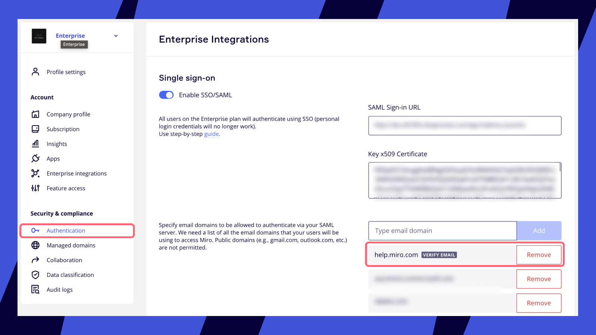

SAML 기반 SSO(통합로그인)를 사용하면 사용자가 선택한 ID 공급업체(IdP)를 통해 Miro에 액세스할 수 있습니다.

> **사용 가능 플랜:** Business 플랜, Enterprise 플랜
> **설정 가능한 사용자:** 회사 관리자

## SAML SSO 작동 방식

1. Miro 사용자가 SSO를 사용해 Miro에 로그인하려고 하면 Miro가 ID 공급업체(IdP)에 SAML(Security Assertion Markup Language) 요청을 보냅니다.
2. ID 공급업체는 사용자의 신원 정보를 검증하고 신원 확인을 위해 Miro에 응답을 다시 전송합니다.
3. Miro는 응답을 승인하고 액세스 권한을 부여해 사용자가 Miro 계정에 로그인할 수 있도록 합니다.

## SSO를 활성화하면 어떻게 되나요?

**처음 SSO 활성화하기**

SSO를 처음 설정하면 기존 사용자는 중단 없이 Miro에서 계속 작업할 수 있습니다. 그러나 다음에 로그아웃하거나, 세션이 만료되거나, 새 장치에서 로그인을 시도하면 SSO를 통해 로그인해야 합니다.

표준 로그인 + 비밀번호, Google, Facebook, Slack, AppleID, O365를 포함한 다른 사용자 로그인 옵션은 비활성화됩니다.

**유휴 세션 시간 초과**

[유휴 세션 시간 초과](../../security-integrations/security-management/02-idle-session-timeout.md)를 활성화한 경우, 사용자는 Miro 프로필에서 자동으로 로그아웃되며 SSO를 통해 다시 인증해야 합니다.

**여러 팀 및 조직**

사용자가 여러 Miro 팀이나 조직을 가지고 있는 경우 동일한 ID 공급업체를 인증에 사용하도록 구성할 수 있습니다.

**SSO로 로그인해야 하는 사용자**

Enterprise 구독에 속해 있고, SSO 설정에 등록된 도메인을 가진 2가지 조건 *모두*를 충족하는 활성 사용자는 SSO로 로그인해야 합니다.

- SSO 설정에 등록되지 않은 도메인에서 Miro에 액세스하는 사용자는 SSO로 로그인할 필요가 없으며 대신 표준 로그인을 사용해 로그인해야 합니다.
- Miro Enterprise 구독에 속하지 않지만 인증된 도메인을 사용하는 사용자는 [JIT(Just-In-Time) 프로비저닝](../../user-management/13-user-provisioning-on-enterprise-plan.md)이 활성화된 경우에만 SSO를 통해 로그인해야 합니다. 이러한 사용자는 사전 구성된 팀에 자동으로 추가되며 로그인 시 SSO를 사용해야 합니다.
- Enterprise 구독 외부의 Miro 팀에 속한 [관리되는 사용자](../../user-management/06-managed-users-on-enterprise-plan.md) 또한 인증을 위해 SSO를 사용해야 합니다. 이러한 사용자는 다른 팀에 액세스할 수 있습니다. 특정 팀에 대한 액세스를 제한하려면 [도메인 제어](../../canvas-25-admin-features/domain-control/01-domain-control.md) 설정을 업데이트하세요.

**사용자 세부 정보 관리하기**

로그인에 성공하면 ID 공급업체가 자동으로 사용자 데이터를 Miro에 제공합니다. 이름 및 비밀번호와 같은 일부 매개 변수는 변경할 수 없습니다. 부서 및 프로필 사진과 같은 기타 매개 변수는 선택 사항입니다.

- Miro 사용자 이름은 사용자 인증이 성공할 때마다 업데이트됩니다. Miro 사용자 이름을 설정하는 방법에 대한 자세한 내용은 고급 SSO 설정을 참고하세요. 사용자의 이메일 주소를 변경해야 하는 경우 [SCIM](../../security-integrations/system-for-cross-domain-identity-management-scim/02-scim.md)을 통해서만 변경할 수 있습니다. SCIM을 사용하지 않는 경우 [지원팀에 문의](https://help.miro.com/hc/requests/new?referer=help-center-article)하세요.

*SSO 설정의 도메인*

> **💡**잠금을 방지하려면 SSO 설정에 나열된 도메인 외 도메인을 가진 이메일(예: acmebreaktheglass@gmail.com)을 사용해 비상시 잠금 해제용 사용자를 생성하세요. 또는 지원팀에 문의해 전체 조직에 대해 SSO를 비활성화할 수 있습니다.

## SSO 구성하기

### ID 공급업체(IdP)

원하는 ID 공급업체를 사용하세요. 다음은 널리 사용되는 ID 공급업체 플랫폼입니다.

- [OKTA](../../security-integrations/single-sign-on-sso/07-how-to-configure-okta-sso.md)
- [Azure AD](../../security-integrations/single-sign-on-sso/05-how-to-configure-entra-id-sso.md)(Microsoft)
- [OneLogin](../../security-integrations/single-sign-on-sso/08-how-to-configure-onelogin-sso.md)
- [ADFS](../../security-integrations/single-sign-on-sso/02-how-to-configure-adfs-sso.md)(Microsoft)
- [Auth0](../../security-integrations/single-sign-on-sso/03-how-to-сonfigure-auth0-sso.md)
- [Google SSO](../../security-integrations/single-sign-on-sso/06-how-to-configure-google-sso.md)
- [Jumpcloud SSO](https://support.jumpcloud.com/support/s/article/single-sign-on-sso-with-miro)

### IdP 구성하기

> ****💡**** Enterprise 조직에 [여러 IdP](../../security-integrations/single-sign-on-sso/01-adding-multiple-identity-providers.md)를 추가하려면 [비공개 베타](https://coda.io/form/Miro-Multi-IdP-Private-Beta-Sign-Up_dkoTJMza_jV)에 등록하세요.

1. ID 공급업체의 구성 섹션으로 이동한 다음 지침에 따라 SSO를 구성합니다.

2. 다음의 메타데이터를 추가합니다. 선택 필드는 모두 건너뛰고 기본값은 모두 그대로 두는 것이 좋습니다.

#### 사양(메타데이터)

|  |  |
| --- | --- |
| **프로토콜** | SAML 2.0 |
| **바인딩** | SP에서 IdP로 HTTP REDIRECT IdP에서 SP로 HTTP POST |
| **서비스 URL**(SP 시작 URL)  시작 URL, 응답 URL, 신뢰 당사자 SSO 서비스 URL, 대상 URL, SSO 로그인 URL, ID 공급업체 엔드포인트 등이라고도 함 | https://miro.com/sso/saml |
| **어설션 소비자 서비스(ACS) URL**   허용된 콜백 URL, 사용자 지정 ACS URL, 응답 URL이라고도 함 | https://miro.com/sso/saml |
| **엔티티 ID**   식별자, 신뢰 당사자 트러스트 식별자라고도 함 | https://miro.com/ |
| **기본 릴레이 상태** | 구성에서 *비워둬야* 함 |
| **[서명 요구 사항](https://developers.onelogin.com/saml/examples/response)** | *서명된* 어설션이 있는 서명되지 않은 SAML 응답  *서명된* 어설션이 있는 서명된 SAML 응답 |
| **SubjectConfirmation 메서드** | "urn:oasis:names:tc:SAML:2.0:cm:bearer" |
| ID 공급업체 SAML 응답에는 ID 공급업체가 발급한 **공개 키 x509 인증서**가 포함되어야 합니다.  자세한 SAML 예시는 [여기](https://www.samltool.com/generic_sso_res.php)에서 확인할 수 있습니다. [Miro SP 메타데이터 파일](https://drive.google.com/file/d/1BN58fiwC062F5MC-PsO3QN7JlCbKNCSJ/view)(XML)을 다운로드하세요. | |

:::warning
암호화 및 통합로그아웃(Single Log Out)은 지원되지 않습니다.
:::

#### 사용자 신원 정보

아래 나열된 항목 외의 필드는 필수가 아닙니다. 선택 필드는 모두 건너뛰고 기본값은 모두 그대로 두는 것이 좋습니다.

|  |  |
| --- | --- |
| 필수 사용자 신원 정보 속성 | |
| **NameID**(사용자의 이메일 주소와 동일)  SAML_Subject, 기본 키, 로그온 이름, 애플리케이션 사용자 이름 형식 등이라고도 함 | &lt;NameID 형식="urn:oasis:names:tc:SAML:1.1:nameid-format:emailAddress"&gt; |
| **어설션과 함께 전송될 선택적 속성**  (SSO를 통한 새 인증이 있을 때마다 업데이트되며, 존재하고 사용 가능한 경우에 사용됨) | - "DisplayName" 또는 "http://schemas.microsoft.com/identity/claims/displayname"(선호 이름으로 사용됨)   [mceclip0.png](http://schemas.xmlsoap.org/ws/2005/05/identity/claims/givenname)   - “FirstName”, "GivenName" 또는 "http://schemas.xmlsoap.org/ws/2005/05/identity/claims/givenname"; - “LastName”, "Surname" 또는 "http://schemas.xmlsoap.org/ws/2005/05/identity/claims/surname"; - “ProfilePicture“ - 이미지의 인코딩된 URL |

### Miro 설정에서 SSO 활성화하기

:::note
설정에서 SSO를 활성화해도 즉시 사용자에게 SSO가 활성화되지는 않습니다. 도메인이 인증된 후에만 SSO 로그인을 사용할 수 있습니다.
:::

Business 플랜 Enterprise 플랜

1. **회사** 설정 > **보안** > **SSO(통합로그인)**으로 이동합니다.
2. **SSO/SAML을 켭니다.

**

1. **회사** 설정 > **보안 및 규정 준수** > **인증** > **SSO(통합로그인)**으로 이동합니다.
2. **SSO/SAML을 켭니다.

**

Miro 설정에서 SSO 구성하기

SSO 설정에서 SSO/SAML 기능을 켠 후 다음 필드를 입력하세요.

1. **SAML 로그인 URL**: 대부분의 경우 최종 사용자가 신원 정보를 입력해야 하는 ID 공급업체 페이지가 열립니다.
2. **공개 키 x.509 인증서**: ID 공급업체가 발급하는 인증서입니다.
3. SAML 서버를 통해 인증하는 데 허용되거나 필요한 모든 도메인 및 하위 도메인(ACME.com 또는 ACME.dev.com)

*Miro SSO 설정*

### SSO/SAML 인증서 갱신하기

공개 키 x.509 인증서가 만료되어도 SSO는 계속 작동하지만, Miro를 안전하게 계속 사용하려면 갱신하는 것이 좋습니다. 공개 키 x.509 인증서는 ID 공급업체와 Miro간에 공유되는 정보의 보안, 개인 정보 보호, 신뢰성, 무결성을 보장합니다.

이 인증서는 ID 공급업체가 지정(및 인증)할 수 있는 기간 동안만 유효합니다. 만료일을 확인하려면 ID 공급업체에 문의하세요.

인증서 갱신 프로세스는 다음 두 단계로 이루어집니다.

1. ID 공급업체로 인증서를 갱신합니다. 이 작업을 수행하는 방법은 ID 공급업체가 제공하는 지침을 확인하세요.
2. Miro SSO 구성에 갱신된 인증서를 추가합니다.

#### Miro에 갱신된 인증서 추가하기

:::warning
로그인 중단을 방지하려면 조직이 덜 바쁜 시간(예: 주말 또는 업무 시간 이후)에 x.509 인증서를 교체하는 것이 좋습니다.
:::

1. **회사 설정** > **인증** > **SSO(통합로그인)**으로 이동합니다.
2. **Key x.509 인증서** 필드 내의 콘텐츠를 삭제합니다.
3. 필드에 새 키를 붙여넣습니다.
4. 아래로 스크롤하고 **저장**을 클릭합니다.
   *Miro에서 x.509 인증서 갱신하기*

### SSO 도메인 인증하기

> **설정 권한을 가진 사용자:** 회사 관리자

:::tip
[도메인 제어](../../canvas-25-admin-features/domain-control/01-domain-control.md)를 통해 이미 인증된 도메인은 다시 인증할 필요가 없습니다.
:::

도메인 이름을 입력한 후에는 해당 도메인 이름을 인증해야 합니다. 도메인이 SSO 설정의 도메인 목록에 추가된 후 인증될 때까지는 사용자가 SSO를 사용할 수 없습니다. 도메인이 인증되지 않으면 SSO 설정에 **이메일을 인증하세요**라는 안내가 표시됩니다.

*Miro SSO 설정의 인증되지 않은 도메인 표시*

### 도메인 인증 요구 사항

- 인증을 수행하는 사람은 회사 관리자여야 합니다. 회사 관리자로서 회사 관리자가 **아닌** 사람에게 인증 이메일을 보내려면 확인 링크가 포함된 인증 이메일을 전달해 프로세스를 완료할 수 있습니다.
- 인증 이메일을 받을 수 있는 실제 이메일 주소를 사용해야 합니다.
- 공개 도메인(예: @gmail.com, @outlook.com 등)은 허용되지 않습니다.
- SSO 기능을 활성화하고 도메인 이름을 SSO 설정에 추가해야 합니다.

### 도메인 인증하기

1. 도메인을 추가하면 도메인을 인증하기 위해 이메일 주소를 입력하라는 팝업이 열립니다. SSO 설정에 추가한 것과 동일한 도메인의 이메일 주소를 입력해 해당 도메인의 사용자임을 증명합니다.
2. **인증 보내기**를 클릭합니다.
3. 15분 이내에 인증 이메일을 받게 됩니다.
4. 이메일의 인증 링크를 클릭해야 합니다. 이 단계를 완료하려면 회사 관리자여야 합니다.
5. **저장** 버튼을 클릭해 완료합니다.
6. 이제 인증된 도메인의 사용자가 SSO로 로그인할 수 있습니다.


*SSO 도메인 인증 팝업*

:::tip
여러 개의 도메인 및 하위 도메인을 관리하는 경우(하위 도메인은 별도의 이름으로 인식되어 별도 인증 필요) 먼저 하나 이상의 도메인 이름을 인증한 다음, 지원팀에 쉼표로 구분된 전체 도메인 목록과 함께 [지원 요청을 제출](https://help.miro.com/hc/requests/new?referer=help-center-article)하면 한 번에 확인할 수 있습니다. 도메인이 10개 이상인 경우 Miro가 대신 인증을 수행합니다. 도메인이 10개 미만인 조직은 반드시 직접 인증해야 합니다. Business 플랜에서는 조직당 3개의 도메인만 인증할 수 있습니다.
:::

## SSO 구성 테스트하기

SSO 구성을 활성화하기 전에 테스트해 사용자의 로그인 문제 발생 가능성을 줄이세요.

1. 위의 단계를 완료해 SSO 설정을 구성합니다.
2. **SSO 구성 테스트** 버튼을 클릭합니다.
3. 결과를 검토합니다.

- 문제가 발견되지 않으면 **SSO 구성 테스트에 성공했습니다**라는 확인 메시지가 표시됩니다.
- 문제가 발견되면 **SSO 구성 테스트에 실패했습니다**라는 확인 메시지와 함께 수정해야 할 사항을 안내하는 자세한 오류 메시지가 표시됩니다.


*SSO 구성 테스트하기*

## 고급 SSO 설정(선택 사항)

선택 사항 설정 섹션은 SSO 구성에 익숙한 고급 사용자가 사용합니다.

### 신규 사용자를 위한 JIT(Just In Time) 프로비저닝

JIT 프로비저닝을 사용하면 신규 사용자가 초대를 기다리거나 긴 온보딩 프로세스를 거치지 않고도 Miro를 바로 시작할 수 있습니다. 또한 관리되는 구독 외부에서 무료 팀이 생성되지 않도록 합니다(도메인 제어 필요). 신규 사용자의 JIT 프로비저닝을 활성화하려면 SSO가 필요합니다. JIT로 프로비저닝된 모든 사용자에게는 구독의 기본 라이선스가 할당됩니다.

|  |  |  |
| --- | --- | --- |
| **구독 유형** | **라이선스 유형** | **라이선스 만료 시 동작** |
| Business 플랜 | 풀 라이선스 | 사용자가 자동으로 추가되지 않으며 JIT 기능 작동 중지 |
| Enterprise 플랜([플렉시블 라이선스 프로그램](../../enterprise-subscription-management/enterprise-licensing/03-flexible-licensing-program-flp.md) 없음) | 풀 라이선스 | 사용자가 [제한된 무료](../../enterprise-subscription-management/enterprise-licensing/04-free-restricted-license.md) 라이선스로 프로비저닝됨 |
| Enterprise 플랜(플렉시블 라이선스 프로그램 활성화) | 무료 또는 제한된 무료 라이선스 | [기본 라이선스](../../enterprise-subscription-management/enterprise-licensing/05-license-management-on-the-flexible-licensing-program-flp.md) 설정에 따라 다름 |

### JIT(Just-in-Time) 프로비저닝 활성화하기

JIT 프로비저닝을 활성화하면 Miro에 등록한 모든 신규 사용자에게 자동으로 적용됩니다. 그러나 기존 Miro 사용자는 플랜에 가입하려면 초대를 받아야 합니다.

1. SSO 설정으로 이동합니다.
2. **나열된 도메인을 사용해 새로 등록하는 모든 사용자를 자동으로 Enterprise 계정에 추가** 상자를 선택합니다.
3. **새로 등록한 사용자의 기본 팀 선택** 드롭다운에서 팀을 선택합니다.
4. **저장**을 클릭합니다.

SSO(통합로그인) 설정에서 특정 도메인을 나열하면 해당 도메인으로 등록하는 모든 사용자가 자동으로 Enterprise 구독에 추가됩니다. 이러한 사용자는 JIT 설정에서 선택한 팀에 할당됩니다.

*Enterprise 통합 페이지에서 JIT 프로비저닝 기능 활성화*

이제 설정에 나열된 도메인으로 등록하는 모든 *신규 사용자*가 Miro에 가입하면 Enterprise 구독 산하의 **지정한****팀**에 자동으로 추가됩니다.

:::warning
Enterprise 플랜에서는 [팀 검색 가능](../../managing-enterprise-teams-and-content/11-manage-team-privacy-and-discovery-on-enterprise-plan.md)을 활성화하면 이 팀이 검색 가능한 팀 목록에도 표시됩니다.
:::

### DisplayName을 기본 사용자 이름으로 설정하기

기본적으로 Miro는 **FirstName** + **LastName** 속성을 사용합니다. 또는 **DisplayName**을 대신 사용하도록 요청할 수 있습니다. 이 경우 Miro는 사용자의 SAML 응답에 **DisplayName**이 *있다면* DisplayName을 사용합니다.

**DisplayName**이 없지만 **FirstName** + **LastName**이 있으면 Miro는 **FirstName** + **LastName을 사용합니다.** **DisplayName**을 선호 SSO 사용자 이름으로 설정하려면 Miro 지원에 문의하세요.

SAML 통신에 이 세 가지 속성 모두가 없으면 Miro는 사용자의 이메일 주소를 사용자 이름으로 표시합니다.

|  |  |
| --- | --- |
| **설정** | **기본 사용자 이름** |
| Miro 사용자 이름 | FirstName + LastName |
| 대체 설정 | DisplayName(사용자의 SAML 요청에 있는 경우) |
| 대체 | FirstName + LastName(DisplayName이 없는 경우) |
| 선호 SSO 사용자 이름 | DisplayName([Miro 지원에 문의](../../../using-miro/tools/troubleshooting/06-contacting-miro-support.md)) |
| 속성 없음 | 이메일 주소가 사용자 이름으로 표시됨 |

예상과 다른 이름이 표시되면 SSO를 통해 인증해야 할 수도 있습니다. 또는 SAML 응답에 업데이트에 필요한 값이 포함되어 있지 않을 수 있습니다.

### IdP에서 사용자 프로필 사진 동기화하기

:::warning
일반적으로 SCIM을 활성화하지 않았거나 IdP가 **ProfilePicture** 속성을 지원하지 않는 경우(예: Azure에서 **ProfilePicture** 미지원) 이 옵션을 활성화하는 것이 좋습니다. 그 외의 경우에는 즉시 업데이트를 통해 **ProfilePicture**를 [SCIM](../../security-integrations/system-for-cross-domain-identity-management-scim/02-scim.md)으로 전달하는 것이 좋습니다.
:::

이 설정이 켜져 있으면 다음 사항이 적용됩니다.

- IdP 측에서 설정한 프로필 사진이 사용자의 Miro 프로필에서 프로필 사진으로 설정됩니다.
- 사용자는 자신의 프로필 사진을 직접 업데이트하거나 제거할 수 없습니다.

사용자 이름 속성과 마찬가지로 사용자는 Miro에서 바로 데이터를 변경할 수 없습니다. 데이터 *동기화*는 즉시 이루어지지 않으며, IdP는 사용자가 *다음에* SSO 인증을 진행할 때 업데이트된 항목을 Miro에 전송합니다. 단, 이 때 “IdP에서 사용자 프로필 사진 동기화” 설정이 계속 활성화되어 있어야 합니다.

프로필 사진이 IdP에 설정되어 있고 SAML 통신에서 이 속성이 전달되게 하려는 경우 Miro에서 요구하는 스키마는 다음과 같습니다.

```
<saml2:Attribute Name="ProfilePicture" NameFormat="urn:oasis:names:tc:SAML:2.0:attrname-format:uri">
<saml2:AttributeValue
xmlns:xs="http://www.w3.org/2001/XMLSchema"
xmlns:xsi="http://www.w3.org/2001/XMLSchema-instance" xsi:type="xs:string">https://images.app.goo.gl/cfdeBqKfDKsap1icxecsaHF
</saml2:AttributeValue>
</saml2:Attribute>
```

### SSO의 데이터 레지던시 관련 설정

[Miro의 데이터 레지던시](../../canvas-25-admin-features/data-security/03-eu-data-center-residency.md) 지원을 사용하고 전용 URL(workspacedomain.miro.com)이 있는 경우 ID 공급업체의 구성을 조정해야 합니다.

그러려면 [ORGANIZATION_ID]를 URL에 추가해야 합니다.

Miro 대시보드 오른쪽 상단 모서리의 **프로필** > **설정** > 주소 표시줄의 URL에서 ORGANIZATION_ID를 확인할 수 있습니다.

|  | 표준 값 | 데이터 레지던시에 따른 값 |
| --- | --- | --- |
| **어설션 소비자 서비스 URL**(또는 허용된 콜백 URL, 사용자 지정 ACS URL, 응답 URL): | https://miro.com/sso/saml | https://workspace-domain.miro.com/ sso/saml/ORGANIZATION_ID |
| **엔티티 ID**(식별자, 신뢰 당사자 트러스트 식별자): https://miro.com/ | https://miro.com/ | https://workspace-domain.miro.com/ ORGANIZATION_ID |

### SSO 외부 사용자를 위한 이중 인증(2FA) 설정하기

2FA(이중 인증)는 보안 계층을 추가적으로 제공합니다. 2FA를 사용하면, 사용자는 로그인 시 신원을 확인하기 위해 추가 단계를 완료해야 합니다. 이 추가 조치를 통해 승인된 개별 사용자만 구독에 액세스할 수 있습니다.
[이중 인증 관리자 가이드](../../security-integrations/two-factor-authentication-2fa/01-enterprise-two-factor-authentication-2fa-–-admin-guide.md)에서 자세히 알아보세요.

## 발생할 수 있는 문제 및 해결 방법

내 도메인 주소가 SSO 설정에서 허용되지 않습니다. - `DomainName이 사용 중입니다` 메시지가 표시됩니다.

보안상의 이유로 조직의 도메인은 *오직 한 회사 산하(Enterprise 구독)*에서만 지원됩니다. 다른 Business 플랜 또는 [Enterprise 플랜](../../../plans-billing/miro-plans/04-enterprise-plan.md)에 이미 도메인이 설정되어 있으면 원하는 도메인으로 SSO를 활성화하지 못할 수 있습니다. 따라서 사전에 동료와 확인하는 것이 좋습니다.

도메인 인증 이메일의 링크를 따라갔지만 인증이 완료되지 않습니다.

링크는 **Enterprise 통합** 페이지로 연결됩니다. 통합 페이지로 이동하지 않는다면 연결을 방해할 수 있는 피싱 방지 소프트웨어를 사용하고 있는지 확인하세요. 또한 링크를 클릭할 때 Miro 회사 관리자인지 확인하세요. 회사 관리자만 설정 페이지에 액세스할 수 있습니다.

최종 사용자의 이메일 주소를 변경해야 합니다. / 사용자의 이메일을 변경했는데 사용자가 보드에 액세스할 수 없습니다.

회사가 도메인 이름을 변경해 최종 사용자의 이메일 주소도 SSO 신원 정보를 변경해야 하는 경우 [지원팀에 문의해](https://help.miro.com/hc/requests/new?referer=help-center-article) 도움을 받으세요.

SSO 절차에 별도의 게이트웨이(예: Duo Dag과 같은 MFA)를 사용하고 싶습니다.

당연히 가능합니다. Miro는 SAML 2.0에서 작동하는 한 원하는 모든 솔루션을 지원합니다.

SSO를 활성화했지만 Miro의 사용자 프로필 데이터(IdP에서 지원하는 경우 이름, 프로필 사진)가 IdP의 데이터와 동기화되지 않습니다.

SAMLResponse에 비어 있지 않은 새 값이 포함된 *경우* 사용자 인증이 성공할 때마다 Miro 사용자 이름과 프로필 사진이 업데이트됩니다. Miro 사용자 이름을 설정하는 방법에 대한 자세한 내용은 고급 SSO 설정(선택 사항)을 참고하세요.

Miro에 로그인할 때 한 사용자 또는 모든 사용자에게 오류가 발생하는 경우 [일반적인 오류 목록](../../../using-miro/tools/troubleshooting/10-i-can't-log-in-via-sso.md)과 해결 방법을 확인하세요.
