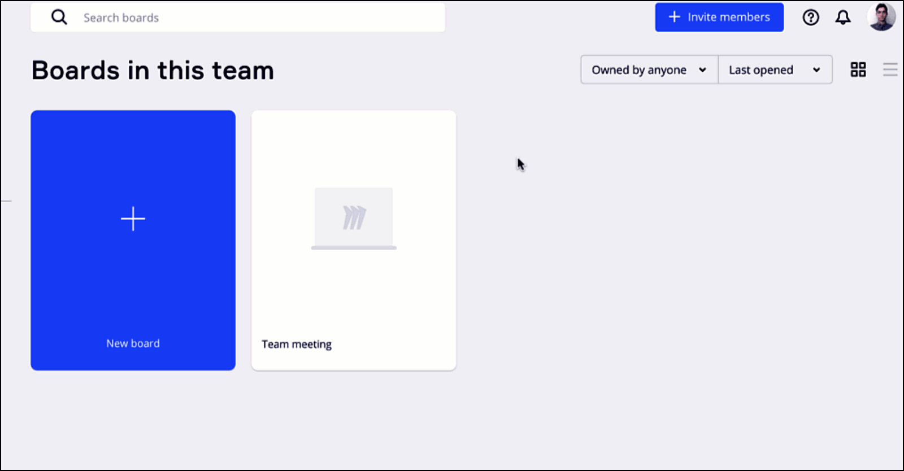
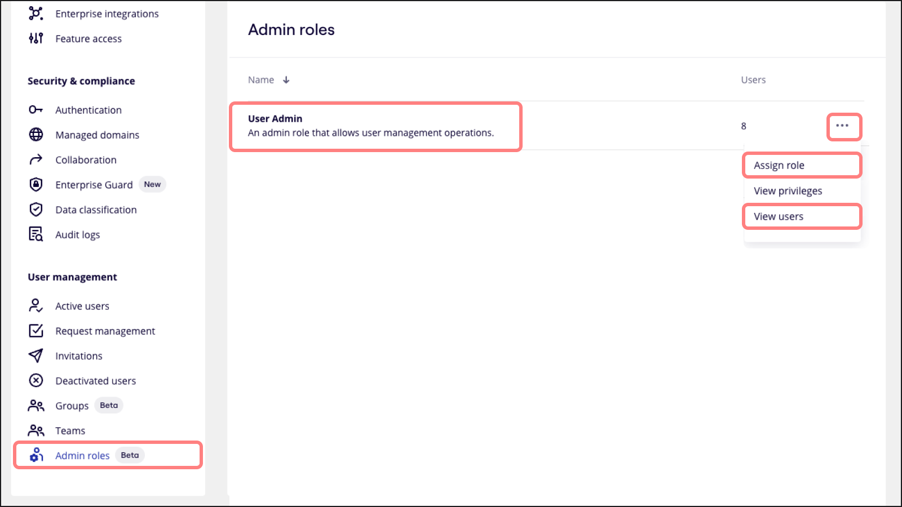
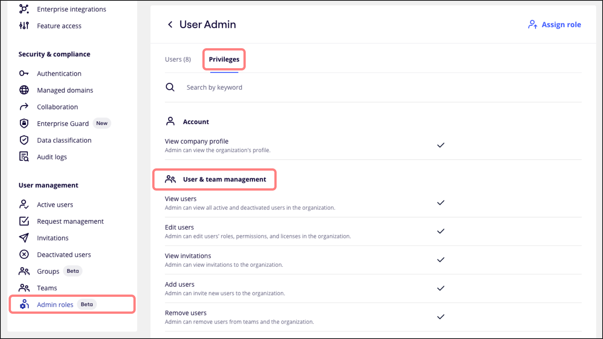
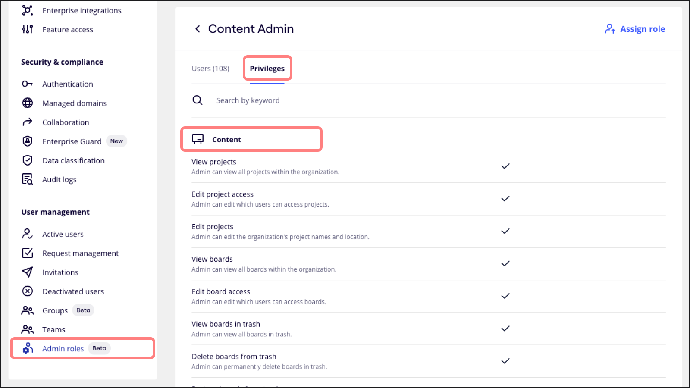

Miro는 역할 기반 액세스 제어를 사용해 사용자가 제품에서 보거나 수행할 수 있는 작업을 관리합니다. 사용자 역할은 보드, [프로젝트](../../using-miro/sharing-boards/16-projects.md), 팀, 회사에 대해 정의됩니다. 일부 사용자 역할에는 특정 플랜이나 유료 라이선스가 필요할 수 있습니다.

## 협업 내 역할

**방문자**는 팀이나 조직에 속하지 않는 일회성 Miro 사용자입니다. [방문자](../../using-miro/sharing-boards/08-collaboration-with-visitors.md) 역할은 빠른 공유, 즉각적인 협업, 일회성 브레인스토밍 세션에 적합합니다. 방문자는 링크를 통해 공유된 공개 보드에만 액세스할 수 있습니다. 방문자는 Miro에 가입할 필요가 없으며 Miro 계정 없이도 공개 보드에 액세스할 수 있습니다. 모든 플랜에서 방문자를 초대할 수 있습니다.

**게스트**는 일시적인 Miro 사용자이지만 팀이나 조직에 속하지 않습니다. [게스트](../../using-miro/sharing-boards/07-collaboration-with-guests.md) 역할은 비공개 보드에서 가끔씩 협업할 때 적합합니다. 등록된 사용자에게 액세스 권한을 부여하고 언제든지 권한을 취소할 수 있습니다. 이 옵션은 유료 플랜에서만 사용할 수 있습니다.

**멤버** 역할은 지속적인 협업을 위한 풀 팀 참여자입니다. 멤버는 팀에서 공유한 모든 보드에 액세스할 수 있습니다. 또한 플랜 기능에 대한 풀 액세스 권한을 가지고 있으며 자체 보드와 콘텐츠를 만들 수 있습니다.

[방문자, 게스트, 멤버가 사용할 수 있는 기능](../../using-miro/sharing-boards/10-visitors-guests-and-members.md)에 대해 자세히 알아보세요.

## 보드 및 프로젝트 내 역할

### 보드 내 역할

보드에서의 역할은 초대를 통해 직접 받거나 [기본 공유 설정](../../using-miro/sharing-boards/11-default-sharing-settings.md) 또는 [팀 레벨에서 보드를 공유](../../using-miro/sharing-boards/03-sharing-boards-and-inviting-collaborators.md)할 때 간접적으로 받게 됩니다. 보드의 액세스 레벨을 구성하려면 보드의 공유 대화 상자를 열고 아래 나열된 역할 중에서 선택하세요.

*보드 공유 설정*

- **소유자**

  각 보드에는 보드 소유자가 있습니다. 보드 소유자는 보드당 한 명만 있을 수 있습니다. 보드 소유자 권한:

  - [팀 간 보드 이동](../../using-miro/managing-boards/04-how-to-move-a-board.md)
  - [보드 백업](../../using-miro/import-and-export/export/05-how-to-save-board-backup.md) 다운로드(유료 플랜 전용)
  - [공동 소유자 추가](../../using-miro/sharing-boards/06-co-owners-of-boards-and-spaces.md)(Business 및 Enterprise 플랜 전용)
  - [보드 비밀번호 설정](../../using-miro/sharing-boards/13-password-protection-for-public-boards.md)(유료 플랜 전용)
  - [프레임 숨기기](../../using-miro/essential-tools/07-frames.md), [보호 잠금 사용](../../using-miro/working-on-the-board/21-work-smarter-not-harder.md)(유료 플랜 전용)
  - [보드 콘텐츠 설정 구성](../../using-miro/sharing-boards/14-how-to-allow-or-restrict-copying-and-exporting-boards-and-content.md)(유료 플랜 전용)
  - [협업 툴 설정](../../using-miro/facilitation-tools/06-collaboration-tools.md) 구성
  - [보드를 공유할 수 있는 사용자](../../using-miro/sharing-boards/02-who-can-share-a-miro-board.md) 구성
  - [보드 소유권을 다른 공동 작업자에게 이전](../../using-miro/managing-boards/05-how-to-transfer-board-ownership.md)
  - [보드 삭제](../../using-miro/managing-boards/07-how-to-delete-a-board.md)
- **공동 소유자**

  Business 및 Enterprise 플랜 사용자는 보드 공동 소유자를 추가할 수도 있습니다. 보드 공동 소유자의 권한:

  - [보드 콘텐츠 설정](../../using-miro/sharing-boards/14-how-to-allow-or-restrict-copying-and-exporting-boards-and-content.md) 및 [협업 툴 설정](../../using-miro/facilitation-tools/06-collaboration-tools.md) 관리
  - [프레임 숨기기 및 표시,](../../using-miro/facilitation-tools/06-collaboration-tools.md) [보호 잠금 추가](../../using-miro/working-on-the-board/17-locking-content-on-the-board.md)
  - [보드 비밀번호 추가](../../using-miro/sharing-boards/13-password-protection-for-public-boards.md)
  - [보드 백업 다운로드](../../using-miro/import-and-export/export/05-how-to-save-board-backup.md)
  - 다른 공동 소유자 추가
  - 보드 커버 이미지 변경 및 보드 이름 바꾸기
  - [보드 공유](../../using-miro/sharing-boards/03-sharing-boards-and-inviting-collaborators.md)
  - [고급 보드 공유 권한](../../using-miro/sharing-boards/02-who-can-share-a-miro-board.md) 구성
  **[보드 공동 소유자](../../using-miro/sharing-boards/06-co-owners-of-boards-and-spaces.md)에 대해 자세히 알아보세요.**
- **편집자**

  편집자는 보드 콘텐츠를 변경하고 새 파일을 삭제하거나 업로드할 수 있습니다. 편집자는 방문자, 게스트, 멤버 여부에 따라 다양한 보드 툴과 설정을 사용할 수 있습니다.

  [보드 콘텐츠 설정](../../using-miro/sharing-boards/14-how-to-allow-or-restrict-copying-and-exporting-boards-and-content.md)에서 허용된 경우 편집자는 보드 콘텐츠를 복사할 수 있습니다.
- [**댓글 작성자**](../../using-miro/sharing-boards/01-board-access-rights.md)는 보드에서 보드 콘텐츠를 보고 다른 사용자에게 댓글을 남길 수 있습니다.
- [**뷰어**](../../using-miro/sharing-boards/01-board-access-rights.md)는 보드를 보기만 할 수 있습니다.

### 프로젝트 내 역할

> **해당 플랜:** Starter, Business, Enterprise, Education 플랜

[프로젝트](../../using-miro/sharing-boards/16-projects.md)에서의 역할은 프로젝트의 여러 보드(기존 및 새로 생성된 보드 모두)에 대한 특정 액세스 권한을 사용자에게 부여하는 데 사용됩니다. 프로젝트 레벨 액세스 권한 및 참여자는 프로젝트 작성자가 설정하며 각 특정 참여자에 대해 프로젝트 편집자가 변경할 수 있습니다.

프로젝트에서의 역할은 초대를 통해 직접 받거나 [기본 공유 설정](../../using-miro/sharing-boards/11-default-sharing-settings.md) 또는 팀 레벨에서 프로젝트를 공유할 때 간접적으로 받게 됩니다. 언제든지 [프로젝트에 대한 액세스를 구성](../../using-miro/sharing-boards/16-projects.md)할 수 있습니다.

- 프로젝트 **소유자**는 프로젝트를 편집하거나 삭제하고, 프로젝트에서 보드를 추가/제거하고, 프로젝트를 전체 팀에 표시하거나 보이지 않게 만들고, 특정 사용자의 액세스를 정의할 수 있습니다. 소유권은 다른 사용자에게 이전될 수 있습니다.
- **공동 소유자**는 프로젝트에 초대되고 프로젝트의 팀 및 다른 사용자의 액세스 권한을 변경할 수 있지만 프로젝트를 삭제할 수는 없습니다.
- **편집자**는 프로젝트에서 보드를 편집하고 특정 사용자의 액세스를 정의할 수 있습니다.
- **댓글 작성자**는 프로젝트의 모든 보드에 댓글을 달 수 있습니다.
- **뷰어**는 프로젝트의 모든 보드를 볼 수 있습니다.

프로젝트 액세스와 보드 액세스는 서로를 보완하며 동시에 작동합니다.

- 사용자가 이미 특정 보드 내 역할이 있으면 *최대 액세스 권한*을 가진 역할이 적용됩니다.
- 프로젝트의 멤버십이 취소되면 사용자는 프로젝트에서 발생하는 액세스 권한을 잃게 되고 직접 받은 보드의 역할만 유지됩니다.

## 팀 내 역할

- **팀 관리자**는 사용자, 액세스 권한 설정, 기타 팀 속성을 관리할 수 있는 확장된 권한을 가진 멤버입니다. 다른 사용자의 콘텐츠에 대해 특별한 액세스 권한은 부여되지 않습니다. 구독 내에 팀이 여러 개 있다면 각 팀의 관리자가 존재합니다. 팀마다 여러 명의 관리자가 있을 수 있습니다.
- **멤버**는 팀에 초대된 사용자이며 [팀 공유](../../using-miro/sharing-boards/03-sharing-boards-and-inviting-collaborators.md) 보드 및 [프로젝트](../../using-miro/sharing-boards/16-projects.md)에 모두 액세스할 수 있으며 자체 보드를 만들 수 있습니다. 유료 플랜의 경우 멤버는 언제나 팀의 라이선스를 할당받습니다.
- [**게스트**](../../using-miro/sharing-boards/07-collaboration-with-guests.md)는 이메일을 통해 보드에 직접 초대되었지만 팀 자체에는 초대되지 않은 사용자입니다. 보드에 액세스할 수 있지만 자체 보드를 만들 수는 없습니다. 게스트는 유료 및 Education 플랜에서 사용할 수 있으며, 편집 액세스 권한이 있는 게스트는 Business 플랜과 Enterprise 플랜에서만 사용할 수 있습니다.
- 구독 수준에서는 **[결제 관리자](../../administration/admin-faq/01-admin-faq.md)**도 역할에 해당합니다. 이 상태는 카드를 연결한 상태에서 구독을 시작하는 사람에게 부여됩니다.

팀 사용자 목록을 보려면 [팀 설정을 열고](../../administration/get-started-as-a-miro-admin/01-i-am-a-new-miro-admin.-where-to-start.md) **활성 사용자**로 전환하세요.

## 회사 레벨

> **해당 플랜:** Business 플랜, Enterprise 플랜

회사는 산하에 여러 팀을 둘 수 있습니다. 아래에서 팀 레벨과 비교한 회사 레벨 역할을 참고하세요.

- **회사 관리자**는 사용자, 팀 관리자, 보안, 액세스 권한 설정, 회사 내의 기타 속성을 관리할 수 있는 확장 권한이 있는 멤버입니다. 다른 사용자의 콘텐츠에 대해 특별한 액세스 권한은 부여되지 않습니다. 회사 관리자는 여러 명 존재할 수 있습니다.
- **사용자 관리자**는 사용자와 팀을 생성 및 관리하고 사용자 라이선스를 관리합니다. 이를 통해 회사 관리자가 불필요한 권한을 할당하지 않고 책임을 위임할 수 있습니다.
- **콘텐츠 관리자**는 전체 관리자 권한이 없어도 콘텐츠를 관리하고 구성할 수 있습니다. 이 역할을 사용하면 콘텐츠 액세스, 편집, 공유를 정밀하게 제어해 데이터 보안을 유지하면서 콘텐츠를 효율적으로 관리할 수 있습니다. 콘텐츠 관련 작업을 안전하고 효과적으로 위임하려는 회사에서 필수적인 역할입니다.
- **보안 관리자**는 감사 로그, 인증 설정, 협업 설정, 관리되는 도메인 등의 보안 관리 관련 설정을 보고 편집할 수 있습니다.
- **멤버**는 회사 팀 중 하나 이상의 팀에 프로비저닝되거나 초대된 사람입니다. [팀 공유](../../using-miro/sharing-boards/03-sharing-boards-and-inviting-collaborators.md) 또는 [회사 공유](../../using-miro/sharing-boards/03-sharing-boards-and-inviting-collaborators.md) 보드 및 [프로젝트](../../using-miro/sharing-boards/16-projects.md)에 액세스하고 자체 보드를 만들 수 있습니다.
- 이전에는 팀이 아닌 사용자였던 **게스트**는 플랜에 속해 있지만 어떤 팀의 멤버도 아닌 사용자입니다. 따라서 팀/회사와 공유된 보드에 액세스할 수 없으며 직접 이메일 초대를 통해 특별히 공유된 보드에만 액세스할 수 있습니다.

  - 게스트를 추가하면 게스트는 무료 라이선스를 받아 풀 멤버로 전환되며, 팀 보드 보기 및 생성이 가능하고 Miro 유료 플랜의 모든 기능에 액세스할 수 있습니다.

:::tip
Enterprise 플랜에서의 [관리자 역할과 해당 권한](../../administration/get-started-as-a-miro-admin/02-understand-admin-roles-and-their-privileges.md)에 대해 자세히 알아보세요.
:::

## 관리자 역할 할당

### 사용자 관리자 할당하기

> **해당 플랜:** Enterprise 플랜

1. [설정](https://miro.com/app/settings/user-profile/)으로 이동합니다.
2. **사용자 관리**에서 **관리자 역할**을 클릭하세요.
3. **사용자 관리자** 역할 옆에 있는 세 점 아이콘(**…**)을 클릭하고 드롭다운 메뉴에서 **역할 할당**을 선택하세요.
4. 사용자 관리자 권한을 부여할 사용자를 선택합니다. 사용자는 최대 50명까지 선택할 수 있습니다.
5. 선택을 확정하려면 **할당** 버튼을 클릭하세요.
6. 사용자 관리자 역할에 할당된 모든 사용자를 보려면 세 점 아이콘(**…**)을 다시 클릭하고 **사용자 보기**를 선택하세요.

   
*사용자 관리자 역할 할당하기*

사용자 관리자에게 할당된 권한을 보려면 **사용자 관리자** 표시줄을 클릭하고 **권한** 탭으로 전환한 다음 아래로 스크롤해 모든 **사용자 및 팀 관리** 권한을 확인하세요.

*사용자 관리자 권한 보기*

### 콘텐츠 관리자 할당하기

> **해당 플랜:** Enterprise 플랜

1. [설정](https://miro.com/app/settings/user-profile/)으로 이동합니다.
2. **사용자 관리**에서 **관리자 역할**을 클릭하세요.
3. **콘텐츠 관리자** 역할 옆에 있는 세 점 아이콘(**…**)을 클릭하고 드롭다운 메뉴에서 **역할 할당**을 선택하세요.
4. 콘텐츠 관리자 권한을 부여할 사용자를 선택합니다. 사용자는 최대 50명까지 선택할 수 있습니다.
5. 선택을 확정하려면 **할당** 버튼을 클릭하세요.
6. 콘텐츠 관리자 역할에 할당된 모든 사용자를 보려면 세 점 아이콘(**…**)을 다시 클릭하고 **사용자 보기**를 선택하세요.

*콘텐츠 관리자 역할 추가하기*

콘텐츠 관리자에게 할당된 권한을 보려면 **콘텐츠 관리자** 표시줄을 클릭하고 **권한** 탭으로 전환한 다음 아래로 스크롤해 모든 **콘텐츠** 권한을 확인하세요.

*콘텐츠 관리자 권한 보기*

:::note
현재는 **관리자 역할** 탭에서 할당된 사용자를 볼 수 있습니다. 앞으로 이러한 역할을 **활성 사용자**에서도 볼 수 있도록 가시성을 확장할 계획입니다.
:::

## 자주 묻는 질문

**멤버를 게스트로 전환하려면 어떻게 해야 하나요?**

Business 및 Enterprise 플랜에서는 **회사 설정 > 활성 사용자**에서 [멤버를 게스트로 전환](../../using-miro/sharing-boards/07-collaboration-with-guests.md)할 수 있습니다. [Team 플랜](../../plans-billing/miro-plans/08-starter-plan.md)에서는 **팀 설정 > 활성 사용자**에서 체험판 멤버만 게스트로 전환할 수 있습니다.

**기여자가 보드에서 변경한 내용은 어디에서 볼 수 있나요?**

[보드 변경 이력](../../using-miro/managing-boards/11-board-history-activity.md)을 확인하세요. 가입하지 않은 방문자 상태의 사용자가 보드를 편집하면 해당 사용자의 활동에 이름이 표시되지 않습니다.

**초대받은 사람은 어떤 액세스 레벨을 받게 되나요?**

사용자를 팀 멤버로 초대하면 모든 [팀 공유](../../using-miro/sharing-boards/03-sharing-boards-and-inviting-collaborators.md) 보드 및 [프로젝트](../../using-miro/sharing-boards/16-projects.md)를 볼 수 있습니다. 팀에 추가하지 않고 특정 보드에 초대하면 해당 보드에만 액세스할 수 있습니다.

**팀에 다른 관리자를 추가하려면 어떻게 해야 하나요?**

[이 단계](../../administration/user-management/06-how-to-manage-admin-roles.md)를 따르세요. 관리자만 다른 사용자를 관리자 역할로 승격시킬 수 있습니다. Education 플랜의 경우 회사 또는 팀 관리자는 한 명만 허용됩니다.
