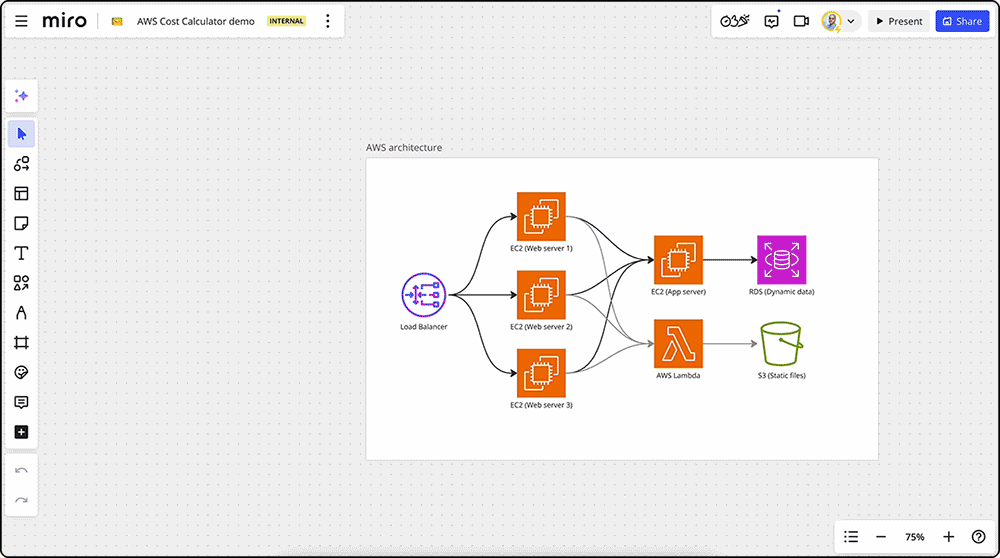
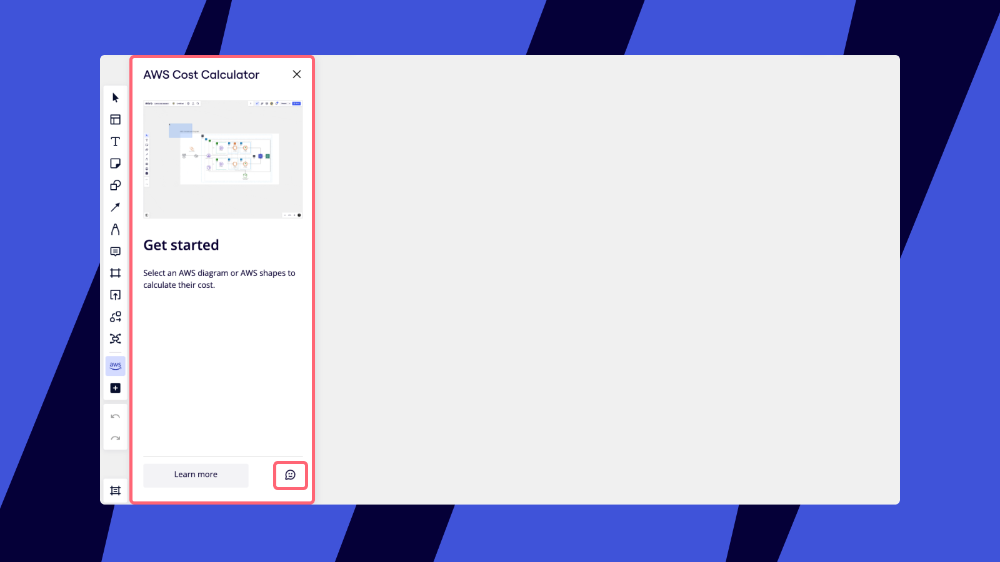

AWS 비용 계산기 앱은 Miro 보드에서 직접 AWS 서비스 비용을 추정할 수 있는 간단한 방법을 제공합니다. 이는 특히 프로젝트 관리자와 IT 전문가에게 유용하여 효율적인 계획을 위한 비용 추정을 간소화합니다.

:::note
(Enterprise) AWS 비용 계산기는 Advanced 라이선스와 함께 사용할 수 있습니다. 더 많은 정보는 [Enterprise 라이선스 이해하기](../../plans-billing/miro-plans/05-understanding-enterprise-licenses.md)에서 확인하세요.
:::

AWS 비용 계산기는 다음 AWS 서비스의 아이콘을 지원합니다:

1. ALB
2. APIGateway
3. AS2
4. Athena
5. CertificateAuthority
6. ClassicLoadBalancer
7. CloudFront
8. CloudWatch
9. CodePipeline
10. DataFirehouse
11. DynamoDB
12. EBS
13. EC2
14. ECR
15. EFS
16. EKS
17. Elb
18. EventBridge
19. Fargate
20. FileCache
21. FTP
22. FTPS
23. GLB
24. GlueCrawlers
25. GlueDataBrewInteractiveSessions
26. GlueDataCatalogStorageRequests
27. GlueETLForRayJobsAndInteractiveSessions
28. GlueETL 작업 및 인터랙티브 세션
29. IAM
30. Kafka
31. Kinesis 데이터 스트림
32. Lambda
33. NAT 게이트웨이
34. NLB
35. RDS
36. Redshift
37. Route53
38. S3
39. SageMaker
40. SecretManager
41. Ses
42. SFTP
43. SNS
44. SQS
45. StepFunctions
46. StepFunctionsExpressWorkFlow
47. TransitGateway
48. VpcCloudWan
49. VpcNetworkAccessAnalyzer
50. VpcPrivateLink
51. VpcReachabilityAnalyzer
52. VpcTrafficMirroring
53. VPNConnection
54. Waf

## AWS 비용 계산기 설정 및 사용 방법

1. Miro 마켓플레이스에서 [AWS 비용 계산기](https://miro.com/marketplace/aws-cost-calculator/)를 설치합니다.
2. AWS 비용을 계산하려는 Miro 보드를 엽니다.
3. [생성](../../getting-started/start-here/your-first-board/05-toolbars.md) 툴바에서 **툴, 미디어 및 통합** (**+**)을 클릭하고 ‘AWS 비용 계산기’를 검색합니다.
4. **AWS 비용 계산기**를 선택합니다. AWS 비용 계산기 패널이 보드의 왼쪽에 열립니다.
5. 드래그하여 다이어그램의 모든 AWS 아이콘을 선택하세요. 그러면 비용 계산기가 다이어그램 내의 모든 AWS 아이콘을 자동으로 표시합니다.
6. 각 AWS 아이콘에 대해 **편집**을 클릭하여 지역 및 스토리지 유형과 같은 세부 내용을 지정한 후 **서비스 선택 저장**을 클릭하세요.
7. 모든 아이콘 편집을 완료한 후, **계산**을 클릭하여 총 AWS 비용을 확인하세요.
8. 비용을 더 잘 이해하려면 상단 탭과 드롭다운 메뉴를 사용하여 시간대(**시간**, **월**, **연도**) 및 **지역**별로 비용을 필터링하세요.

*AWS 서비스 비용 계산하기*

## 정확한 계산을 위한 팁

- **구체적으로 작성하세요**: 세부 정보를 많이 제공할수록 비용 추정이 정확해집니다.
- **정기적으로 검토하세요**: AWS 가격은 변경될 수 있습니다. 정기적으로 추정을 확인하고 업데이트하며, 항상 AWS에서 실제 비용을 확인하세요.

## AWS 비용 계산기에 대한 피드백 제공

피드백은 AWS 비용 계산기를 개선하고 더 유용하게 만드는 데 매우 중요합니다.

1. **AWS 비용 계산기** 패널을 Miro 보드에서 엽니다.
2. 패널의 오른쪽 아래에 있는 피드백 아이콘을 클릭하여 경험을 평가하세요.
3. 열린 텍스트 필드에 추가 피드백을 작성하고, 향후 업데이트에서 지원하고 싶은 AWS 아이콘을 포함하세요.

*AWS 비용 계산기에 피드백 남기기*
