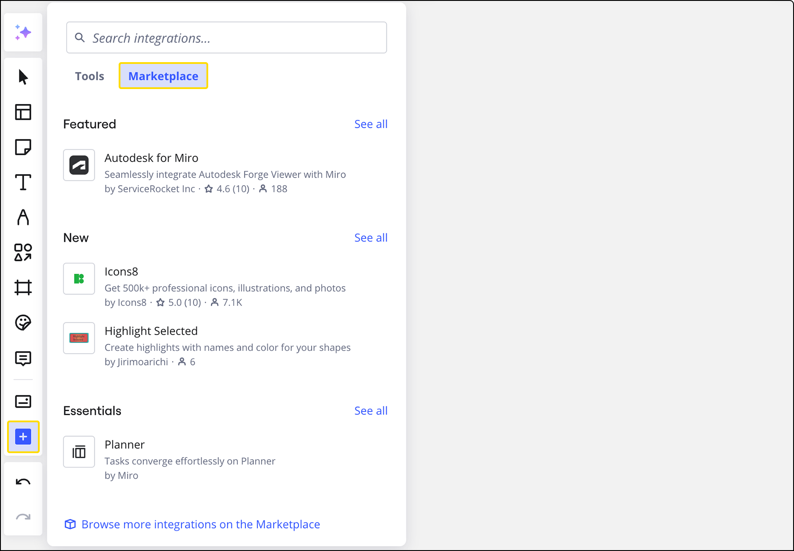

Miro 마켓플레이스에서 앱을 설치하여 Miro의 기능을 확장할 수 있습니다. 이 문서는 앱 설치 및 제거, 앱 권한 이해, 맞춤형 통합 생성 개요에 대해 안내합니다.

## Miro 마켓플레이스에서 앱 설치

[Miro 마켓플레이스](https://miro.com/marketplace/)는 Miro 경험을 향상시키기 위해 앱을 발견하고 추가할 수 있는 중앙 허브입니다. 보드에서 직접 앱을 설치하거나 마켓플레이스 웹사이트를 방문하여 설치할 수 있습니다.

*Miro 마켓플레이스*

사용자가 앱을 추가하는 기본적인 두 가지 방법이 있습니다:

1. **보드에서:** 작성 툴바에서 **툴, 미디어 및 통합 (+)** 아이콘을 클릭한 후 마켓플레이스 탭의 "통합 검색" 검색 상자를 사용하세요. 앱이 이미 목록에 있으면 클릭하여 추가하세요. 이 패널에서 사용 가능한 앱을 둘러볼 수도 있습니다.
   *작성 툴바의 마켓플레이스*
2. **마켓플레이스 웹사이트에서:** [Miro 마켓플레이스](https://miro.com/marketplace/) 웹사이트에 직접 방문하여 앱을 둘러보고 설치할 수도 있습니다.

**회사 관리자용:**
회사 관리자는 해당 플랜에서 팀 설정을 통해 전체 팀에 앱을 설치할 수 있습니다. 이 작업을 수행하려면 **팀 설정** > **앱 및 통합** > **앱 설치**로 이동하세요. 이 섹션은 팀 전체의 앱을 중앙에서 관리하고 배포할 수 있도록 해줍니다.

*관리자를 위한 팀 설정의 설치된 앱 섹션*

## 앱 제거

팀 설정에서 앱을 관리하고 제거할 수 있습니다. 관리자가 아닌 사용자는 팀의 구성에 따라 앱 제거에 제한이 있을 수 있습니다.

:::warning
관리자가 팀 설정에서 앱 설치를 허용하지 않은 경우, 관리자가 아닌 사용자는 앱을 제거할 수 없습니다.
:::

팀 앱을 관리하려면 **팀 설정 > 앱 및 통합**으로 이동하세요. 이 페이지에는 팀용 또는 개인적으로 설치한 모든 앱이 나와 있습니다.

*팀 설정의 앱 및 통합*

앱을 제거하려면 다음 단계를 따르세요:

1. **앱 및 통합** 목록에서 제거할 앱을 선택하세요.
2. **팀 제거** 또는 **개인 제거**를 클릭하세요. 사용 가능한 옵션은 앱 설치 방식과 관리자 권한에 따라 달라집니다.

*앱 제거 옵션*

## 앱 설치 권한

팀 및 회사 관리자는 누가 앱을 설치할 수 있으며 어떤 앱이 그들에게 제공되는지 관리할 다양한 제어 기능을 갖추고 있어 보안 및 규정 준수를 보장합니다.

팀 관리자는 관리자가 아닌 팀 멤버가 앱을 설치할 수 있는지 여부를 구성할 수 있습니다. 이 설정은 **팀 설정 > 앱 및 통합**의 앱 관리 옵션에서 찾을 수 있습니다.

*팀 설정의 "관리자가 아닌 사용자가 앱을 설치할 수 있도록 허용" 옵션*

[Enterprise 플랜](../../plans-billing/miro-plans/04-enterprise-plan.md)의 사용자를 위해, 회사 관리자는 보다 세부적인 제어에 접근할 수 있습니다. **회사 설정** > **앱**을 통해 **승인된 앱**을 관리할 수 있습니다. 이 기능은 관리자가 회사에서 검증한 애플리케이션 목록을 만들어, 승인된 목록에 없는 앱을 사용자가 설치하지 못하도록 제한할 수 있게 해줍니다. [Enterprise 플랜의 앱 발견 및 설치 설정 관리에 대해 자세히 알아보세요](../../enterprise-administration/managing-apps-on-enterprise-plan/02-app-management.md).

*Enterprise 회사 설정에서 승인된 앱 관리*

## 맞춤형 통합과 개발자 플랫폼

Miro 마켓플레이스에서 제공되지 않는 특정 기능이 필요한 경우 [Miro Developer Platform](https://miro.com/api/)을 사용하여 맞춤형 솔루션을 만들 수 있습니다. 이 플랫폼은 REST API, 웹 플러그인, 임베드를 포함한 강력한 도구를 제공하여 필요에 맞춘 강력한 통합을 구축할 수 있도록 도와줍니다.

맞춤형 통합을 개발할 때 고려해야 할 주요 사항은 다음과 같습니다:

- **시작하기:** [개발자 팀을 생성](https://developers.miro.com/)하여 앱을 구축하기 시작할 수 있습니다. 표준 개발자 팀은 개발 및 테스트 목적에 맞게 설계되어 특정 제한 사항이 있습니다:
  - 팀에 최대 5명의 사용자.
  - 팀에 최대 3개의 보드.
  - 보드에 워터마크가 표시됩니다.
  - 보드 내보내기 기능은 사용할 수 없습니다.
- **Enterprise 플랜 개발자:** 조직이 [Enterprise 플랜](../../plans-billing/miro-plans/04-enterprise-plan.md)을 사용하는 경우, 구독의 일환으로 개발자 팀을 생성할 수 있습니다. 이 개발자 팀은 표준 개발자 팀의 제한을 받지 않으며, 모든 Enterprise급 보안 기능을 누릴 수 있습니다. [Enterprise 플랜을 위한 개발자 팀에 대해 자세히 알아보세요](../../enterprise-administration/managing-apps-on-enterprise-plan/04-enterprise-developer-teams.md).

추가 정보, 지원 및 다른 개발자와의 연결을 위해 [개발자 플랫폼 포럼](https://community.miro.com/developer-platform-forum-57)을 탐색할 수 있습니다.
