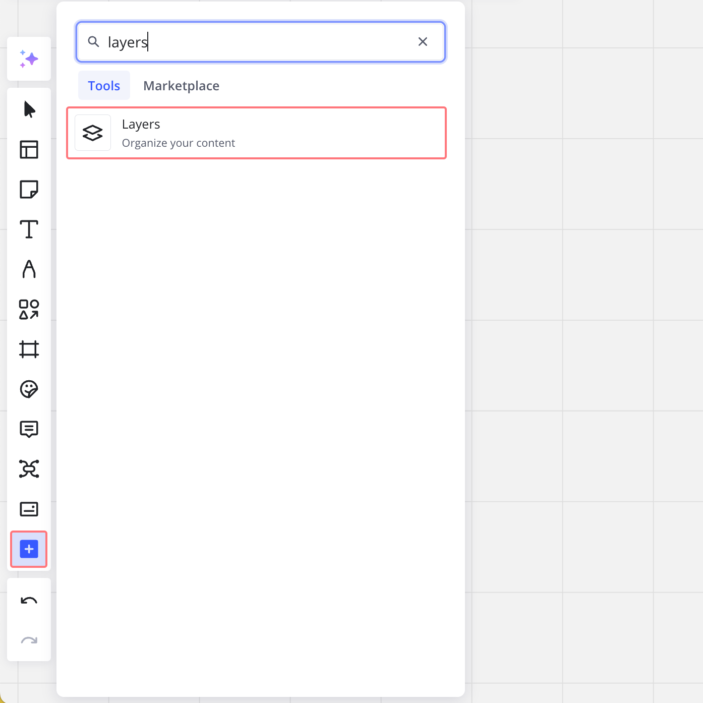
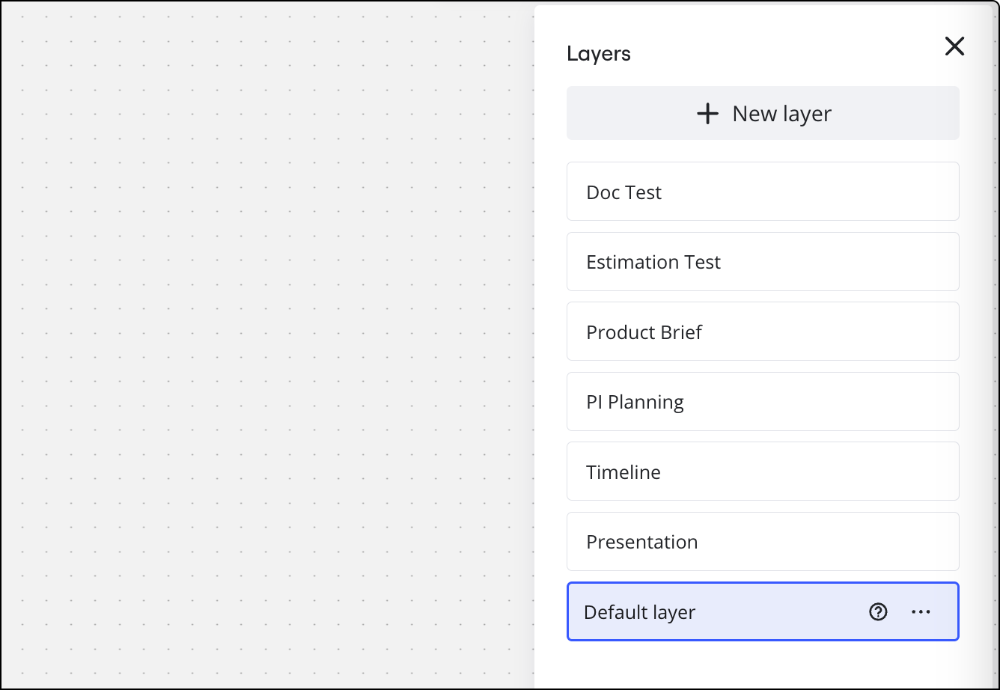
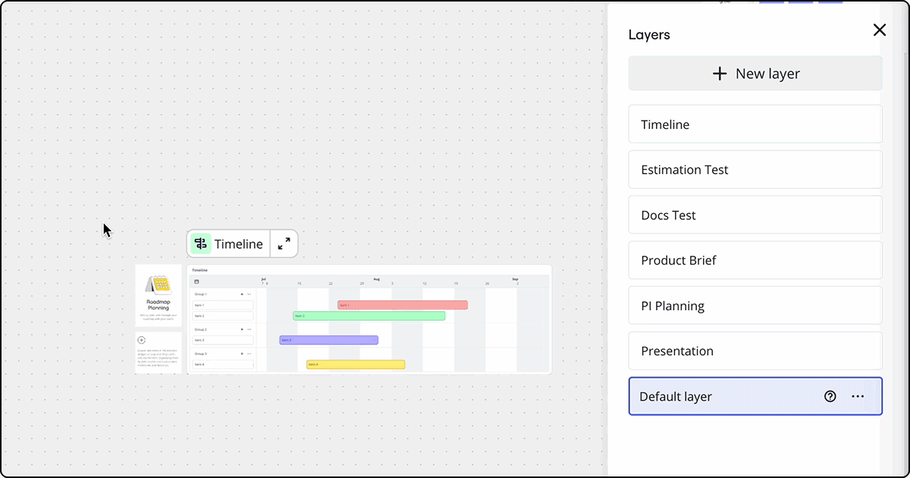
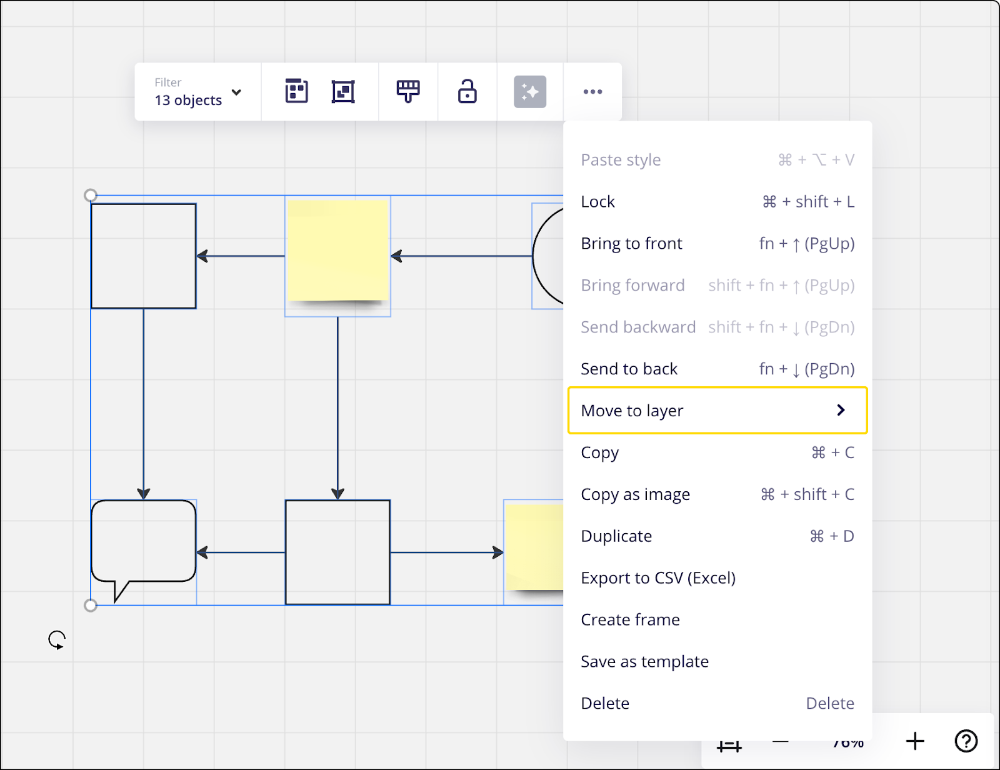
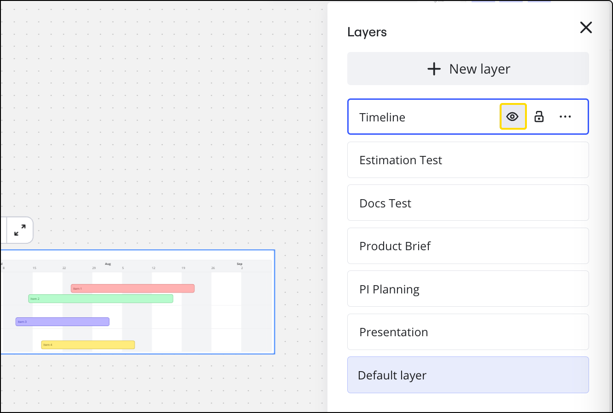
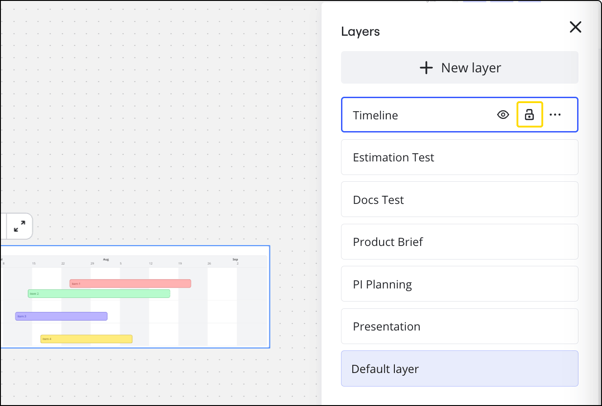
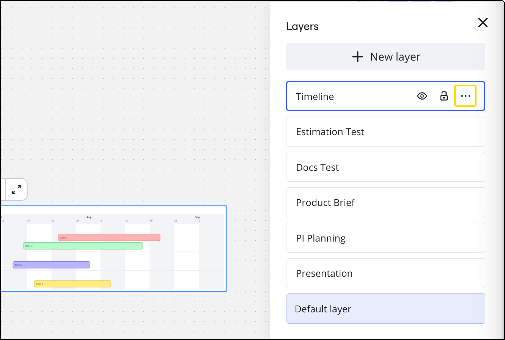

레이어는 보드의 콘텐츠를 별도 섹션으로 구성할 수 있는 기능을 제공하며, 이는 다이어그램의 복잡성을 관리하고 더 정교하고 체계적인 작업을 가능하게 합니다.

## 레이어 액세스

**레이어 패널**에 액세스하려면:

1. 작성 툴바에서 **미디어, 툴, 통합** () 아이콘을 클릭하세요.
2. **레이어**를 검색한 후, 레이어 툴을 클릭하세요.
3. **레이어** 아이콘을 마우스 오른쪽 버튼으로 클릭한 후 **툴바에 고정**을 선택하면 작성 툴바에 레이어 툴을 고정할 수 있습니다.

*레이어 메뉴는 프레임 및 레이어 아이콘을 클릭하면 나타납니다*

**레이어 아이콘**을 클릭하면 패널이 캔버스 오른쪽에 열립니다. 여기에서 레이어를 활성화하거나, 기존 레이어에 이름을 지정하거나, 새 레이어를 만들 수 있습니다.

*레이어 메뉴가 캔버스의 오른쪽에 나타납니다*

### 레이어 사용 가능 대상

레이어 내 기능은 사용자 역할에 따라 달라집니다.

- 뷰어와 댓글 작성자는(해당 권한을 가진 게스트 포함) 레이어에 접근할 수 없습니다.
- 편집자(편집 권한이 있는 게스트 포함)는 레이어를 생성, 편집, 숨기기, 표시하는 것이 가능합니다.
  - 이메일로 초대받은 편집자도 레이어를 잠그거나 잠금 해제할 수 있습니다.
- 보드 소유자와 공동 소유자는 편집자의 모든 기능을 사용할 수 있으며, 레이어를 잠그고 해제하며 보호 잠금을 사용할 수 있습니다.

## 레이어 사용하기

콘텐츠를 선택하여 새 레이어나 기존 레이어에 추가함으로써 관련된 콘텐츠를 체계적으로 정리할 수 있습니다.

1. 새 레이어나 기존 레이어에 추가할 콘텐츠를 선택하세요.
2. **레이어** 메뉴를 클릭하세요.
3. 새 레이어에 콘텐츠를 추가하려면: **+ 새 레이어로 이동**을 클릭하세요. 그 다음 새 레이어의 이름을 지정할 수 있습니다.
4. 콘텐츠를 기존 레이어로 이동하려면 레이어 이름 옆의 **세 점 아이콘** (**...**)을 클릭하고 **선택 항목을 레이어로 이동**을 선택하세요.

*기존 레이어에 콘텐츠 추가*

특정 레이어에 포함할 콘텐츠를 추가할 때는 먼저 레이어를 선택하세요. 새 콘텐츠는 그 레이어에 자동으로 추가됩니다.

새 레이어 또는 기존 레이어에 콘텐츠를 추가할 수도 있습니다.

1. 추가할 콘텐츠를 선택하세요.
2. 컨텍스트 메뉴에서 **세 점 아이콘** (**...**)을 클릭합니다.
3. **레이어로 이동** 옵션을 선택하세요.

*컨텍스트 메뉴에서 세 점 아이콘 (**...**) 아래에 **레이어로 이동** 옵션이 있습니다*

레이어는 필요에 따라 숨기거나, 잠그거나, 이름 변경하거나, 복제할 수 있습니다.

1. 레이어 메뉴에서 레이어 이름을 클릭하거나 위로 마우스를 가져가세요.
2. **레이어 숨기기**: **눈 아이콘**을 클릭하여 레이어를 숨기세요. 아이콘이 열린 눈에서 감은 눈으로 변경됩니다. 선택한 레이어의 모든 콘텐츠가 캔버스에서 사라집니다. (숨겨진 콘텐츠는 모든 사용자에 대해 캔버스에서 사라지며, 페이지를 새로고침해도 숨겨진 상태로 유지됩니다.)
3. **감은 눈 아이콘**을 클릭하여 레이어를 표시하세요. 숨겨진 콘텐츠가 캔버스에 다시 나타납니다.
   *레이어를 숨기는 것은 눈 아이콘을 사용합니다*
4. 레이어를 **잠그려면:** **잠금 아이콘**을 클릭하여 레이어를 잠그세요. 아이콘이 열린 자물쇠에서 닫힌 자물쇠로 변경됩니다. 레이어가 잠기면 해당 레이어의 콘텐츠는 편집할 수 없습니다(이동 또는 삭제 포함).
5. **닫힌** **잠금 아이콘**을 다시 클릭해 레이어의 콘텐츠 잠금을 해제하세요.
   *잠금 아이콘은 레이어를 잠그거나 잠금 해제하는 데 사용됩니다*
6. 레이어를 **복제하려면:** 레이어의 오른쪽에 있는 **세 점 아이콘 (...)**을 클릭하세요.
7. **레이어 복제**를 클릭하세요.
8. 두 번째 레이어가 원래 레이어 바로 위에 보드에 표시됩니다.
9. 복제된 레이어를 이동하려면 레이어 메뉴에서 해당 레이어가 선택되어 있는지 확인한 다음, 캔버스에서 레이어의 콘텐츠를 클릭하고 원하는 위치로 드래그하세요.
   
   *레이어를 복제하려면 세 점 아이콘 (...) 메뉴를 사용합니다*

레이어 이름 바꾸기:

1. 레이어 메뉴에서 레이어 이름을 두 번 클릭하세요.
2. 레이어 이름을 수정하세요.
3. Enter 키를 누르세요.

## 다이어그램 형식의 레이어

다이어그램 형식의 레이어는 캔버스 레이어와 독립적으로 작동합니다. 이 분리는 다이어그램 작성 과정을 간소화하고 일반 보드 콘텐츠와 다이어그램의 특정 구성 요소 간의 혼동을 방지하도록 설계되었습니다. 다이어그램 내에서 레이어가 작동하는 방식의 세부 사항을 더 알고 싶으면 [다이어그램 형식](../formats/diagramming/02-miro-diagrams.md)에 대한 자세한 기사를 참조하세요.

- **캔버스 vs. 다이어그램 레이어**: 캔버스 레이어는 프레젠테이션과 같은 일반적인 목적으로 사용되는 반면, 다이어그램 내의 레이어는 다이어그램 자체의 요소를 조직하기 위해 별도로 관리됩니다.
- **부모 관계**: 요소가 다이어그램의 일부가 되면, 다이어그램 형식에 의해 부모로 지정되기 때문에 캔버스 레이어에 추가할 수 없습니다.

## 레이어 다시 정렬

패널에서 레이어를 다시 정렬할 수 있으며, 이는 어떤 레이어의 콘텐츠가 상단에 표시될지를 결정합니다. 레이어를 원하는 순서로 재정렬하려면, 레이어 패널 내에서 드래그하세요.

이것은 다이어그램의 동일한 부분에 대해 약간 다른 콘텐츠로 두 가지 버전을 생성해야 할 때 유용한 도구입니다. 레이어를 서로 직접 맞대어 배치하면, 레이어를 다시 정렬하여 어느 레이어가 표시될지를 변경할 수 있습니다.

## 기본 레이어

기본 레이어는 항상 표시되며, 다른 레이어가 활성화되어 있지 않으면 새 위젯이 기본 레이어에 추가됩니다. 특정 레이어에서 작업하지 않을 때는 기본 레이어에서 작업하게 됩니다.

기본 레이어는 숨기거나 잠글 수 없기 때문에 다른 레이어와 다릅니다.
