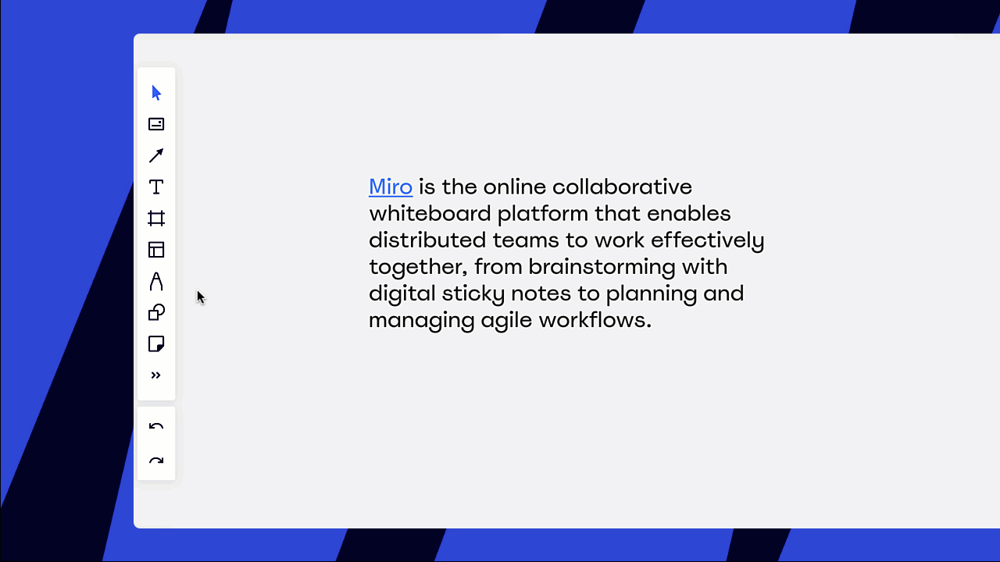
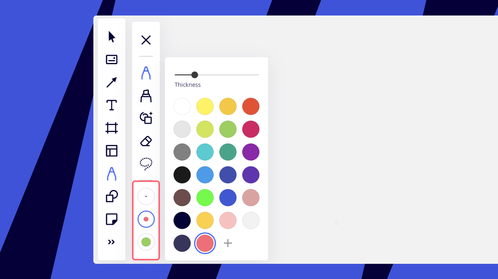
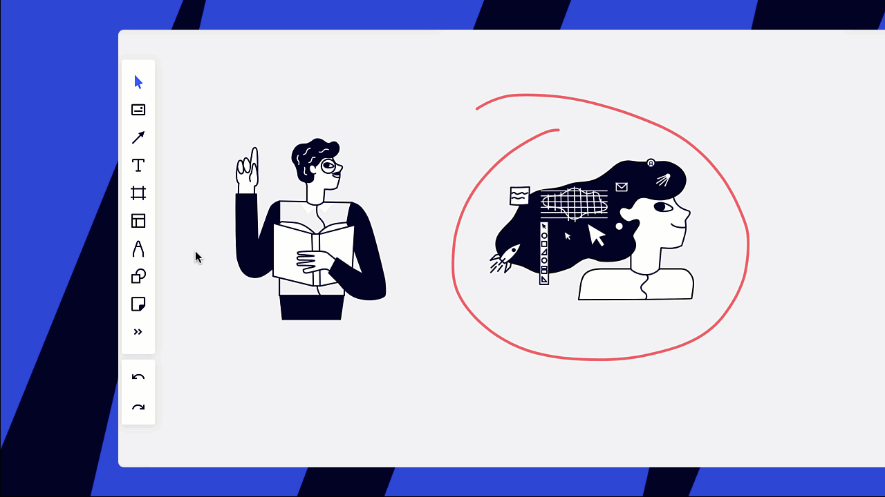
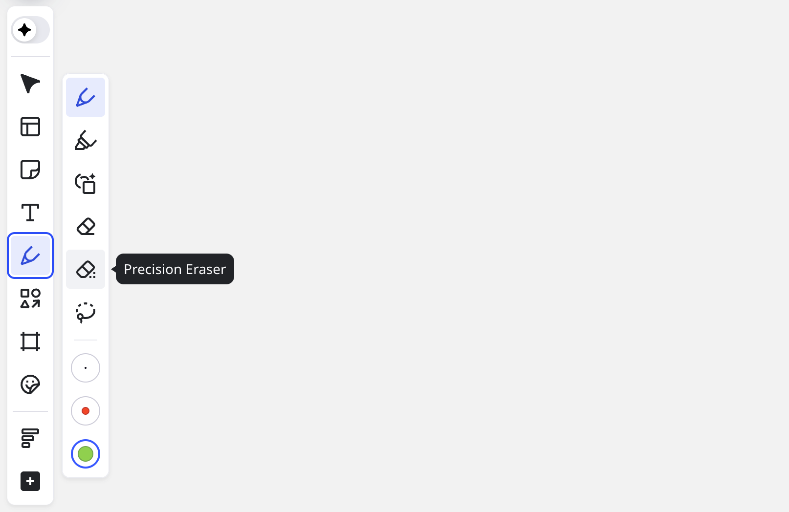

펜 도구를 사용하여 보드에 손으로 그린 그림을 추가하고 필요에 따라 삭제할 수 있습니다. 이 도구는 마우스, 트랙패드, 터치스크린과 잘 작동하며 태블릿 워크플로의 필수적인 부분이 될 수 있습니다.

> **사용 가능 환경:**브라우저 버전, [데스크톱 앱](../../getting-started/apps-for-devices/05-desktop-app.md), [태블릿 앱](../../getting-started/apps-for-devices/11-tablet-app.md)

## 펜 사용 방법

:::note
어떤 종류의 펜 도구도 사용할 수 있습니다 - Apple Pencil, Surface Pen, Samsung S Pen 등 - Miro와 호환되는 [모든 장치에서](../../getting-started/apps-for-devices). Miro의 터치 장치에서 개선된 스타일러스 지원에 대한 [동영상을](10-pen.md) 시청하세요.
:::

**펜** 도구를 클릭하거나 [키보드에서 P를 눌러](../working-on-the-board/06-shortcuts-and-hotkeys.md) 도구를 사용하기 시작하세요. **프리셋**을 사용하여 하나의 색상 및 두께에서 다른 것로 쉽게 전환할 수 있습니다.

*펜 사용하기*

**하이라이터**를 사용하여 목업에 주석을 달고 회의를 더 흥미롭게 만들어보세요.

*하이라이터 사용 중*

[스마트 드로잉](12-smart-drawing.md)을 활용하여 쉽게 [도형](11-shapes.md), [스티커 메모](14-sticky-notes.md), [연결선](05-connection-lines.md)을 만들어보세요.

:::tip
[도형 도구](11-shapes.md)를 통해 더 많은 도형을 만들 수 있습니다.
:::

*Miro 스마트 드로잉*

펜, 형광펜, 스마트 드로잉을 위해 최대 세 가지의 프리셋을 만들 수 있습니다 (각 도구별로 세 가지 프리셋). 프리셋을 더블 클릭하여 색상과 두께를 변경해 편집할 수 있습니다.

*펜 프리셋*

드로잉을 삭제하려면 스마트 드로잉 아이콘 아래에서 **지우개**를 선택하고, 마우스 버튼을 누른 채로 드로잉 위를 쓸어 넘깁니다. 지우개는 펜 드로잉만 제거합니다. 또한, **선택** 도구로 드로잉을 선택하고 키보드의 **삭제** 키를 사용하여 지울 수도 있습니다.

*Miro에서 펜 드로잉 지우기*

그림의 일부를 지워야 할 경우, **정밀 지우개** 도구를 사용할 수 있습니다. 도구를 선택한 후, 지우고자 하는 부분을 따라 클릭하고 눌러 주시면 됩니다.

*정밀 지우개 도구*

라쏘 도구는 손으로 그린 그림이나 보드에 있는 다른 객체들을 선택하고 이동하는 데 매우 유용합니다.

*라쏘 도구로 객체 선택하기*

펜, 지우개, 또는 올가미 도구 사용을 중단하려면 툴바에서 다른 도구나 선택 도구로 전환하세요.

*툴바의 선택 도구*

<iframe allowfullscreen="" frameborder="0" height="362" src="https://www.youtube.com/embed/1do19MJmzSI" width="644"></iframe>
*stylus를 활용한 Miro 사용*

### 자주 묻는 질문

1. *Miro가 손글씨를 텍스트로 변환하는 기능을 지원하나요?*
   - 아니요, 현재 이 기능은 지원되지 않습니다. 그러나 위의 동영상에서 볼 수 있듯이, 일부 iPad 모델에서는 Apple Pencil과 Scribble을 사용하여 손글씨를 [텍스트](16-text.md)로 변환하는 옵션이 지원됩니다.
2. *형광펜의 투명도를 조절할 수 있나요?*
   - 현재 이 기능은 지원되지 않습니다.
3. *직선을 그리려면 어떻게 해야 하나요?*
   - [연결선](05-connection-lines.md)을 사용하거나 [스마트 드로잉 모드](12-smart-drawing.md)에서 직선을 만들 수 있습니다.
4. *펜 프리셋을 삭제할 수 있나요?*
   - 아니요, 하지만 색상과 굵기를 쉽게 변경할 수 있습니다.
