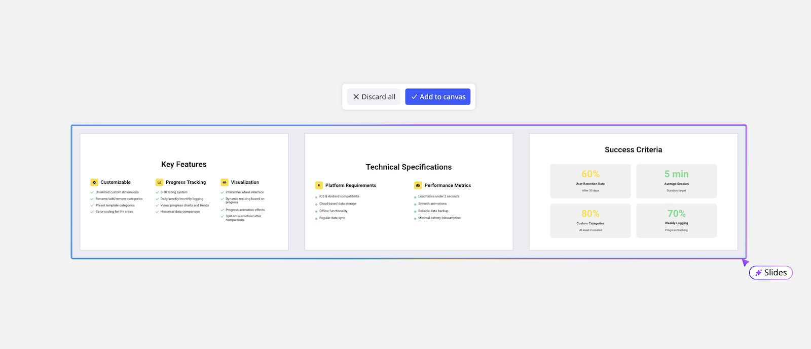

Miro AI를 사용해 [Miro 슬라이드](13-miro-slides.md) 작성 과정을 빠르게 진행하세요.

## AI로 슬라이드 만들기

1. 작성 툴바 위의 **AI로 생성** () 아이콘을 클릭하세요.
2. 열리는 측면 패널에서 **포맷** 탭을 클릭하세요.
3. **슬라이드** 포맷을 선택하세요.
4. AI 프롬프트를 따라 슬라이드 덱을 생성하세요.
5. 보드 객체를 선택하여 슬라이드의 컨텍스트로 추가하세요.

## 선택된 콘텐츠로 슬라이드 생성

보드 상의 객체로 제공된 컨텍스트에서 바로 슬라이드를 생성하려면:

1. 포함할 보드 객체를 선택하세요.
2. 컨텍스트 툴바에서 **Miro AI** 아이콘을 클릭하세요.
3. 드롭다운 메뉴에서 **슬라이드**를 클릭하세요.

## AI 팀원을 사용하여 슬라이드 생성

AI 팀원으로 슬라이드를 생성하려면:

1. 사용할 **AI 팀원**을 엽니다.
2. 프롬프트 박스 하단의 **슬라이드** 아이콘을 클릭하세요.
3. 프롬프트를 입력하고 Enter 키를 누릅니다.
4. 슬라이드가 보드에 생성됩니다.

## AI로 슬라이드 편집하기

슬라이드를 보드에 반영하기 전에, Miro AI를 사용해 개별 슬라이드를 편집할 수 있습니다.

1. AI 프롬프트에서 **슬라이드 편집**을 클릭합니다.
2. 편집할 슬라이드를 선택하세요.
3. 편집할 내용을 입력하고 엔터 키를 눌러 반영합니다.
4. 편집 결과를 검토하고 필요 시 수정합니다.

## AI로 슬라이드 추가하기

추가 슬라이드가 필요하다면, 보드에 반영하기 전에 Miro AI를 사용해 추가할 수 있습니다.

1. AI 프롬프트에서 **슬라이드 추가**를 클릭합니다.
2. 프롬프트에 주제나 기타 정보를 입력하고 Enter 키를 누릅니다.
3. 새 슬라이드를 검토하고 필요에 따라 반복하세요.

## 캔버스에 슬라이드 커밋하기

Miro AI를 사용하여 슬라이드를 편집하거나 추가하는 작업이 끝나면, **캔버스에 추가** 버튼을 클릭하여 보드에 결과를 커밋합니다.

*캔버스에 추가를 클릭하여 슬라이드를 보드에 커밋하세요*

슬라이드를 캔버스에 추가하고 나면 필요에 따라 슬라이드를 수동으로 편집할 수 있습니다.

## 슬라이드를 이미지로 내보내기

Miro 슬라이드 데크에서 슬라이드를 이미지로 내보내는 방법에 대해서는 [Miro 슬라이드](13-miro-slides.md)를 참조하세요.

## AI 슬라이드 생성의 모범 사례

AI 슬라이드에서 최상의 결과를 얻으려면 다음 팁을 따르세요:

- **브랜드 색상 설정**: AI 슬라이드가 자동으로 브랜드 색상을 적용하도록 [Miro 브랜드 센터](../../administration/get-started-as-a-miro-admin/04-brand-center.md)에서 브랜드 팔레트를 구성하세요.
- **프롬프트에서 색상 맞춤 지정**: 브랜드 센터가 설정되지 않았거나 다른 색상을 사용하려면, 프롬프트에서 색상을 설명하거나 HEX 코드를 사용해 언급하세요.
- **구조와 레이아웃 정의**: AI에게 원하는 흐름을 지정할 수 있습니다 (예: “5 슬라이드 덱: 개요, 도전 과제, 해결책, 결과, 다음 단계”).
- **청중과 톤을 지정하세요**: AI가 톤과 스타일을 조정할 수 있도록 프레젠테이션 대상자를 명시하세요 (예: "경영진 대상", "고객 보고용").
