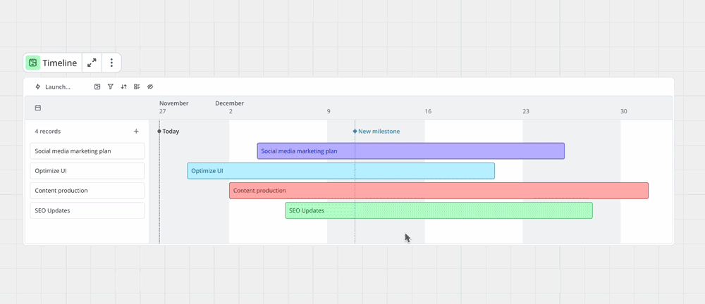
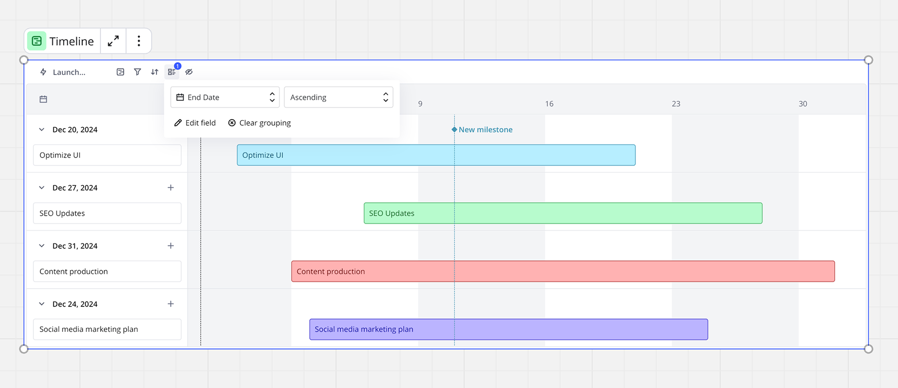

타임라인은 이해관계자와 팀을 전략적으로 정렬하는 인터랙티브 계획 도구입니다. Miro 보드에서 직접 타임라인을 생성, 관리, 공유하세요. 타임라인을 이용해 프로젝트 로드맵을 만들고 가시성을 높이며, 마일스톤을 더 효율적으로 달성할 수 있습니다. 타임라인을 일, 주, 월, 분기 단위로 볼 수 있습니다.

## 주요 기능

- **Miro 보드 내에서 인터액티브 타임라인 맞춤 설정**.
- **타임라인 위젯 내 레코드 추가 및 삭제**.
- **Miro 카드 드래그 앤 드롭**하여 타임라인 위젯으로 이동.
- **레코드 그룹화**를 통해 정보를 논리적으로 구성.
- **각 타임 바 크기 조절**로 개별 레코드의 날짜 변경.
- **날짜 변경 시 타임라인 보기 및 타임 바 자동 확대/축소**.
- **다양한 데이터 소스가 있는 여러 개의 타임라인 위젯 추가**를 동일한 Miro 보드에 포함하세요.
- **타임라인을 팀 멤버 및 이해관계자와 공유**하세요.
- **프로젝트 간 "차단됨" 및 "차단 중" 필드를 사용하여** 기록 간의 의존성을 매핑하고 시각화하세요.

## 보드에 타임라인 추가하기

:::warning
게스트 편집자는 타임라인을 추가하거나 편집할 수 없습니다.
:::

1. Miro 보드 열기.
2. [작성 툴바](../../getting-started/start-here/your-first-board/05-toolbars.md)에서 **더 많은 앱** (**+**) 선택.
3. 검색하여 **타임라인**을 선택합니다.
   이제 커서가 타임라인 아이콘으로 표시됩니다.
4. Miro 보드 어디에서나 클릭하여 타임라인 위젯을 배치합니다.

## 타임라인 상호작용

타임라인 위젯은 작업을 관리할 수 있는 여러 컨트롤을 제공합니다.

### 레코드 추가

항목 열 위의 플러스 기호(**+**)를 클릭합니다. 새 항목이 타임라인에 나타납니다.

항목을 재배치하려면 타임라인에서 위아래로 끌어다 놓습니다. 타임라인의 시간 막대를 끌어다 놓을 수도 있습니다.

### 항목의 텍스트 편집

항목이나 시간 막대를 선택한 후 텍스트를 선택합니다. 깜박이는 커서는 텍스트가 편집 준비가 되었음을 나타냅니다.

:::tip
항목 열에서 오른쪽 경계를 드래그하여 텍스트가 길어질 경우 너비를 확장할 수 있습니다.
:::

항목 내 텍스트에 서식을 적용하거나 링크를 추가하려면 다음을 수행하십시오:

1. 편집할 레코드를 더블 클릭하세요.
   레코드가 편집 가능한 상태가 됩니다.
2. 형식을 지정할 텍스트를 하이라이트하세요.
   컨텍스트 메뉴가 나타납니다.
3. 컨텍스트 메뉴에서, 또는 [키보드 단축키](../working-on-the-board/06-shortcuts-and-hotkeys.md)를 사용하여 텍스트에 형식을 적용하거나 링크를 추가합니다.
4. Enter 키를 눌러 레코드를 저장합니다.

레코드를 편집할 때 텍스트 형식을 측면 패널에서도 적용할 수 있습니다.

### 레코드 삭제

1. 편집할 레코드 또는 시간 막대를 선택하세요.
2. 키보드의 삭제 또는 백스페이스를 누르세요.
3. 레코드가 삭제되었습니다.

### 시작 및 종료 날짜 변경

타임라인에서 표시할 시간 범위를 변경하려면, 타임라인 위젯의 왼쪽 상단에 있는 **캘린더 아이콘** ()을 선택하여 시작 및 종료 날짜를 선택하세요. 타임라인이 자동으로 선택한 날짜에 맞춰 조정됩니다.

또한 드롭다운을 사용하여 타임라인을 **일**, **주**, **월**, **분기**, **연** 단위로 조정할 수 있습니다.

*타임라인 크기 변경*

특정 레코드의 시작일과 종료일을 변경하려면 시간 막대의 양 끝을 드래그하세요.

타임라인은 날짜 오류가 있는 레코드에 경고 아이콘을 표시합니다. 예를 들어 종료일이 시작일보다 앞선 경우입니다. 경고 아이콘을 클릭하여 날짜를 올바른 순서로 전환하세요.

*경고 아이콘을 클릭하여 올바른 날짜를 설정하세요.*

시작일이나 종료일이 없는 레코드의 경우 타임라인은 누락된 날짜에 그라데이션으로 채워진 시간 막대를 표시합니다.

*누락된 시작일이나 종료일을 추가하려면 그라데이션 시간 막대를 클릭하세요.*

날짜가 없는 항목의 경우, 타임라인에는 더하기 (**+**) 버튼이 표시됩니다. 더하기 버튼을 클릭하세요. 타임라인에 시간 막대가 추가됩니다. 이제 시간 막대를 편집하여 시작일과 종료일을 설정할 수 있습니다.

### 항목 건너뛰기

일부 긴 타임라인에는 시야에서 벗어난 시간 막대가 있는 항목이 있습니다. 항목 열에서 해당 시간 막대로 스크롤 없이 건너뛰려면 오른쪽 화살표 버튼을 클릭하세요.

*시야에서 벗어난 시간 막대로 건너뛰려면 오른쪽 화살표 버튼을 클릭하세요.*

### 자동 맞춤

모든 시간 막대가 완벽하게 맞도록 타임라인을 조정하려면, 레코드 열 위에서 **자동 맞춤**을 클릭하세요.

***자동 맞춤** 버튼을 사용하면 타임라인의 모든 시간 막대를 자동으로 맞출 수 있습니다.*

### 레코드 색상 변경하기

레코드 또는 시간 막대를 클릭하면 색상 원이 나타납니다. 색상 원을 클릭하여 색상 선택기를 열고 원하는 색상을 선택하세요.

### 레코드 위치 변경하기

레코드 열에서 레코드를 끌어다 놓아 타임라인의 위치를 변경할 수 있습니다. 시간 막대도 옵션으로 끌어다 놓을 수 있습니다.

*타임라인에서의 레코드 재배치*

### 레코드 필터링

타임라인의 내용을 하나 이상의 필드로 필터링하여 작업할 항목을 좁힐 수 있습니다. 타임라인 상단의 필터 아이콘을 클릭하여 이 작업을 수행할 수 있습니다. 하나 이상의 필드로 필터링할지를 선택하고, 필터링할 필드를 선택합니다. 필터가 적용되면, 타임라인의 필터 아이콘 상단에 필터가 몇 개 적용 되었는지를 참조하기 위해 카운터가 표시됩니다.

필터를 제거하려면 같은 단계를 따르고 제거할 필터 옆의 휴지통을 클릭합니다.

### 레코드 정렬

타임라인의 내용을 정렬하려면 타임라인 상단의 정렬 아이콘을 클릭한 다음, 타임라인 내에서 레코드를 정렬할 필드를 선택하세요. 그런 다음, 해당 필드를 기준으로 레코드를 오름차순 또는 내림차순으로 정렬할지 선택할 수 있습니다. 정렬이 적용되면 정렬 아이콘 위에 정렬이 적용되었음을 나타내는 카운터가 표시됩니다.

같은 단계를 따라 정렬을 제거하고 드롭다운에서 삭제 옵션을 클릭하여 정렬을 제거할 수 있습니다.

### 타임라인 복사 및 붙여넣기

타임라인을 복사해 붙여넣을 때 두 가지 옵션을 제공하는 팝업이 나타납니다.

- 원본 타임라인의 동기화된 보기를 붙여넣기
- 원본 타임라인을 템플릿으로 사용해 새 타임라인 생성

보드 내 및 보드 간에 복사하고 붙여넣을 수 있습니다.

타임라인을 원본 타임라인의 동기화 보기로 붙여넣으면 새 타임라인의 모든 기록이 원본 타임라인의 기록과 동기화 상태를 유지하게 됩니다. 그러나 새 타임라인의 보기를 사용자 지정해도 원본에는 영향을 미치지 않습니다. 예를 들어, 필터를 적용하거나 정렬, 그룹화, 레이아웃을 변경해도 원본 타임라인의 속성은 변하지 않습니다. 이를 활용하여 동일한 정보를 다중 보기/레이어로 각각 만들 수 있으며, 기록들은 타임라인 및 보드들 간에 동기화된 상태로 남아 있습니다.

새 타임라인으로 붙여넣기를 선택하면 원본 타임라인의 복사본이 만들어지지만 새 타임라인의 기록이 원본에 다시 동기화되지는 않습니다. 따라서 원본 타임라인을 템플릿으로 사용하여 동일한 레이아웃을 가진 새 타임라인을 생성한 것입니다. 새 타임라인에 대한 편집 사항은 원본에 반영되지 않으며 반대의 경우도 마찬가지입니다.

### 레코드 그룹화

그룹은 타임라인에 추가적인 계층을 제공합니다. 예를 들어, 시작일이나 종료일을 기준으로 로드맵을 정렬하고자 할 때 사용할 수 있습니다.

그룹을 만들려면 타임라인 상단의 **그룹** 아이콘을 클릭한 후, 레코드를 그룹화할 필드를 선택하십시오. 필드를 선택하면 타임라인이 관련 그룹으로 분리되며, 이 그룹을 확장하거나 축소할 수 있습니다. 그룹을 제거하려면 동일한 절차로 **그룹 해제**를 클릭하세요.

*타임라인에서의 레코드 그룹화*

:::tip
레코드를 다른 그룹으로 드래그 앤 드롭할 수 있습니다.
:::

## 타임라인에 Miro 카드 또는 스티커 메모 추가하기

타임라인 위젯은 Miro 카드 또는 스티커 메모의 데이터를 시각화합니다. 어떤 카드나 스티커 메모든 타임라인 위젯으로 드래그 앤 드롭하세요.

## 동기화 카드

타임라인에서 기록을 드래그 앤 드롭하여 캔버스에 동기화 카드를 생성할 수 있습니다.

다음 단계를 따라 동기화 카드를 생성하세요:

1. 연결된 카드를 만들고 싶은 레코드에 커서를 올려놓으세요.
   아이콘이 레코드의 왼쪽에 나타납니다.
2. 점 아이콘을 클릭하고 캔버스로 드래그하세요.
   레코드의 정보로 카드가 생성됩니다.
3. 타임라인의 레코드가 업데이트되면 카드도 업데이트되며, 그 반대도 마찬가지입니다.

   타임라인에서 연결된 카드를 성공적으로 만들었습니다.

카드의 오른쪽 아래에 데이터베이스 아이콘이 나타나면 타임라인에 연결되어 있음을 알 수 있습니다.

레코드를 삭제하면, 해당 연결된 카드는 보드에 남아 있지만 빈 상태로 나타납니다.

캔버스에서 동기화된 카드를 삭제해도, 타임라인의 레코드는 그대로 유지됩니다.

기존 동기화된 카드를 그것이 생성된 타임라인으로 드래그하면 작동하지 않습니다. 이는 해당 타임라인에서 고유한 레코드로 취급되기 때문입니다. 그러나 기존 동기화된 카드를 새로운 타임라인으로 드래그할 수 있으며, 이 경우 타임라인에 새로운 비동기 레코드로 나타납니다.

## Jira 카드를 타임라인에 추가하는 방법

Jira 카드를 타임라인으로 드래그 앤 드롭하여 Jira 동기화 레코드를 생성할 수 있습니다. 이를 통해 Miro와 Jira의 작업을 통합해 한 곳에서 팀 전체의 작업을 관리하고 추적할 수 있습니다.

타임라인에 Jira 카드를 추가하려면 다음의 단계를 따르세요:

1. 캔버스에서 관련된 Jira 카드를 찾습니다.
2. 카드를 타임라인으로 드래그합니다.
3. 타임라인 내의 목표 행에 카드를 놓습니다.

Miro에서 이루어진 모든 변경사항은 Jira에서도 반영되며, 그 반대도 마찬가지입니다. 타임라인 내에서 다음과 같은 필드는 Jira와 동기화됩니다:

- 제목
- 설명
- 예상
- 시작 날짜
- 종료 날짜
- 담당자 (베타)
- 상태 (베타)

타임라인의 다른 모든 필드는 Miro에만 저장되며 Jira에 동기화되지 않습니다.

**자세한 정보:** [Jira 카드 자주 묻는 질문](../../integrations-apps/atlassian/17-jira-cards-faq.md)을 참조하세요.

## 마일스톤 추가

다가오는 날짜와 기한을 추적하기 위해 타임라인에 마일스톤을 추가할 수 있습니다.

1. 타임라인 위젯 위로 마우스를 가져가면 점선과 깃발 아이콘이 나타납니다.
2. 선택한 날짜를 클릭하고 마일스톤의 이름을 지정하세요.
3. 마일스톤 이름을 편집하려면 더블 클릭하세요. 깜박이는 커서는 텍스트를 편집할 준비가 되었음을 나타냅니다.
4. 클릭하고 색상 원에서 색상을 선택하여 색상을 변경하세요.
5. 마일스톤을 클릭한 다음 그 위에 나타나는 캘린더 선택기를 열어 마일스톤 날짜를 변경하세요.

## 타임라인의 레이아웃 변경

타임라인의 레이아웃을 변경하여 동일한 기록을 테이블에서 확인할 수 있습니다. 이 작업은 캔버스에 있는 기존 위젯의 레이아웃을 변경하거나 그 타임라인을 복사한 후, 복사본의 레이아웃을 변경함으로써 수행할 수 있습니다. 레이아웃 변경은 테이블 상단의 타임라인 아이콘을 클릭하여 테이블 또는 타임라인 중 선택하는 방식으로 이루어집니다. 테이블 보기로 전환하면 필터링, 그룹화, 정렬 등의 설정이 유지되고 기본적인 필드로 제목, 설명, 상태, 예상, 우선순위, 테마, 시작 및 종료 날짜 등이 표시될 수 있습니다.

**더 많은 정보:** [테이블](14-tables.md)을 참조하세요.

## 타임라인 공유하기

다음 단계에 따라 Miro 보드에서 타임라인을 공유하세요:

1. 공유하려는 타임라인 위젯을 선택합니다.
   컨텍스트 메뉴가 위젯 위에 나타납니다.
2. **더보기** (**...**) 메뉴를 선택합니다.
   드롭다운 메뉴가 열립니다.
3. **링크 복사**를 선택합니다.
4. 보드를 볼 수 있는 권한이 있는 사람과 링크를 공유합니다.

## 관계 (종속성)

> **사용 가능한 플랜:** Business, Enterprise

이 관계 필드 유형을 사용하면 타임라인에서 레코드 간의 종속성을 연결선을 통해 맵핑할 수 있습니다. 이를 통해 프로젝트 관계를 추적하고 작업 항목 간의 의존성을 이해할 수 있습니다.

### 레코드 간의 종속성 추가

1. 커서로 타임라인 바 위에 올려놓으면 연결 지점이 나타날 때까지 기다리세요.
2. 하나의 바에서 다른 바로 클릭한 채 드래그하여 의존성 라인을 만드세요.
3. 의존성은 자동으로 타임라인과 테이블 보기 모두에 나타납니다.

:::note
레코드는 여러 개의 차단 및 차단 당하는 관계를 가질 수 있습니다. 의존성은 모든 동기화된 타임라인에서 동기화되어, 보드와 보기 전반에 일관성을 유지합니다.
:::

:::note
의존성은 자동으로 테이블 보기에 해당하는 차단 및 차단 당하는 필드를 생성합니다.
:::

:::warning
현재 제한 사항 (베타):

- Jira와 연동된 기록이나 다른 서드파티 통합을 위한 종속성은 아직 지원되지 않습니다.
- 연동된 카드에 대한 종속성의 시각적 지표는 아직 표시되지 않습니다.
- 종속성을 기반으로 한 자동 날짜 조정은 아직 사용할 수 없습니다.
:::

## 관계 (중첩)

> **해당 플랜:** Enterprise Advanced

중첩 관계를 사용하여 타임라인 내에서 기록 간의 계층 구조를 생성할 수 있습니다.

### 기록 간의 계층 구조 생성

1. 타임라인 바를 클릭하고 상황에 맞는 메뉴에서 **하위 레코드 추가**를 클릭합니다.
2. 계층 구조가 기본적으로 켜집니다. 끄려면 타임라인 헤더에서 **보기 설정**으로 이동하세요.
3. 계층 구조가 켜져 있을 때, 드래그 앤 드롭으로 레코드 간의 계층 관계를 생성할 수 있습니다.

부모 레코드 옆의 **캐럿**을 사용해 자식 레코드를 표시하거나 숨길 수 있습니다.

계층적 관계는 측면 패널에서도 보고 편집할 수 있습니다. 데이터를 자세히 보려면 **테이블** 레이아웃으로 전환하세요.

:::note
타임라인의 계층 구조는 자동으로 테이블과 동기화됩니다. 계층 구조는 테이블 보기에서 자동으로 부모 필드와 자식 필드를 생성합니다.
:::

:::note
**설정** 보기에서 테이블 및 타임라인 헤더의 네스팅을 토글 설정으로 끄면 쉽게 네스팅 시각화를 끌 수 있습니다.
:::

:::warning
부모 항목을 삭제하면 모든 하위 항목도 삭제됩니다. 실행 취소 기능을 사용하여 이를 되돌릴 수 있습니다.
:::

:::warning
**현재 제한 사항 (베타):**

- 계층의 최대 8단계.
- Jira와 동기화된 레코드나 다른 서드파티 통합에 대한 네스팅은 아직 지원되지 않습니다.
- 시각화는 동기화된 카드나 칸반 보기에서 사용할 수 없습니다.
:::

## 집중 모드

타임라인을 전체 화면 모드에서 편집하고 볼 수 있습니다. 위젯 상단의 **대각선 화살표 아이콘**을 클릭하기만 하면 됩니다. 필터, 정렬, 그룹, 필드 숨기기와 같은 설정은 오른쪽 상단에 있습니다.

캔버스로 돌아가려면 상단의 **캔버스에서 발상하기**를 클릭하세요.
