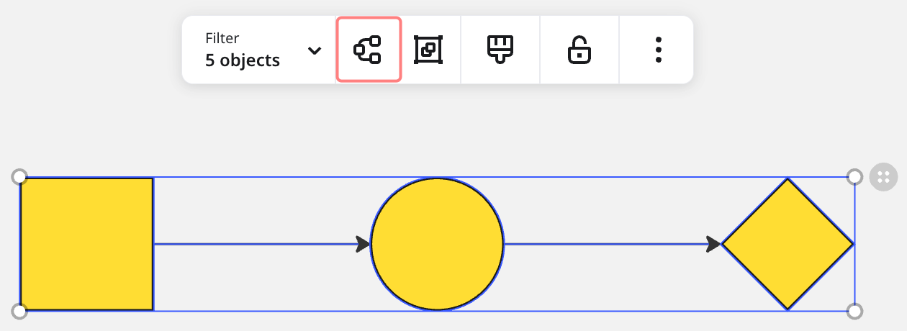

Miro 다이어그램은 복잡한 아이디어를 시각화하고 효과적으로 브레인스토밍하며 팀과 구조적인 방식으로 협업할 수 있도록 도와줍니다. **레이어**, **Miro AI**, **다이어그램 도형**과 같은 필수 도구를 쉽게 접근할 수 있어, 이 새로운 형식은 다이어그램 작성을 위한 완전한 **작업 공간**입니다.

## Miro 다이어그램이란 무엇인가요?

Miro 다이어그램은 다이어그램 작성을 향상시키기 위해 설계된 전용 워크스페이스입니다. 레이어, Miro AI, 다양한 다이어그램 도형 라이브러리와 같은 도구가 제공되는 구조화된 환경을 제공합니다. 이 포맷은 프로세스 맵핑, 시스템 설계, 브레인스토밍 등 다양한 목적을 위해 명확하고 체계적이며 전문적인 다이어그램을 작성하는 데 도움을 줍니다.

## 다이어그램 포맷 접근

Miro 보드에 새로운 다이어그램을 추가하려면 다음 단계를 따르세요:

1. **플러스 (+) 아이콘**을 툴바에서 클릭하세요.
2. **Diagram**을 선택하세요.
3. 캔버스에서 아무 곳이나 클릭하여 추가하세요.

이로써 다이어그램 전용 형식이 생성되어 다음 작업을 시작할 수 있습니다:

- **직접 도형 추가**
- **AI로 생성하기**

## 다이어그램 수동으로 만들기

도형을 수동으로 추가하려면 다음 단계를 따르세요:

1. **도형 추가**를 클릭하세요. 이 작업은 **포커스 모드**를 자동으로 엽니다. 여기서 다음을 수행할 수 있습니다:
   - [다이어그램 작성 도형](../../working-on-the-board/15-custom-shapes-for-diagramming.md)을 추가하거나 [사용자 지정 도형](../../working-on-the-board/15-custom-shapes-for-diagramming.md)을 추가하세요.
   - 요소를 선과 화살표로 연결하세요.
   - [컨테이너](#use-containers)를 추가하여 요소를 그룹화하세요.
   - 다이어그램에 주석을 남기기 위해 스티커 메모와 텍스트를 추가하세요.
   - [AI로 만들기](#create-with-ai) 도구로 전환하세요.

## AI로 다이어그램 만들기

Miro AI를 사용하면 입력에 따라 도형 배치와 연결을 자동화하여 빠르게 다이어그램을 생성할 수 있습니다. 브레인스토밍, 프로세스 매핑 또는 데이터 구조화 작업을 할 때 Miro AI는 시간을 절약하고 시각화에 명확성을 보장합니다.

캔버스의 위치에 따라 Miro AI를 사용해 두 가지 방법으로 다이어그램을 만들 수 있습니다:

1. 다이어그램 형식 자체에서 생성하기.
2. [왼쪽에 있는 AI로 만들기 도구에서 생성하기.](#add-a-diagram-with-miro-ai)

AI로 새 다이어그램을 만들 때, 시작할 수 있는 유형 중 하나를 선택할 수 있습니다:

- **플로우차트**
- **마인드 맵**
- **ER 다이어그램**
- **UML 시퀀스**
- **UML 클래스**

### **AI를 사용해 다이어그램 포맷에서 다이어그램 만들기**

방금 보드에 빈 다이어그램 포맷을 추가한 경우, Miro AI를 사용해 내용을 채울 수 있습니다:

1. 도형 안에서 **AI로 만들기**를 클릭합니다. 집중 모드가 열립니다.
2. **도형 유형**을 선택하고 **도형을 설명**합니다. 예를 들어, "온라인 상점 결제 플로"와 같은 것입니다.
3. **도형 생성**을 클릭합니다.

:::tip
Miro AI는 프롬프트의 의미적 스타일링에 반응합니다. 자세한 내용은 [Miro AI와 다이어그램 및 마인드맵](../../miro-ai/13-miro-ai-with-diagrams-and-mindmaps.md)을 참조하세요.
:::

Miro AI는 사용자의 입력을 분석하여 미리 정의된 템플릿과 연결을 기반으로 구조화된 다이어그램을 생성합니다. 그런 다음 AI가 생성한 도형을 수동으로 추가한 것처럼 **편집**, **이동**, **연결**할 수 있습니다.

.png)

### AI로 만들기 패널에서 다이어그램 생성

아직 다이어그램을 추가하지 않았다면 Miro AI가 처음부터 다이어그램을 생성할 수 있습니다. 이렇게 하려면:

1. **AI로 만들기** 패널을 엽니다.
2. **다이어그램** 콘텐츠 유형을 선택합니다.
3. 미리 정의된 **다이어그램 유형** 중 하나를 선택합니다.
4. **만들고자 하는 다이어그램**을 설명합니다.
5. **다이어그램 생성**을 선택합니다.

생성된 다이어그램은 캔버스의 빈 영역에 나타납니다. 수동으로 추가한 것처럼 AI로 생성된 도형을 **편집**, **이동**, **연결**할 수 있습니다.

:::tip
Miro AI는 프롬프트의 의미적 스타일에 반응합니다. 자세한 내용은 [Miro AI와 다이어그램 및 마인드맵](../../miro-ai/13-miro-ai-with-diagrams-and-mindmaps.md)을 참조하세요.
:::

## 기존 다이어그램에서 다이어그램 포맷 만들기

캔버스에 이미 다이어그램을 작성했고 이를 다이어그램 포맷으로 구조화하고 싶다면, 클릭 한 번으로 변환할 수 있습니다. 이렇게 하면 모든 연결이 그대로 유지되면서 다이어그램 전용 기능이 추가됩니다.

캔버스에 있는 기존 다이어그램을 다이어그램 포맷으로 변환하려면:

1. **연결된 여러 도형**을 선택하세요.
2. 컨텍스트 메뉴에서 **다이어그램으로 감싸기**를 클릭하세요.

선택한 도형과 연결이 다이어그램 형식으로 구조화됩니다. 여전히 도형을 다이어그램 형식 안팎으로 이동할 수 있습니다.

## 다이어그램 작업

다이어그램을 추가하거나 생성한 후에 **집중 모드, 레이어 및 컨텍스트 메뉴**를 사용하여 다듬을 수 있습니다. 이 도구는 체계적으로 구성하고 방해 요소를 최소화하며 효율적으로 다이어그램을 구성하는 데 도움이 됩니다.

### 집중 모드 사용

다이어그램을 작업할 때 집중하고 싶으면 **집중 모드**(전체 화면)에서 열 수 있습니다. 집중 모드는 효율적인 다이어그램 작성을 위해 Miro에서 설계한 다이어그램 작업 공간입니다. 이 모드에 액세스하려면 작업 중인 다이어그램 위에 있는 **집중 모드** 아이콘을 클릭하세요.

 copy.png)

집중 모드에서는 도형 맞춤화, 레이어, AI 기반 생성과 같은 모든 다이어그램 편집 도구에 액세스할 수 있습니다. 또한, **도형이 표에 맞춰 자동 정렬**되어 요소를 정확하게 정렬하기 쉽습니다. 집중 모드에서는 위젯의 픽셀 크기를 지정할 수 있는 정밀한 크기 조정도 사용할 수 있습니다. **자세한 정보:** [정밀한 크기 조정](../../essential-tools/01-precise-resizing.md)을 참조하세요.

집중 모드를 종료하려면 화면 상단의 **캔버스로 돌아가기**를 클릭하세요.

### 레이어 사용하기

다이어그램의 레이어를 사용하면 보드의 다른 부분에 영향을 주지 않고 다이어그램 내의 콘텐츠를 **조직 및 관리**할 수 있습니다. 전 Miro 보드에 적용되는 [캔버스 레이어](../../essential-tools/09-layers.md)와 달리, **다이어그램 레이어는 작업 중인 다이어그램에만 특정**됩니다.

다이어그램의 레이어는 다음과 같이 작동합니다:

- 레이어는 다이어그램의 **집중 모드**에서만 관리할 수 있습니다. 다이어그램 내의 도형을 클릭한 다음 "편집 중: 다이어그램 레이어 이름" 버튼을 선택하여 집중 모드에 빠르게 액세스할 수 있습니다.
- 각 다이어그램은 캔버스 레이어와는 별도의 **자체 레이어 세트**를 가지고 있습니다.
- 각 다이어그램은 모든 새로운 요소가 배치되는 **기본 레이어**로 시작합니다. 필요에 따라 복잡한 다이어그램을 더 잘 구조화하기 위해 추가 레이어를 만들 수 있습니다.
- 다이어그램을 구조화하기 위해 **여러 레이어를 추가**할 수 있습니다.
- **다이어그램** 내부의 **요소들을 레이어 간에 이동할 수 있습니다**.
- 편집하거나 발표할 때 다이어그램의 특정 부분에 집중하기 위해 레이어를 **숨기거나 잠글 수 있습니다**.
- 다이어그램을 복사 및 붙여넣기하거나 복제하면 모든 레이어도 함께 복제됩니다. 이렇게 하면 레이어 구조를 매번 새로 만들지 않고도 다이어그램의 다양한 버전을 생성하기에 유용합니다.

#### 새 레이어 추가

다이어그램 내에 새 레이어를 만들려면 다음 단계를 따르세요:

1. 다이어그램의 **포커스 모드**를 엽니다.
2. 우측 상단에서 **레이어**를 클릭하여 **다이어그램 레이어** 사이드바를 엽니다.
3. **+ 새 레이어**를 클릭하여 새 레이어를 생성합니다.
4. 다이어그램을 체계적으로 유지하기 위해 레이어의 이름을 변경합니다 (선택 사항).

또는 다이어그램에서 요소를 마우스 오른쪽 버튼으로 클릭한 후 **레이어로 이동** > **+ 새 레이어**를 선택할 수 있습니다.

#### 레이어 관리

기본적으로 모든 새로운 요소는 **기본 레이어**에 배치됩니다. 다이어그램을 더 잘 조직하기 위해 요소를 레이어 간에 이동하거나 레이어를 숨기거나 잠그고 레이어 설정을 조정할 수 있습니다.

**레이어 간에 요소 이동:**

레이어 간에 요소를 이동하려면:

1. 이동할 요소를 오른쪽 클릭합니다.
2. **레이어로 이동**을 선택한 다음 요소를 이동할 레이어를 선택합니다.

**레이어 숨기기:**

레이어를 숨기면 다이어그램을 편집하거나 발표할 때 보기 간소화에 도움이 됩니다. 레이어를 숨기려면:

- **다이어그램 레이어 사이드바**에서 레이어 옆의 **눈 아이콘**을 클릭하여 레이어를 숨기거나 표시합니다.

**레이어 잠금:**

레이어를 잠그면 실수로 수정되는 것을 방지할 수 있습니다. 레이어를 잠그려면:

- **다이어그램 레이어 사이드바**에서 레이어 옆의 **자물쇠 아이콘**을 클릭하여 수정 기능을 끕니다. 다시 클릭하여 잠금을 해제합니다.

**레이어 설정 수정:**

레이어의 이름을 바꾸거나, 복제하거나, 이동하거나, 삭제할 수 있습니다. 레이어 설정을 수정하려면:

- **다이어그램 레이어 사이드바**에서 **세 개의 점 아이콘**을 클릭하여 레이어 옆에 추가 옵션에 접근하세요.

### 컨테이너 사용

컨테이너는 프레임과 비슷하지만, 다이어그램 작성에 최적화되어 있습니다. 캔버스에서 요소들을 그룹화하고 조직화하는 데 도움을 줍니다. 컨테이너를 사용하면 커넥터 라인이 원활하게 작동하고 컨테이너 안에 다른 컨테이너를 중첩할 수 있습니다.

사용할 수 있는 두 가지 주요 컨테이너가 있습니다:

- **일반 컨테이너**: 이러한 컨테이너는 프레임처럼 작동하며 내부에 배치된 모든 요소의 부모 역할을 합니다. 다이어그램 내 특정 영역을 정의하기 위해 이 컨테이너에 이름을 부여할 수 있습니다. 또한 일반 컨테이너를 중첩하여 더 복잡한 다이어그램을 관리하기 위한 하위 구역을 만들 수 있습니다.
- **스윔레인**: 이는 프로세스 다이어그램에서 주요 사용되며, 다른 부서 또는 프로세스 단계와 같은 서로 다른 작업의 레인들을 시각적으로 구분하는 데 사용됩니다.

추가적인 조직화를 위해 컨테이너를 [레이어](#context-menu-in-diagrams) 내에서 이동할 수 있습니다.

### 다이어그램을 기본 보기로 설정

다이어그램 작업 시, 세 점 아이콘을 클릭하여 컨텍스트 메뉴를 통해 추가 기능을 찾을 수 있습니다.

예를 들어, 보드를 열 때 다이어그램을 기본 보기로 설정할 수 있습니다. 이를 위해:

1. 캔버스에서 다이어그램을 선택합니다.
2. 세 점 (...) 메뉴를 열고 **기본 보기로 설정**을 선택합니다.

이제 선택한 다이어그램 형식이 보드를 열 때마다 자동으로 열립니다.

## 다이어그램을 문서에 추가하기

다이어그램의 [동기화 사본](../../working-on-the-board/11-synced-copies.md)을 [Miro 문서](../12-docs-in-miro.md)에 추가하여 문서에 컨텍스트, 구조, 시각적 명확성을 제공할 수 있습니다. 이는 다이어그램을 다른 사람과 공유하거나 더 구조화된 형식으로 프레젠테이션할 때 특히 유용합니다.

Doc에 Diagram을 추가하려면 다음 단계를 따르세요:

1. **선택** 캔버스에서 Diagram을 선택하세요.
2. **드래그 앤 드롭**으로 Diagram을 Doc에 넣으세요.
3. **크기 조정 및 위치 선정**을 통해 필요에 따라 Doc 내에서 Diagram을 조정하세요.

동기화 사본이 이제 Doc의 일부로 포함되었습니다.

.png)
:::note
동기화 사본은 모든 사용자가 **보기 전용**입니다. 사본의 내용을 변경하려면 원본 Diagram의 내용을 수정하세요.
:::

## 다른 보드로 다이어그램 복사

여러 팀이 다른 보드에서 협업할 때, [동기화 사본](../../working-on-the-board/11-synced-copies.md)을 만들어 여러 장소에서 같은 다이어그램을 공유할 수 있습니다. 이렇게 하면 어디서 작업하든 간에 모두가 단일 진실 공급원을 기준으로 조율됩니다.

동기화된 다이어그램을 다른 보드로 복사하려면 다음 단계를 따르세요:

1. **공유하려는** 다이어그램을 우클릭합니다.
2. **복사 및 동기화**를 선택합니다.
3. 대상 보드로 이동해 다이어그램을 **붙여넣기**합니다.

복사한 다이어그램은 **원본과 동기화**되어 원본에서 변경된 사항이 자동으로 동기화 사본에 반영됩니다.

:::note
동기화 사본은 **모두 보기 전용**입니다. 사본의 콘텐츠를 변경하려면 원래 다이어그램의 콘텐츠를 수정하세요.
:::

## 다이어그램 공유

다이어그램을 다른 사람과 공유하는 방법은 다음과 같습니다:

1. **집중 모드에서 브라우저의 주소 표시줄에서 URL을 복사**하세요.
2. **캔버스에서, 세 개의 점 아이콘을 클릭**합니다. 그런 다음 **집중 모드 링크 복사**를 클릭합니다.

## 다이어그램을 이미지로 내보내기

다이어그램을 JPG, PDF, 또는 SVG로 내보낼 수 있습니다.

다이어그램을 내보내기 위해 다음과 같은 단계를 따르세요:

1. 다이어그램을 선택합니다.
   다이어그램 위에 컨텍스트 메뉴가 나타납니다.
2. 컨텍스트 메뉴에서 세로로 된 세 개의 점을 클릭해 **더보기** 메뉴를 엽니다.
3. **공유 및 내보내기** > **이미지로 내보내기**를 클릭합니다.
   **이미지로 내보내기** 모달이 열립니다.
4. JPG, PDF, SVG 중에서 내보낼 형식을 선택합니다.
   JPG의 경우 해상도를 **작게**, (기본값) **중간** 또는 **크게** 선택할 수 있습니다.
5. **내보내기**를 클릭합니다.

## 자주 묻는 질문

**다른 툴의 다이어그램을 가져올 수 있나요?**

네, 다른 플랫폼에서 가져온 다이어그램을 Miro의 다이어그램 형식으로 쉽게 변환할 수 있습니다.

다음의 워크플로를 지원합니다:

- **Lucidchart**: Lucidchart 다이어그램을 **.vsdx** 파일로 내보내고 Miro에 가져오거나, Lucidchart에서 직접 복사하여 Miro 보드에 붙여넣을 수 있습니다.
- **Draw.io** (diagrams.net으로도 알려져 있음): 다이어그램을 **.vsdx** 파일로 내보내고 Miro에 가져옵니다.
- **Microsoft Visio**: Visio에서 다이어그램을 **.vsdx** 파일로 내보낸 후 Miro에 가져옵니다.

가져온 후, **도형 선택**한 다음, 상황에 맞는 메뉴에서 **다이어그램으로 묶기**를 사용하여 구조화된 다이어그램 형식으로 변환합니다.

다이어그램 가져오기에 대해 자세히 알아보세요:

- [Lucidchart에서 다이어그램 가져오기](../../../getting-started/migrating-content-to-miro/04-import-lucidchart-diagrams-to-miro.md)
- [Draw.io에서 다이어그램 가져오기](../../../getting-started/migrating-content-to-miro/02-import-draw.io-diagrams-to-miro.md)
- [Visio에서 다이어그램 가져오기](../../../getting-started/migrating-content-to-miro/09-import-visio-diagrams-to-miro.md)
