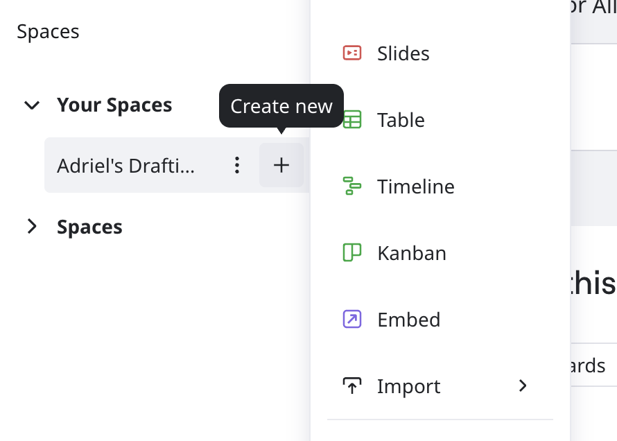

출처 애플리케이션에서 PDF 또는 VSDX로 내보낸 후 여러 다이어그램을 Miro로 일괄 가져올 수 있습니다.

:::note
일부 애플리케이션의 경우, 지원되는 파일 타입이 하나뿐입니다. 확인하려면 파일 타입 지원을 참조하세요.
:::

## 다이어그램을 Miro로 일괄 가져오는 방법

출처 애플리케이션에서 PDF 또는 VSDX로 내보낸 파일이 있는지 확인한 후, 다음 절차를 완료하여 다이어그램을 Miro로 가져오세요.

1. Miro 대시보드에서 다이어그램을 가져올 스페이스에서 **새로 만들기** (**+**)를 클릭합니다.
   
2. **가져오기** > **\{소스\}에서 가져오기**를 클릭합니다. 예를 들어, **Mural에서 가져오기**.
    **{소스}에서 가져오기** 모달이 열립니다.
3. 화면의 안내에 따라 진행합니다.
4. (선택 사항) 가져올 스페이스를 변경하거나 새 스페이스를 만들려면 플러스 (**+**) 버튼을 클릭합니다.
5. **가져오기** ***x*** **파일**을 클릭하세요.

## 파일 형식 지원

| 소스 | 파일 형식 |
| --- | --- |
| Conceptboard | PDF, VSDX |
| Lucidchart | PDF, VSDX |
| Lucidspark | PDF, VSDX |
| Mural | PDF |
| Visio | VSDX |
