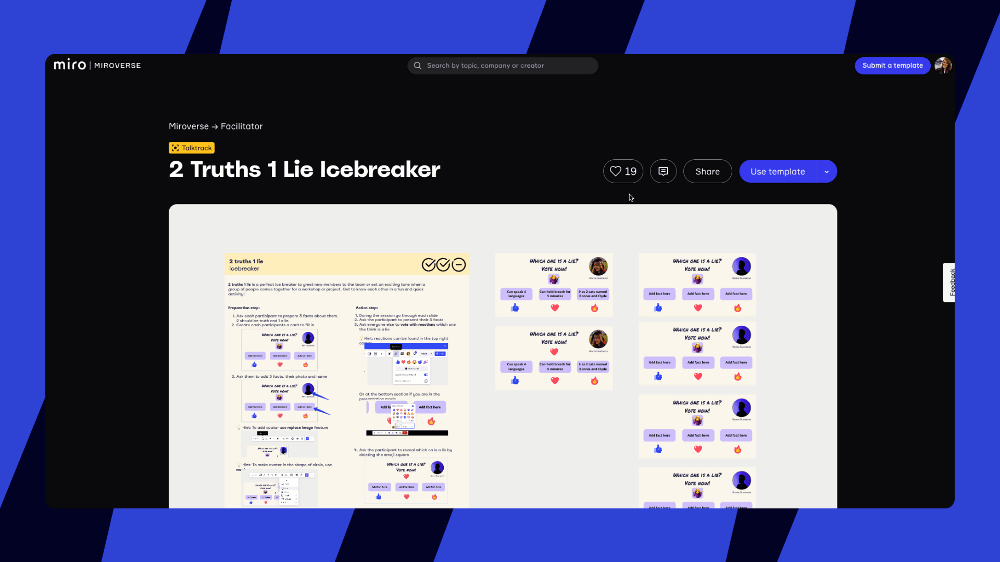
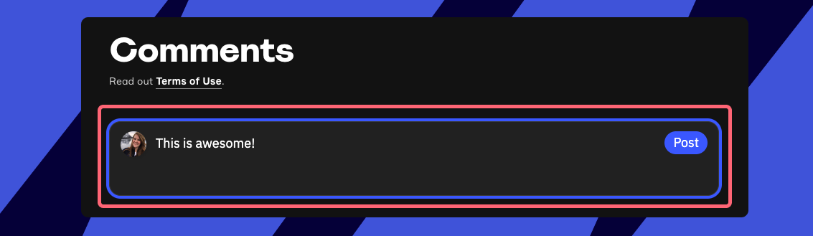
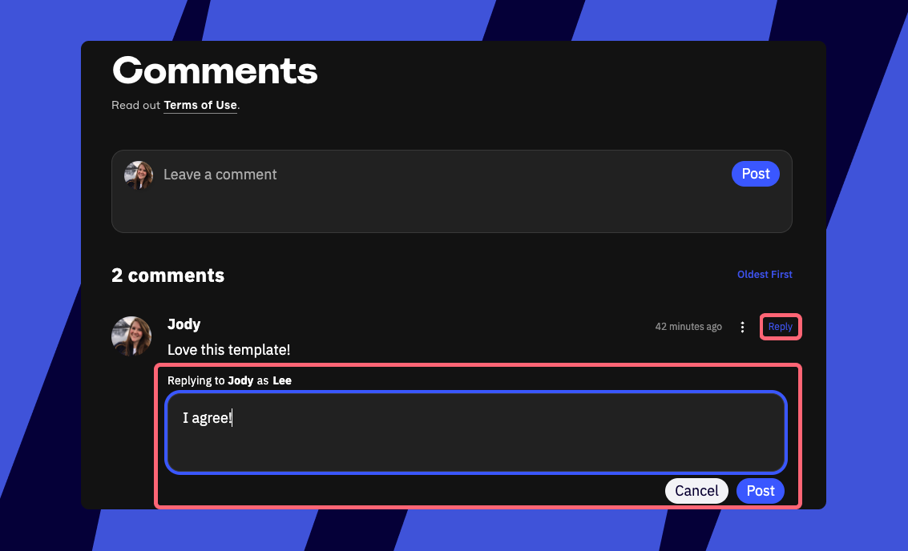
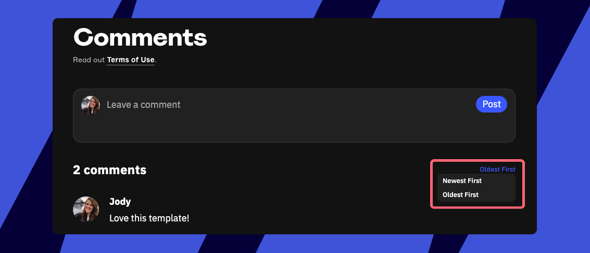
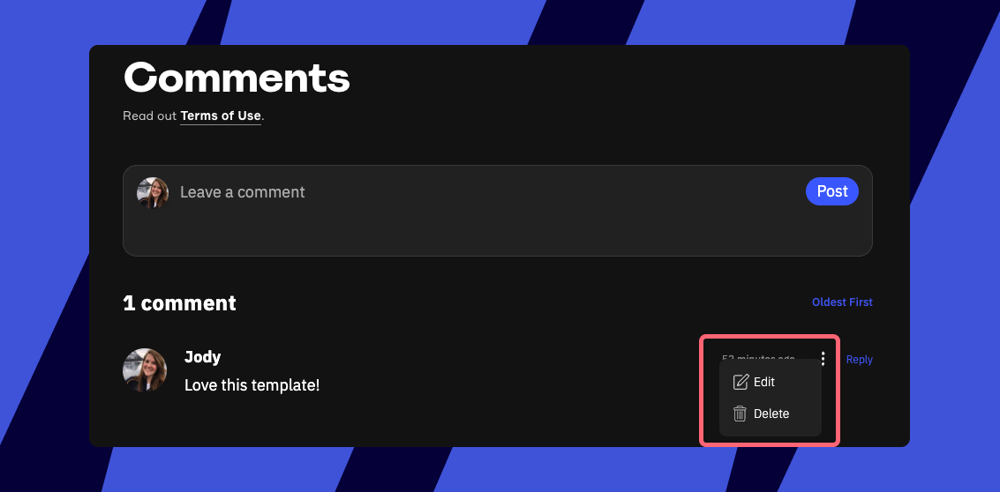

Miroverse는 사용자가 템플릿에 대한 피드백을 공유하고 인사이트를 교환하여 품질을 보장하고 협업 학습 기회를 창출할 수 있도록 돕습니다. 구체적인 댓글을 남겨 크리에이터가 템플릿을 개선하고 커뮤니티에 기여하도록 도울 수 있습니다.

:::note
템플릿에 피드백을 남기려면 [Miroverse](01-what-is-miroverse.md)에 로그인해야 합니다.
:::

:::warning
Miroverse 템플릿의 모든 댓글은 검토됩니다. Miroverse 피드백 지침을 따라주세요.
:::

## 피드백과 댓글 공유하는 방법

Miroverse 프로필에서 직접 또는 템플릿 페이지에서 생각을 공유할 수 있습니다. 커뮤니티에 참여하려면 댓글을 올리거나 답글을 달 수도 있습니다.

### 프로필에서 피드백 보내기

1. 오른쪽 상단 모서리의 사용자 프로필 사진을 클릭합니다.
2. **템플릿 피드백** 클릭
3. **템플릿 피드백** 탭에서 사용한 모든 템플릿을 볼 수 있습니다.
4. **피드백 주기**를 클릭하거나 **건너뛰기**를 클릭해 목록에서 템플릿을 제거하세요.
5. **이 템플릿에서 어떤 점이 마음에 들었나요?** 적용 가능한 이유를 선택하세요.
6. 또한 **공개적으로** **댓글**을 남길 수도 있습니다 (최대 1,000자). Miroverse 피드백 지침을 따르는 것을 잊지 마세요.
7. **피드백 공유**를 클릭하여 제출하세요.

*Miroverse 프로필 페이지에서 템플릿에 피드백 남기기*

### 템플릿 페이지에서 피드백 보내기

1. 피드백을 주고 싶은 템플릿 페이지로 이동하세요.
2. **좋아요** (하트) 아이콘을 클릭하여 템플릿을 저장하세요.
3. **템플릿 피드백** 아이콘을 클릭하세요.
4. **이 템플릿의 어떤 점이 좋았나요?** 적용 가능한 이유를 선택하세요.
5. **공개 댓글을 남길** **수**도 있습니다 (최대 1,000자). Miroverse 피드백 지침을 따르는 것을 잊지 마세요.
6. **피드백 공유하기**를 클릭하여 제출하세요.

*템플릿 페이지에서 템플릿 피드백 남기기*

### 댓글을 관리하는 방법

귀하가 피드백의 일환으로 남긴 모든 댓글은 템플릿 페이지의 **댓글** 섹션에 자동으로 나타납니다. 템플릿 페이지로 직접 이동해 생각을 공유하고, 토론에 참여하며, 댓글을 관리할 수도 있습니다.

댓글을 남기려면:

1. **댓글 남기기** 필드에 입력을 시작하세요.
2. **게시**를 클릭하세요.

*Miroverse 템플릿에 댓글 남기기*

**대답**을 통해 다른 댓글에 응답하여 대화에 참여할 수 있습니다.

*댓글에 답장하기*

댓글을 **최신순** 또는 **오래된 순**으로 정렬할 수 있습니다.

*댓글 정렬*

제출 후 댓글을 **편집**하거나 **삭제**하려면 댓글 옆의 **세 점 아이콘** (**...**) 메뉴를 클릭하세요.

*댓글을 편집하거나 삭제하는 옵션*

:::note
[Miroverse 설정](03-miroverse-profiles.md)에서 템플릿 댓글 및 답글의 알림을 켤 수 있습니다.
:::

## Miroverse 피드백 지침

우리의 활기찬 커뮤니티에 기여해 주셔서 감사합니다. Miroverse에서 긍정적이고 협업적인 환경을 유지하기 위해 댓글을 남길 때 다음 지침을 준수해 주세요. 모든 멤버에게 경험을 향상시키기 위해 적극적으로 참여해 주시기를 기대하며, 앞으로도 계속해서 귀하의 기여를 기대합니다.

### **할 일:**

- **템플릿 크리에이터에게 감사와 감사를 표현하세요**. 템플릿을 만드는 것은 사랑이 담긴 수고이며, 긍정적인 댓글은 그들의 노력과 헌신을 인정하는 데 큰 도움이 됩니다.
- **건설적인 피드백 제공하기**: 구체적이고 명확한 피드백은 크리에이터가 훌륭한 템플릿을 만드는 데 도움을 줍니다. 예를 들어, "템플릿을 어떻게 사용하는지 이해하지 못하겠습니다"라고 말하기보다는, "워크숍의 1단계와 2단계에 대한 더 자세한 지침이 포함되면 도움이 될 것입니다"라고 말할 수 있습니다. 잘하셨습니다!
- **긍정적인 격려 제공하기**: 크리에이터들이 잘하고 있는 점을 강조하세요. 긍정적인 피드백은 건설적인 피드백만큼 중요합니다. 칭찬할 때 구체적으로 이야기해 보세요. 이는 크리에이터가 자신의 템플릿의 어떤 점이 다른 사람들의 공감을 얻는지 이해하는 데 도움이 됩니다.
- **다른 사람들과 상호작용하기**: 게시물의 다른 댓글 작성자들과 소통하고 네트워킹을 통해 대화에 참여하세요! 아이디어를 향상하고, 맥락을 추가하거나, Miroverse의 방대한 템플릿 라이브러리를 사용해 다른 사람들이 Miro를 더욱 성공적으로 활용할 수 있도록 팁과 리소스를 제공합니다. 모두 환영합니다!

### **피해야 할 것들:**

- **홍보나 판매를 삼가세요**: 댓글은 홍보가 아닌 템플릿과 커뮤니티와의 소통에 중점을 두어야 합니다.
- **과도한 자기 홍보 피하기**: 관련성을 추가하지 않고 관련 없는 콘텐츠나 소셜 미디어 프로필을 링크하거나 홍보하는 것은 적절하지 않습니다. 해당 행동은 댓글 삭제로 이어질 수 있습니다.
- **스팸성 행동을 피하세요**: 댓글을 Miroverse, 특정 템플릿 또는 진행 중인 논의와 관련되게 유지하세요. 동일한 댓글을 반복해서 게시하거나 관련 없는 콘텐츠를 소개하지 마세요.
- **부정적인 태도를 자극하지 마세요**: 부정적인 상호 작용을 유발하거나 선동하려는 의도의 댓글은 허용되지 않습니다. 반복적인 위반은 콘텐츠 삭제 및 댓글 제한으로 이어질 수 있습니다.
- **증오 발언 및 차별 금지**: 인종, 종교, 성별 또는 기타 특성을 기반으로 개인이나 그룹을 대상으로 한 댓글은 용납되지 않습니다. 이러한 댓글은 신속하게 제거되며, 댓글 작성 권한이 취소될 수 있습니다.
- **무례하게 행동하지 마세요**: 논의 중인 다른 댓글 작성자나 언급된 개인에 대한 인신공격, 모욕, 욕설은 피하십시오. 이러한 성격의 댓글은 제거되며, 댓글 작성 기능이 제한될 수 있습니다.
