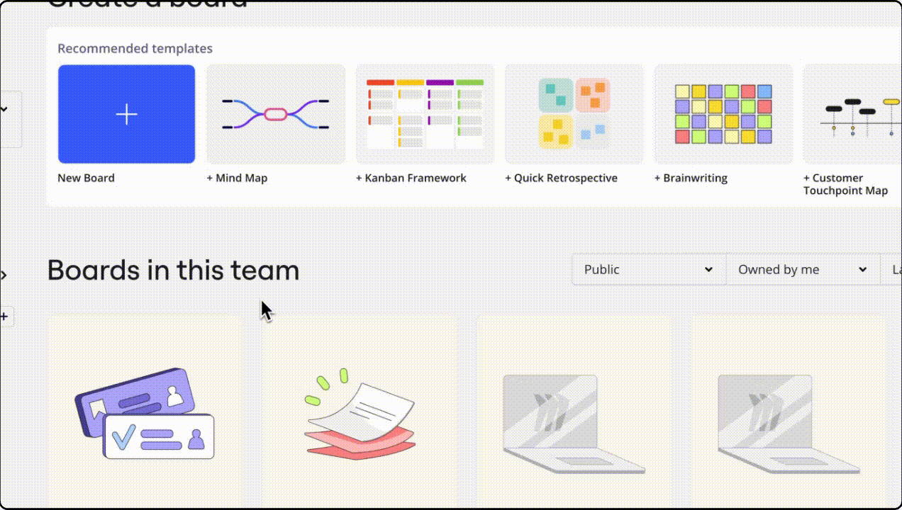
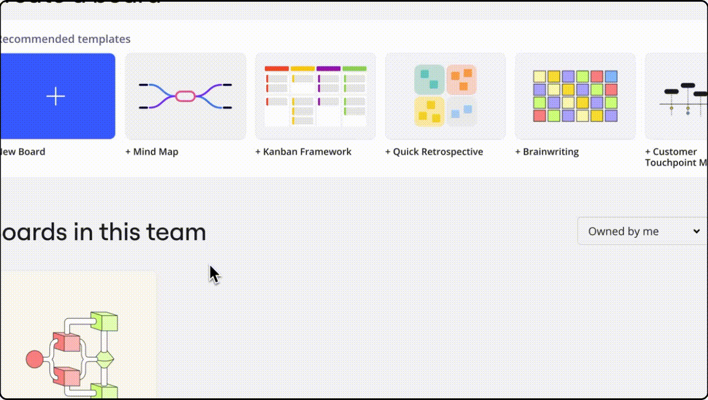
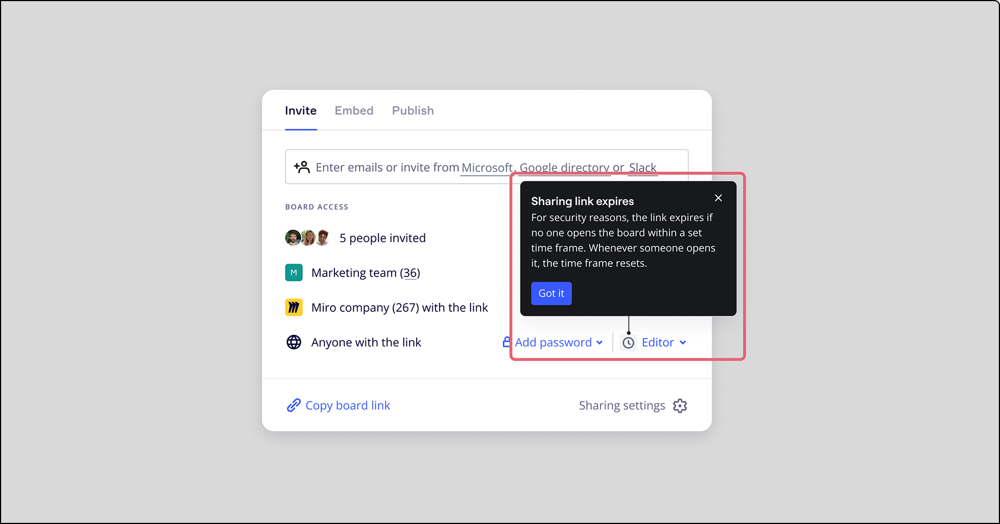

방문자를 보드에 초대해 쉽고 즉각적으로 협업하세요. 방문자는 무료로 초대받을 수 있으며 Miro에 가입할 필요가 없습니다.

> **사용 가능 환경:** 브라우저, 데스크톱 앱, 태블릿 앱

## 방문자와 협업하기

방문자와 협업하려면 보드를 공개해야 합니다. 방문자는 설정한 액세스 수준과 플랜 유형에 따라 보고, 댓글을 달고, 편집할 수 있습니다.

:::warning
Miro는 Google이나 Bing과 같은 검색 엔진에서 공개 보드가 인덱싱되지 않도록 노력하고 있습니다. 그러나 링크가 있는 모든 사용자는 이러한 보드에 액세스할 수 있으며, 링크가 의도한 대상 외의 사람에게 공유될 수 있습니다. Miro 플랜에 따라 [공개 보드에 비밀번호를 설정](13-password-protection-for-public-boards.md)해 보안을 강화할 수 있습니다.
:::

## 방문자 액세스 권한을 활성화하는 방법

방문자는 보드가 공개 상태인 한 액세스할 수 있습니다.

:::tip
방문자에게 최적화된 경험을 선사하려면 보드의 [시작 화면](03-sharing-boards-and-inviting-collaborators.md)을 설정하세요. 보드에 방문자와 관련 없는 콘텐츠가 있는 경우 [특정 프레임을 숨길](../essential-tools/07-frames.md) 수도 있습니다.
:::

Starter, Business, Enterprise, Education 플랜 Free 플랜

1. 대시보드로 이동한 다음 보드 카드 위로 마우스를 가져가세요
2. 오른쪽 상단 모서리의 세 점 아이콘을 클릭하세요
3. **공유**를 클릭하세요
4. **링크가 있는 모든 사용자** 옆의 **보기 가능, 댓글 작성 가능** 또는 **편집 가능**을 선택하세요. [비밀번호로 보드를 보호](13-password-protection-for-public-boards.md)할 수도 있습니다.
5. **보드 링크 복사**를 클릭하여 사용자에게 직접 공유하세요
   > **✏️** Enterprise 관리자가 [공개 공유를 제한](../../enterprise-administration/canvas-25-admin-features/data-security/07-sharing-policy-on-enterprise-plan.md)한 경우 방문자에게 보드를 공유하지 못할 수 있습니다. 해당 공유 옵션을 사용할 수 없는 경우 관리자에게 문의하세요.

   
   *방문자가 편집 액세스 권한을 가지는 공개 보드 공유하기*
   > ⚠️ **편집 가능**을 허용하면 앞으로의 모든 사용자와 이미 뷰어 또는 댓글 작성자로 추가한 사용자 또한 편집이 가능해집니다. [보드 공유의 작동 방식을 알아보세요.](05-who-has-access-to-my-board.md)

   > ✏️ Enterprise 플랜 회사 관리자는 [필수 비밀번호를 설정](../../enterprise-administration/canvas-25-admin-features/data-security/07-sharing-policy-on-enterprise-plan.md)하고 Enterprise 구독 내의 모든 보드에 대한 [공개 링크 만료일](../../enterprise-administration/canvas-25-admin-features/data-security/07-sharing-policy-on-enterprise-plan.md)을 활성화할 수 있습니다.

Free 플랜의 경우 방문자 기능이 제한됩니다.

1. 대시보드로 이동한 다음 보드 카드 위로 마우스를 가져가세요
2. 오른쪽 상단 모서리의 세 점 아이콘을 클릭하세요
3. **공유**를 클릭하세요
4. **링크가 있는 모든 사용자** 옆에서 **보기 가능**을 선택합니다 (편집 및 댓글 작성은 유료 및 Education 플랜의 방문자만 사용할 수 있습니다).
5. **보드 링크 복사**를 클릭하고 사용자에게 직접 공유하세요.

   
   *방문자가 보기 액세스 권한을 가지는 공개 보드 공유하기*

### 방문자의 공개 보드 이용 방법

#### 방문자가 사용할 수 있는 툴은 무엇인가요?

방문자는 보드 액세스 레벨([보기, 댓글](01-board-access-rights.md), 또는 편집)에 따라 [도형](../essential-tools/11-shapes.md), [선](../essential-tools/05-connection-lines.md), [텍스트](../essential-tools/16-text.md), [스티커 메모](../essential-tools/14-sticky-notes.md) 및 [펜 툴](../essential-tools/10-pen.md)을 [작성 툴바](../../getting-started/start-here/your-first-board/05-toolbars.md)에서 볼 수 있습니다.

방문자가 Miro 계정을 생성하면 작성 툴바에 대한 모든 액세스 권한을 갖게 됩니다.


*-1.png)공개 Miro 보드의 방문자 시점*

#### 비밀번호로 보호된 보드

보드 소유자 또는 공동 소유자가 [비밀번호 보호](13-password-protection-for-public-boards.md)를 추가한 경우 방문자는 보드를 열기 전에 비밀번호를 입력해야 할 수 있습니다.

**공개 링크 만료**
공유 창에 시계 아이콘이 표시되는 경우, [공개 링크 만료](../../enterprise-administration/canvas-25-admin-features/data-security/07-sharing-policy-on-enterprise-plan.md)가 회사 관리자가 설정한 것입니다.</span> 방문자와 공유한 공개 링크는 설정된 시간 동안 보드가 열리지 않으면 자동으로 만료됩니다입니다. 더 이상 보드에 액세스할 수 없다면 링크가 만료되었을 수 있습니다. 보드 소유자에게 연락해 링크 재공유를 요청하세요.


*공유 설정의 공개 링크 만료 아이콘*

### 방문자를 초대해 이름을 추가하도록 합니다

로그인한 등록 사용자는 실명으로 보드에 표시되고, 편집 권한이 있는 방문자는 자동으로 이름(예: *방문 중인 발명가*)이 할당됩니다.

방문자와 더욱 협력적인 방법으로 상호 작용하기 위해, 일부 보드 소유자와 공동 소유자는 [미등록 사용자가 보드에 참여할 때 자신의 이름을 추가할 수 있도록](09-visitor-names-beta.md) 허용할 수 있습니다.

## 편집 액세스 권한이 있는 방문자

> **사용 가능 대상:** 유료 및 Education 플랜

파트너나 Miro 프로필이 없거나 Miro 팀에 액세스할 수 없는 동료와 협업할 때에는 [편집 액세스](01-board-access-rights.md) 권한을 가진 방문자를 초대하세요.

### 편집 액세스 권한을 가진 방문자의 공개 보드 이용 방법

Miro에서 방문자는 팀원 또는 게스트보다 제한된 기능을 사용하게 됩니다. 이는 보드 소유자로서 보드를 완전히 제어할 수 있도록 하기 위한 것입니다.

작성 [툴바](../../getting-started/start-here/your-first-board/05-toolbars.md)에서 편집권한이 있는 방문자는 [도형](../essential-tools/11-shapes.md), [선](../essential-tools/05-connection-lines.md), [텍스트](../essential-tools/16-text.md), [스티커 메모](../essential-tools/14-sticky-notes.md)를 추가하고 [펜 툴](../essential-tools/10-pen.md)을 사용할 수 있습니다.

> 비등록 방문자는 등록된 방문자보다 도구에 대한 접근이 더 제한적입니다.

#### 편집 액세스 권한을 가진 방문자가 사용할 수 *없는* 기능 및 툴

- 보드 이름 변경하기
- 보드 공유 설정 변경하기
- 팀 대시보드 액세스
- 다른 보드 액세스
- 댓글에서 다른 사용자 멘션하기
- 화상 채팅, 투표 세션 또는 화면 공유 시작
- 카드 선택기에서 Asana, Jira, Microsoft Azure, Rally 카드 생성, 편집 또는 추가(단, 카드 보기는 가능)
- 보드 백업 다운로드
- 보드에서 오브젝트 잠금 및 잠금 해제, 잠긴 오브젝트는 편집 불가합니다.
- 보드 알림 받기
- 액티비티 목록 접근 및 보드 콘텐츠 복원하기
- Google Drive에 보드 링크 저장하기
- 오브젝트 정보 보기
- 모바일 브라우저에서 보드 편집하기
- 보드 콘텐츠 설정에서 허용되지 않는 경우 보드 콘텐츠 복사하기
- Miro에 가입하지 않았거나 보드 콘텐츠 설정에서 허용되지 않는 경우 보드 복제 또는 내보내기
- 공동 작업자를 보기에 초대하기
- Miro 보드에 콘텐츠 업로드하기

:::note
Starter, Business, Enterprise, Education 플랜의 보드 소유자는 [보드 콘텐츠 설정](14-how-to-allow-or-restrict-copying-and-exporting-boards-and-content.md) 및 방문자가 [팀으로 보드 복제](../managing-boards/03-how-to-duplicate-a-board.md), 보드에 붙여 넣은 파일/이미지/PDF 다운로드, 위젯 복사, [이미지/PDF로 보드 내보내기](../import-and-export/export/03-how-to-export-your-board.md)를 허용할지 설정할 수 있습니다.
:::

### 협업 앱

방문자는 회의 및 워크숍 중에 더 많은 참여 기회를 갖게 됩니다. 편집 액세스 권한을 가진 방문자는 Miro에 가입한 후 [협업 앱](../../integrations-apps/integrations-basics/04-how-to-install-apps.md)을 보드에 설치된 모든 을 사용할 수 있습니다.

아이콘, 이미지, 스티커, 테이블 및 차트와 같은 재미있고 시각적인 앱, 그리고 플래닝 포커 및 아이스 브레이커와 같은 그룹 활동 및 참여 앱에 액세스할 수 있어요.

- [아이콘파인더](../../integrations-apps/more-integrations/09-iconfinder.md)
- [언스플래시](../../integrations-apps/more-integrations/16-unsplash.md)
- [와이어프레임 라이브러리](../../integrations-apps/more-integrations/16-unsplash.md)
- [차트](../essential-tools/03-charts.md)
- [사용자 스토리 맵](../advanced-tools/07-user-story-mapping.md)
- 플래닝 포커
- 브랜드페치
- [Adobe XD](https://help.miro.com/hc/articles/360016621780-Adobe-XD)
- Clusterizer
- unDraw 기호
  > 💡 더욱 효과적이고 흥미로운 협업을 위해 더 많은 앱이 추가될 예정입니다. 위의 목록에서 새로운 앱 추가를 확인해 주세요.

## 자주 묻는 질문

*보드의 공유 메뉴에 '링크가 있는 모든 사용자' 옵션이 표시되지 않는 이유는 무엇인가요?*

Enterprise 플랜에서는 [회사 관리자](../../plans-billing/miro-plans/04-enterprise-plan.md)가 보안상의 이유로 [공개 공유를 제한](../../enterprise-administration/canvas-25-admin-features/data-security/07-sharing-policy-on-enterprise-plan.md)할 수 있습니다.
무료 팀[에 저장된 보드에서는 공개 편집을 위한 공유가 지원되지 않는다는 점에 유의하세요](../../plans-billing/miro-plans/09-free-plan.md).
브라우저에서 활성화된 광고 차단 확장 프로그램으로 인해 이 문제가 발생할 수도 있습니다. 해당 프로그램을 비활성화해 모든 공유 옵션이 나타나는지 확인하세요.

*방문자가 내가 공유한 링크로 보드에 액세스할 수 없는 이유는 무엇인가요?*

링크가 있는 모든 사용자 **편집 가능, 댓글 작성 가능 또는 보기 가능** 옵션 옆의 **선택하고**보드 공유 메뉴 또는 브라우저 주소창에서 복사한 보드 링크를 전송했는지 확인하세요. 링크는 다음과 같은 형식이어야 합니다:

```
https://miro.com/app/board/o9L_kSnC_0=/</span>
```

문제가 지속되면 사용자에게 다른 브라우저나 시크릿 모드에서 보드를 열어 보도록 요청하세요.

*방문자가 이메일로 초대를 받게 되나요?*

아니요, 방문자는 이메일을 통해 명시적으로 공개 보드에 초대되지 않습니다. 보드를 공개적으로 공유하고 보드 링크를 복사한 다음 방문자에게 보내기만 하면 됩니다. 보드 링크가 있는 사용자는 공개적으로 공유를 중단하지 않는 한 해당 콘텐츠를 편집, 댓글 작성 또는 보기할 수 있습니다.

*보드를 공개적으로 공유할 때 새로운 보드 링크가 생성되나요?*

아니요, 보드를 공개하면 링크가 동일하게 유지됩니다.

*방문자와 보드 공유를 중지하려면 어떻게 해야 하나요?*

보드 공유 메뉴를 열고 **링크가 있는 모든 사용자** 옵션 옆의 **액세스 권한 없음**을 선택하세요.

*보드에 동시에 액세스할 수 있는 방문자 수는 몇 명인가요?*

보드에 방문자를 무제한 무료로 초대할 수 있습니다.

더 많은 사용자와 동시에 효과적으로 협업할 수 있도록 Miro를 지속적으로 최적화하고 있습니다. 자세히 알아보려면 [Miro의 역대 최대 규모 세션](../troubleshooting-technical-questions/technical-guidelines/05-how-many-users-can-collaborate-on-a-board-simultaneously.md)에 대해 읽어보세요.

*편집 액세스 권한을 가진 방문자로 보드에 참여할 수 있도록 사용자에게 링크를 보냈는데, 가입 후에야 팀원 목록에 추가되었습니다. 왜요?*

방문자를 위한 공개 링크를 활성화하는 대신 [보드 및 팀 초대 링크](03-sharing-boards-and-inviting-collaborators.md)를 보냈을 수 있습니다.

사용자 및 잘못 추가된 라이선스를 제거[하는 방법에 대해 자세히 알아보세요](../../administration/user-management/04-manage-extra-licenses.md).

*방문자 작성 툴바가 변경된 이유는 무엇인가요?*

대부분의 방문자는 몇 가지 툴만 사용하기 때문에 이를 더욱 간소화하기로 결정했습니다. Miro 계정에 가입하면 전체 [작성 툴바](../../getting-started/start-here/your-first-board/05-toolbars.md)를 사용할 수 있습니다.
