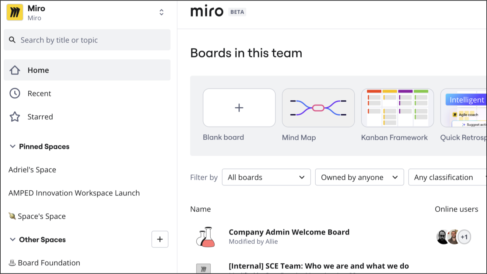
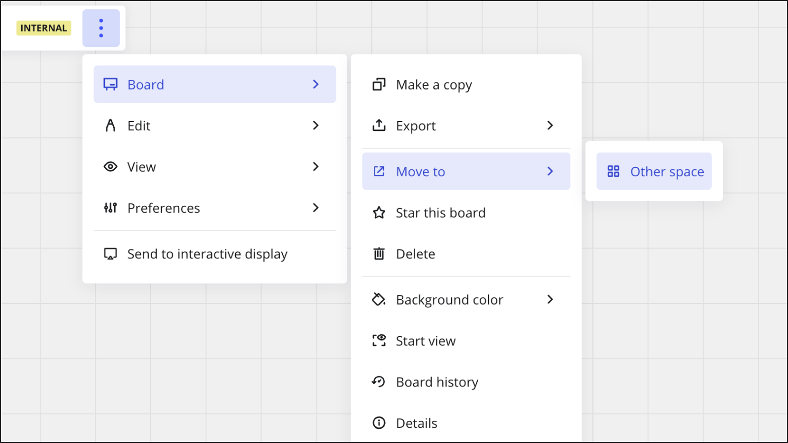
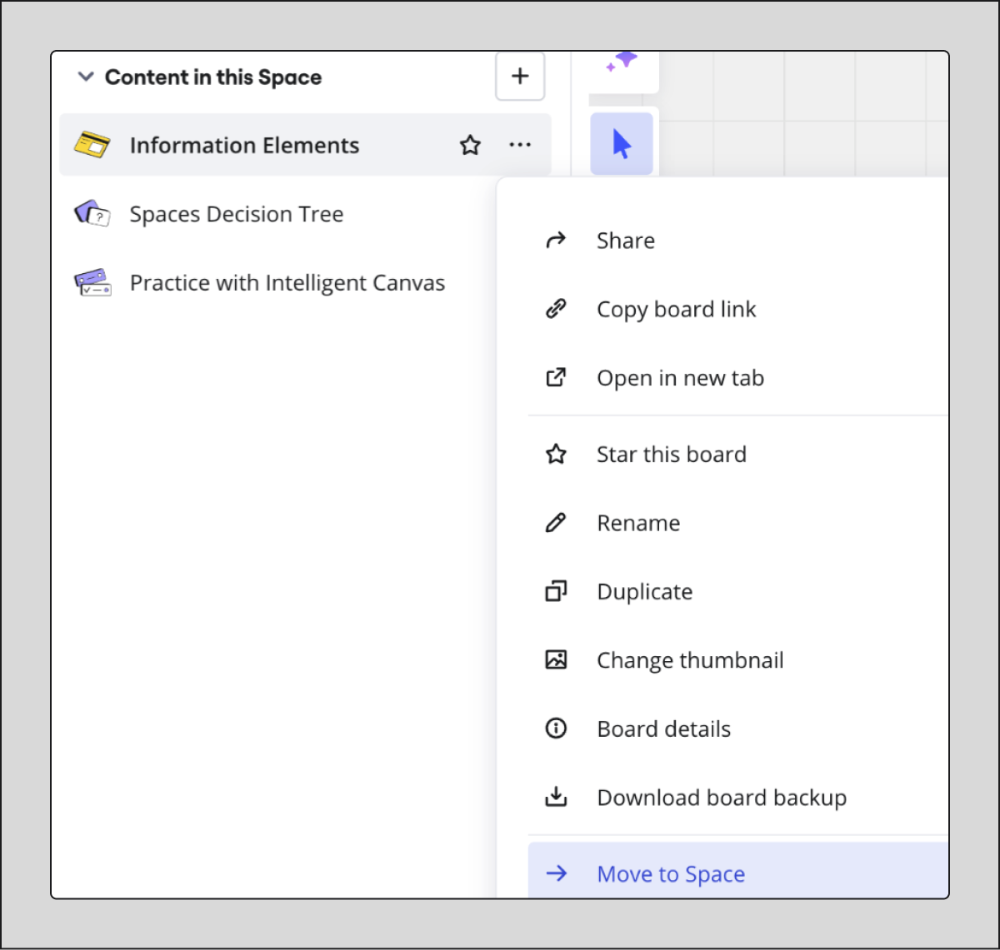

사용자들이 여러 보드에서 작업을 관리하고 콘텐츠를 더 쉽게 찾을 수 있도록, Miro는 콘텐츠 관리의 새로운 경험인 스페이스를 도입했습니다.

스페이스는 대시보드와 사이드바를 재구성하여 컨텍스트와 계층적 콘텐츠 관리가 가능하도록 합니다.

:::note
스페이스는 팀들이 그들의 Miro 콘텐츠를 조직하는 주요 방법으로 프로젝트를 대체합니다. 모든 기존 프로젝트는 자동으로 스페이스로 변환됩니다.
:::

각 Miro 조직은 여러 팀을 가질 수 있으며, 각 팀은 여러 개의 스페이스를 가질 수 있습니다. Miro 이노베이션 워크스페이스에서 표현하고자 하는 각 비즈니스 컨텍스트를 위한 스페이스입니다.

스페이스를 직접 생성하거나, [프로젝트 플랜](04-blueprints-beta.md)이라고 불리는 스페이스 템플릿을 선택할 수 있습니다.

:::tip
일반적인 정보는 자주 묻는 질문을 참조하세요.
:::

## 주요 기능

- **스페이스**
  특정 비즈니스 목표에 따라 콘텐츠를 조직화하세요.
- **섹션**
  스페이스 내에서 섹션을 만들어 콘텐츠를 더 세분화하여 관리하세요.
- **보드 및 섹션 재정렬**
  스페이스 내에서 섹션이나 다른 콘텐츠의 순서를 변경하려면 드래그 앤 드롭하세요.
- **집중된 사이드바**
  스페이스 내 모든 콘텐츠 사이를 빠르게 탐색할 수 있도록 도와줍니다.
- **고정된 스페이스**
  사이드바에 자주 사용하는 스페이스를 고정하여 빠르게 접근할 수 있습니다.
- **스페이스 공유**
  중요한 팀원들과 스페이스를 공유하세요. 프로젝트에 대한 접근을 관리하던 것과 같은 프로세스와 기준으로 스페이스에 대한 접근을 제어할 수 있습니다.
- **스페이스 개요**
  보드를 스페이스 개요로 설정하여 스페이스 내 콘텐츠에 대한 컨텍스트와 명확성을 부여할 수 있습니다. 사용자 지정 [대시보드](03-space-overview-dashboard-beta.md)도 생성할 수 있습니다.

**추가 정보:**

- 스페이스 가이드
- [스페이스 개요](02-space-overview.md)
- 자주 묻는 질문

## 스페이스 가이드

홈 대시보드는 간소화되어 있으며, 팀 내 모든 보드를 정렬하고 필터링할 수 있으며, 어떤 스페이스에도 속하지 않은 보드도 포함됩니다.

*스페이스가 있는 홈 대시보드*

새로운 스페이스 또는 Miro 보드를 생성하거나, 콘텐츠를 가져오거나, 템플릿과 Miroverse를 탐색하려면 **새로 만들기** 버튼을 선택하세요.

"[프로젝트 플랜](04-blueprints-beta.md)"이라고 불리는 스페이스 템플릿도 선택할 수 있습니다.

:::note
템플릿 스트립에서 보드를 생성하면, 해당 보드는 스페이스에 속하지 않습니다. 보드를 스페이스로 이동하는 방법은 스페이스 간 보드 이동 방법을 참조하세요**.**
:::

:::tip
스페이스 대시보드에서 미로 팀 간 전환이 가능합니다. 화면 왼쪽 위에 있는 팀 이름을 선택해 팀 선택기로 접근하세요.
:::

### 스페이스에 없는 보드

스페이스가 도입되기 전, 일부 미로 보드가 프로젝트에 포함되어 있지 않았을 수 있으며, 현재로서는 이 보드들이 어떤 스페이스에서도 포함되지 않은 상태입니다.

스페이스에 포함되지 않은 보드를 찾으려면 **홈** 영역에서 **필터 기준:**을 **스페이스에 속하지 않은 보드**로 설정하세요. 홈 대시보드가 스페이스에 없는 모든 보드를 보여줍니다.

### 스페이스 사이드바

스페이스 내에서 보드를 열면 사이드바에 해당 스페이스의 다른 콘텐츠가 표시됩니다. 또한 새 섹션을 생성할 수도 있습니다.

:::note
링크를 통해 보드에 접근하면 사이드바는 기본적으로 닫혀 있습니다.
:::

스페이스 사이드바에 접근하려면 스페이스 내에서 보드를 엽니다. 사이드바가 접힌 상태라면, [보드 바](../working-on-the-board/02-miro's-new-simplified-user-interface.md)에서 **사이드바 열기** 햄버거 메뉴를 클릭하세요.

*당신의 Miro 보드에서, 보드 바에는 **사이드바 열기** 햄버거 메뉴가 포함됩니다.*

스페이스 사이드바에서, **새로 만들기** (**+**) 메뉴를 열 수 있으며, 이를 통해 스페이스 내에서 새 보드를 생성하고, 새 섹션을 생성하거나, 보드를 스페이스로 이동하고, 템플릿 및 Miroverse를 가져오고 탐색할 수 있습니다.

:::tip
**새로 만들기** (**+**) 메뉴에서 **포맷**, 예를 들어 문서나 슬라이드를 선택해 집중 모드에서 새로운 보드를 생성하십시오.
:::

스페이스에 속하지 않은 보드에 접근할 경우, 사이드바에는 최근에 방문한 콘텐츠가 시간대별로 그룹화되어 표시되는 **최근 항목**이 나타납니다.

사이드바에서 콘텐츠를 검색하고 필터링하려면, 스페이스나 **최근 항목** 아래에 있는 돋보기 아이콘을 사이드바 오른쪽 상단에서 선택하세요.

사이드바를 닫으려면 오른쪽 상단의 **X**를 선택하세요.

### 고정된 스페이스

사이드바의 **고정된 스페이스**는 자주 사용하는 스페이스에 빠르게 접근할 수 있게 해줍니다. 스페이스 위에 마우스를 올리고 핀 아이콘을 선택해 스페이스를 고정할 수 있습니다.

:::note
이전에 별표 표시된 프로젝트는 이제 고정된 스페이스입니다.
:::

### 스페이스 옵션

스페이스 **옵션** 메뉴에 접근하려면, 스페이스를 열고 오른쪽 상단의 세 점 아이콘 (...)을 선택하세요.

스페이스 **옵션** 메뉴에서 다음 작업을 선택할 수 있습니다:

- **스페이스 링크 복사**
  스페이스의 링크를 즉시 복사하여 공유합니다.
- **공유**
  팀원들을 초대하여 스페이스에 대한 접근을 공유하고 역할을 할당합니다. 팀의 다른 모든 멤버에게는 **접근 불가** 또는 **보기 가능**으로 설정할 수 있습니다.
- **이름 변경**
  스페이스의 이름을 변경합니다.
- **삭제**
  스페이스를 삭제합니다.

:::tip
사이드바의 스페이스에 대한 세 점 아이콘(**...**)을 선택하여 스페이스 **옵션** 메뉴에 접근할 수 있습니다.
:::

### 스페이스의 역할

역할은 사용자가 스페이스 내의 기존 보드와 새로 생성된 보드에서 어떤 권한을 가지는지를 지정합니다. 언제든지 스페이스의 접근을 설정하기 위해 역할을 사용할 수 있습니다.

:::note
기존 프로젝트에 대한 모든 권한은 스페이스로 이관됩니다.
:::

다음과 같은 스페이스 역할을 가질 수 있습니다:

- **소유자**
  스페이스를 편집하고 삭제할 수 있으며, 보드를 추가 및 제거하고, 팀 전체의 가시성을 설정하고, 스페이스 수준 및 보드 수준의 역할을 지정하며, 소유권을 다른 사용자에게 양도할 수 있습니다. 스페이스 소유자는 스페이스 내 모든 콘텐츠의 자동 편집자가 됩니다.
- **공동 소유자**
  지정된 사용자의 스페이스 수준 역할을 업데이트하고, 스페이스 수준의 역할을 지정할 수 있습니다. 스페이스 공동 소유자는 스페이스 내 모든 콘텐츠의 자동 편집자가 됩니다.
- **편집자**
  스페이스 내 모든 보드를 편집하고 보드 수준의 역할을 부여할 수 있습니다.
- **댓글 작성자**
  스페이스 내 모든 보드에 댓글을 남길 수 있습니다.
- **뷰어**
  스페이스 내 모든 보드를 볼 수 있습니다.

사용자는 이미 특정 보드에 대해 보드 수준의 역할이 지정되어 있을 수 있습니다. 스페이스 수준의 더 높은 역할을 받는다면, 스페이스 내 모든 보드에 대해 더 높은 역할이 우선합니다. 회원이 스페이스 수준의 역할을 잃으면, 기존의 보드 수준의 역할을 유지합니다.

**추가 정보:** [Miro의 역할](../../getting-started/start-here/05-roles-in-miro.md)을 참조하세요.

### 스페이스 만들기

팀을 위한 새로운 스페이스를 빠르게 만들 수 있습니다.

:::tip
[프로젝트 플랜](04-blueprints-beta.md)으로 불리는 스페이스 템플릿을 선택할 수도 있습니다.
:::

다음 단계에 따라 진행하세요:

1. 다음 방법 중 하나를 선택하세요:
   - **홈** 대시보드의 오른쪽 상단에서 **+ 새로 만들기**를 선택하세요. 그런 다음 **스페이스**를 선택하세요.
   - 사이드바의 **다른 스페이스** 옆에 있는 플러스 (**+**) 기호를 선택하세요.
     **새 스페이스** 모달이 열립니다.
2. 새로운 스페이스의 이름을 지정하세요.
   최대: 60자.
3. 스페이스 생성을 선택하세요.
   <이름>에 초대 모달이 열립니다.
4. 다음 중 하나를 수행하세요:
   - 검색을 사용해 팀원을 이메일 주소로 찾아 선택합니다.

     > 💡 여러 팀원을 선택할 수 있습니다.
   - 검색바에서 팀을 클릭해 개별 팀원 또는 모든 팀원을 선택한 후, 선택을 누릅니다.
5. 스페이스에 추가를 선택합니다.
6. 부여할 권한을 선택하세요.

   > ✏️ 부여된 권한은 스페이스 내 모든 Miro 보드에 적용됩니다. 자세한 내용은 자주 묻는 질문을 참조하세요.
7. **완료**를 선택하세요.
   스페이스가 성공적으로 생성되었습니다.

### 스페이스 공유하기 방법

스페이스의 소유자와 공동 소유자로서, 팀의 다른 멤버와 스페이스를 공유하고 역할을 부여할 수 있습니다.

다음 단계를 따르세요:

1. 스페이스 **옵션** 메뉴를 엽니다.
2. **공유**를 선택합니다.
   **<이름>의 스페이스 초대하기** 모달이 열립니다.
3. 다음 중 하나를 수행합니다:
   - 이메일 주소로 팀 멤버를 검색한 후, 해당 팀 멤버를 선택합니다.

     > 💡 여러 팀 멤버를 검색 및 선택할 수 있습니다.
   - 검색창에서 **팀**을 클릭하여 개별 팀 멤버 또는 모든 팀 멤버를 선택한 후, **선택**을 클릭합니다.
4. 부여할 권한을 선택하세요.

   > ✏️ 부여할 역할 및 권한은 스페이스 내부의 모든 보드에 적용됩니다. 자세한 내용은 자주 묻는 질문을 참고하세요.
5. (선택사항) 맞춤 메시지를 추가하세요.
6. **초대 보내기**를 선택하세요.

   팀 또는 팀 구성원과 스페이스를 성공적으로 공유했습니다.

### 팀 전체의 스페이스 접근 권한 변경 방법

팀 전체가 스페이스에 접근할 수 있는지 업데이트할 수 있습니다.

:::note
개별 구성원을 초대하여 부여하는 권한은 별도로 관리됩니다.
:::

다음 단계를 따르세요:

1. 스페이스 **옵션** 메뉴를 엽니다.
2. **공유**를 선택합니다.
3. 팀의 **스페이스 접근**에서 다음 중 하나를 지정하세요:
   - **보기 가능**
     모든 팀 구성원이 스페이스 및 보드 내부를 볼 수 있습니다.
   - **댓글 가능**
     모든 팀 구성원이 스페이스 내부의 모든 보드에 댓글을 달 수 있습니다. 보기 포함.
   - **편집 가능**
     모든 팀 구성원이 스페이스 및 보드 내부를 편집할 수 있습니다. 보기와 댓글 포함.
   - **접근 불가**
     개별적으로 초대되지 않는 한 팀 구성원은 스페이스에 접근할 수 없습니다.

     전체 팀의 스페이스 접근 권한을 성공적으로 변경했습니다.

### 스페이스에 대한 액세스 관리 방법

스페이스 소유자 또는 공동 소유자로서, 특정 스페이스에 대한 액세스를 관리하고 역할을 할당할 수 있습니다.

개별 팀 멤버에 대한 액세스와 권한을 관리하고, 팀의 다른 모든 멤버에 대한 액세스를 관리할 수 있습니다.

다음 단계를 따르세요:

1. 스페이스의 **옵션** 메뉴를 엽니다.
2. **공유**를 선택합니다.
3. **스페이스 액세스** 아래에서 **액세스 관리**를 선택합니다.
   **사람들 액세스 관리** 뷰가 열립니다.
4. 초대한 팀 멤버의 권한을 수정합니다.

   > 💡 팀 멤버를 추가하려면 **사람 추가**를 선택하세요.
5. 변경 사항을 확인하려면 **완료**를 선택하세요.
   다시 모달의 시작으로 돌아갑니다.
6. (선택 사항) **스페이스 접근** 아래에서 팀의 다른 모든 사람들을 위한 접근 권한을 지정하세요.

   스페이스의 접근 관리를 성공적으로 완료했습니다.

**자세한 정보:** 스페이스의 역할을 참고하세요.

### 스페이스 내에서 섹션을 만드는 방법

콘텐츠를 조직화하려면 스페이스 내에서 섹션을 선택적으로 만들 수 있습니다.

섹션은 스페이스 사이드바에서만 나타납니다. 보드를 열어야 섹션을 보고 관리할 수 있습니다.

다음 단계를 따르세요:

1. 스페이스 사이드바에서 **새로 만들기** (**+**)을 선택합니다.
2. **섹션 추가**를 선택합니다.
   이름 없는 섹션이 사이드바에 추가됩니다.
3. 새로운 섹션의 이름을 입력하고 **Enter** 키를 누릅니다.

   섹션이 성공적으로 생성되었습니다.

이제 스페이스 사이드바에서 새 섹션으로 콘텐츠를 드래그 앤 드롭할 수 있습니다. 특정 보드에 대해 세 점 아이콘 (**...**)을 선택하여 **옵션** 컨텍스트 메뉴를 열고 **섹션으로 이동**을 선택할 수 있습니다.

섹션의 이름을 변경하거나 삭제하려면, 수정할 섹션의 세 점 아이콘 (**...**)을 선택한 후 **이름 변경** 또는 **삭제**를 선택합니다.

:::note
편집자 이상의 접근 권한을 가진 스페이스 멤버는 섹션을 생성, 이름 변경, 삭제할 수 있으며, 보드를 다른 섹션으로 이동할 수 있습니다. 콘텐츠 관리자는 자신이 속한 스페이스의 모든 섹션을 관리할 수 있습니다.
:::

### 스페이스 안에서 콘텐츠와 섹션의 순서를 변경하는 방법

스페이스 내의 섹션 및 콘텐츠의 순서를 변경할 수 있습니다.

기본적으로 Miro는 모든 콘텐츠와 섹션을 생성 시간에 따라 내림차순으로 정렬합니다. 최신 콘텐츠가 맨 위에 표시됩니다.

스페이스 내에서 콘텐츠의 순서를 변경하려면, 스페이스 사이드바에서 선택한 항목을 위아래로 드래그 앤 드롭하세요. 섹션이나 섹션 내의 콘텐츠를 선택할 수 있습니다.

:::tip
섹션을 이동하려면, 컨텍스트 메뉴를 이용할 수도 있습니다. 세 점 아이콘(**...**)을 선택한 후 **위로 이동** 또는 **아래로 이동**을 선택하세요.
:::

### 스페이스 개요 설정 방법

스페이스 내부의 보드 중 하나를 스페이스 개요로 지정할 수 있으며, 이는 스페이스에 접근하는 사용자에게 기본 진입 지점을 제공합니다.

스페이스 개요를 설정하는 방법에 대한 자세한 내용은 [스페이스 개요](02-space-overview.md)를 참조하세요. 또한 스페이스 개요에 대한 독특한 [대시보드](03-space-overview-dashboard-beta.md)를 생성할 수도 있습니다.

### 보드를 다른 스페이스로 이동하는 방법

스페이스 간에 Miro 보드를 이동할 수 있습니다.

:::tip
다음 절차는 스페이스에 없는 보드에도 적용됩니다.
:::

다음 단계를 따르세요:

1. Miro 보드의 왼쪽 상단에 있는 보드 바에서 세로로 정렬된 세 개의 점을 선택합니다.
   **주 메뉴**가 열립니다.
    *보드를 다른 스페이스로 이동*
2. **보드** > **이동** > **다른 스페이스**를 선택합니다.
   **보드를 스페이스로 이동** 모달이 열립니다.
3. 드롭다운 메뉴에서 스페이스를 선택합니다.

   > ✏️ 편집 권한이 있는 스페이스만 표시됩니다.
4. (선택 사항) **멤버 알림**을 선택하여 대상 스페이스의 모든 멤버에게 이메일을 보냅니다.
5. **이동**을 선택합니다.
   보드를 다른 스페이스로 성공적으로 이동했습니다.

대안으로, 사이드바에서 보드를 다른 스페이스로 이동할 수 있습니다.

다음 단계를 따라주세요:

1. 보드 사이드바에서 이동하려는 보드에 커서를 올리고, 세 점 아이콘(**...**)을 선택하여 상황별 메뉴에 접근합니다.
    *보드 사이드바에서 다른 스페이스로 보드 이동*
2. **스페이스로 이동**을 선택하세요.
   **보드를 스페이스로 이동** 모달이 열립니다.
3. 드롭다운 메뉴의 목록에서 스페이스를 선택하세요.

   > ✏️ 편집 권한이 있는 스페이스만 표시됩니다.
4. (선택 사항) **멤버 알림**을 선택하여 대상 스페이스의 모든 멤버에게 이메일을 보냅니다.
5. **이동**을 선택하세요.
   보드를 다른 스페이스로 성공적으로 이동했습니다.

### 보드를 스페이스 간에 일괄 이동하는 방법

스페이스 간에 보드를 일괄 이동할 수 있습니다.

다음 단계를 따르세요:

1. 대시보드 사이드바에서 (**+**)을 선택하여 **새로 만들기** 메뉴를 엽니다.
2. **여기로 보드 이동**을 선택합니다.
   **보드를 <스페이스 이름>으로 이동** 모달이 나타납니다.
3. (선택 사항) 본인이 소유한 보드만 찾으려면 **내가 소유한 보드만 검색**을 선택합니다.
4. 스페이스로 이동하려는 보드를 선택하거나 검색 기능을 사용하여 보드를 찾아 선택합니다.
5. (선택 사항) **멤버에게 알림**을 선택합니다.
6. **보드 이동**을 선택합니다.
   Miro 보드를 하나의 스페이스에서 다른 스페이스로 일괄 이동했습니다.

:::tip
스페이스 설정 메뉴에서도 일괄로 보드를 이동할 수 있습니다. 스페이스 설정 메뉴에서 보드 추가를 선택하세요.
:::

### 스페이스 삭제 방법

스페이스 소유자인 경우 스페이스를 삭제할 수 있습니다. 팀원이 생성한 스페이스 내 보드는 팀 레벨로 이동됩니다.

귀하가 소유한 보드를 팀 레벨로 이동하거나 휴지통으로 이동할지 선택할 수 있습니다.

*스페이스 소유자는 자신이 소유한 보드를 팀 레벨에 유지할지 휴지통에 넣을지 선택할 수 있습니다.*

다음의 단계들을 따라주세요:

1. 스페이스 옵션에서 삭제를 클릭합니다.
   삭제 스페이스 모달이 열립니다. 기본적으로 **보드를 휴지통으로 이동**이 선택되어 있습니다.
2. (선택 사항) 소유한 보드를 팀 수준에 유지하려면 **보드를 휴지통으로 이동**의 선택을 해제합니다.
3. **스페이스 삭제**를 클릭합니다.
   스페이스가 삭제됩니다. 다른 팀 멤버가 생성한 보드는 팀 수준으로 이동됩니다. 만약 2단계를 건너뛰었을 경우, 소유한 보드는 휴지통으로 이동됩니다.

## 결론

스페이스는 프로젝트를 대체할 뿐만 아니라 완전히 새로운 방법으로 Miro에서 콘텐츠를 관리할 수 있게 해줍니다. 특히 수백 명의 사용자와 수천 개의 Miro 보드를 갖춘 조직에서는 스페이스를 통해 콘텐츠 검색과 관리가 단순해집니다.

사실, 스페이스는 세계적인 혁신 플랫폼으로서의 Miro 워크스페이스 경험을 발전시킵니다.

**자세한 정보:** 자주 묻는 질문을 참조하세요.

## 자주 묻는 질문

**프로젝트는 어떻게 되었나요?**

귀하의 프로젝트는 자동으로 스페이스로 이전됩니다. 콘텐츠 생성, 권한 설정, 공유는 모두 동일하게 작동합니다.

**프로젝트에 포함되지 않은 보드는 어떻게 되나요? 지금은 어디에 있나요?**

스페이스에 포함되지 않은 보드를 찾으려면, **홈** 대시보드에서 **스페이스에 속하지 않은 보드**로 필터를 설정하세요. 프로젝트에 포함되지 않았던 보드는 스페이스에 포함되지 않습니다.

**제가 즐겨찾기한 프로젝트는 어떻게 되나요?**

즐겨찾기한 프로젝트는 지금은 핀된 스페이스입니다.

**스페이스가 프로젝트와 동일한 역할과 권한을 사용하나요?**

스페이스는 기존 Miro 보드의 관리를 강화합니다. 프로젝트에 설정된 권한은 스페이스로 이어집니다. 콘텐츠 관리자, 프로젝트 관리자—지금은 스페이스 관리자—및 접근 역할은 변경되지 않습니다.

**프로젝트에 속했던 보드의 링크를 받으면 어떻게 되나요?**

해당 링크는 변환된 스페이스 내의 보드로 안내합니다. 스페이스 출시 시 각 프로젝트는 스페이스로 변환됩니다. 이전에 설정된 모든 보드 권한은 그대로 유지됩니다.

**프로젝트를 내 Enterprise 계정으로 마이그레이션하고 싶습니다. 안전한가요?**

네, 안전합니다. 프로젝트는 스페이스로 전환됩니다.

**만약 사용자가 보드보다 더 높은 스페이스 권한이 있다면 어떻게 되나요?**

사용자는 가장 높은 수준의 역할을 가지게 됩니다. 예를 들어, 사용자가 스페이스에서 댓글 작성만 할 수 있고 해당 스페이스 안의 보드를 편집할 수 있는 권한이 있는 경우, 사용자는 그 보드에 대한 편집자 권한을 유지합니다. 반대로 사용자가 스페이스 안의 보드를 볼 수 있는 접근 권한을 가지고 있고, 스페이스에 대한 편집자 접근 권한을 가지고 있는 경우에도, 사용자는 그 보드에 대해 편집자 접근 권한을 가지게 됩니다.

**누가 내 스페이스의 보드를 볼 수 있나요?**

어떤 사용자가 스페이스에 접근할 수 있다면, 그 스페이스 안의 모든 보드를 볼 수 있습니다.

**소유자 또는 공동 소유자는 스페이스 내에서 어떤 콘텐츠 권한을 가지나요?**

스페이스의 소유자 또는 공동 소유자는 스페이스 내 모든 자식 콘텐츠에 대한 편집 권한을 가집니다.

**다른 모든 간소화된 UI 변경 사항에 대해 더 알아볼 수 있는 곳은 어디인가요?**

보드 UI에 대한 Miro의 개선 사항에 대해 더 알아보려면, [Miro의 새로운 간소화된 유저 인터페이스](../working-on-the-board/02-miro's-new-simplified-user-interface.md)를 참조하세요.
