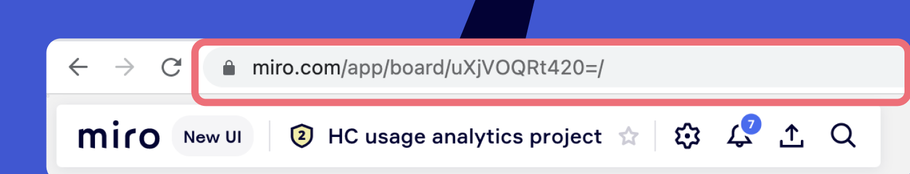

성능 문제가 발생하거나 Miro를 사용할 수 없는 경우 Miro 지원에 버그를 보고하는 방법을 알아보세요.

## 버그 보고 전

1. [Miro 상태 페이지에서](https://status.miro.com/) 잠재적 성능 저하 보고서를 확인하세요.
2. [문제가](https://support.google.com/chrome/answer/95464) **시크릿(비공개) 모드** 및 **다른 브라우저에서** 재현되었는지 확인하세요.
3. [브라우저 확장 프로그램을 비활성화하세요](https://support.box.com/hc/articles/360044196613-How-To-Disable-Plugins-Add-Ons-Extensions-In-Multiple-Browsers). 때로는 Miro 프로세스와 충돌하기도 합니다(예: 텍스트 위젯과 문법 사용).
4. 데스크톱 앱에서 작업하는 경우 [앱 데이터를](../../../getting-started/apps-for-devices/05-desktop-app.md) 초기화하세요.
5. 특정 보드에서 성능 문제가 발생하면 [보드를](../../managing-boards/03-how-to-duplicate-a-board.md) 복제해 보고 복사된 보드에 문제가 지속되는지 확인하세요.
6. 문제 해결 가이드를 확인하세요.

- [보드 성능 및 로드 문제](../../tools/troubleshooting/04-board-performance-and-loading-issues.md)
- [로그인할 수 없습니다](../../tools/troubleshooting/09-i-can't-log-in.md)
- [Miro 보드에 액세스하거나 편집할 수 없습니다](../../tools/troubleshooting/08-i-can't-access-or-edit-a-miro-board.md)
- [보드 내보내기 문제](../../tools/troubleshooting/03-board-export-issues.md)
- [보드나 콘텐츠를 분실했습니다](../../tools/troubleshooting/11-i-lost-my-board-or-content.md)
- 기타 가이드

## 버그 제출 방법

가능한 한 많은 세부 정보를 제공하세요. 그러면 문제를 즉시 파악해 더 나은 도움을 드릴 수 있습니다.

1. 문제에 대한 설명을 포함하고 스크린샷, GIF 또는 [짧은 동영상을](https://chrome.google.com/webstore/detail/openvid-screen-recorder-c/liecbddmkiiihnedobmlmillhodjkdmb) 보내세요. 추가적으로

- 특정 보드에서 문제가 발생하면 [가능한](mailto:support@help.miro.com) 경우 편집 권한으로 [보드를](../../sharing-boards/03-sharing-boards-and-inviting-collaborators.md) support@help.miro.com으로 공유하세요.
- 문제가 업로드된 특정 파일과 연결되어 있는 경우 파일을 보내주세요.

2. 장치, 운영 체제, 브라우저 버전 지정
3. 브라우저 콘솔 및 네트워크 로그 또는 데스크톱 앱 로그를 입력하세요

### 콘솔 로그 기록

**브라우저 콘솔 로그 기록**

1. Miro 보드에 있는 동안 브라우저의 **주소 표시줄을** 클릭하세요(설정 페이지나 대시보드가 아닌 보드 중 하나에서 문제가 재현된 경우 이 단계를 사용하세요).
   ​
2. **F12** 또는 **fn +** F12를 눌러 브라우저 개발자 툴을 여세요.
3. **네트워크** 탭을 선택하고 **로그 보존 상자를** 선택하세요
4. 페이지 새로 고침
5. 문제를 다시 재현해 보세요
6. 다운로드 화살표 기호를 클릭해 네트워크 HAR 로그를 **내보내세요**
   
7. **콘솔** 탭으로 전환하고 레코드를 마우스 오른쪽 버튼으로 **클릭하고 다른 이름으로 저장을** 선택하세요.
   ​
8. .log 및 .har 파일을 보내세요. 파일 크기가 티켓에 연결되지 않으면 파일을 클라우드 스토리지에 업로드하고 링크를 보내주세요.  링크가 있는 모든 사용자가 파일을 다운로드할 수 있도록 허용하세요.

**Mac에서 데스크톱 앱 로그를 기록하는 방법**

Mac의 데스크톱 앱에서 버그가 발생하면 로그 레코드를 보내주세요.

1. 데스크톱 앱에서 왼쪽 상단 모서리의 **도움말을** 클릭하세요. **탭으로 개발자 툴 열기 를** 선택하세요.​​​​​​​
   
2. ​**네트워크** 탭으로 전환하세요.​​​​ **로그 보존** 상자를 선택하세요
3. 문제를 해결하려는 보드를 여세요(보드에 액세스할 수 없는 경우 단계를 건너뛰기 )
4. **Ctrl + R** 단축키로 페이지 새로고침
5. 이슈 재현하기
6. 다운로드 화살표 기호를 클릭해 네트워크 HAR 로그를 내보내세요.
   
7. 콘솔 탭으로 전환하고 레코드를 마우스 오른쪽 버튼으로 클릭하고 다른 이름으로 **저장을 선택하세요.**​
8. 다시 **도움말을** 클릭하고 **개발자 툴** 열기를 선택하고 2~7단계를 반복하세요. 이렇게 하면 다른 데이터 세트를 제공하는 다른 유형의 로그를 수집해 문제를 더 자세히 조사할 수 있습니다
9. .log 및 .har 파일을 보내주세요. 파일 크기가 티켓에 연결되지 않으면 파일을 클라우드 스토리지에 업로드하고 링크를 보내주세요(링크가 있는 모든 사용자가 파일을 다운로드할 수 있도록 허용).

**Windows에서 데스크톱 앱 로그를 기록하는 방법**

Windows의 데스크톱 앱에서 버그가 발생하면 로그 레코드를 보내주세요.

1. 데스크톱 앱에서 **Alt** 키를 누르고 **도움말** > 탭용 개발자 툴 *
*열기**
2. ​**네트워크** 탭으로 전환하세요.​​​​ **로그 보존** 확인란을 선택하세요
3. 문제 해결을 원하는 보드를 여세요(보드에 액세스할 수 없는 경우 이 단계를 건너뛰기 )
4. **Ctrl + R** 키를 눌러 페이지를 새로고침하세요.  **Ctrl + R**
5. 이슈 재현하기
6. 다운로드 아이콘을 클릭해 네트워크 HAR 로그를 내보내세요
   
7. 콘솔 탭으로 전환하고 레코드를 마우스 오른쪽 버튼으로 **클릭하고 다른 이름으로 저장을** 선택하세요.
   
8. 다시 **도움말** 열기 > **개발자 툴** 열기를 선택하고 2~7단계를 반복하세요. 이렇게 하면 다른 데이터 세트를 제공하는 다른 유형의 로그를 수집해 문제를 더 자세히 조사할 수 있습니다
9. .log 및 .har 파일을 보내주세요. 파일 크기가 티켓에 연결되지 않으면 파일을 클라우드 스토리지에 업로드하고 링크를 보내주세요(링크가 있는 모든 사용자가 파일을 다운로드할 수 있도록 허용).

> **✏️** [Miro 지원에 문의하는 방법을](../../tools/troubleshooting/06-contacting-miro-support.md) 확인하세요.
