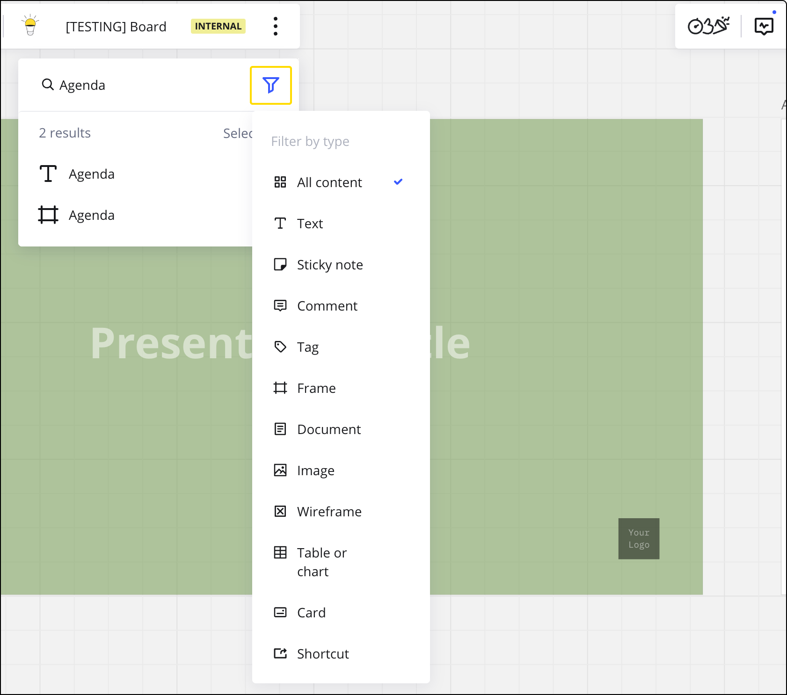

Miro의 고급 텍스트 검색 기능은 보드에서 정보를 신속하게 찾고 정리하는 데 도움을 줍니다.

## 찾기 기능에 액세스하기

**찾기** 기능에 두 가지 방법으로 액세스할 수 있습니다:

- 보드 메뉴에서 세 점 아이콘(**...**)을 클릭한 후, **편집** 하위 메뉴로 이동합니다.
- 키보드 단축키를 사용하세요: **Cmd + F** (Mac) 또는 **Ctrl + F** (Windows) [^1].

## 보드에서 오브젝트 찾기

오브젝트를 검색하려면:

1. 위 방법 중 하나를 사용하여 찾기 기능을 시작합니다.
2. 검색 필드에 검색어를 입력하세요.
3. 검색어가 포함된 Miro 위젯을 포함하여 결과 목록이 표시됩니다.
4. 찾은 객체는 보드에 하이라이트되며, 다른 콘텐츠는 어두워집니다. 결과는 검색 필드 아래에 나열됩니다.
5. 검색 결과를 클릭하면 해당 오브젝트로 직접 이동됩니다.

## 검색 결과 필터링

결과를 필터링하여 검색을 상세화할 수 있습니다. 예를 들어, 특정 태그가 있는 스티커 메모를 검색하거나 텍스트 메모 내에서만 검색할 수 있습니다. 필터링하려면:

1. 검색 필드 옆의 필터 옵션을 클릭하세요.
2. **모든 콘텐츠**를 드롭다운 메뉴에서 다른 카테고리로 변경하세요.

*검색 결과 필터*

## 자주 묻는 질문

**"찾기 및 바꾸기" 옵션이 보드에 있나요?**

아니요, 현재로서는 해당 옵션이 없습니다.

**텍스트 상자/스티커 메모 안의 특정 단어는 어떻게 찾을 수 있나요?**

이 방법을 브라우저에서 사용할 수 있습니다. 텍스트 상자/스티커 메모를 클릭해 텍스트 편집 모드로 들어간 후, 내장된 브라우저 페이지 검색을 사용하세요 (예를 들어, Chrome에서는 **Ctrl + F**(Windows), **Cmd + F**(Mac)를 누를 수 있습니다).
