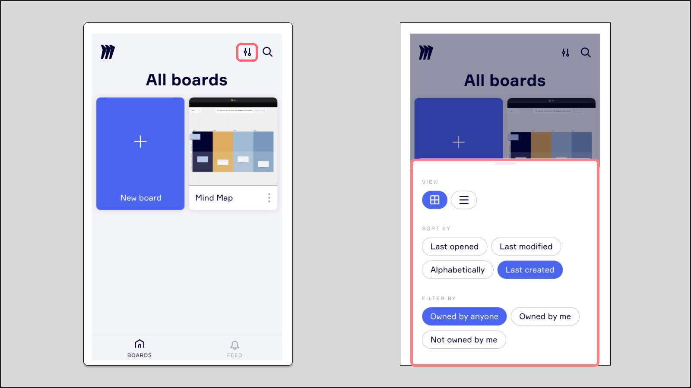

Zwiększ współpracę zespołową w dowolnym czasie i miejscu dzięki aplikacji mobilnej Miro. Pozostawaj w kontakcie i na bieżąco z postępami swojego zespołu, angażuj się w dynamiczne burze mózgów za pomocą pomysłów i karteczek oraz oferuj ciągłe uwagi poprzez płynne komentowanie.

:::tip
Aplikacja mobilna jest dostępna we wszystkich [językach](../../using-miro/managing-your-profile/03-language-settings.md) obsługiwanych przez Miro.
:::

## Pobierz aplikację mobilną Miro

|  |  |
| --- | --- |
| [google-play-badge.png](https://play.google.com/store/apps/details?id=com.realtimeboard&hl=en&gl=US&pli=1) | [Download_on_the_App_Store_Badge_US-UK_RGB_blk_092917.svg](https://apps.apple.com/us/app/miro-online-whiteboard/id1180074773) |

:::note
Jeśli masz trudności z używaniem aplikacji Miro na telefonie, odwiedź [rozwiązywanie problemów z urządzeniami mobilnymi i tabletami](../../using-miro/tools/troubleshooting/16-troubleshooting-mobile-and-tablet-device-issues.md).
:::

## Funkcje dostępne w aplikacji mobilnej Miro

- Tekst
- Kształty
- Karteczki (w tym [tagi](../../using-miro/essential-tools/14-sticky-notes.md), [emoji](../../using-miro/essential-tools/14-sticky-notes.md) i [etykiety autora](../../using-miro/essential-tools/14-sticky-notes.md))
- Ramki
- Komentarze i [śledzenie wątku komentarzy](../../using-miro/facilitation-tools/asynchronous-tools/01-comments.md)
- Przesyłanie zdjęć i plików
- Kopiowanie i wklejanie między tablicami
- Linie łączące
- Rysunki piórem i [zakreślacz](../../using-miro/essential-tools/10-pen.md)
- [Lasso](../../using-miro/working-on-the-board/10-working-with-objects.md)
- [Konwersja karteczek](../../using-miro/import-and-export/import/06-stickies-capture.md)
- [SSO](../../enterprise-administration/security-integrations/single-sign-on-sso/09-single-sign-on-sso.md)
- [Talktrack](../../using-miro/facilitation-tools/asynchronous-tools/02-talktrack-board-recordings.md)
- [Zarządzanie uwagą](../../using-miro/facilitation-tools/04-attention-management.md) ("Podążaj" i "Przyciągnij do mnie")
- Sterowanie dla [Slajdów Miro](../../using-miro/formats/13-miro-slides.md)
- Tryb ciemny

## Funkcje o ograniczonej dostępności lub funkcjonalności

Pewne funkcje Miro nie są obsługiwane na urządzeniach mobilnych. Obejmuje to szablony, eksport tablic, tryb prezentacji, czat wideo, głosowanie i ulubione tablice. Nie można zmieniać subskrypcji ani dodawać licencji w aplikacji mobilnej lub przeglądarkach mobilnych.

Aplikacja mobilna obecnie zapewnia *ograniczoną funkcjonalność* dla niektórych funkcji:

|  |  |
| --- | --- |
| **Funkcja** | **Ograniczona funkcjonalność** |
| Tworzenie i udostępnianie tablic | Brak uprawnień do edycji dla [odwiedzających](../../using-miro/sharing-boards/08-collaboration-with-visitors.md) |
| Przestrzenie | Filtrowanie tablic według [przestrzeni](../../using-miro/spaces/01-spaces.md) |

## Wymagania mobilne

- **Użytkownicy iOS:** iOS 16 lub nowsza
- **Użytkownicy Android:** Android 7 lub nowsza

Jeśli aplikacja nie jest kompatybilna z Twoim telefonem, możesz nadal uzyskać dostęp do następujących funkcji Miro przez przeglądarkę mobilną:

- **Wyświetlanie tablic:** Dostęp i przeglądanie zawartości.
- **Pozostawianie komentarzy:** Naciśnij i przytrzymaj ekran, aby dodać komentarz.

## Nawigacja w aplikacji mobilnej

:::tip
Upewnij się, że używasz najnowszej wersji aplikacji mobilnej Miro, aby cieszyć się zaktualizowanymi i ulepszonymi elementami nawigacyjnymi.
:::

### Filtry

Użyj filtrów, aby sortować i dostosowywać pulpit. Dostęp do filtrów znajdziesz w prawym górnym rogu pulpitu.

*Filtrowanie tablic w aplikacji*

### Przełączanie między zespołami

Aby przełączyć zespoły, stuknij ikonę zespołu w lewym górnym rogu, a następnie wybierz żądany zespół z listy.

*Przełączanie między zespołami w aplikacji*

### Paski narzędzi aplikacji Miro

Użyj poniższego przewodnika po paskach narzędzi, aby poruszać się po aplikacji Miro:

1. Powróć do [pulpitu](../start-here/miro-dashboard/01-what-is-on-your-dashboard.md)
2. Tytuł tablicy
3. [Wyszukaj](../start-here/miro-dashboard/03-how-to-search-in-miro.md)
4. Uczestnicy ([Zarządzanie uwagą](../../using-miro/facilitation-tools/04-attention-management.md))
5. [Menu tablicy](../start-here/your-first-board/05-toolbars.md)
6. [Ramki](../../using-miro/essential-tools/07-frames.md)
7. [Notatki](../../using-miro/essential-tools/17-visual-notes.md)
8. [Odtwarzanie nagrań Talktrack](../../using-miro/facilitation-tools/asynchronous-tools/02-talktrack-board-recordings.md)
9. [Pasek tworzenia](../start-here/your-first-board/05-toolbars.md) (ograniczone narzędzia i funkcje)

*Interfejs tablicy w aplikacji mobilnej*

## Zarządzanie uwagą w aplikacji

Podobnie jak w wersji desktopowej, użytkownicy mogą śledzić innych użytkowników na tablicy lub przyciągać pojedynczych uczestników do swojego widoku.

*
Zarządzanie uwagą w aplikacji*

## Jak pracować na tablicy w aplikacji

### Gesty dotykowe w aplikacji mobilnej

- **Przesuń palcem**, aby przesuwać się po tablicy.
- **Przytrzymaj dłużej** i przesuń, aby wybrać wiele obiektów.
- **Ściągaj dwoma palcami**, aby oddalić lub przybliżyć.
- **Dwukrotnie dotknij** tablicy, aby przybliżyć.
- **Dwukrotnie dotknij i przesuń palcem w górę** **lub w dół**, aby przybliżyć lub oddalić.
- **Przesuń palcem w górę i w dół na krawędziach ekranu**, aby przybliżyć lub oddalić.
- Wybierz obiekt i stuknij **Edycja**, aby edytować obiekt.
- **Dwukrotnie dotknij** obiektu, aby dodać tekst.
- **Przytrzymaj dłużej** obiekt, aby go przesunąć.

### Jak edytować obiekty tablicy

Gdy otworzysz tablicę w aplikacji mobilnej, domyślnie będzie ona w trybie tylko do odczytu. Dzięki temu możesz łatwo przesuwać się po tablicy bez przemieszczania obiektów.

1. Wybierz obiekt i stuknij **Edytuj**.
2. Dwukrotnie stuknij obiekt, aby rozpocząć dodawanie tekstu.
3. Długo trzymaj obiekt, aby go natychmiast przesunąć.

### Jak kopiować i wklejać pomiędzy tablicami

Kopiowanie elementu z jednej tablicy na inną jest tak samo proste jak kopiowanie i wklejanie elementów na tej samej tablicy.

1. Otwórz tablicę, z której chcesz skopiować obiekt.
2. Wybierz obiekt, a następnie naciśnij **trzy pionowe kropki** w dolnym pasku narzędzi.
3. Wybierz **Kopiuj**.
4. Otwórz tablicę, na którą chcesz wkleić obiekt.
5. Naciśnij **ikona Dodaj (+)** i następnie naciśnij **Wklej**.
6. Przesuń wklejony obiekt we właściwe miejsce na tablicy.

Jeśli chcesz skopiować i wkleić obraz, plik lub inną treść inną niż tekst z zewnątrz Miro, musisz użyć funkcji **Prześlij** zamiast kopiowania i wklejania. Opcję Prześlij znajdziesz w menu **Dodaj (+)**.

### Jak rysować linie łączące

Rysowanie linii łączących pomiędzy obiektami pozwala stworzyć pomiędzy nimi powiązanie, które pozostaje nawet po przesunięciu obiektów po tablicy.

1. Wybierz obiekt, od którego chcesz zacząć połączenie.
2. Naciśnij ikonę **Edycja**.
3. Przeciągnij **niebieską kropkę**, która pojawia się poniżej obiektu, do obiektu, z którym chcesz się połączyć.
4. Pojawi się strzałka, łącząc obiekty.
   
5. Aby usunąć linię łączącą, wybierz ją, a następnie kliknij ikonę **Kosz** w dolnym pasku narzędzi.

### Jak wyświetlić szczegóły tablicy

Naciśnij ikonę menu z trzema kropkami w prawym górnym rogu, aby wyświetlić szczegóły tablicy, zmienić okładkę tablicy i zaktualizować dostęp do tablicy.

*Menu tablicy w aplikacji mobilnej*

## Zarządzanie preferencjami użytkownika i tablicy

### Ustawienia tablicy

W sekcji **Ustawienia tablicy** możesz włączyć lub wyłączyć kursory użytkowników, tabelkę tablicy, [przyciąganie obiektów](../../using-miro/formats/diagramming/01-miro-for-mapping-diagramming.md), a także zdecydować, czy pokazać rozwiązane komentarze.

*Ustawienia tablicy w aplikacji mobilnej*

### Prośby o uprawnienia do edycji

Kiedy ktoś prosi o uprawnienia do edycji tablicy, właściciel tablicy otrzymuje powiadomienie push z aplikacji Miro. Może wtedy kliknąć powiadomienie, aby łatwo przejść do tablicy i przyznać wnioskodawcy uprawnienia do edycji.

## Wsparcie głosowe dla tablic

Użytkownicy, którzy potrzebują pomocy z elementami wizualnymi, mogą włączyć funkcję przetwarzania głosu, dostępną na iOS i Androidzie. Po prostu włącz przetwarzanie głosu w ustawieniach telefonu, aby używać go z Miro.

Kiedy funkcja przetwarzania głosu jest włączona, będzie odczytywać na głos to, co znajduje się na ekranie, gdy wybierzesz elementy. To pomoże Ci słyszeć to, co znajduje się w aplikacji, dzięki czemu łatwiej będzie tworzyć i wyświetlać treści.

## Powiadomienia push

Gdy pierwszy raz logujesz się do aplikacji, zapytamy, czy chcesz włączyć powiadomienia push. W ten sposób zawsze będziesz wiedzieć, kiedy członek zespołu wspomni Cię na tablicy. Możesz wyłączyć te powiadomienia w dowolnym momencie w **Ustawieniach** aplikacji.

Dotyczy to tylko powiadomień push na smartfonie. Dowiedz się, jak wyłączyć [powiadomienia e-mail i newslettery](../../using-miro/managing-your-profile/02-miro-notifications.md).

*Kliknij awatar, aby otworzyć ustawienia profilu*

## FAQ

Czy mogę dodać linki internetowe do mojej tablicy za pomocą aplikacji mobilnej?

Tak, aby dodać link, najpierw go skopiuj. Następnie stuknij przycisk tworzenia (**+**) znajdujący się w dolnym prawym rogu tablicy. Wybierz **Prześlij**, a następnie **Wklej ze schowka**. Twój link zostanie wklejony na tablicę.

Jak włączyć tryb ciemny?

Domyślnie tryb ciemny jest włączony zgodnie z ustawieniami telefonu. Jeśli chcesz włączyć lub wyłączyć tryb ciemny specjalnie dla aplikacji mobilnej Miro, kliknij przycisk **Zmień tryb** w banerze na ekranie głównym aplikacji, a następnie wybierz **Tryb ciemny** lub **Tryb jasny**.
