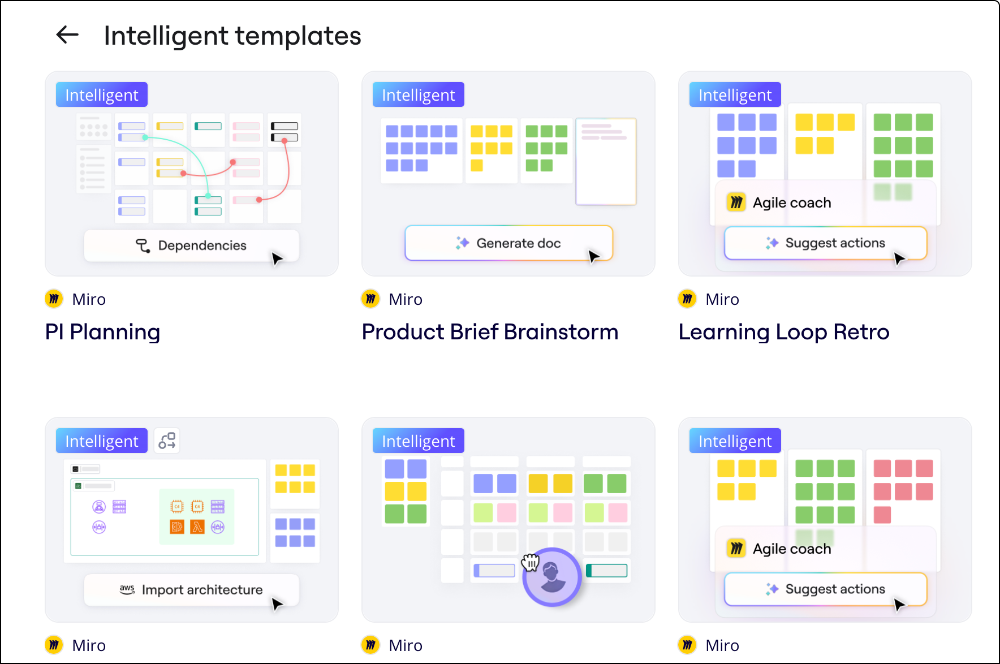

Od inspiracji do szybkiego startu dla każdego projektu, Miro oferuje różnorodne **t****szablony**, które pomogą Ci zwiększyć kreatywność i produktywność.

Od ćwiczeń z myślenia projektowego, rytuałów agile, po ramy do podejmowania decyzji, nasza [biblioteka szablonów](https://miro.com/templates/) zawiera ponad 300 specjalnie opracowanych szablonów, przeznaczonych do codziennych przypadków użycia, które pozwolą Ci rozpocząć współpracę w kilka sekund.

Miro oferuje również szablony dla przestrzeni, zwane planami projektów. Możesz wybrać gotową przestrzeń ze wstępnie ustalonymi tablicami i formatami, które najlepiej pasują do Twojego przepływu pracy. Aby dowiedzieć się więcej o planach projektów, zobacz plany projektów.

> **Dostępne w**: wersja przeglądarkowa, [aplikacja komputerowa](../../apps-for-devices/05-desktop-app.md), [aplikacja na tablety](../../apps-for-devices/11-tablet-app.md)

:::tip
Nie znalazłeś szablonu, którego potrzebujesz? [Prześlij nam swój pomysł](https://community.miro.com/wish-list-32), a być może dodamy go do biblioteki w przyszłości.
:::

:::tip
Odwiedź [Miroverse](https://miro.com/miroverse/) – galerię szablonów społeczności z najlepszymi tablicami Miro. Dowiedz się, jak możesz [opublikować własny szablon w Miroverse](../../../using-miro/miroverse/06-how-to-get-published-on-miroverse.md).
:::

<iframe allowfullscreen="" frameborder="0" height="315" src="//fast.wistia.com/embed/iframe/zuw2ce5s0d" width="560"></iframe>

## Jak znaleźć i używać szablony, aby rozpocząć

Przeglądaj galerię szablonów, aby zacząć z gotowym frameworkiem lub łącz różne szablony, aby utrzymać projekt w ruchu.

Przejdź do trybu współpracy szybciej, tworząc własny szablon lub korzystając z [szablonu](02-custom-templates.md) wykonanego przez Miro, który odpowiada Twoim potrzebom. Szablony znajdują się w jednym z czterech miejsc:

- Twój pulpit jest punktem wyjścia do rozpoczęcia czegoś nowego
- Selektor szablonów. Tutaj będą dostępne Twoje szablony niestandardowe, a także wybrane szablony wykonane przez Miro i te stworzone przez społeczność w Miroverse
- Strona internetowa Miro. Wszystkie szablony stworzone przez Miro znajdziesz na [miro.com/templates](https://miro.com/templates/)
- [Miroverse](../../../using-miro/miroverse/01-what-is-miroverse.md). Wszystkie szablony stworzone przez społeczność znajdziesz na [miro.com/miroverse](https://miro.com/miroverse/)

### Z pulpitu

Aby dodać szablon tablicy z pulpitu, wybierz szablon lub kliknij **Przeglądaj szablony** , aby otworzyć selektor szablonów. Po wybraniu szablonu zostanie utworzona nowa tablica.

*Szablony na pulpicie Miro*

### Z selektora szablonów – szablony i Plany projektu

Aby dodać szablon do istniejącej tablicy lub wybrać plan projektu dla zespołu, wybierz ikonę **Szablony** () **na pasku narzędzi. Wybierz szablon lub plan projektu z selektora szablonów.**

Selektor szablonów pozwala Ci łatwo przeglądać **300****+ szablonów** Miro, w tym szablony najlepszej jakości stworzone przez twórców Miroverse. Użyj wyszukiwarki, aby łatwo znaleźć szablon, który najlepiej odpowiada Twoim potrzebom. Wyszukiwanie obejmuje także wszystkie [szablony niestandardowe](02-custom-templates.md).

*Selektor szablonów*

Przeglądaj główne przypadki użycia za pomocą kategorii, tagów tematycznych i wyróżnionych szablonów. Dowiedz się wszystkiego o szablonie dzięki informacjom o autorach szablonów, interaktywnym podglądom i zasobom edukacyjnym.

Zdecyduj, czy chcesz zacząć od przykładowej zawartości (dostępnej w niektórych szablonach), czy od pustego szablonu.

*Opcje użycia szablonu z wypełnioną zawartością lub pustego na podglądzie szablonu*

Jeśli wolisz zacząć tablicę od zera, odznacz **Pokaż podczas tworzenia nowej tablicy**, a selektor szablonów nie będzie się pojawiał za każdym razem, gdy tworzysz nową tablicę. Zawsze możesz ponownie otworzyć selektor szablonów z paska narzędzi.

*Opcja wyświetlania selektora szablonów za każdym razem, gdy tworzysz tablicę*

### Plany projektów

Selektor szablonów umożliwia również wybór [planu projektu](../../../using-miro/spaces/04-blueprints-beta.md).

Plany projektów to szablony dla przestrzeni. Możesz wybrać plan projektu przestrzeni, aby wstępnie zorganizować swoją przestrzeń z tablicami i formatami, które odpowiadają Twojemu przepływowi pracy i potrzebom zespołu. Tablice i formaty są wstępnie wypełnione wszystkim, czego potrzebujesz, aby rozpocząć przepływ.

Aby uzyskać dostęp do planów projektów z poziomu pulpitu Miro, po prawej stronie wybierz **Przeglądaj szablony**. Otworzy się selektor szablonów, a następnie wybierz **Plany projektów**.

:::tip
Możesz także uzyskać dostęp do selektora szablonów i planów projektów z poziomu tablicy Miro. Wybierz **Szablony** () z paska tworzenia. Otworzy się selektor szablonów.
:::

:::note
Plany projektów nie są dostępne w wersji Free. Użytkownicy na wersji Free mogą zobaczyć funkcję planów projektów oraz opcję zmiany na wyższą wersję swojego abonamentu.
:::

### Z paneli szablonów

Szablony są wbudowane w ramki, karteczki, tabele i mapy myśli, co umożliwia łatwy dostęp. Aby szybciej tworzyć, po prostu otwórz dowolne z tych narzędzi na [pasku narzędzi](05-toolbars.md) i kliknij **Szablony**.

*Dostęp do szablonów z panelu karteczek*

### Łącz i dopasowuj szablony

Możesz dodać na swoją tablicę tyle szablonów, ile potrzebujesz. Łącz struktury i aktywności z wielu szablonów, aby bezproblemowo kontynuować współpracę na tej samej tablicy. Wystarczy przejść do selektora szablonów z wybranej tablicy i wybrać dowolny gotowy szablon lub [jeden z własnych](02-custom-templates.md).

Po dodaniu szablonu, elementy są automatycznie rozgrupowywane. Każdy obiekt możesz kliknąć, aby go przesunąć lub edytować. Jeśli chcesz przesunąć więcej niż jeden obiekt jednocześnie, możesz je [zgrupować](../../../using-miro/working-on-the-board/08-structuring-board-content.md) lub [utworzyć wokół nich ramkę](../../../using-miro/essential-tools/07-frames.md). Możesz kopiować elementy szablonu i wklejać je, jeśli potrzebujesz dodać więcej podobnych pozycji. Możesz [wybrać wszystkie elementy szablonu](../../../using-miro/working-on-the-board/10-working-with-objects.md), aby go przesunąć lub usunąć, jeśli nie jest Ci potrzebny na Twojej tablicy.

:::tip
Utrzymuj spójność i dopasuj swój unikalny styl, aktualizując [kolory](../../../using-miro/working-on-the-board/14-colors.md) i/lub [czcionki](../../../using-miro/essential-tools/06-fonts.md).
:::

## Wyczyść wstępnie wypełnioną zawartość

Jeśli obiekty w szablonie są wstępnie wypełnione treścią, możesz jednocześnie wyczyścić zawartość wielu widżetów (takich jak karteczki, kształty i karty). Ta funkcja pozwala usunąć cały tekst, tagi, emoji, autorów, przydzielonych użytkowników i terminy z wybranych widżetów, przywracając je do ich pustego stanu, jednocześnie zachowując ich stylizację (kolory, rozmiary itp.).

Aby wyczyścić zawartość:

1. Wybierz widżety, które chcesz wyczyścić.
2. Kliknij prawym przyciskiem myszy, aby otworzyć menu kontekstowe.
3. Wybierz opcję „Wyczyść zawartość” z menu.
4. Alternatywnie, użyj skrótu Cmd + Delete (Mac) lub Ctrl + Delete (Windows).

## Praca z inteligentnymi szablonami

Inteligentne szablony są zaprojektowane tak, aby usprawniać przepływ pracy i angażować zespoły podczas takich aktywności jak planowanie sprintu, retrospektywy i roadmapy. Inteligentne szablony łączą AI, interaktywne narzędzia i integracje w jedną spójną całość.

Funkcje inteligentnych szablonów obejmują:

- Generowanie dokumentu podsumowującego wnioski ze spotkania.
- Generowanie kolejnych kroków w retrospektywie.
- Dodawanie członków zespołu do kart za pomocą widgetu Lista osób.
- Generowanie obserwacji z badań użytkowników.
- Uzyskiwanie opinii na temat pomysłów.

Możesz dodać inteligentne szablony do nowych lub istniejących tablic w taki sam sposób, jak uzyskujesz dostęp do zwykłych szablonów: przez swój pulpit lub selektor szablonów. Znajdziesz tam sekcję dedykowaną inteligentnym szablonom lub wyszukasz je wśród kategorii szablonów. Szukaj banera **Inteligentny** w lewym górnym rogu miniatury szablonu.

*Przykłady inteligentnych szablonów w selektorze szablonów*

## Udostępnianie linków do szablonów

Wprowadź członków zespołu w temat używania Miro w kilka sekund, a nie godzin. Linki do udostępniania pomagają szybko skierować innych do odpowiedniego szablonu i rozszerzyć zasięg polecanych zasobów.

Przejdź do szablonu, który chcesz udostępnić i możesz skopiować link do udostępniania na dwa sposoby:

- Kliknij menu z 3 kropkami na miniaturze szablonu i wybierz **Kopiuj link**.
- Kliknij **Podgląd**, aby zobaczyć szczegóły szablonu i wybierz **Kopiuj link do udostępnienia** w prawym górnym rogu.

## Tworzenie szablonu niestandardowego

Jeżeli często powtarzasz te same aktywności lub zauważasz, że ludzie często kopiują i wklejają, znalazłeś świetnego kandydata na szablon niestandardowy. Ustandaryzuj procesy i unikaj marnowania czasu na duplikowanie wysiłku, tworząc szablony niestandardowe widoczne dla Ciebie i Twojego zespołu. [Dowiedz się więcej o tworzeniu, udostępnianiu i edytowaniu szablonów niestandardowych](02-custom-templates.md).

:::note
Abonament Starter będzie zawierał opcje „Personal” i „Team” pod Szablonami niestandardowymi.
Opcje „Company”, „Team” i „Personal” są dostępne w abonamentach Starter, Business, Enterprise i Education.
:::

## FAQ

**Czy mogę zaimportować szablon z innej usługi do Miro?**

Nie, ale możesz korzystać z dowolnego szablonu znajdującego się w bibliotece szablonów Miro lub tworzyć własne szablony niestandardowe.

**Czy mogę uzyskać dostęp do selektora szablonów w aplikacji mobilnej?**

Nie, obecnie nie jest to możliwe.

**Czy szablony Miro są darmowe?**

Tak, szablony z biblioteki i selektora są darmowe, natomiast szablony niestandardowe są dostępne tylko w płatnych i Education wersjach. Szablony zawierające pakiety kształtów do tworzenia inteligentnych diagramów są dostępne tylko w wersjach Business, Enterprise oraz Education.

**Czy mogę stworzyć szablon tablicy, aby inni użytkownicy mogli go kopiować do swoich zespołów?**

Tak, włącz kopiowanie tablicy w ustawieniach tablicy i udostępnij tablicę innym użytkownikom. Zarejestrowani użytkownicy Miro będą mogli zduplikować tablicę do swoich zespołów.
Jeśli w Twoim zespole dostępne są szablony niestandardowe, możesz stworzyć własny szablon i udostępnić go swojemu zespołowi. Więcej informacji tutaj.
