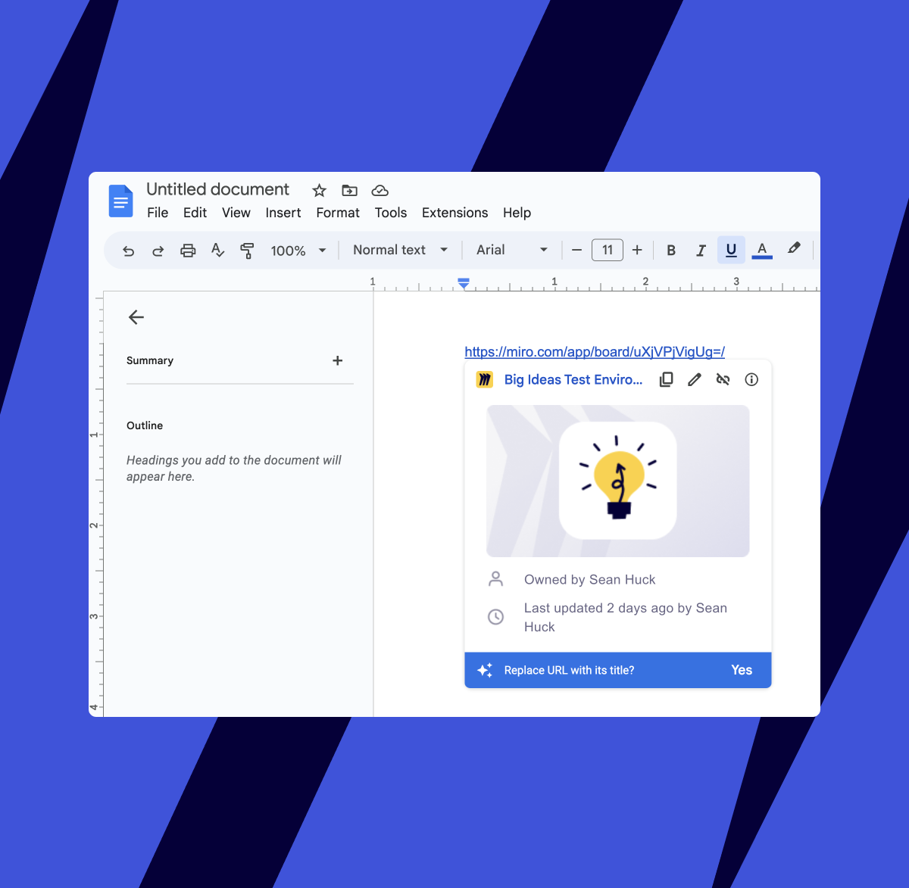
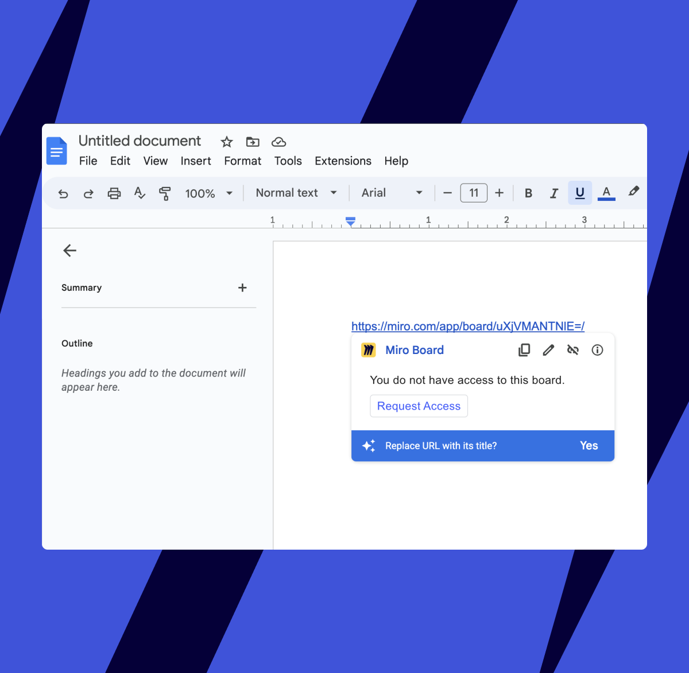

Google oferuje potężne możliwości współpracy dzięki swojej inteligentnej planszy, która wykorzystuje interaktywne bloki konstrukcyjne zwane inteligentnymi chipami. Dzięki inteligentnemu chipowi Miro dla Google możesz dodać skrót do tablicy Miro bezpośrednio w Dokumentach Google, Slajdach lub Arkuszach, zwiększając swoje możliwości współpracy.

Dodatkowo, Miro oferuje inteligentne zrzuty ekranu, umożliwiając wklejanie tablic Miro i widżetów bezpośrednio jako obrazy do Dokumentów, Slajdów i Arkuszy Google, z udoskonaloną funkcjonalnością utrzymywania synchronizacji treści.

*Dodatek inteligentnego chipa Miro w Dokumentach Google*

## Skonfiguruj inteligentne chipy Miro

Wykonaj te kroki, aby zintegrować linki do tablic Miro jako inteligentne chipy w Dokumentach, Slajdach lub Arkuszach Google.

:::note
Twój administrator Google Workspace może potrzebować zainstalować dodatek Miro dla Twojej organizacji lub zespołu w Google Workspace. Skontaktuj się z administratorem, jeśli nie jest dostępne. [Dowiedz się więcej](https://support.google.com/a/topic/1056395?hl=en&ref_topic=27380).
:::

1. Wklej link do swojej tablicy Miro w dokumencie Google, a następnie naciśnij **Tab**. Google sprawdzi, czy link jest linkiem do aktywnego elementu.
2. Google sprawdzi, czy masz już zainstalowany dodatek Miro do Google Workspace. Następnie wystąpi jedna z dwóch sytuacji:
   1. Jeśli masz już zainstalowany dodatek do Google Workspace, nie musisz instalować aktywnych elementów — już je masz. Zobaczysz podgląd swojej tablicy po kliknięciu linku.
   2. Jeśli nie masz zainstalowanego dodatku, zostaniesz poproszony o zainstalowanie go z Google Workspace Marketplace.

      > ✏️ Może być konieczne, aby Twój administrator Google zainstalował dla Ciebie dodatek.
3. Następnie Google poprosi Cię o połączenie się z Twoim kontem Miro. To jest potrzebne do wyświetlenia niektórych informacji o tablicy i ustalenia, czy masz dostęp do tablicy, do której linkujesz. Kliknij **Połącz z Miro**.

   
*Łączenie Miro z Google Workspaces*
4. Następnie jedno z dwóch działań zostanie podjęte:
   1. Jeśli masz już uprawnienia do dostępu do tej tablicy, zobaczysz chip z podglądem tablicy oraz takimi informacjami jak właściciel tablicy i data ostatniej modyfikacji.
   2. Jeśli potrzebujesz autoryzacji, zobaczysz przycisk **Poproś o dostęp**. Kliknij go, a Twoja prośba zostanie wysłana do właściciela tablicy.

      *Prośba o dostęp do prywatnej tablicy*
5. Gdy Twój dostęp zostanie zatwierdzony, zobaczysz chip z podglądem tablicy. Jeśli nie widzisz podglądu, odśwież dokument.
6. Twoja tablica została teraz dodana do dokumentu, a kliknięcie jej przeniesie Cię do tablicy Miro. Każda osoba z dostępem do tablicy może utworzyć smart chip w swoim dokumencie Google.

   
*Łączenie łącza smart chip Miro do tablicy z Google Workspaces*

## Użyj inteligentnych zrzutów ekranu Miro

Integracja panelu bocznego Miro pozwala osadzić treści z tablic Miro bezpośrednio w dokumentach, slajdach lub arkuszach Google, bez opuszczania dokumentu. Ta funkcja zapewnia płynny dostęp do Twoich tablic Miro i umożliwia wstawianie treści wizualnych z ulepszonymi funkcjami.

### Panel boczny Miro

Panel boczny Miro w Dokumentach, Slajdach lub Arkuszach Google zawiera następujące funkcje:

- **Bezpośredni dostęp do tablicy:** Uzyskaj dostęp do swoich tablic Miro bezpośrednio z dokumentów, slajdów lub arkuszy Google bez konieczności przełączania aplikacji.
- **Wybór tablicy:** Wybierz spośród dostępnych tablic Miro, używając przycisku "Wybierz tablicę Miro do osadzenia".
- **Interaktywny podgląd:** Przeglądaj i wybieraj konkretne treści z tablicy Miro przed wstawieniem.
- **Precyzyjne umieszczenie:** Wstawiaj treści dokładnie tam, gdzie znajduje się kursor w dokumencie.
- **Inteligentna funkcjonalność:** Osadzone treści utrzymują połączenie z oryginalną tablicą Miro.

### Jak korzystać z panelu bocznego Miro

1. W dokumentach, slajdach lub arkuszach Google umieść kursor w miejscu, gdzie chcesz wstawić treść Miro.
2. Otwórz panel boczny po prawej stronie, klikając ikonę integracji Miro.
   
3. Kliknij **Wybierz tablicę Miro do osadzenia**, aby wybrać spośród dostępnych tablic Miro.
   
4. Przeglądaj i wybierz konkretny obszar, ramkę lub treść, którą chcesz osadzić z podglądu tablicy.
   
5. Użyj dowolnych dostępnych opcji z menu rozwijanego, aby wybrać inne ustawienia wyświetlania lub selekcje.
6. Kliknij **Potwierdź**, aby wstawić zawartość w miejscu, gdzie znajduje się kursor.

Osadzona zawartość pojawi się jako zrzut ekranu w dokumencie, z połączeniem smart chip do oryginalnej tablicy Miro.

:::note
**Notatka:** Panel boczny Miro wymaga zainstalowania dodatku Miro do przestrzeni roboczej Google. Funkcja działa zarówno z Dokumentami, Slajdami, jak i Arkuszami Google.
:::

## Zarządzaj dodatkiem jako administrator

Przejrzyj te punkty, jeśli jesteś administratorem przestrzeni roboczej Google zarządzającym dodatkiem Miro:

1. Dodatek do przestrzeni roboczej Google może być instalowany lub usuwany tylko po stronie Google.
2. Jeśli chcesz ograniczyć dostęp do inteligentnych chipów Google, musi to zostać zrobione po stronie Google; Miro nie ma kontroli nad tym, którzy użytkownicy instalują i używają inteligentnych chipów.

## Często zadawane pytania

Tutaj znajdziesz odpowiedzi na najczęściej zadawane pytania dotyczące Miro smart chips dla Google.

Jaka jest różnica między Smart Chips a panelem bocznym Miro?

Smart Chips tworzą klikalne linki do tablic Miro w Twoich dokumentach Google, podczas gdy panel boczny Miro pozwala osadzić treści wizualne z tablic Miro bezpośrednio w Dokumentach i Slajdach Google. Panel boczny zapewnia zintegrowany sposób wybierania i wstawiania konkretnych treści z tablicy bez opuszczania dokumentu.

Które aplikacje Google Workspace obsługują integrację z Miro?

Smart Chips działają z Dokumentami Google, a panel boczny Miro działa zarówno z Dokumentami, jak i Slajdami Google. Wsparcie dla Arkuszy Google jest określane przez firmę Google - prosimy sprawdzać aktualizacje w Centrum pomocy.

Z jakim rodzajem linków działają Smart Chips?

Smart chip Miro dla Google obsługuje linki do tablic Miro i obiektów na tablicach.

Jak elementy osadzone z tablic Miro pozostają zaktualizowane?

Treści osadzone za pomocą panelu bocznego Miro utrzymują połączenie z oryginalną tablicą Miro. Chociaż nie synchronizuje się automatycznie, możesz odświeżyć osadzone treści, aby upewnić się, że odzwierciedlają najnowszą wersję Twojej tablicy Miro.

Jak działa panel boczny w Dokumentach Google?

Panel boczny w Dokumentach Google zapewnia bezpośredni dostęp do twoich tablic Miro bez opuszczania dokumentu. Kliknij ikonę integracji Miro, aby otworzyć panel boczny z prawej strony, a następnie użyj "Wybierz tablicę Miro do osadzenia", aby wybrać spośród dostępnych tablic. Panel umożliwia podgląd i wybór konkretnych obszarów lub ramek przed wstawieniem ich do dokumentu w miejscu, gdzie znajduje się kursor.
