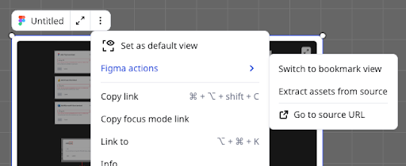

Możesz osadzić treści z następujących integracji innych firm bezpośrednio na swojej tablicy Miro:

- Box ([dokumentacja administratora](https://docs.google.com/document/d/1VYy-m7wNKPBPzamOjrzJjl1KIxvOcZvqvoK4UjfGPzE/edit?usp=sharing))
- Figma ([dokumentacja administracyjna](https://docs.google.com/document/d/1AsY8Xq1osXdTz1qCvQoE3cs0TeQEWcPPBpI3mBQO20E/edit?usp=sharing))
- Google Dokumenty ([dokumentacja administratora](https://docs.google.com/document/d/1HuW37I9olHGxhDrjVR8iRRZ2fMK1y8xy2FsPwdtlvVc/edit?usp=sharing))
- Google Sheets ([dokumentacja administratora](https://docs.google.com/document/d/1HuW37I9olHGxhDrjVR8iRRZ2fMK1y8xy2FsPwdtlvVc/edit?usp=sharing))
- Google Slides ([dokumentacja administratora](https://docs.google.com/document/d/1HuW37I9olHGxhDrjVR8iRRZ2fMK1y8xy2FsPwdtlvVc/edit?usp=sharing))
- Looker ([dokumentacja administratora](https://docs.google.com/document/d/1AUCQWRwDICLygwVmwSxXpz7RmRivPit0EIKgBMIkT6A/edit?usp=sharing))
- Microsoft Excel ([dokumentacja administracyjna](https://docs.google.com/document/d/1Gw94z5Pc-elS-pRXKGZVBWKKNEIFR9y9yzAAkbXKwMM/edit?usp=sharing))
- Microsoft PowerPoint ([dokumentacja administratora](https://docs.google.com/document/d/1Gw94z5Pc-elS-pRXKGZVBWKKNEIFR9y9yzAAkbXKwMM/edit?usp=sharing))
- Microsoft Word ([dokumentacja dla administratora](https://docs.google.com/document/d/1Gw94z5Pc-elS-pRXKGZVBWKKNEIFR9y9yzAAkbXKwMM/edit?usp=sharing))
- Power BI ([dokumentacja administratora](https://docs.google.com/document/d/1hMepF163jQF8LI-U8ES8DzHVMW4TltXDr14fJ2KU29k/edit?usp=sharing))

> ***Dostępne na:** Wersje Starter, Business, Education i Enterprise*

**Więcej informacji:** Zobacz [przegląd aplikacji i integracji Miro](02-miro-apps-and-integrations-overview.md).

## Najważniejsze funkcje

Osadzona zawartość w Miro obejmuje następujące kluczowe funkcje:

- **Ujednolicony UX i inteligentne linki**
  Wykonaj te same kroki, aby osadzić dowolną integrację zewnętrzną.
- **Menu kontekstowe**
  Użyj selektora zasobów, otwórz tryb skupienia i zmień na widok zakładek.
- **(Inteligentne szablony) Skróty do działań**
  Twórz szablony ze skrótami, które pobierają dane z narzędzia zewnętrznego.

## Jak osadzać treści zewnętrzne w Miro

Poniższa procedura wyjaśnia, jak osadzić treści z integracji zewnętrznych.

**Wymagania wstępne**

- Upewnij się, że Twój administrator firmy, administrator treści lub administrator zespołu zezwolił na użycie żądanych integracji zewnętrznych.
- Upewnij się, że masz dostęp do treści zewnętrznej, którą chcesz osadzić.

Aby dowiedzieć się, jak administratorzy mogą włączyć integracje dla użytkowników w swojej organizacji, zobacz [zarządzanie aplikacjami](../../enterprise-administration/managing-apps-on-enterprise-plan/02-app-management.md).

**Procedura**

Wykonaj jedną z następujących czynności:

- Skopiuj i wklej URL z [zewnętrznej integracji](02-miro-apps-and-integrations-overview.md) na planszę Miro.
- W pasku narzędzi tworzenia wybierz **Narzędzia**. Wyszukaj i wybierz obsługiwane narzędzie zewnętrzne, które chcesz osadzić. Otworzy się okno modalne, w którym możesz wprowadzić URL strony trzeciej.
- Na pasku tworzenia wybierz **Narzędzia**. Wyszukaj i wybierz **Prześlij**, a następnie **Prześlij przez URL**.
- Na pulpicie wybierz **+ Utwórz nowy**, a następnie **Osadź**.
- Na tablicyw pasku bocznym **Przestrzenie** wybierz **+,** a następnie **Osadź**.

  Jeśli Miro łączy się po raz pierwszy, postępuj zgodnie z instrukcjami wyświetlanymi na ekranie. Możesz potrzebować zalogować się do swojego narzędzia zewnętrznego lub poprosić o dostęp do treści, które chcesz osadzić.

  Udało Ci się pomyślnie osadzić treści zewnętrzne na swojej tablicy Miro.

## Menu kontekstowe iFrame dla integracji

Menu kontekstowe iFrame pojawia się nad widżetem osadzania.

*Menu kontekstowe iFrame.*

Menu kontekstowe iFrame zawiera następujące opcje:

- **Tryb skupienia**
  Skoncentruj uwagę na iFrame w trybie pełnoekranowym. Aby wejść w tryb skupienia, wybierz przycisk rozwiń. W trybie skupienia, aby wyjść, wybierz **Przejdź na planszę**.
- **Widok zakładek**
  Zwiń iFrame do zakładki, którą możesz później rozwinąć. Aby uzyskać dostęp do widoku zakładek, wybierz przycisk z pionowymi kropkami, a następnie wybierz **Przełącz na widok zakładek** w menu działań.
- **Selektor zasobów**
  Wybierz inny zasób lub wszystkie zasoby do osadzenia, takie jak ramka Figma lub wykres Power BI. Aby otworzyć selektor zasobów, wybierz pionowy przycisk z kropkami, a następnie wybierz **Wyodrębnij zasoby ze źródła** w menu działań. Selektor zasobów obsługuje następujące integracje:
  - Ramki Figma i sekcje
  - Prezentacje Google
  - Wykresy Lookera
  - Karty MS Excel
  - Slajdy MS PowerPoint
  - Strony MS Word
  - Wykresy Power BI

Menu ustawień iFrame zawiera również przycisk z pionowymi kropkami, który otwiera dodatkowe opcje.

## Skróty do działań dla integracji na inteligentnych szablonach

Skróty do działań to przyciski, które tworzysz, aby wyzwalać zdarzenia na swojej tablicy. Możesz ustawić skrót do działania, który natychmiast uruchamia integrację.

**Więcej informacji:** Zobacz [Skróty do działań](../../product-announcements/canvas-and-collaboration/101-action-shortcuts.md).
