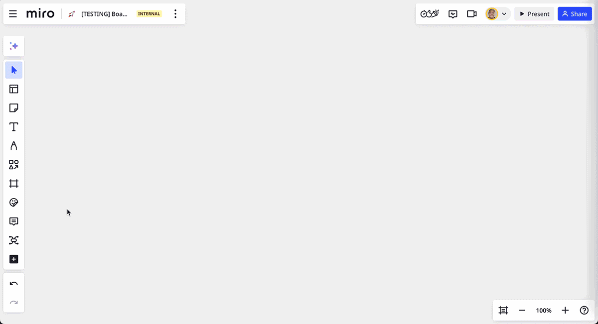
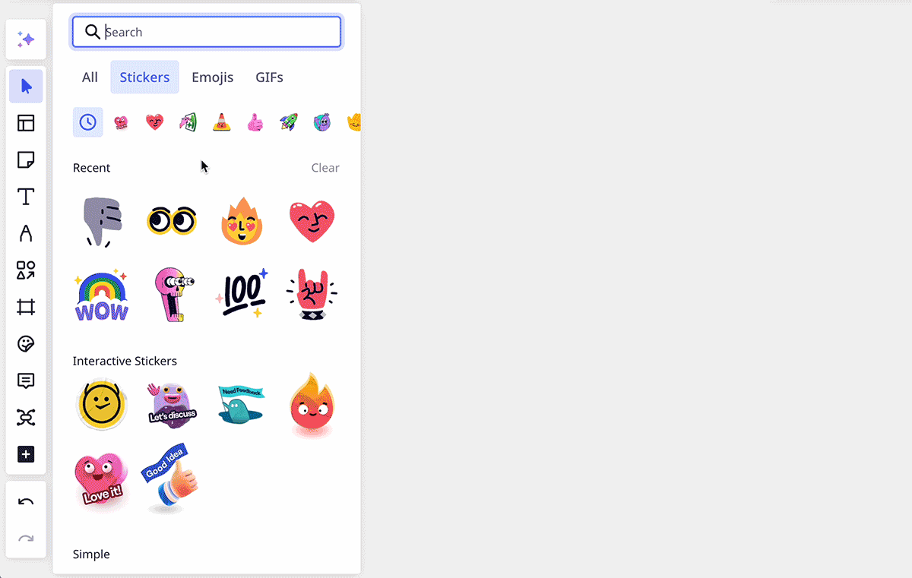
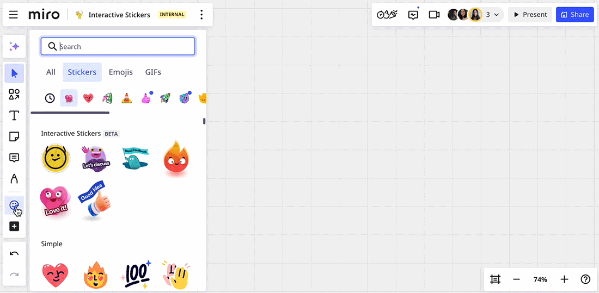

W Miro możesz umieszczać emoji, naklejki i GIF-y na swoich tablicach oraz je modyfikować. Udostępniaj feedback, wyrażaj emocje i wizualizuj swoje myśli oraz pomysły.

> **Dostępne dla:** planów Free, Starter, Business, Education i Enterprise
> **Dostępne na:** wersji przeglądarkowej, aplikacji komputerowej, aplikacji na tablety, aplikacji mobilnej (ograniczona funkcjonalność)

## Naklejki i emoji

Dodaj energii swoim tablicom Miro za pomocą naklejek i emoji, aby dodać do swojej zawartości chwile, które można znacznie spersonalizować z zabawnym akcentem.

:::note
Jeśli nie możesz znaleźć aplikacji Naklejki i Emojis, pobierz ją z [Miro Marketplace](https://miro.com/marketplace/emoji-app/?backUrl=%2Fmarketplace%2F). Jeśli nie masz uprawnień do zarządzania aplikacjami, skontaktuj się z administratorem zespołu lub administratorem firmy.
:::

### Jak dodać naklejki lub emoji na tablicę

1. Przejdź do [paska narzędzi](../../getting-started/start-here/your-first-board/05-toolbars.md) po lewej stronie tablicy.
2. Kliknij ikonę **Narzędzia, Media i Integracje** () i wyszukaj **Naklejki i Emoji**.
3. Przełącz się na kartę **Naklejki** lub **Emoji** na górze panelu.
4. Kliknij i przeciągnij naklejki lub emoji na tablicę.

*Dodawanie emoji i naklejek na tablicy Miro*

Możesz dodać kilka emoji i naklejek, pozostawiając otwartą bibliotekę.

Przełączaj się pomiędzy różnymi typami naklejek w menu poziomym.

*Przełączanie między grupami naklejek*

Użyj wyszukiwania, aby szybko znaleźć emoji lub naklejkę.

Po dodaniu emoji lub naklejki możesz kliknąć na nią, aby zmienić jej rozmiar i obrócić.

Zmień domyślny odcień skóry dla swoich emoji, klikając **Odcień skóry**. Zauważ, że odcień skóry niektórych emoji nie może być zmieniony (na przykład emoji uśmieszków).

Ostatnio używane emoji i naklejki pojawią się w sekcji **Ostatnie** na ich odpowiednich kartach.

:::warning
Z powodu ograniczeń technicznych, emoji flagowe są wyświetlane jako litery w systemie Windows. Ponadto mogą występować problemy z wyświetlaniem emoji na systemach operacyjnych wyprodukowanych przed 2018 rokiem.
:::

### Interaktywne naklejki

Niektóre naklejki zawierają funkcje interaktywne, takie jak zmiany wyglądu, gdy użytkownicy tablicy klikną na naklejkę, aby wyrazić swoje poparcie. Te interaktywne naklejki znajdziesz na poziomym menu na karcie Naklejki.

*Interaktywne naklejki zmieniają się, gdy użytkownicy na nie klikają*

## GIF-y

> **Dostępne dla:** Darmowy, Starter, Business

Tchnij życie w swoje tablice Miro za pomocą GIF-ów, aby uzyskać zabawne, angażujące i wizualnie dynamiczne doświadczenie współpracy.

### Jak dodać GIF do tablicy

1. Przejdź do [paska narzędzi](../../getting-started/start-here/your-first-board/05-toolbars.md) po lewej stronie tablicy.
2. Kliknij ikonę **Narzędzia, Media i integracje** () i wyszukaj **Naklejki i emoji**.
3. Przełącz się na kartę **GIFy** na górze panelu.
4. Kliknij i przeciągnij GIFy na tablicę. Możesz także użyć wyszukiwarki, aby szybko znaleźć GIF.
