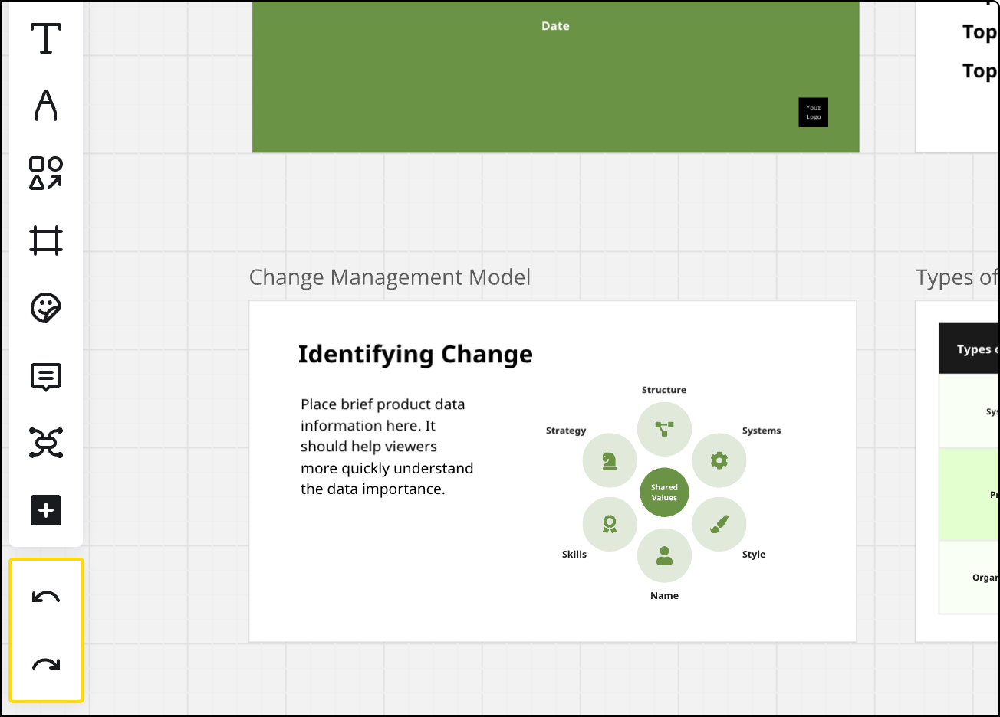

Przypadkowo usunięto lub przeniesiono widżet na tablicy? Nie martw się, ponieważ możesz łatwo cofnąć tę akcję.

## Opcje cofania i przywracania

**Cofnij** i **Przywróć** są dostępne na pasku narzędzi tworzenia. Możesz cofnąć i przywrócić *do 30 akcji* w Miro podczas bieżącej sesji. Jeśli odświeżysz stronę lub ponownie otworzysz swoją tablicę, polecenia **cofnąć** i **przywrócić** *będą niedostępne*.

:::tip
Jeśli potrzebujesz przywrócić przypadkowo usunięte treści, [sprawdź ten przewodnik](../working-on-the-board/18-restoring-board-content.md).
:::

*Opcje cofania/przywracania na tablicy Miro*

Aby **cofnąć** swoje poprzednie działania, naciskaj **Ctrl + Z** (*dla Windows*)/**Cmd** + **Z** (*dla Mac*), aż dojdziesz do działania, które chcesz cofnąć. Jeśli wolisz nawigację myszą od skrótów klawiaturowych, kliknij przycisk **cofnąć** ().

Aby **przywrócić** akcję, którą cofnąłeś, naciśnij **Ctrl + Shift + Z** (*dla Windows*)/**Cmd** + **Shift** + **Z** (*dla Mac*) lub kliknij przycisk **przywróć** ().

Oba przyciski **przywrócić** i **cofnąć** zostają aktywowane dopiero po wykonaniu co najmniej jednej akcji na tablicy. Możesz cofnąć/przywrócić tylko swoje działania, a nie działania współpracowników.

## FAQ

**Jak cofnąć usunięcie całej tablicy?**

Instrukcje znajdują się tutaj: [Jak przywrócić usuniętą tablicę](../managing-boards/08-how-to-restore-a-deleted-board.md).

**Czy mogę cofnąć usunięcie zawartości na mojej tablicy?**

Tak, [dowiedz się tutaj jak](../working-on-the-board/18-restoring-board-content.md).

**Czy mogę cofnąć zmiany wprowadzone przez innych edytujących tablicę?**

Nie, możesz cofnąć tylko swoje działania.

**Przyciski Cofnij/Przywróć nie są aktywne. Dlaczego?**

Pamiętaj, że przyciski zostaną aktywowane dopiero po wprowadzeniu zmian na tablicy w bieżącej sesji roboczej. Nie są aktywne, gdy rozpoczynasz nową sesję (na przykład, gdy przeładujesz stronę). Jeśli przyciski nie zostają aktywowane nawet po zmianie zawartości, zapoznaj się z naszym [przewodnikiem po rozwiązywaniu problemów](../tools/troubleshooting/07-how-to-troubleshoot-and-report-a-bug.md). Zwróć uwagę, że paski narzędzi mogą znikać na iPadzie - [dowiedz się więcej](../../getting-started/apps-for-devices/11-tablet-app.md).
