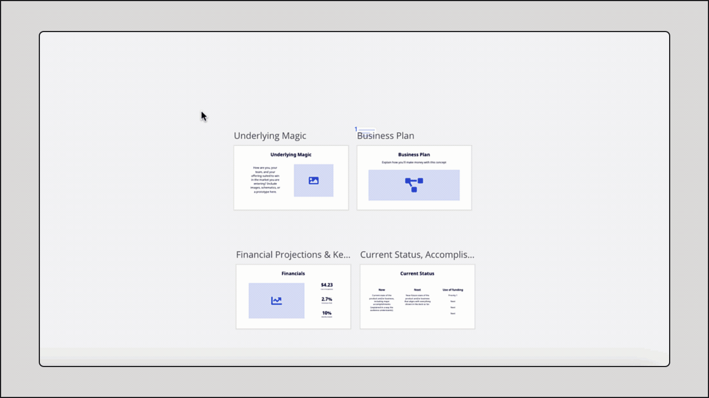
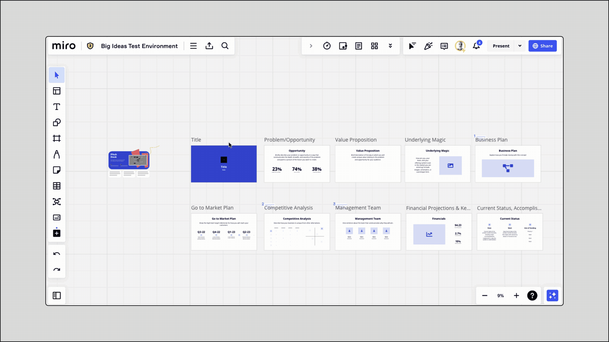

Przekształcaj z łatwością tablice Miro w obrazy i pliki PDF lub CSV, idealne do udostępniania współpracownikom i klientom lub do zapisania w dokumentacji.

> 🚀  Zapewnij swojej pracy publiczność, na jaką zasługuje. [Publikuj w Miroverse](https://miro.com/miroverse/submission/?backToUrl=/) dla ponad 60 milionów użytkowników.

*Menu eksportowania*

## Opcje eksportowania zależą od wersji, przeglądarki i urządzenia

Niektóre opcje eksportowania mogą nie być dostępne w zależności od wersji Miro, przeglądarki i urządzenia. Pamiętaj, że eksportowanie jest dostępne tylko wtedy, gdy właściciel lub współwłaściciel tablicy **włączy tę opcję** dla osób współpracujących na tablicy w [ustawieniach zawartości tablicy](../../sharing-boards/14-how-to-allow-or-restrict-copying-and-exporting-boards-and-content.md).

|  |  |  |  |  |  |
| --- | --- | --- | --- | --- | --- |
|  | Wersja Free | | Wersje Starter, Business, Enterprise, Education | | Eksportowanie do pliku CSV (wszystkie wersje) |
|  | Niska rozdzielczość | Wysoka rozdzielczość bez znaku wodnego | Niska  rozdzielczość | Wysoka rozdzielczość bez znaku wodnego |
| Google Chrome | ✔ | ✘ | ✔ | ✔ | ✔ |
| Safari | ✔ | ✘ | ✔ | ✔ | ✔ |
| Firefox | ✔ | ✘ | ✔ | ✔ | ✔ |
| Opera | ✔ | ✘ | ✔ | ✔ | ✘ |
| Edge <79 | ✘ | ✘ | ✘ | ✔ | ✘ |
| [Aplikacja komputerowa](../../../getting-started/apps-for-devices/05-desktop-app.md) | ✔ | ✘ | ✔ | ✔ | ✔ |
| Tablety | ✔ | ✘ | ✔ | ✔ | ✘ |
| Urządzenia mobilne | ✘ | ✘ | ✘ | ✘ | ✘ |

## Zapisz jako obraz

:::warning
Edge (od wersji 79) obsługuje tylko **eksportowanie wektorowe**. Wersja Free obsługuje eksportowanie tylko w małym rozmiarze. Użytkownicy wersji Free mogą eksportować tablice w przeglądarkach Chrome, Firefox, Opera, Safari, aplikacji komputerowej lub aplikacji na tablety.
:::

**Aby wyeksportować tablicę jako obraz JPG**:

1. Otwórz menu eksportowania w lewym górnym rogu tablicy.
2. Wybierz **Zapisz jako obraz**.
3. Wybierz obszar tablicy, który chcesz zapisać jako obraz.
4. Wybierz rozmiar obrazu. W zależności od wersji możesz eksportować tablicę w formacie **małym**, **średnim**, **dużym** lub **wektorowym**. Jakość wektorowa jest zapisywana jako plik PDF. Dzięki eksportowaniu wektorowemu możesz zachować jakość obrazu podczas eksportowania dużych tablic.
5. Kliknij **Eksportuj**.

*Zapisywanie części tablicy jako obrazu*

**Aby wyeksportować indywidualną ramkę jako obraz:**

1. Wybierz ramkę.
2. Kliknij memu z 3 kropkami w menu kontekstowym.
3. Wybierz **Eksportuj jako obraz**.
4. Wybierz rozmiar pliku i kliknij **Eksportuj**.

*Zapisywanie ramki jako obrazu*

**Aby** **wyeksportować całą tablicę jako obraz:**

1. Zaznacz wszystkie obiekty na tablicy za pomocą skrótu **Ctrl + A** (Windows) lub **⌘** + **A** (Mac).
2. Kliknij menu z 3 kropkami, aby utworzyć ramkę wokół nich.
3. Kliknij menu z 3 kropkami w menu kontekstowym ramki i wybierz **Eksportuj jako obraz**.

*
Tworzenie ramki wokół wybranych obiektów*

## Zapisz jako PDF

:::warning
Edge (od wersji 79) eksportuje tylko w **najlepszej jakości (wektorowej)**. Wersja Free obsługuje eksportowanie tylko w małym rozmiarze. Użytkownicy wersji Free mogą eksportować tablice w przeglądarkach Chrome, Firefox, Opera, Safari, aplikacji komputerowej lub aplikacji na tablety.
:::

Eksportuj [ramki](../../essential-tools/07-frames.md) jako plik PDF w jakości **małej** lub **najlepszej** (**wektorowej**).

**Aby wyeksportować tablicę jako plik PDF:**

1. Utwórz co najmniej jedną ramkę. Każda ramka będzie osobną stroną w zapisanym dokumencie PDF.
2. Aby sprawdzić, w jakiej kolejności ramki będą umieszczone w dokumencie PDF, otwórz podgląd tablicy w lewym dolnym rogu. Aby zmienić kolejność stron w wyeksportowanym pliku PDF, zmień kolejność ramek w panelu przez ich przeciągnięcie.
   
*Zmiana kolejności ramek*
3. Otwórz menu eksportowania w lewym górnym rogu tablicy.
4. Wybierz **Zapisz jako PDF**.
5. Wybierz rozmiar pliku: **Mały rozmiar pliku** lub **Najlepsza jakość**.
6. Kliknij **Eksportuj**.

*Zapisywanie tablicy jako pliku PDF*

Podczas eksportowania tablicy jako pliku PDF wszystkie ramki są eksportowane jako pojedynczy plik.

**Aby wyeksportować** **określone ramki jako plik PDF**:

1. Wybierz ramki, które chcesz eksportować, przytrzymując **Shift**. Możesz też przeciągnąć pole wyboru na treści, które chcesz wyeksportować > kliknij **Filtr** w menu kontekstowym > wybierz **Ramki**.
2. Kliknij menu z 3 kropkami w menu kontekstowym i wybierz **Eksportuj jako PDF**.

*Eksportowanie niektórych ramek jako pliku PDF*

**Aby** **wyeksportować całą tablicę jako jednostronicowy plik PDF:**

Wersje płatne, Education wersja Free

1. Zaznacz wszystkie obiekty na tablicy za pomocą skrótu **Ctrl + A** (Windows) lub **⌘** + **A** (Mac).
2. Kliknij menu z 3 kropkami w menu kontekstowym, aby utworzyć ramkę wokół nich.
3. Kliknij menu z 3 kropkami w menu kontekstowym ramki i wybierz **Eksportuj jako obraz**.
4. Wybierz jakość **wektorową**, kliknij **Eksportuj.
   
*Eksportowanie całej tablicy jako pliku PDF***

Jeśli **nie masz ramek** na swojej tablicy:

1. Zaznacz wszystkie obiekty na tablicy za pomocą skrótu **Ctrl + A** (Windows) lub **⌘** + **A** (Mac).
2. Kliknij menu z 3 kropkami w menu kontekstowym, aby utworzyć ramkę wokół nich.
3. Otwórz menu eksportowania w lewym górnym rogu tablicy, wybierz **Zapisz jako PDF**.
4. Kliknij **Eksportuj**.

*Eksportowanie całej tablicy jako pliku PDF w wersji Free jeśli tablica nie ma innych ramek*

Jeśli już **masz ramki** na swojej tablicy*:*

1. Zaznacz wszystkie obiekty na tablicy za pomocą skrótu **Ctrl + A** (*Windows*) lub **⌘ + A** (*Mac*) lub przeciągając pole wyboru.
2. W menu kontekstowym kliknij **Filtr** i wybierz **Ramki**.
3. Usuń ramki (ale zachowaj treści).
4. Zaznacz wszystkie obiekty na tablicy za pomocą skrótu **Ctrl + A** (*Windows*) lub **⌘ + A** (*Mac*) lub przeciągając pole wyboru.
5. Otwórz menu eksportowania w lewym górnym rogu tablicy, wybierz **Zapisz jako PDF**.
6. Kliknij **Eksportuj**.
7. Cofnij tworzenie ramki i usunięcie ramek, klikając dwukrotnie przycisk **cofnij** pod paskiem narzędzi po lewej stronie.

***Eksportowanie tablicy jako pliku PDF w wersji Free*

:::note
Eksportowanie ramek z dużą liczbą obiektów może spowodować zakłócenie procesu eksportowania (np. może brakować części tekstu w eksportowanych plikach PDF). Aby uzyskać optymalną wydajność, zalecamy podzielenie dużych tablic na kilka mniejszych i eksportowanie każdej tablicy osobno*.* Zobacz sekcję [Problemy z eksportowaniem tablicy](../../tools/troubleshooting/03-board-export-issues.md), aby uzyskać więcej wskazówek na temat optymalizacji eksportowania tablic.
:::

## Eksportuj do arkusza kalkulacyjnego (CSV)

> **Dostępność funkcji:** [przeglądarki Chrome, Safari i Firefox](../../troubleshooting-technical-questions/technical-guidelines/02-supported-browsers-browser-restrictions.md), [aplikacja komputerowa](../../../getting-started/apps-for-devices/05-desktop-app.md)

Tekst na tablicy (na karteczkach, w tabelach, kartach, polach tekstowych, kształtach) można wyeksportować do pliku CSV.

**Aby wyeksportować tekst jako plik CSV:**

1. Wybierz treść ramki lub tablicy. Możesz [wybrać zawartość tablicy](../../working-on-the-board/10-working-with-objects.md), przeciągając zaznaczony wybór lub przytrzymując **Shift**.
2. Kliknij memu z 3 kropkami w menu kontekstowym.
3. Wybierz **Eksportuj** **do pliku CSV**.
4. W rezultacie otrzymasz plik CSV z zawartością tablicy wstawioną do kolumny w następującej kolejności: tekst, [opis/URL karty](../../essential-tools/02-cards.md), tagi na karteczkach/kartach.

*Eksportowanie ramki do pliku CSV*

Możesz także wyeksportować całą tablicę do pliku CSV, wybierając opcję **Eksportuj do arkusza kalkulacyjnego (CSV)** na tablicy w menu **eksportowania**.

*Opcja eksportowania tablicy do arkusza kalkulacyjnego (CSV)*

## Miejsce zapisywania wyeksportowanych plików

Jeśli korzystasz z Miro w przeglądarce, pliki będą przechowywane w folderze, w którym są domyślnie zapisywane pliki pobrane z przeglądarki (skonfigurowane w ustawieniach przeglądarki).

Jeśli korzystasz z aplikacji komputerowej Miro, sprawdź folder Pobrane na swoim urządzeniu.

## Ograniczenia

- Eksportowanie tablicy Miro może być ograniczone dla użytkowników w [ustawieniach zawartości tablicy](../../sharing-boards/14-how-to-allow-or-restrict-copying-and-exporting-boards-and-content.md).
- Eksportowanie w wysokiej rozdzielczości bez znaku wodnego nie jest dostępne w wersji Free Miro.
- Edge (od wersji 79) obsługuje tylko eksportowanie wektorowe.
- Eksportowanie Miro do pliku CSV nie jest obsługiwane w przeglądarce Opera, Edge (<79), na tabletach i urządzeniach mobilnych.
- Eksportowanie tablic Miro nie jest obsługiwane w [zespołach programistów](https://miro.com/api/).
- Eksportowanie tablic Miro nie jest obsługiwane na urządzeniach mobilnych.
- Linki są klikalne tylko w plikach PDF wyeksportowanych w jakości **wektorowej**.
- Obrazy bitmapy na tablicy są kompresowane podczas przesyłania, natomiast obiekty utworzone w Miro (kształty, naklejki, tekst, linki itp.) zachowają swoją jakość.

## Drukowanie tablic

Aby wydrukować tablicę, wyeksportuj ją jako [obraz](#h_addbdd43-b51c-41ca-bfbb-ca328e5124ef) lub [plik PDF](#h_1feb9f36-ada2-4306-a03c-93deb1285044) zgodnie z instrukcjami powyżej i wydrukuj wyeksportowany dokument. Dowiedz się, [jak wydrukować tablicę Miro](04-how-to-print-your-board.md).

Dowiedz się więcej o innych opcjach eksportowania:

- [Zapisz tablicę jako szablon](../../../getting-started/start-here/your-first-board/02-custom-templates.md)
- [Pobierz kopię zapasową tablicy](05-how-to-save-board-backup.md)
- [Osadź tablicę](02-embed-a-miro-board.md)
- [Zapisz na Dysku Google](../../../integrations-apps/google/05-google-drive.md)
- [Dołącz do Jira](../../../integrations-apps/atlassian/02-miro-for-jira-cloud.md)

## Często zadawane pytania

*Nie widzę opcji eksportowania tablicy Miro. Dlaczego?*

Opcja eksportowania może być ograniczona w [ustawieniach zawartości tablicy](../../sharing-boards/14-how-to-allow-or-restrict-copying-and-exporting-boards-and-content.md) przez właściciela tablicy. Jeśli eksportowanie tablic jest dozwolone w ustawieniach zawartości tablicy, ale nadal brakuje niektórych opcji eksportowania, upewnij się, że Twoja wersja, urządzenie i przeglądarka obsługują eksportowanie tablic – sprawdź dostępność eksportowania.

*Jak zezwolić osobom współpracującym na mojej tablicy na eksportowanie tablicy?*

Sprawdź [ustawienia zawartości tablicy](../../sharing-boards/14-how-to-allow-or-restrict-copying-and-exporting-boards-and-content.md) i upewnij się, że opcja kopiowania tablicy jest dostępna dla uczestników tablicy. Może być również konieczne poproszenie administratora o [zezwolenie na kopiowanie zawartości tablicy użytkownikom spoza zespołu](../../sharing-boards/14-how-to-allow-or-restrict-copying-and-exporting-boards-and-content.md).

*Czy mogę eksportować tablicę w formatach PPT, PNG lub SVG?*

Nie, w tej chwili możesz zapisać swoje tablice jako pliki PDF, JPG lub CSV.

*Czy komentarze będą zawarte w wyeksportowanym dokumencie?*

Nie, ale mamy tę funkcję w naszym backlogu.

*Czy tytuły ramek będą wyświetlane w wyeksportowanym dokumencie?*

Nie, ale możesz zastąpić tytuły ramek [widżetami tekstowymi](../../essential-tools/16-text.md), które będą wyświetlone w dokumencie.

*Czy mogę wyeksportować wyniki głosowania?*

Nie, zrób zrzut ekranu.

*Czy podczas pracy na tablicy wszystkie zmiany są automatycznie zapisywane?*

Tak. Zalecamy również zapisywanie [kopii zapasowych](05-how-to-save-board-backup.md) i eksportowanie tablic, na wypadek gdyby treść została przypadkowo usunięta. Jeśli pracujesz na [tablicy internetowej](../../special-features/10-web-whiteboard.md) i nie masz profilu Miro, [zarejestruj się w Miro](../../../getting-started/start-here/02-how-to-register-with-miro.md), aby zapisać tablicę i kontynuować pracę nad nią po 24 godzinach.

*Jak wyeksportować pojedynczy element lub zestaw elementów?*

Możesz wybrać opcję **Zapisz jako obraz** na tablicy w Menu **eksportowania** i zaznaczyć interesujący Cię obszar. Innym sposobem jest [wybranie obiektu lub obiektów](../../working-on-the-board/10-working-with-objects.md), [utworzenie ramki wokół nich](../../essential-tools/07-frames.md) i jej wyeksportowanie.

*Czy mogę eksportować tablicę do pliku CSV za pomocą inteligentnych danych?*

W tej chwili eksport pliku CSV nie zachowuje struktury i relacji na tablicy. Jeśli jednak wyeksportujesz [tabele](../../advanced-tools/05-grid.md) jako plik CSV, struktura zostanie zapisana.

*Czy mogę eksportować pliki przesłane na tablicę?*

Tak, jeśli jest to dozwolone w [ustawieniach zawartości tablicy](../../sharing-boards/14-how-to-allow-or-restrict-copying-and-exporting-boards-and-content.md). Jeśli ta opcja nie jest ograniczona, wybierz plik i kliknij ikonę pobierania w menu kontekstowym.

:::note
Jeśli wystąpią problemy z eksportowaniem tablicy Miro, zapoznaj się z możliwymi rozwiązaniami w artykule [Problemy z eksportowaniem tablicy](../../tools/troubleshooting/03-board-export-issues.md).
:::
