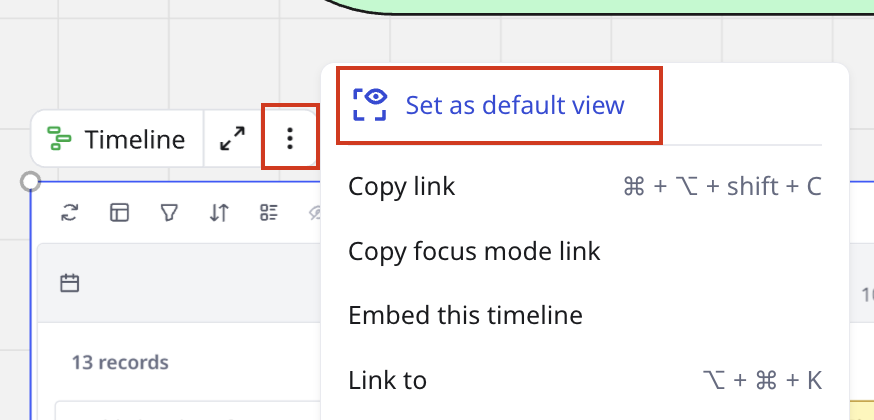

[Miroverse](https://miro.com/miroverse/) to biblioteka szablonów stworzona przez użytkowników Miro. Szablon to tablica Miro z gotowym frameworkiem, który można wykorzystać do powtarzalnych działań. Udostępniając swoje unikalne przepływy pracy, projekty i struktury w Miroverse, możesz inspirować innych i pomóc im szybciej rozpocząć pracę.

<iframe frameborder="0" height="315" src="https://www.youtube.com/embed/pcUqCCRp8q8?si=E6lRt8Iil2PbmA01" title="YouTube video player" width="560"></iframe>

:::note
Przed przesłaniem, odwiedź [wytyczne dotyczące treści w Miroverse](08-miroverse-publishing-checklist-and-guidelines.md), aby upewnić się, że Twoje zgłoszenie spełnia wszystkie kryteria publikacji.
:::

:::tip
Odwiedź [Creator Toolbox](https://miro.com/miroverse/creators/), aby uzyskać więcej wskazówek i zasobów dotyczących publikacji w Miroverse. Możesz także uzyskać dostęp do [społeczności Twórców](https://miro.com/miro-creators/) oraz wydarzeń.
:::

## Jak przesłać szablon

Aby opublikować swoją tablicę w [Miroverse](https://miro.com/miroverse/):

1. Przejdź do witryny [Miroverse](https://miro.com/miroverse/).
2. Zaloguj się przy użyciu zarejestrowanego profilu Miro.
3. Kliknij **Prześlij szablon** w prawym górnym rogu dowolnej strony Miroverse, aby otworzyć formularz zgłoszeniowy.
4. Jeśli nie masz jeszcze profilu Miroverse, musisz go utworzyć, aby przesłać szablon. Dodaj swoje zdjęcie, rolę, nazwę firmy i krótki biogram.
5. Kliknij **Zapisz i kontynuuj**.
6. Wybierz tablicę, którą chciałbyś przesłać jako szablon, używając rozwijanej listy, aby **Wybrać** **tablicę**. W rozwijanej liście pojawią się tylko tablice, które posiadasz.
7. Kliknij **Kontynuuj**.

:::note
Jeśli korzystasz z wersji Starter, Business, Enterprise lub Education, pamiętaj, aby [zezwolić każdemu, kto ma dostęp do tablicy, na kopiowanie zawartości tablicy](../sharing-boards/14-how-to-allow-or-restrict-copying-and-exporting-boards-and-content.md).
:::

8. Podaj **tytuł szablonu**. Publiczna nazwa twojego szablonu. Wybierz jasny i prosty tytuł, który wyraźnie opisuje jego cel.
9. Wybierz maksymalnie trzy odpowiednie **kategorie** dla swojego szablonu na podstawie jego przypadków użycia.
10. Wybierz główną **rolę** lub funkcję, jaką wspiera Twoja tablica (Inżynieria, Produkt itp.). Jeśli nie widzisz dokładnego dopasowania, wybierz to, które najlepiej pasuje.
11. Napisz **Opis** dla swojego szablonu. Uwzględnij sekcje, takie jak informacje o Twoim szablonie, jak go używać, dla kogo jest przeznaczony, a także wszelkie wskazówki czy najlepsze praktyki. Użyj paska narzędzi formatowania w polu opisu, aby dodać nagłówki sekcji (H1, H2), punkty, listy numerowane lub inne formatowanie, które ułatwia czytanie i nawigację po treści. Aby uzyskać więcej informacji, odwiedź [Jak napisać opis szablonu w Miroverse](10-tips-for-writing-a-miroverse-template-description.md).
12. Dodaj **obraz okładki**. Prześlij zrzut ekranu (maks. rozmiar 1080x480px) najbardziej atrakcyjnej części swojego szablonu.
13. (Opcjonalnie) Dodaj **wideo przewodnik**. Dodaj [Talktrack](../facilitation-tools/asynchronous-tools/02-talktrack-board-recordings.md), aby wizualnie wytłumaczyć i zademonstrować sposób użycia swojego szablonu za pomocą dźwięku i wideo. Możesz także dodać link do YouTube, Loom lub Wistia.*Dodanie szczegółów o szablonie*
14. (Opcjonalnie) Kliknij **Podgląd**, aby wyświetlić twój szablon przed przesłaniem go do recenzji.
15. Kliknij **Wyślij** po wypełnieniu formularza.

Zespół ds. przesyłania w Miroverse zweryfikuje Twój szablon, co zazwyczaj zajmuje do dwóch dni roboczych. Zespół albo opublikuje Twój szablon, jeśli spełnia [kryteria publikacji i wytyczne](08-miroverse-publishing-checklist-and-guidelines.md), albo odeśle Ci feedback, abyś mógł go dopracować do publikacji. Otrzymasz aktualizacje na adres e-mail powiązany z Twoim profilem Miroverse.

:::note
Jeśli masz jakiekolwiek pytania dotyczące procesu, skontaktuj się z zespołem Miroverse pod adresem [miroverse@miro.com](mailto:miroverse@miro.com) lub odpowiedz bezpośrednio na jeden z e-maili o statusie zgłoszenia.
:::

## Szablony formatując

Oprócz szablonu tablicy z wieloma elementami, możesz także przesyłać [szablony formatów](../formats/02-formats-focus-modes.md) z pojedynczym dokumentem, tabelą, osią czasu, diagramem lub slajdami. Te ukierunkowane, pojedyncze narzędzia są idealne dla zespołów do użycia jako bloki konstrukcyjne do większych ram, lub samodzielnie.

### Utwórz i prześlij swój format:

1. Tworzenie formatu w Miro.
   1. Otwórz swoją tablicę i kliknij ikonę **Narzędzia, media i integracje** (**+**) w pasku narzędzi.
   2. Wyszukaj i wybierz format, którego chcesz użyć: Dokument, tabelę, oś czasu, diagram lub slajdy.
   3. Kliknij w dowolnym miejscu na planszy, aby dodać Format.
   4. Dostosuj format, aby stworzyć swój szablon.
2. Ustaw tryb skupienia jako widok domyślny.
   1. Kliknij ikonę **menu z 3 kropkami** () w menu kontekstowym obok formatu.
   2. Wybierz **Ustaw jako domyślne wyświetlanie**.
      *Ustaw jako widok domyślny*
3. Aby udostępnić swój szablon społeczności, skorzystaj z [formularza zgłoszeniowego](https://miro.com/miroverse/submission/).

## Jak edytować, wyświetlić podgląd lub usunąć swoje szkice i szablony

Wszystkie zmiany w zgłoszeniu są automatycznie zapisywane w miarę wprowadzania. Aby opuścić formularz zgłoszeniowy, jeśli nie jesteś gotowy na przesłanie, kliknij po prostu **Wyjdź** lub **logo Miroverse** w lewym górnym rogu. Szablon pojawi się jako wersja robocza na Twoim profilu i będzie widoczny tylko dla Ciebie. Możesz uzyskać dostęp do przesłanych materiałów w dowolnym momencie z sekcji wersji roboczych w swoim profilu Miroverse.

Jeśli chcesz [edytować](05-how-to-edit-your-templates-on-miroverse.md), **podejrzeć** lub **usunąć wersję roboczą**:

1. Przejdź do swojego profilu Miroverse.
2. Kliknij ikonę **menu z 3 kropkami** (**...**) w prawym górnym rogu pola szablonu.
3. Wybierz działanie, które chcesz wykonać (**Edytuj**, **Podgląd** lub **Usuń**).

> Jeśli masz jakiekolwiek pytania dotyczące procesu, możesz skontaktować się z zespołem ds. zgłoszeń, odpowiadając na dowolny z e-maili dotyczących statusu zgłoszenia.

### Często zadawane pytania

**Jak dostosować podgląd mojego szablonu?**

Ustaw [widok początkowy](../sharing-boards/03-sharing-boards-and-inviting-collaborators.md) swojej tablicy przed przesłaniem jej w formularzu zgłoszeniowym. Aby dostosować podgląd po opublikowaniu, musisz przesłać nową tablicę z dostosowanym widokiem początkowym ustawionym w trybie edycji.

**Jak dodać Talktrack do mojego szablonu?**

Nagraj [nagranie](../facilitation-tools/asynchronous-tools/02-talktrack-board-recordings.md) na tablicy, którą chcesz zgłosić. Twoje Talktracki zostaną automatycznie dołączone do szablonu, a szablon będzie miał specjalny tag wskazujący, że zawiera Talktrack.

**Czy mogę usunąć tablicę po przesłaniu jej do Miroverse?**

Aby zapewnić, że tablice pozostaną dostępne dla wszystkich użytkowników po publikacji, tworzymy kopię Twojej tablicy, gdy naciśniesz przycisk "Prześlij". Możesz usunąć swoją wersję po przesłaniu do Miroverse, ale zalecamy usunięcie dopiero po pomyślnym opublikowaniu na wypadek konieczności wprowadzenia edycji.

**Jak mogę usunąć mój szablon z Miroverse?**

Aby usunąć opublikowany szablon z Miroverse, skontaktuj się z zespołem Miroverse pod adresem [miroverse@miro.com](mailto:miroverse@miro.com). Usunięcie szablonu nie wpłynie na kopie już wykonane na tablicy. Każda osoba, która utworzyła kopię Twojego szablonu przed jego usunięciem, może nadal uzyskiwać dostęp do swojej kopii i ją edytować.

**Co stało się z komentarzami do mojego szablonu?**

Po przesłaniu szablonu do Miroverse wszelkie powiązane komentarze zostaną usunięte, aby zapewnić świeże doświadczenie. Komentarze nie zostaną usunięte z tablicy szablonu, tylko z samego szablonu.

**Jak podejść do dostępności podczas tworzenia mojego szablonu?**

Miro dąży do tworzenia inkluzywnych doświadczeń dla wszystkich użytkowników. Miroverse, nasza przestrzeń napędzana przez społeczność, jest miejscem na szablony tworzone przez użytkowników. Twórcy zachowują prawa do posiadania i są odpowiedzialni za swoją treść, zapewniając zgodność z prawem i potrzebami odbiorców. Choć dostępność nie jest wymagana, zachęcamy do [projektowania inkluzywnego](../../getting-started/accessibility-in-miro/04-how-to-make-your-miro-boards-more-accessible.md) dla szerszej użyteczności.

Przesyłając do Miroverse, twórcy zgadzają się, że:

- Ich treści są publiczne i nie są regularnie monitorowane przez Miro.
- Miro nie ponosi odpowiedzialności za dostępność ani dokładność zgłoszeń.

Dowiedz się więcej o naszym podejściu do dostępności w ramach głównego produktu [tutaj](https://miro.com/accessibility/) oraz zapoznaj się z [szczegółowym przeglądem funkcji dostępności](../../getting-started/accessibility-in-miro/01-overview-of-miro-accessibility.md) w naszym Centrum pomocy.
