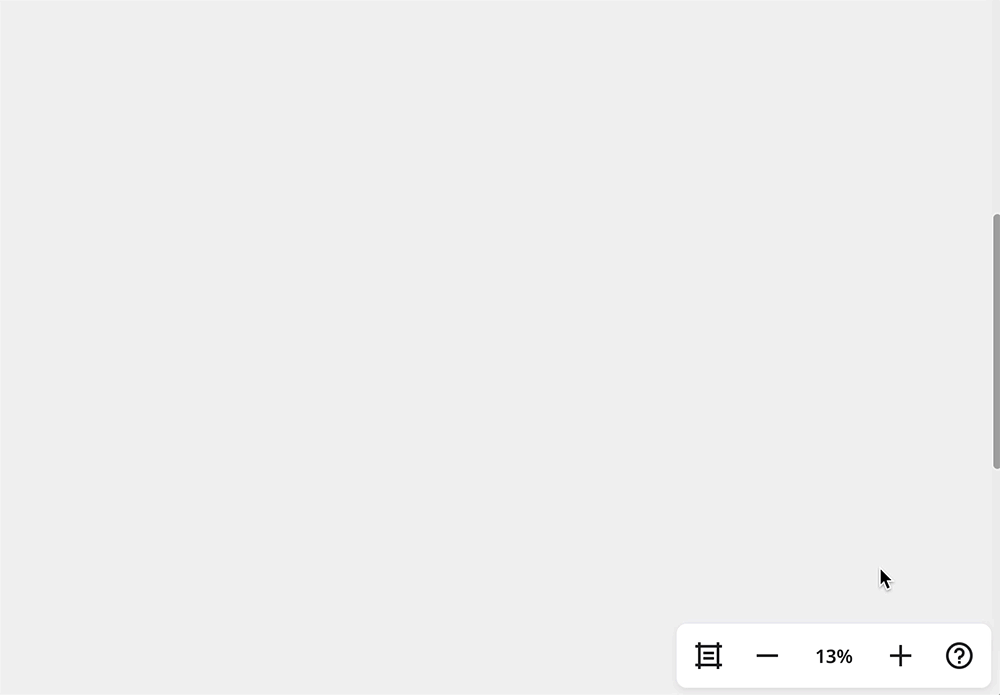

Oto, co zrobić, jeśli masz problem ze znalezieniem tablicy Miro lub jeśli niektóre treści na tablicy zniknęły.

:::tip
Aby zabezpieczyć swoją treść, pamiętaj o zapisywaniu [kopii zapasowych tablic](../../import-and-export/export/05-how-to-save-board-backup.md).
:::

## Tablica zniknęła

Jeśli przypadkowo usunąłeś tablicę Miro lub jedna z Twoich tablic zniknęła, istnieje kilka sposobów, aby ją znaleźć.

### Sprawdź swoje zespoły Miro i użyj wyszukiwania

Jeśli jesteś członkiem kilku zespołów Miro, spróbuj [przełączać się między zespołami](../../../getting-started/start-here/miro-dashboard/04-profile-and-teams.md) na pasku po lewej stronie swojego pulpitu. Następnie kliknij **Tablice w tym zespole**, aby zobaczyć wszystkie tablice w określonym zespole.

*Przełączanie się między zespołami Miro*

Możesz również użyć [wyszukiwania](../../../getting-started/start-here/miro-dashboard/03-how-to-search-in-miro.md), aby znaleźć tablicę.

Może być konieczne zastosowanie filtra Należy do dowolnej osoby, aby upewnić się, że wyświetlasz wszystkie tablice. Filtry mogą również pomóc Ci zawęzić wyszukiwanie do tablic, których jesteś właścicielem, oraz do tablic posiadanych przez innych.

*Filtrowanie tablic na pulpicie*

### Znajdź link do tablicy w historii przeglądarki lub skrzynce odbiorczej

Jeśli nadal nie możesz znaleźć tablicy, poszukaj linku do tablicy w historii przeglądarki lub w skrzynce odbiorczej. Dopóki jesteś właścicielem tablicy, możesz [przywrócić tablicę, otwierając link](../../managing-boards/08-how-to-restore-a-deleted-board.md). Tablice można przywrócić w ciągu 90 dni od momentu ich usunięcia.

### Sprawdź kosz

Jeśli jesteś użytkownikiem płatnego planu i nadal nie możesz zlokalizować swojej tablicy lub znaleźć URL, możesz spróbować [przywrócić tablicę z kosza](../../managing-boards/08-how-to-restore-a-deleted-board.md).

*Sekcja kosza na pulpicie Miro*

### Sprawdź swoje szablony niestandardowe

Jeśli tablica znajdowała się w płatnym lub zespole Education, sprawdź wszelkie [szablony niestandardowe](../../../getting-started/start-here/your-first-board/02-custom-templates.md) o podobnej nazwie - możliwe, że początkowo utworzyłeś szablon, a nie tablicę.

### Przejrzyj wszelkie zmiany w dostępie do tablicy

Możliwe, że zostałeś(aś) usunięty(a) z zespołu, w którym znajdowała się Twoja tablica, i straciłeś(aś) do niej dostęp. Podczas usuwania użytkownika, administrator może przydzielić jego tablice innym lub je usunąć. Jeśli tablica nie została usunięta, możesz użyć linku do tablicy i [poprosić aktualnego właściciela o dostęp](../../sharing-boards/01-board-access-rights.md). Jeśli tablica została usunięta, możesz poprosić administratora zespołu o [odzyskanie usuniętej tablicy](../../managing-boards/08-how-to-restore-a-deleted-board.md) w ciągu 90 dni.

## Brak zawartości tablicy

Jeśli część zawartości Twojej tablicy zaginęła, mamy kilka wskazówek, które pomogą Ci ją odnaleźć.

### Sprawdź historię zmian na tablicy

Otwórz tablicę i kliknij ikonę **Otwórz pasek boczny** w lewym dolnym rogu. Na podglądzie otwartej tablicy kliknij **ikonę Historia zmian na tablicy**. Jeśli zobaczysz brakującą zawartość, w większości przypadków możesz łatwo ją przywrócić, klikając ikonę przywracania. Jednak istnieją pewne [ograniczenia dotyczące przywracania zawartości](../../working-on-the-board/18-restoring-board-content.md).

:::tip
Użytkownicy na płatnych wersjach mogą również wypróbować [funkcję wersjonowania tablic](../../managing-boards/12-board-history-versions.md).
:::

*Przywracanie zawartości z historii zmian na tablicy*

### Sprawdź swoją tablicę na minimapie

Jeśli nie możesz znaleźć brakującej zawartości w historii zmian na tablicy, istnieje szansa, że zawartość jest nadal gdzieś na Twojej tablicy.

Spróbuj sprawdzić minimapę. Minimapa znajduje się w prawym dolnym rogu tablicy, dostępna za pośrednictwem menu powiększenia, i daje ogólny pogląd na twoją zawartość, dzięki czemu jeśli coś wyskoczyło z ramki, będziesz mógł(a) to tam dostrzec.

*Ogólny widok zawartości na Twojej tablicy można znaleźć na minimapie*
