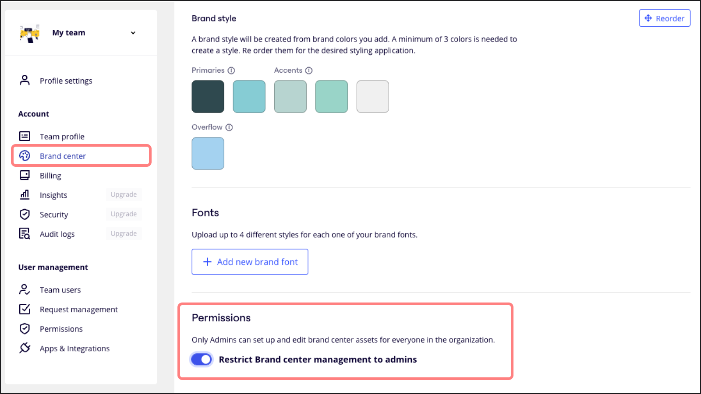
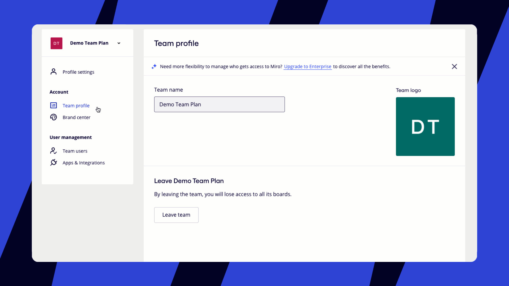
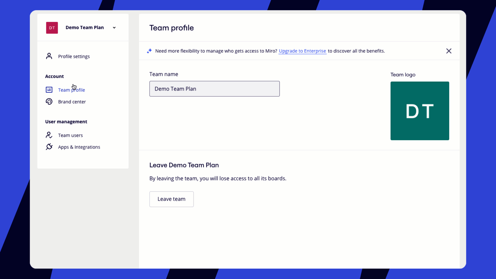
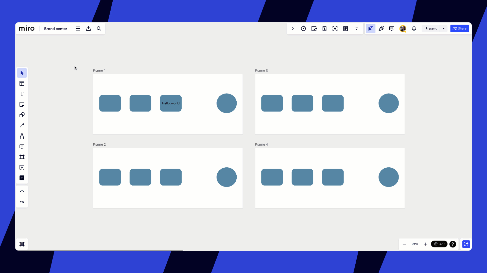
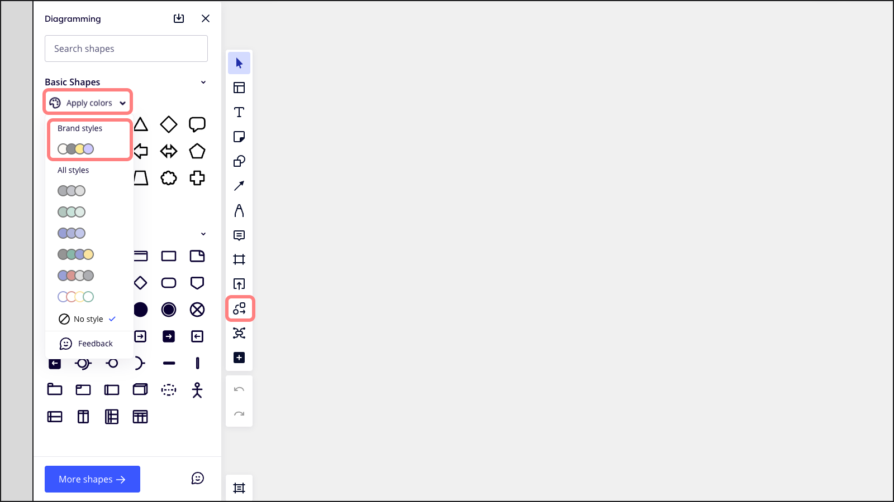

Faça upload das fontes e cores da sua marca para que você e seu time possam criar conteúdo da marca com facilidade. Garanta que cada board e apresentação mostrem a personalidade única da sua marca e impressione stakeholders e clientes com um visual sofisticado.

> **Disponível para:** planos Education, Starter, Business e Enterprise
> **Disponível em:** navegador para desktop, aplicativo para desktop
> **Quem pode fazer isso:** admins da empresa, admins do time, membros do time

## Como administrar a Central da marca

As fontes e cores adicionadas à Central da marca se aplicam a toda a sua organização. Isso inclui todos os times e boards do seu plano.

Todos os [visitantes,convidados e membros do time](../../using-miro/sharing-boards/10-visitors-guests-and-members.md) com acesso de edição podem aplicar as cores, as fontes e o estilo de sua marca aos boards.

:::note
No momento, não é possível personalizar fontes e cores para times individuais.
:::

### Como administrar as configurações da sua Central da marca

Controle quem pode fazer alterações na sua Central da marca. Os admins podem restringir o acesso à Central da marca para todos os membros do time que não sejam admins. Para fazer isso, basta ativar **Restringir o gerenciamento da Central da marca a admins** nas configurações da Central da marca. Essa opção é ativada por padrão para o plano Enterprise.

Quando esta opção estiver ativada:

- **Planos Business, Enterprise:** somente Admins da empresa podem gerenciar a Central da marca.
- **Planos Education, Starter:** somente admins do time podem gerenciar a Central da marca.

*A opção de restringir o gerenciamento da Central da marca a admins está ativada*

## Como carregar cores e fontes da marca

### Como carregar as cores da sua marca

**Diretrizes para fazer upload de cores**

- Você pode carregar de até 24 cores.
- No momento, somente HEX é compatível.
- Para estilos da marca, você deve carregar pelo menos 3 cores.

Admins da empresa, admins do time, membros do time

1. Clique na foto do perfil no canto superior direito do seu painel e clique em **Central da marca**; ou abra as configurações da sua **empresa** e, em **Conta**, clique em **Central da marca**.
2. O painel da central da marca será aberto.
3. Em **Cores**, há duas seções: **cores da marca** e **estilo da marca**.
4. Para adicionar as **cores da sua marca**, clique no ícone de adição (**+**) e insira o código **HEX** da cor e o **nome da cor**.
5. O **estilo da sua marca** é criado automaticamente a partir das cores da marca adicionadas.
6. Personalize o layout das **cores** e do **estilo da sua marca**. Clique em **Reordenar**, arraste e organize as cores da maneira que desejar e clique em **Concluído**.
7. Clique em uma cor para **editá-la** ou **excluí-la**.

*Como o Admin da empresa adiciona* *cores na Central da marca*

1. Clique na foto do perfil no canto superior direito do seu painel e clique em **Central da marca**; ou abra as configurações do seu **time** e, em **Conta**, clique em **Central da marca**.
2. O painel da central da marca será aberto.
3. Em **Cores**, há duas seções: **cores da marca** e **estilo da marca**.
4. Para adicionar as **cores da sua marca**, clique no ícone de adição (**+**) e insira o código **HEX** da cor e o **nome da cor**.
5. O **estilo da sua marca** é criado automaticamente a partir das cores da marca adicionadas.
6. Personalize o layout das **cores** e do **estilo da sua marca**. Clique em **Reordenar**, arraste e organize as cores da maneira que desejar e clique em **Concluído**.
7. Clique em uma cor para **editá-la** ou **excluí-la**.

> Como membro do time, você poderá gerenciar a Central da marca somente se o Admin da empresa tiver habilitado esta opção para você.

*Como um membro do time adiciona cores na Central da marca*

### Como carregar as fontes da sua marca

**Diretrizes para carregar fontes**

- Você pode carregar de até 10 fontes.
- Os arquivos de fontes compatíveis incluem oft, ttf, woff e woff2.
- As extensões dos arquivos devem estar em letras minúsculas. Por exemplo, "fontedamarca.ttf".
- O tamanho máximo do arquivo da fonte é de até 20 MB.
- É necessário carregar o arquivo da fonte normal.
- Faça upload somente das fontes que tiver autorização para usar.

Admins da empresa, admins do time, membros do time

1. Clique na foto do perfil no canto superior direito do seu painel e clique em  **Central da marca**; ou abra as configurações da **Empresa** e, em**Conta**, clique em**Central da marca**.
2. O painel da central da marca será aberto.
3. Role para baixo até **Fontes**.
4. Clique em **+ Adicionar fontes de marca**.
5. Clique em **Carregar** para adicionar o arquivo de fonte correspondente para cada **estilo de fonte**. Você poderá **visualizar** a fonte após o upload.
6. Clique em **Salvar fonte**.
7. Ao lado do nome da fonte, passe o mouse sobre o ícone de lápis para **editá-la** ou no ícone da lixeira para **excluí-la**.

*Como o Admin da empresa adiciona**fontes na Central da marca*

1. Clique na foto do perfil no canto superior direito do seu painel e clique em **Central da marca**; ou abra as configurações do seu **time** e, em  **Conta**, clique em  **Central da marca**.
2. O painel da central da marca será aberto.
3. Role para baixo até **Fontes**.
4. Clique em **+ Adicionar fontes de marca**.
5. Clique em **Carregar** para adicionar o arquivo de fonte correspondente para cada **estilo de fonte**. Você poderá **visualizar** a fonte após o upload.
6. Clique em **Salvar fonte**.
7. Ao lado do nome da fonte, passe o mouse sobre o ícone de lápis para **editá-la** ou no ícone da lixeira para **excluí-la**.

> Como membro do time, você poderá gerenciar a Central da marca somente se o Admin da empresa tiver habilitado esta opção para você.

*Como um membro do time adiciona fontes na Central da marca*

### Como definir uma fonte padrão

Mantenha a consistência visual no conteúdo da sua organização ao selecionar uma fonte padrão. Esta configuração se aplica a todos os boards e objetos, incluindo texto, formas, diagramas e grades.

1. Clique nos três pontos (**…**) ao lado da fonte que deseja definir como padrão.
2. Ative **Definir como padrão**.

## Como aplicar fontes e cores da sua marca

Depois de adicionar as cores e fontes da sua marca na Central da marca, você e seu time podem começar a aplicá-las aos boards.

### Como aplicar cores de marca a um objeto ou quadro

1. Selecione um quadro ou objeto no board.
2. O menu de contexto será aberto.
3. Clique no seletor de  **cores**.
4. As **cores da sua marca** aparecerão na parte superior do menu suspenso.
5. Selecione uma cor.

*Como aplicar uma cor da marca no board*

### Como aplicar fontes de marca a um objeto de texto

1. Clique duas vezes em qualquer objeto de texto no board.
2. O menu de contexto será aberto.
3. Clique no seletor de **fonte**.
4. As **fontes da sua marca** aparecerão na parte superior do menu suspenso.
5. Selecione uma fonte.

:::warning
Os arquivos de fonte não são incluídos na exportação de backups do board. Se você carregar o backup de um board para uma organização que não oferece suporte ao arquivo da fonte da marca, o texto será padronizado com a fonte Open Sans.
:::

*Como aplicar uma fonte de marca no board*

### Como aplicar o estilo da sua marca em quadros

1. Selecione um quadro ou vários quadros no board.
2. O menu de contexto será aberto.
3. Clique no ícone de **estilos**.
4. O painel de estilos será aberto.
5. Selecione um **estilo de marca**.
6. O estilo da marca será aplicado ao quadro e a todos os objetos dentro do quadro.

:::tip
Experimente aplicar diferentes versões do estilo da sua marca. Clique na paleta de cores do estilo da sua marca novamente para **embaralhar** as cores.
:::

*Como aplicar o estilo da marca a vários quadros*

### Como aplicar o estilo da sua marca às formas de diagramas

1. Acesse a [barra de ferramentas de criação](../../getting-started/start-here/your-first-board/05-toolbars.md) no lado esquerdo do seu board.
2. Clique no ícone **Mais aplicativos** (**+**) e procure "Formas de diagramas".
3. Inicie o aplicativo **Formas de diagramas**. O painel **Diagramas** será aberto.
4. Role para baixo para encontrar o pacote de formas que deseja usar para criar seu diagrama.
5. No menu suspenso **Aplicar cores**, selecione um **estilo de marca**.
6. O estilo de marca selecionado será aplicado às formas do diagrama.

*Como aplicar um estilo de marca a formas de diagrama*

:::note
Para garantir que nosso conteúdo seja acessível e inclusivo para todos, algumas cores da marca podem ser ajustadas. Estas mudanças estão alinhadas com os padrões de acessibilidade, pois priorizamos a usabilidade para oferecer uma experiência ideal para todos os usuários.
:::

## Perguntas frequentes

As fontes da minha marca são incluídas quando exporto meus boards?

Quando você exporta ou copia boards que usam fontes da marca, as fontes não são exportadas com o board. Se você mover boards que usam fontes de marca para uma organização que não tem a fonte carregada na Central da marca no momento da cópia, as fontes serão revertidas para Open Sans. Por esse motivo, as fontes da marca aparecem como Open Sans nos templates do Miroverse.

As fontes da marca estão disponíveis para pessoas fora da minha organização?

Sim. Depois que a Central da marca estiver configurada, qualquer pessoa com direitos de edição nos boards compartilhados pelo time poderá acessar e usar as cores e fontes da marca. Isso inclui [convidados](../../using-miro/sharing-boards/07-collaboration-with-guests.md) e [visitantes](../../using-miro/sharing-boards/08-collaboration-with-visitors.md) com acesso de edição. Essa é uma ótima opção para workshops e reuniões com pessoas que não fazem parte do seu time, pois não terão problemas com a fonte, o que geralmente acontece com ferramentas que precisam de fontes específicas instaladas em seu computador.
