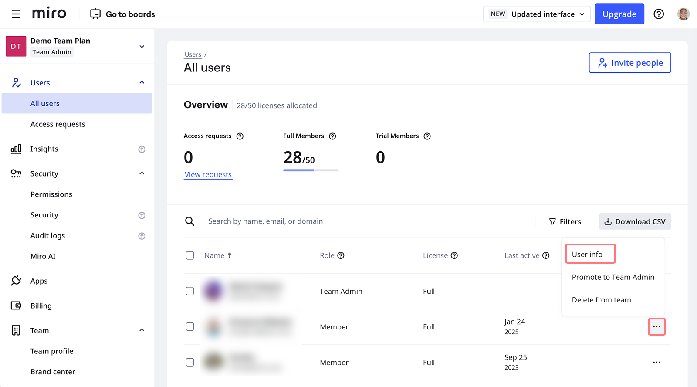
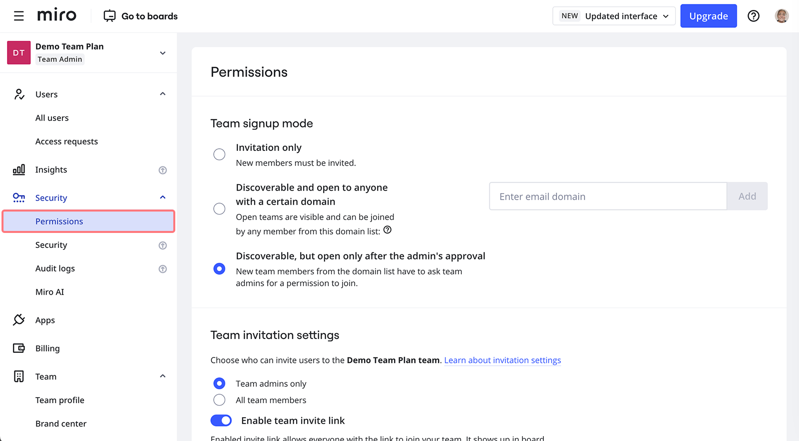
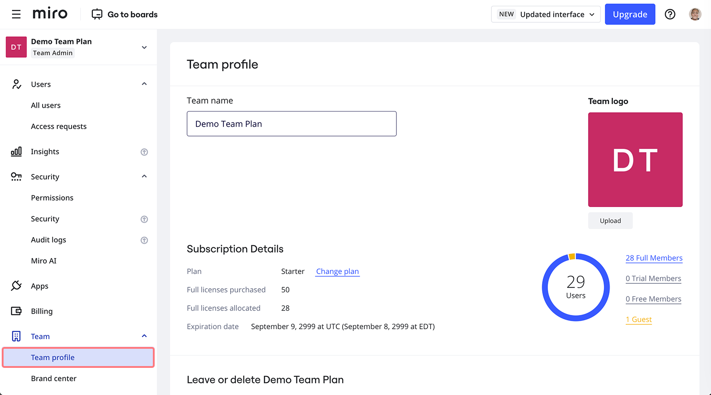

Ao [fazer upgrade sua time](../../plans-billing/manage-your-subscription-and-plan/03-upgrade-your-plan.md) para [o plano Starter](../../plans-billing/miro-plans/08-starter-plan.md) ou receber uma licença Education , você terá acesso a opções avançadas de gerenciamento admin , como compartilhamento de board e configurações de conteúdo. Saiba mais sobre esses e outros controles disponíveis para admins nos plano Starter ou Education .

:::note
Observe que o plano Education permite um admin por time. Você pode conceder direitos de admin a outro usuário ao [sair da sua time de Education](../../using-miro/managing-your-profile/06-how-to-leave-a-team.md).
:::

Clicar no avatar do seu perfil no canto superior direito do painel abre o menu suspenso de onde você pode acessar o **console do admin**.

### Usuários

Na aba **Todos os usuários** , você pode encontrar a lista de todos os membros do time e [convidados](../../using-miro/sharing-boards/07-collaboration-with-guests.md). Os membros da Team podem criar novos boards dentro da time e ter acesso [aos compartilhados pelo time](../../using-miro/sharing-boards/03-sharing-boards-and-inviting-collaborators.md) e [espaços](../../using-miro/spaces/01-spaces.md)compartilhados pela equipe. [Os Convidados](../../using-miro/sharing-boards/07-collaboration-with-guests.md) foram convidados como espectadores ou comentaristas para boards específicos da sua time , mas não podem criar novos conteúdos neles.

A opção de [convidar novos membros do time](../user-management/01-invite-users.md) está presente no canto superior direito da tela. [Para excluir um usuário da sua time](../user-management/08-remove-users.md), [conceder direitos de admin](../user-management/06-how-to-manage-admin-roles.md)ou promover um usuário convidado a membro um time , abra o menu clicando nos três pontos. Selecionar **Editar informações do usuário** abre o cartão de informações do usuário , onde você pode ver o número de boards, espaços e [templates](../../getting-started/start-here/your-first-board/02-custom-templates.md) que pertencem ao usuário.

*Abrindo um cartão de informações do usuário*

No plano Starter , você pode converter [membros de teste](../user-management/01-invite-users.md) em convidados nas configurações da Team . No plano Education , se você deseja converter um membro pleno em convidado, [exclua o usuário da time](../user-management/08-remove-users.md) e [convide-o a comentar ou visualizar alguns boards na time](../user-management/01-invite-users.md). O usuário aparecerá como convidado na sua lista de usuários.

No plano Starter , você também pode excluir usuários em massa.

Para baixar a lista de usuários da time no plano Starter , clique no botão **Baixar CSV** na parte superior da lista de Usuários.

### Segurança

A aba Permissões em Segurança permite que os admins configurem quatro tipos de configurações que definem o nível de acesso ao conteúdo armazenado na time:

- [Modo de inscrição em Team](../team-management/02-manage-team-signup-mode.md): torne sua time detectável por usuários dentro de seus domínios corporativos.
- [Configurações de convite de Team](../user-management/02-invitation-settings.md): permitir/restringir convites de novos membros por usuários não administradores.
- [Configurações de compartilhamento](../../using-miro/sharing-boards/11-default-sharing-settings.md): defina as configurações de acesso padrão para boards e espaços recém-criados.
- [Segurança de conteúdo](../../using-miro/sharing-boards/14-how-to-allow-or-restrict-copying-and-exporting-boards-and-content.md): defina quem pode copiar conteúdo nos boards do time.

*Permissões nos planos de Team e Education*

### Aplicativos

Instale ou desinstale aplicativos do painel Aplicativos. Para instalar um aplicativo, clique em **Adicionar aplicativos**e navegue ou pesquise o aplicativo que deseja instalar.

Para desinstalar um aplicativo, clique no nome do aplicativo na lista e depois clique em **Remover para a time**.

### Faturamento ( plano Starter )

As configurações de cobrança estão disponíveis tanto para admins do time quanto para [admins de cobrança](../admin-faq/01-admin-faq.md). A partir daqui, você pode alterar o tamanho da sua assinatura , seu plano e o tipo de cobrança, [cancelar sua assinatura](../../plans-billing/manage-your-subscription-and-plan/06-cancel-your-miro-subscription.md) , bem como [personalizar e baixar faturas](../../plans-billing/billing-and-payments/07-understanding-your-invoice.md). Encontre a visão geral das configurações de cobrança neste [artigo](../../plans-billing/manage-your-subscription-and-plan/01-manage-your-subscription.md).

### Team

No **perfil da Team,** você pode [alterar o nome e o logotipo da time ,](../team-management/04-update-team-name-or-logo.md) bem como [sair da time](../../using-miro/managing-your-profile/06-how-to-leave-a-team.md) ou [excluí-la](../team-management/06-delete-and-restore-teams.md). Os admins do plano Education podem ver detalhes do plano , como o número total de boards e licenças de time , enquanto os admins do plano Starter podem revisar os **detalhes da Assinatura**.

Os detalhes da Assinatura exibem informações sobre seu plano atual, o número de licenças (total e alocadas) e a data de expiração da sua assinatura . No lado direito, você pode ver o número de membros Plenos, [Teste](../user-management/01-invite-users.md), Free e [convidados](../../using-miro/sharing-boards/07-collaboration-with-guests.md).

*Perfil da Team no plano Starter*

Você também pode acessar o **Centro de marca** na aba Team , onde você pode definir as cores, fontes e estilo da marca.

### Perguntas frequentes

1. *Como posso criar uma nova time?*
   - Confira [este guia](../../getting-started/start-here/miro-dashboard/02-how-to-create-a-team-in-miro.md).
2. *Quantos admins podemos ter nos plano Team e Education ?*
   - O plano Starter permite quantos admins você desejar - saiba como você pode [promover um usuário a admin](../user-management/06-how-to-manage-admin-roles.md). O plano Education permite apenas um admin por time .
