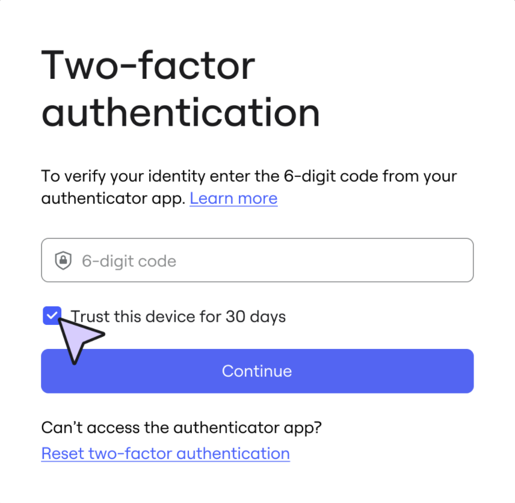

A autenticação em dois fatores (2FA) adiciona uma camada extra de segurança às contas online, exigindo que os usuários forneçam dois métodos exclusivos de verificação antes de acessar suas contas.

Admins da Miro podem habilitar a autenticação em dois fatores (2FA) para seus times e redefinir a 2FA para os membros do time. Os usuários têm a opção de confiar em um dispositivo por 30 dias.

:::note
Este artigo explica a autenticação em dois fatores para os planos Starter, Business e Education. Para saber mais sobre 2FA para Enterprise, veja [autenticação em dois fatores (2FA) (guia do admin).](../../enterprise-administration/security-integrations/two-factor-authentication-2fa/01-enterprise-two-factor-authentication-2fa-–-admin-guide.md)
:::

## Habilitar a autenticação em dois fatores

Para os planos Starter e Education, certifique-se de que você tenha a função de admin do time.

Para um plano Business, verifique se você tem a função de Admin da empresa.

Siga estas etapas:

1. No seu painel da Miro, clique no seu avatar no canto superior direito e selecione **Console de admin**.
2. (Starter) Vá para **Segurança** > **Permissões**.
   (Education) Vá para **Permissões**.
   Vá para **Segurança** > **Autenticação**.
3. Em **autenticação em dois fatores (2FA)**, altere para a posição ativada a opção **Exigir autenticação em dois fatores ao fazer login**.

## Configuração da autenticação em dois fatores (2FA) para usuários

Para times que têm a 2FA habilitada, os usuários devem se autenticar usando um aplicativo autenticador, além de seu e-mail e senha.

Para saber como configurar a autenticação em dois fatores (2FA) como usuário, consulte o [guia do usuário sobre autenticação de dois fatores (2FA)](02-two-factor-authentication-2fa-–-user-guide.md).

## Dispositivos confiáveis

Um usuário que faz login na Miro com autenticação em dois fatores pode optar por confiar em seu dispositivo.

Ao usar o dispositivo confiável para fazer login, será solicitado ao usuário apenas autenticar com o primeiro fator, pulando o segundo fator, porque o dispositivo é confiável.

*Dispositivo confiável para 2FA é habilitado por padrão.*

No login, **Confiar neste dispositivo por 30 dias** está selecionado por padrão, o que o usuário pode optar por desmarcar.

:::note
O período do dispositivo de confiança só pode ser modificado em um plano Enterprise. Para mais informações, consulte [Autenticação em dois fatores (2FA) (guia do admin)](../../enterprise-administration/security-integrations/two-factor-authentication-2fa/01-enterprise-two-factor-authentication-2fa-–-admin-guide.md).
:::

Para desconfiar de um dispositivo que foi confiado acidentalmente, o usuário pode se desconectar de todos os lugares. Vá para **Perfil**, em **Configurações de perfil**, clique em **Sair de qualquer lugar**.

## Redefinir a autenticação em dois fatores (2FA)

Se um usuário perder o acesso ao seu segundo fator, ele poderá solicitar que o admin redefina sua autenticação em dois fatores.

Para redefinir a autenticação em dois fatores para usuários nos planos Starter e Education, certifique-se de que você tem a função de admin do time.

Para redefinir a autenticação em dois fatores para usuários em um plano Business, certifique-se de ter a função de Admin da empresa.

Siga estas etapas:

1. No seu painel da Miro, clique no seu avatar no canto superior direito e selecione **Console de admin**.
2. Vá para **Usuários** > **Todos os usuários**.
3. Localize o usuário e, em seguida, selecione os três pontos (**...**) no final da linha.
4. Clique em **Redefinir a autenticação em dois fatores**.
   O usuário recebe instruções de redefinição por e-mail.
