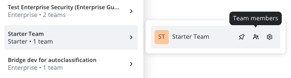

Aprenda como recuperar o controle do time caso seu admin da Miro tenha deixado a empresa.

## Acesse o perfil do administrador do Miro

Para recuperar o acesso e os direitos de admin à sua time Miro , o admin do time deve ter um endereço de e-mail ativo que você pode usar para alterar a senha e fazer login.

Somente admins podem promover outros usuários ao nível de admin . Recomendamos [recuperar a senha de um administrador](../../using-miro/managing-your-profile/05-how-to-change-your-password.md) e [promover um time para admin do time](06-how-to-manage-admin-roles.md). Este procedimento de segurança permite que a Miro proteja seu espaço Miro contra acesso não autorizado.

Se você não conseguir acessar o e-mail do administrador, entre em contato com seu provedor de Serviço de e-mail (ESP) ou com a time de TI para obter assistência. O Miro não pode ajudar você a recuperar o acesso ao e-mail em seu nome.

## Como promover um novo usuário para admin

Free, Starter, Business, Education

1. [Entre](https://miro.com/login/) no Miro com o e-mail do administrador e a senha atualizada.
2. Acesse a lista de membros da sua Team passando o mouse sobre o nome da sua time e clicando no ícone **Membros da Team** .
    *Ícone de membros da Team*
3. Na página **Todos os usuários**, clique nos três pontos na linha do usuário que você deseja promover a admin e, em seguida, clique em uma das seguintes opções: **Conceder admin do time****,** **promover para admin do time**, **promover para Admin da empresa****.**

O novo admin poderá administrar a time e [remover o admin anterior da time](08-remove-users.md).

1. [Entre](https://miro.com/login/) no Miro com o e-mail do administrador e a senha atualizada.
2. Acesse as configurações da sua Team passando o mouse sobre o nome da time e clicando no ícone **Configurações** **da Team** .
    *Ícone de configurações da Team*
3. Clique na time da qual você deseja remover um usuário.
4. No painel lateral, clique em **Usuários**e depois em **Todos os usuários**.
5. Clique nos três pontos na linha do usuário que você deseja promover a admin e, em seguida, clique em **Promover a Admin da empresa.**

O novo admin poderá administrar o plano e [remover o admin anterior](08-remove-users.md).

O plano Education permite apenas um admin por time. Você pode conceder direitos de admin a outro usuário ao sair da time.

1. [Entre](https://miro.com/login/) no Miro com o e-mail do administrador e a senha atualizada.
2. Acesse as configurações da sua Team passando o mouse sobre o nome da time e clicando no ícone **Configurações** **da Team** .
3. Na página **Perfil da Team** , clique em **Sair da time**.
   Uma caixa de diálogo é exibida.
4. Selecione um novo admin e saia da time.O novo admin poderá administrar a time e [remover o admin anterior da time](08-remove-users.md).

## Não consigo acessar o perfil do administrador do Miro

Se você não conseguir acessar o perfil do administrador do Miro , você pode [criar uma nova time](../../getting-started/start-here/miro-dashboard/02-how-to-create-a-team-in-miro.md). Você receberá então permissões de admin para uma nova time. Usando esse método, você pode [convidar novos colaboradores](01-invite-users.md) para essa nova time e [mover os boards](../../using-miro/managing-boards/04-how-to-move-a-board.md) , se necessário. O Miro não é responsável pela migração de boards ou usuários em seu nome.

Se você ainda não conseguir acessar o perfil do administrador do Miro e não conseguir criar uma nova time , [entre em contato com o Suporte do Miro](../../using-miro/tools/troubleshooting/06-contacting-miro-support.md) para fornecer detalhes. Investigaremos a time e solicitaremos confirmações e verificações adicionais para ajudar você.

Não podemos garantir a recuperação do acesso administrativo, pois devemos respeitar os processos legais e de segurança. 

Se você ou qualquer outro solicitante não puder atender a esses critérios, não poderemos prosseguir em seu nome.
