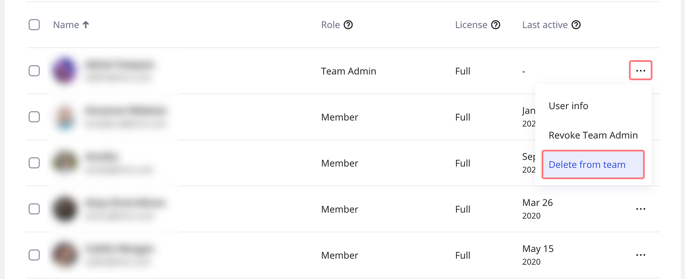
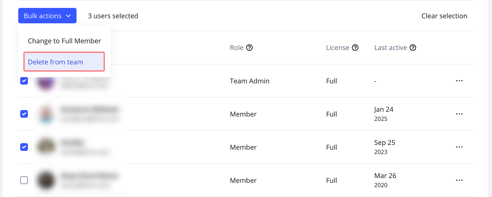

Ao remover um usuário, os admins restringem seu acesso ao conteúdo do time e podem assumir a titularidade do conteúdo do usuário ou excluí-lo.

> **Disponível para:** Free, Starter, Business, Education
> **Configurado por:** Admins de empresa, admins de time

### Como excluir usuários

Para excluir membros ou [Convidados](../../using-miro/sharing-boards/07-collaboration-with-guests.md) da sua time, acesse o **console do admin**. Para acessar o console pelo seu painel, clique no avatar do seu perfil no canto superior direito e depois no botão **Console do admin** .

Na aba**Usuários**> **Todos os usuários** , clique no ícone **de três pontos** (**...**) ao lado de um usuário e escolha**Excluir da time**.

> ✏️ Se você não vir a opção para excluir um usuário, confira as etapas abaixo.

*Excluir um time*

Se o usuário for titular de alguns boards, [Espaços](../../using-miro/spaces/01-spaces.md) ou [templates](../../getting-started/start-here/your-first-board/04-templates.md) criados neste time (compartilhado ou privado), você terá a escolha de passar a titularidade a um dos membros do time (nos planos Free e Education — para um dos admins) ou excluí-los. Clique no ícone da cruz se você quiser alterar a futura titularidade. Se você optar por excluir o usuário e o conteúdo, um admin ainda poderá [restaurar os boards](../../using-miro/managing-boards/08-how-to-restore-a-deleted-board.md) em 90 dias.

:::note
No plano Business, se você optar por transferir a titularidade para os admins do time, o conteúdo será automaticamente reatribuído a um dos admins.
:::

*Como alterar a titularidade do board ao remover um usuário*

Em planos pagos, você também pode excluir usuários em massa: selecione vários usuários e escolha **Excluir do time** em **Ações em massa**.

*Excluindo vários usuários em massa*

O usuário excluído perderá todo o acesso aos Espaços do seu time imediatamente (sem ser notificado). Observe que eles manterão o acesso aos boardsdo time que foram compartilhados por meio de um link público — se o usuário salvou os links para esses boards específicos.

Depois de remover os membros do time com sucesso, você verá uma notificação na parte superior com o número de licenças disponíveis. Você pode convidar novos membros do time ou acessar suas configurações de cobrança para reduzir o número de licenças em seu time.

Se você reduzir o tamanho do seu time, o valor pelo tempo não utilizado será lançado como crédito no saldo da assinatura. Para saber mais sobre o sistema de cobrança proporcional, consulte nosso artigo – [Cobrança e pagamentos](../../plans-billing/billing-and-payments/04-miro-billing.md).

### Como excluir usuários no plano Business

Para remover um usuário e liberar uma licença vaga, abra**Console de admin**> **Usuários** > seção**Todos os usuários**e escolha**Excluir**no menu do usuário. Defina se irá transferir a titularidade do conteúdo do usuário ou remover todas as fontes do usuário e clique em Confirmar. Se você optar por transferir o conteúdo do usuário, ele será reencaminhado para admins dos times onde o conteúdo está localizado.

Se você removeu usuários com uma [licença completa](../../enterprise-administration/user-management/11-user-access-levels-on-enterprise-plan.md), verá uma notificação na parte superior com o número de licenças disponíveis. Se não planeja convidar membros com acesso total para assumir as licenças disponíveis, você pode diminuir o tamanho do seu time nas **Configurações de cobrança** > **alterar tamanho do time**.

:::note
Se você vir uma notificação **O time deve ter pelo menos um admin** ao tentar excluir um usuário, isso significa que o usuário é o único admin em um ou mais times da assinatura. Para corrigir isso, você pode [se convidar para esses times](01-invite-users.md) e [conceder direitos de admin da equipe a si mesmo](06-how-to-manage-admin-roles.md). Сlique no número de equipes do respectivo usuário para saber de quais times eles são membros.
:::

### Perguntas frequentes

1. *Não tenho a opção de excluir usuários. Por quê?*
   - Observe que a opção de remover membros está disponível apenas para admins. Se você não vir a opção nas configurações, peça ao admin para excluir os usuários. Você pode encontrar o e-mail do admin atual na lista de **Usuários ativos**. Você também pode pedir ao usuário para [promovê-lo a admin](06-how-to-manage-admin-roles.md).
2. *Nosso admin da Miro deixou a empresa. Como posso removê-lo?*
   - Confira o artigo: [Meu admin da Miro deixou a empresa](07-my-miro-admin-left-the-company.md).
3. *Como posso remover licenças vagas?
   - Se você tiver licenças disponíveis que deseja excluir, siga [este guia](../../plans-billing/billing-and-payments/04-miro-billing.md).*
