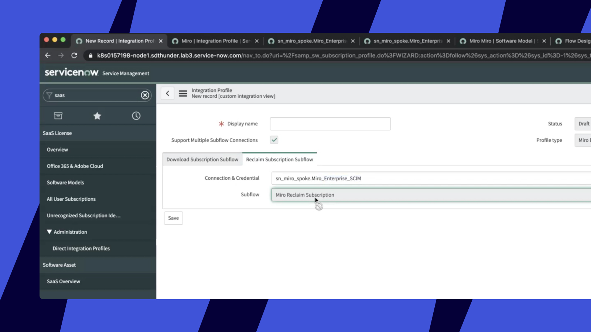

Analise e personalize o uso da sua assinatura em escala com a ajuda da integração do ServiceNow e Miro . A integração permite obter a lista de usuários não ativos e desativá-los do aplicativo de gerenciamento de ativos.

> **Disponível para:** [Plano Enterprise](../../../plans-billing/miro-plans/04-enterprise-plan.md)
> **Configurado por:** Admins da empresa

## Funcionalidades compatíveis

A integração dá acesso aos seguintes recursos:

- **Baixar assinaturas**
  - Obtenha uma lista do uso da assinatura do usuário e o número de licenças alocadas na sua assinatura do Miro Enterprise .
- **Reivindicar assinaturas**
  - Desative usuários no seu plano Miro Enterprise com base no uso da assinatura .

## Etapas de configuração

### Integração

1. No ServiceNow, vá para o módulo **Licença SaaS** e selecione a opção **Perfis de integração Direta** e clique em **Novo**:

   
   *Módulo de licença SaaS*

   > ✏️ Caso o módulo **de licença Saas** não esteja presente na sua instância do ServiceNow, você precisará instalá-lo seguindo estas [etapas](https://docs.servicenow.com/bundle/quebec-it-asset-management/page/product/software-asset-management2/task/request-saas-license-management.html "https://docs.servicenow.com/bundle/quebec-it-asset-management/page/product/software-asset-management2/task/request-saas-license-management.html").
2. Pesquisar por **Perfil de integração do Miro Enterprise**:

   
   *Perfil de integração do Miro Enterprise*
3. Você verá dois subfluxos predefinidos para **Baixar Assinaturas** e **Recuperar Assinaturas:**
   **
   *Baixar Subflow de Assinatura*

   **
   *Reivindicar subfluxo de Assinatura*

### Como criar uma nova conexão

1. Para criar uma nova conexão, vá para **Credenciais e conexões**>**Aliases de conexão e credenciais** e clique em **Novo**.
   
   *A opção de criar um novo Alias de Conexão e Credencial*

 Clique no link **Criar nova conexão e credenciais** :

*Aliases de conexão e credenciais*

Para o subfluxo **Download de assinaturas** , você precisará fornecer **o ID do cliente** e **o Segredo do cliente**.

*Criar conexão e credencial*

2. Para obter o **ID do cliente** e **segredo do cliente,** no lado do Miro , vá para **Configurações > Configurações do perfil > Seus aplicativos** e selecione **Criar novo aplicativo.**

*Crie um novo aplicativo nas configurações do seu perfil*

3. Configure o **nome do aplicativo**, selecione um time e clique em **Criar aplicativo.** Observe que você precisa ter uma [time de desenvolvedores](../../managing-apps-on-enterprise-plan/04-enterprise-developer-teams.md).

4. Na página do aplicativo, na seção **Permissões** , você precisará marcar a opção **organizations:read** e clicar em **Instalar aplicativo e obter token OAuth.**

5. Selecione um time que faça parte da sua organização Enterprise e instale o aplicativo.

6. Copie o **ID do cliente** e **segredo do cliente**.

Para o subfluxo **Recuperar Assinaturas,** você precisará fornecer um token **de API SCIM** . Para obter um token de API SCIM, no Miro acesse o console de admin e vá para **Aplicativos e integrações** > **Integrações Enterprise** > **Provisionamento SCIM** e copie o token em **Token de API**.

## Personalização do uso da Assinatura

Por padrão, **limite da última atividade** está definido para 60 dias. Para alterá-lo, navegue até **Regras de recuperação** e selecione a regra Miro , então você pode modificar o último limite de atividade da seguinte forma:

*Último limite de atividade*

## Possíveis problemas e como resolvê-los

Ao tentar instalar o aplicativo para um time, você vê a mensagem de erro "Não foi possível instalar este aplicativo. Você não pode instalar este aplicativo. Seus escopos indisponível no seu plano atual".
- Esse é o comportamento esperado ao instalar o aplicativo em uma time de desenvolvimento, pois a time de desenvolvimento não tem acesso aos escopos de nível organizacional. Você vai querer instalar o aplicativo em uma das suas times Enterprise onde ele tenha acesso aos escopos da organização para a integração do ServiceNow.

*O erro ao instalar o aplicativo para uma time de desenvolvimento*
