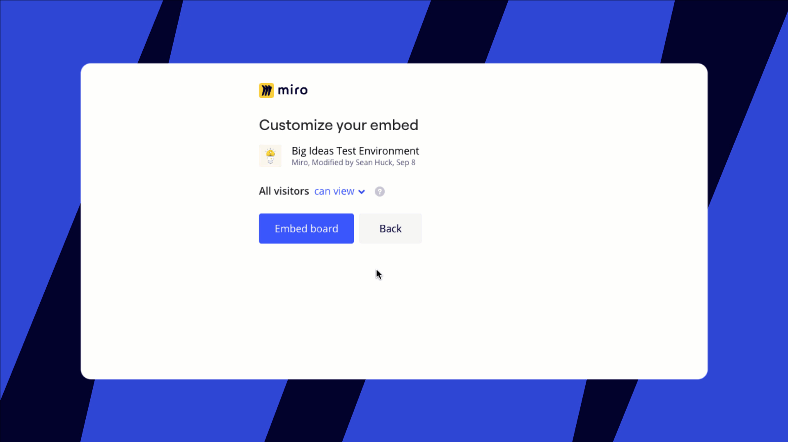
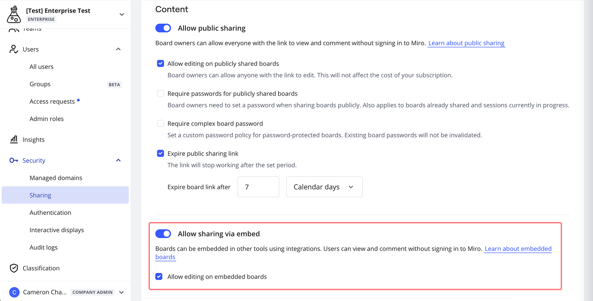

O Miro tem várias integrações que permitem aos usuários compartilhar facilmente um board em aplicativos externos como [Zoom](../../integrations-apps/zoom/02-miro-app-for-zoom-user-guide.md), [Microsoft Teams](../../integrations-apps/microsoft/microsoft-teams/05-embed-miro-boards-in-microsoft-teams.md), [Jira](../../integrations-apps/atlassian/02-miro-for-jira-cloud.md), [Confluence](../../integrations-apps/atlassian/01-miro-for-confluence.md) e [outros](https://miro.com/marketplace/category/embed-miro/). Os admins Enterprise podem permitir ou restringir a incorporação de boards nos aplicativos suportados.

> **Relevante para:** [plano Enterprise](../../plans-billing/miro-plans/04-enterprise-plan.md)

### Incorporando boards da Miro em aplicativos suportados

Ao incorporar um board da Miro em um aplicativo compatível, você pode conceder acesso ao board aos usuários do aplicativo, mesmo que eles não tenham perfis Miro .

Compartilhar um board dentro de um aplicativo compatível não afeta suas configurações de compartilhamento no Miro . Saiba mais sobre [Acesso a boards incorporados em aplicativos suportados](../../integrations-apps/integrate-miro-with-other-apps/01-user-permissions-for-boards-embedded-in-third-party-apps.md).

*Incorporando uma board da Miro com acesso restrito*

### Como restringir ou permitir a incorporação de boards em aplicativos suportados

> **Quem pode fazer isso: Admins da empresa**

Os Admins da empresa no plano Enterprise podem configurar a capacidade de incorporar boards da Miro em aplicativos suportados**.** Com essa configuração ativada, os usuários podem incorporar seus boards da Miro mesmo que [o compartilhamento público esteja restrito em sua organização ou times](../canvas-25-admin-features/data-security/07-sharing-policy-on-enterprise-plan.md).

Para permitir ou restringir o compartilhamento com usuários não conectados em aplicativos suportados:

1. Vá para **Configurações****da organização** .
2. Em **Segurança**, clique em **Compartilhamento**.
3. Role para baixo até a seção Conteúdo e ative/desative **Permitir compartilhamento via incorporação**.

:::note
Saiba mais sobre o  [acesso a um board incorporado para usuários com licenças gratuitas limitadas](../enterprise-subscription-management/enterprise-licensing/04-free-restricted-license.md).
:::

*Permitindo compartilhamento via incorporação no plano Enterprise*

Se você desativar a configuração, as boards incorporadas anteriormente ficarão indisponíveis. Novos boards ainda podem ser incorporados, mas será necessário que cada visitante tenha acesso.

Os usuários têm uma visualizar completa de todos os aplicativos onde um board específico foi incorporado, com a capacidade de revogar o acesso a qualquer momento — tudo nas configurações de compartilhamento do board . Saiba mais sobre como [gerenciar e revogar acesso a boards incorporadas](../../integrations-apps/integrate-miro-with-other-apps/01-user-permissions-for-boards-embedded-in-third-party-apps.md).

### As boards incorporadas em aplicativos suportados podem ser protegidas por senha?

Nas configurações da empresa, os admins têm a opção de exigir senhas para os boards da Miro que são compartilhados por um link público.

Quando você [compartilha um board por meio de um link público com uma senha no lado do Miro](../../using-miro/sharing-boards/03-sharing-boards-and-inviting-collaborators.md), essas configurações não são refletidas nos boards incorporados em aplicativos suportados. A proteção por senha não é aplicada quando você incorpora uma board em [Microsoft Teams](../../integrations-apps/microsoft/microsoft-teams/05-embed-miro-boards-in-microsoft-teams.md), [Zoom](../../integrations-apps/zoom/02-miro-app-for-zoom-user-guide.md) ou outros aplicativos.

Em vez disso, garantimos que o acesso a uma board incorporada esteja disponível apenas no aplicativo compatível e não seja fornecido fora do aplicativo (por exemplo, em um navegador da web) — a menos que a board seja [compartilhada no lado do Miro](../../using-miro/sharing-boards/03-sharing-boards-and-inviting-collaborators.md).
