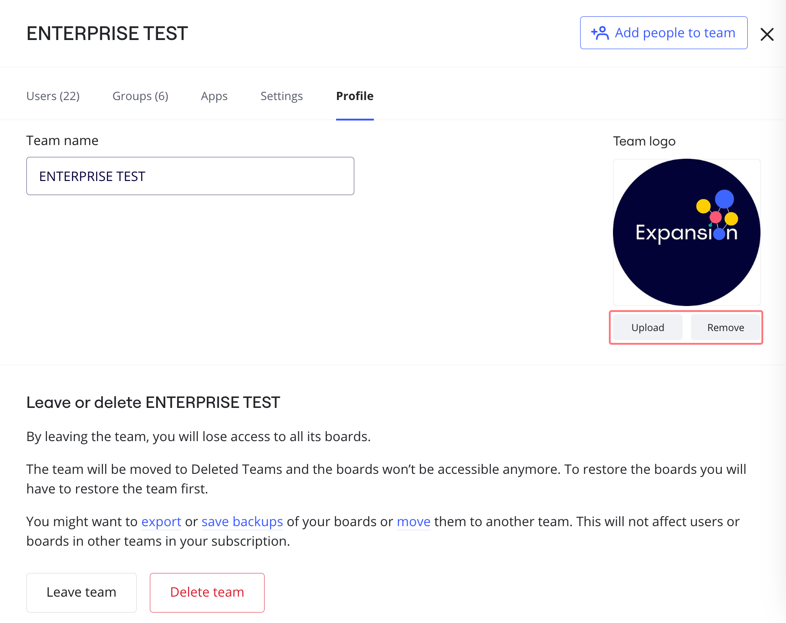
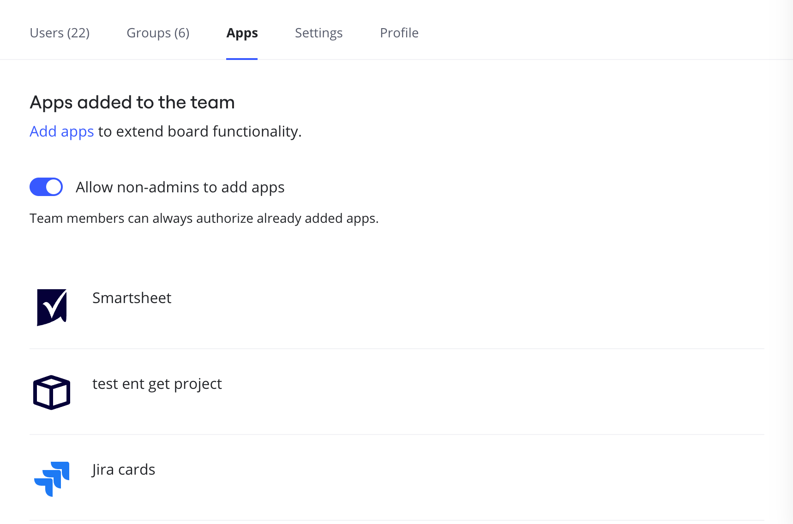
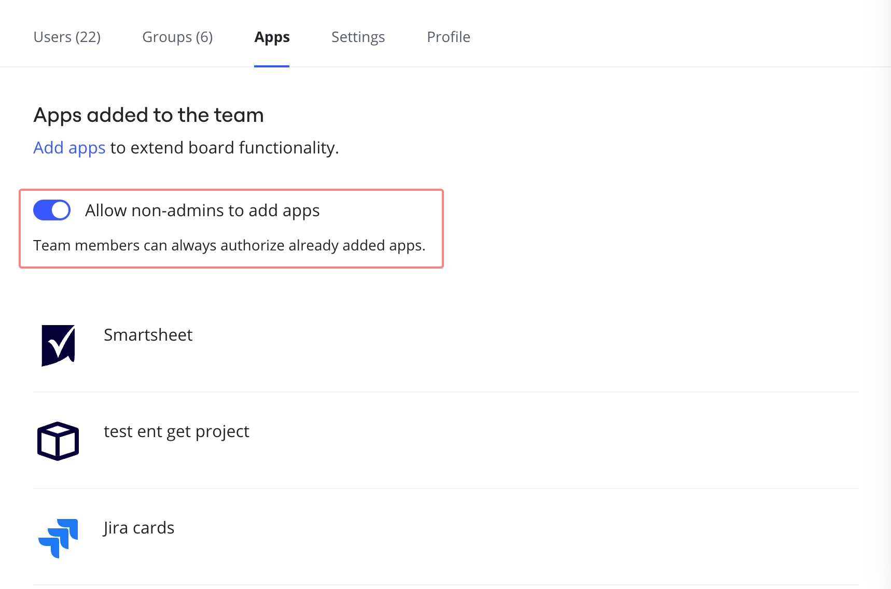
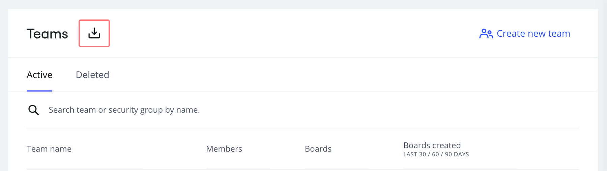

Um time na Miro é um espaço de trabalho compartilhado onde os usuários podem colaborar em boards e Espaços. Com o plano Enterprise, você pode criar diversos times adaptados a grupos ou objetivos específicos. Esse recurso permite uma colaboração perfeita entre equipes, já que os usuários da Miro podem ser membros de vários times.

Os Admins da empresa podem configurar cada time de acordo com suas necessidades, incluindo o gerenciamento de aplicativos e integrações do time, bem como permissões de usuário e privacidade do time.

:::tip
Na Admin Console, o ícone do time mostra quais configurações do time um admin do time pode alterar. Como Admin da empresa, vá para **Admin Console** > **Times** > **\{team name\}** > guia **Configurações** .

Ícone do time: 
:::

:::tip
Se você é novo na Miro, saiba mais sobre [configurações de time e empresa](../../administration/get-started-as-a-miro-admin/01-i-am-a-new-miro-admin.-where-to-start.md).
:::

## Configurações de gerenciamento de time

No Console de Admin, você pode gerenciar todos os times da sua organização na visualização **Times**.

Vá para o **Console de admin** > **Times**.

Clique em **Colunas** para expandir os dados mostrados para cada time. Você pode visualizar configurações como o número de boards criados recentemente e quais times estão ocultos.

Clique em **Filtros** para mostrar apenas os times que correspondem aos seus critérios. Por exemplo, você quer ver quais times permitem que qualquer pessoa no time convide novos membros.

*Adicione colunas e selecione filtros para gerenciar times na sua organização.*

:::tip
Use **Filtros** para realizar uma auditoria de segurança e gerenciar a conformidade de segurança para times.
:::

Selecione um time para abrir o painel de configurações do time. Você pode visualizar as seguintes guias de admin:

- **Usuários**
  Atualizar licenças e funções.
- **Aplicativos**
  Veja quais aplicativos estão habilitados para o time e, opcionalmente, remova-os.
- **Configurações**
  Especifique as configurações do time, como domínios permitidos, privacidade e segurança.
- **Perfil do time**
  Atualizar o nome e o logo do time, e opcionalmente excluir o time.

### Como editar um perfil de time

> **Quem pode fazer isso:** Admin da empresa, admin do time

#### **Alterar o nome do time**

No perfil do time, clique no campo **Nome do time** para editar o nome do time.

*Alterando o nome do time*

#### **Alterar o logotipo do time**

No perfil do time, clique **Carregar** para adicionar ou alterar o logotipo do time, ou clique **Remover** para excluir um logotipo existente.

*Alterando o logotipo do time*

#### **Excluir ou sair de um time**

No perfil do time, usuários e admins podem escolher sair do time. Admins da empresa e admins do time podem excluir o time.

*A opção de sair ou excluir um time*

## Configurações de gerenciamento de usuário do time

> **Quem pode fazer isso:** Admin da empresa, admin do time

Para ver a lista completa de usuários de um time, clique no nome do time. Você verá a função de cada usuário, o tipo de licença e o número de times em que estão.

### Gerenciamento de usuários em um time

Para abrir as configurações de gerenciamento de usuário, clique no ícone de **três pontos** (**...**) ao lado do usuário.

**Admins da empresa** podem editar as informações do usuário, alterar a licença do usuário para membro com acesso total ou gratuita limitada, conceder (ou revogar) permissões de admin do time e excluir o usuário do time.

Dependendo das [configurações de convite do time](../user-management/03-invitation-settings-on-enterprise-plan.md), **os admins do time** podem conceder (ou revogar) permissões de admin do time e excluir o usuário do time.

*Configurações de gerenciamento de usuário*

#### **Como promover um usuário para admin do time**

> **Quem pode fazer isso:** Admin da empresa, admin do time

1. Clique no ícone de **três pontos** (**...**) ao lado do nome de um usuário.
2. Clique em **Conceder direitos de admin do time**.

#### **Remover um usuário de um time**

> **Quem pode fazer isso:** Admin da empresa, admin do time

1. Clique no ícone de **três pontos** (**...**) ao lado do nome de um usuário.
2. Clique em **Excluir do time**.

### Editar informações do usuário

Ao clicar em **Editar informações do usuário**, um painel lateral será aberto. Dentro do painel, você verá uma visualização mais detalhada do perfil e da atividade de um usuário na Miro, incluindo quantos boards, Espaços e templates o usuário tem, e os nomes de seus times. Você pode editar esses detalhes dependendo das permissões de Admin do time ou Admin da empresa.

*Perfil do usuário com lista de times*

#### **Adicionar ou remover um usuário de um time**

Na caixa de diálogo **Editar informações do usuário**, clique em **+** para conceder acesso a um novo time ou clique em **x** ao lado de um time para remover o acesso. Você será solicitado a reatribuir os boards de titularidade do usuário a um novo titular.

## Como encontrar seu contato de cobrança

Se precisar encontrar o **contato de cobrança** do plano do seu time, pode fazer isso em **Configurações**.

1. Vá para **Configurações**.
2. Clique em **Perfil da Organização** e role até **Contatos Principais**.
3. Seu **contato de cobrança** será exibido (ou poderá ser selecionado) lá.

*O contato de cobrança é encontrado em Configurações > Perfil da organização*

## Configurar aplicativos para um time

> **Quem pode fazer isso:** Admin da empresa, admin do time

Os times podem precisar de acesso a aplicativos específicos para uma melhor colaboração. Talvez você também precise restringir o acesso a alguns aplicativos.

Acesse **Configurações** > **Aplicativos e integrações** > **Aplicativos** para ver todos os aplicativos atualmente aprovados para o time.

*Configurações de gerenciamento do aplicativo*

### Como remover o acesso do aplicativo para um time

Clique em um aplicativo. Você verá os detalhes do aplicativo. Clique em **Remover para o time** para remover o acesso ao aplicativo para todo o time.

*Removendo o acesso a um aplicativo para um time*

### Permitir ou restringir aplicativos para membros do time

Permita que os membros do time adicionem aplicativos aprovados do Marketplace da Miro. Ative **Permitir que não administradores adicionem aplicativos**.

:::tip
Os Admins da empresa podem adicionar e remover aplicativos e supervisionar solicitações de aplicativos em Configurações da empresa > Aplicativos. Saiba mais sobre o [Gerenciamento do aplicativo.](../managing-apps-on-enterprise-plan/02-app-management.md)
:::

*Como permitir que não admins adicionem aplicativos aprovados*

## Gerenciar permissões de time

> **Quem pode fazer isso:** Admin da empresa

Configure permissões para seus times, incluindo configurações de convite, permissões de compartilhamento para boards e Espaços, domínios permitidos e configurações de conteúdo do board.

Você também pode restringir a capacidade de mover boards de e para o time e habilitar ou desabilitar a função de cotitular do board para o time.

Saiba mais no artigo [Permissões de time no plano Enterprise](10-team-permissions-on-enterprise-plan.md).

## Ativar o modo de privacidade do time

> **Quem pode fazer isso:** Admin da empresa

Se precisar que os times dentro da sua organização permaneçam invisíveis uns para os outros, você pode ativar o Modo de privacidade do time.

Depois que a opção é habilitada, os membros da assinatura Enterprise não conseguem ver times dos quais não fazem parte, e a opção de [compartilhar boards com toda a empresa](../../using-miro/sharing-boards/03-sharing-boards-and-inviting-collaborators.md) é desabilitada.

Saiba mais sobre [managing team privacy and discovery on Enterprise Plan">como gerenciar a privacidade e a descoberta do time no plano Enterprise](11-manage-team-privacy-and-discovery-on-enterprise-plan.md).

## Exporte os detalhes do seu time

Para baixar uma lista de todos os times da sua assinatura Enterprise, vá para as **Configurações da empresa** > **Times** e clique no ícone **Baixar**.

*Baixando um arquivo CSV com dados de times*

O documento CSV incluirá:

- **Nome do time**
- **URL** para acessar as [configurações de permissões](07-team-management-on-enterprise-plan.md) de um time.
- [SCIM](../security-integrations/system-for-cross-domain-identity-management-scim/02-scim.md) **grupos de segurança** indicando um grupo IdP sincronizado com o time dentro da sua assinatura Enterprise.

As outras colunas (**WhoCanInvite, InviteExternalUsersEnabled, TeamCollaborationCoOwnerRoleEnabled**, etc.) estão relacionadas às [permissões do seu time](07-team-management-on-enterprise-plan.md). Você pode acessar rapidamente as configurações de **Permissões** de um time seguindo o link na segunda coluna e definir as configurações do time de acordo com seus padrões de segurança.
