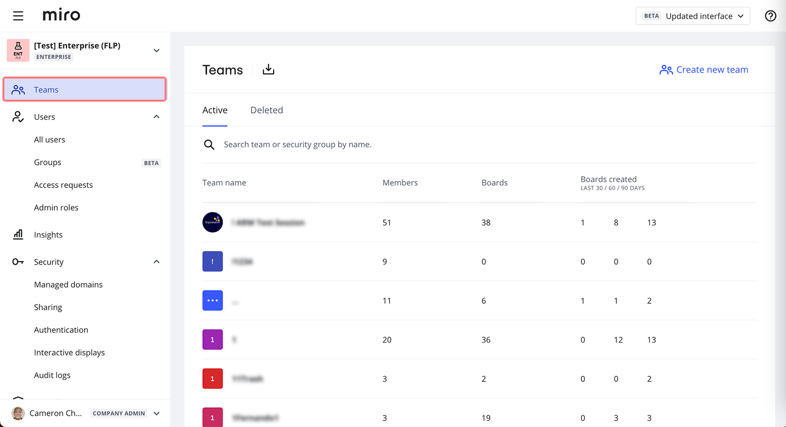
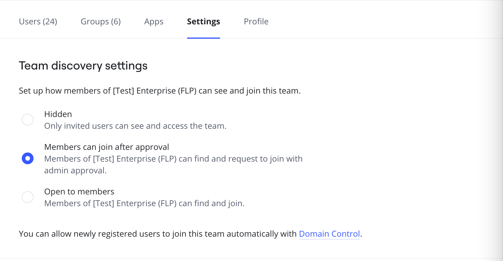
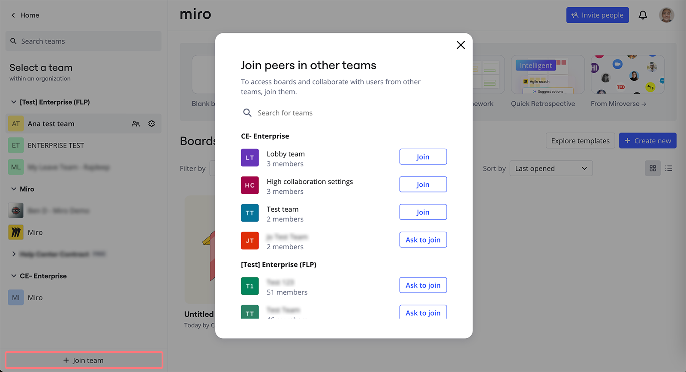
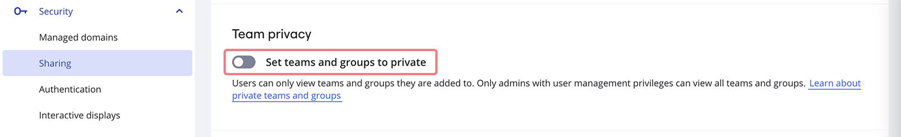

Trabalhar em uma grande organização geralmente significa que o conteúdo e os usuários são distribuídos entre várias times. Garanta que todos tenham acesso ao que precisam permitindo que os membros da sua assinatura vejam e participem de times relevantes.

### Visibilidade do time

**Descoberta da Team** é um time que controla como os membros da organização podem encontrar e ingressar na time. Para gerenciar as configurações de descoberta de um time, acesse **Configurações da empresa > Equipes** e clique na Team cujas configurações você deseja alterar. Em seguida, selecione a aba **Configurações** .

 *Lista de equipes nas configurações da empresa*

:::warning
A descoberta de Team pode ser configurada por Admins da empresa e admins do time, [se os admins do time tiverem permissão para convidar usuários para a time](../../administration/user-management/02-invitation-settings.md) (eles também receberão solicitações de usuário para ingressar na time).
:::

A descoberta da Team tem três estados:

- **Oculto** — a menos que os membros sejam convidados para a time, eles não podem encontrá-lo
- **Os membros podem aderir após aprovação** — a time fica visível e os membros podem solicitar a adesão
- **Aberto a membros** — a time é visível e os membros podem se juntar a ela imediatamente

Se um time tiver [restrições de lista de permissões de domínio](../canvas-25-admin-features/data-security/07-sharing-policy-on-enterprise-plan.md), somente usuários cujos domínios de e-mail estejam na lista de permissões da equipe poderão descobrir e solicitar a entrada na time. Essa configuração garante que a descoberta da time siga as restrições de domínio definidas no nível da time .

:::tip
Habilite nosso recurso Descoberta de Team junto com [o provisionamento Just-in-Time](../user-management/13-user-provisioning-on-enterprise-plan.md)), e a time padrão que você definiu para usuários recém-registrados também ficará visível para usuários existentes.
:::

*de descoberta de Team*

A descoberta de Team não afeta a maneira como os membros veem outros usuários na sua assinatura. Portanto, a menos que seja anulado pela privacidade da Team , os membros podem ver a lista completa de outros usuários nas configurações.

Os membros do seu plano Enterprise poderão encontrar times das quais podem participar abrindo o menu Equipes no canto superior esquerdo do painel e selecionando  **Junte-se à time**. Uma lista de times aparecerá com a opção de **Participar** ou **Pedir para Participar**, dependendo das configurações de segurança de cada equipe.

 *Lista de times detectáveis*

### Privacidade do time

**A privacidade da Team** é uma funcionalidade de nível empresarial que define a visibilidade de times e usuários. Ele pode ser encontrado em Configurações **da empresa** > **Segurança** > **Compartilhamento,** na seção **Privacidade da Team** .

*Configurações de privacidade da*

- Quando a privacidade da Team está desativada, os membros da assinatura podem ver a lista completa de usuários nas configurações e a lista de times detectáveis. É o status padrão para as assinaturas do plano Enterprise para garantir que todos os membros possam encontrar conteúdo relevante e colaborar com outros usuários para promover o compartilhamento de conhecimento, a transparência e reduzir a duplicação de trabalho.
- Quando ativada, a privacidade da Team permite que os membros da assinatura vejam apenas as times para as quais foram convidados e outros usuários dessas times . Ele pode ser usado ao trabalhar com clientes diferentes em times separadas para garantir que eles não aprendam uns sobre os outros. Com a privacidade da Team ativada, não é possível [compartilhe boards com toda a empresa em um clique](../../using-miro/sharing-boards/03-sharing-boards-and-inviting-collaborators.md).

### Privacidade da Team e descoberta da Team trabalhando juntas

A privacidade da Team tem uma prioridade maior do que a descoberta configurada no nível da time . Você verá uma notificação de que as configurações de descoberta de time não estão em vigor. Você ainda pode gerenciar suas opções, que entrarão em vigor quando a privacidade da Team for desativada.

:::note
As configurações de privacidade e descoberta da Team Team a experiência dos membros dentro da assinatura e não têm impacto sobre como um usuário pode [ingressar na assinatura em si](../user-management/13-user-provisioning-on-enterprise-plan.md).
:::
