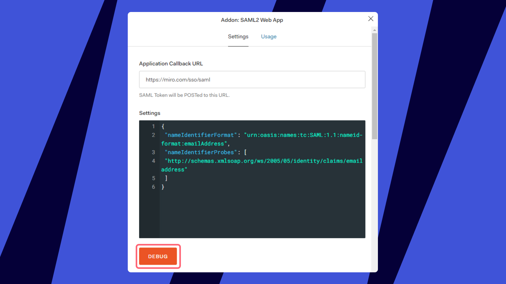

*É altamente recomendável configurar o recurso em uma janela separada do modo anônimo do seu navegador.* *Dessa forma, você mantém a sessão na janela padrão, permitindo que você desligue a autorização SSO caso algo esteja configurado incorretamente.*

Se você deseja configurar uma instância de teste antes de habilitar o SSO na produção, solicite-o ao seu executivo de conta ou representante de Vendas da Miro . Somente aqueles que configurarem o SSO serão adicionados a esta instância de teste.

## Criando o aplicativo Miro dentro do seu locatário

1. Crie o aplicativo na sua lista **de aplicativos** .
   
   *Seção de aplicativos Auth0*
2. Selecione o tipo de aplicativo **Aplicativos Web regulares** .
   
   *Lista de tipos de aplicação*
3. Vá até a aba **Configurações** e certifique-se de que as opções listadas estejam selecionadas exatamente como descrito abaixo.
   


   |  |  |
   | --- | --- |
   | **Método de autenticação de ponto final de token** | PUBLICAR |
   | **URLs de retorno de chamada permitidas** | https://miro.com/sso/saml |
   | **URI de login do aplicativo** | https://miro.com/sso/saml |
   | **Origens permitidas (CORS)** | https://miro.com/ |
   | **Expiração do JWT** | 36000 (Definido por padrão) |
4. Clique em **Mostrar configurações avançadas:**
   

   e então vá para **Certificados** e Copie seu Certificado de Assinatura x509:
   
   *Guia Configurações avançadas no Auth0*
5. Mude para o Miro e abra suas configurações de SSO ( admins do plano Business encontrarão as configurações na aba **Segurança** , admins do plano Enterprise precisarão ir para a aba **Integrações Enterprise** ) e então cole o **Certificado de Assinatura x509** no campo respectivo, conforme mostrado na captura de tela abaixo:
   
   *Guia **de segurança** do Miro com configurações SAML*

## Configurando SAML para o aplicativo

1. Volte para a página de configuração do aplicativo Auth0 e escolha a aba **Addons** e o addon **SAML2** :
   
   *Catálogo de complementos do Auth0*Você verá uma janela pop-up com as configurações da solicitação e **URL de retorno de chamada do aplicativo:
   ***Aba **Configurações** do Addon*
2. Certifique-se de que o **URL** esteja definido como **`https://miro.com/sso/saml`**As **configurações** da solicitação devem ser definidas como o seguinte:

   ```
    "nameIdentifierFormat": "urna:oasis:nomes:tc:SAML:1.1:formato-nameid:endereço-de-email",
    "nomeIdentificadorProbes": [
    "http://schemas.xmlsoap.org/ws/2005/05/identity/claims/emailaddress"
   ```
3. Mude as guias para **Uso**e copie o**URL de login do provedor de identidade:**mceclip2.png
   *Campo URL de login do provedor de identidade no Auth0*
4. Mude para o Miro novamente e cole a URL no campo**URL de iniciar sessão do SAML** .
5. Clique em **Salvar** para que as configurações sejam aplicadas ao seu plano Miro .

## Verificando a configuração

Agora você pode retornar ao console do Auth0 e retornar à aba **Configurações** do complemento. Clique em **Depurar** para acionar a tentativa de login.


*Acionando a tentativa de login*

Isso iniciará a tentativa de login do IdP e permitirá que você veja os resultados.

Em caso de dificuldades, sinta-se à gratuita para [entrar em contato com nossa Team de Suporte](../../../using-miro/tools/troubleshooting/06-contacting-miro-support.md).

## Testando a configuração do SSO no Miro

1. Conclua as etapas acima para configurar o SSO.
2. Clique no botão **Testar a configuração de SSO**.
3. Revise os resultados:

- Se não houver nenhum problema, uma mensagem de confirmação **de que o teste de configuração do SSO foi bem-sucedido** será exibida.
- Se forem encontrados problemas, uma mensagem de confirmação **de falha no teste de configuração do SSO** será exibida, seguida por mensagens de erro detalhadas para orientar você sobre o que precisa ser corrigido.


*Testando a configuração do SSO no Miro*
