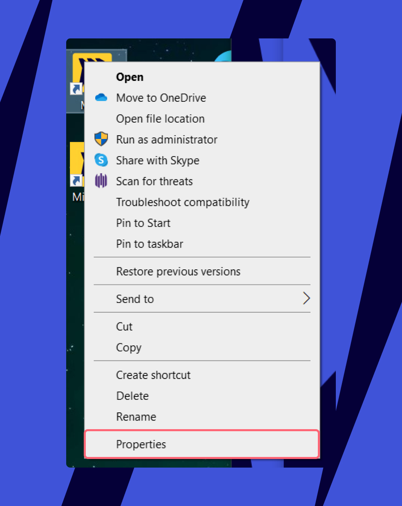

Comece a colaborar em segundos. Use a funcionalidade Enviar para a tela para iniciar qualquer board da Miro na sua tela interativa.

> ***Atualizações da UI da Miro sendo implementadas em fases***
> A Miro está aprimorando a interface do usuário do board para ser mais inclusiva e intuitiva, e introduzindo uma evolução dos Projetos, os Espaços. A implantação será feita gradualmente para todas as contas da Miro durante várias semanas.
>
> Caso já tenha o layout aprimorado de UI e Espaços, este artigo pode descrever pontos de entrada que foram alterados.
>
> Para ver a documentação mais atual, consulte [a nova interface simplificada do usuário da Miro](../../using-miro/working-on-the-board/02-miro's-new-simplified-user-interface.md).
>
> Este artigo será atualizado quando a implementação for concluída.

Saiba [como configurar o Miro no seu display interativo](07-interactive-displays.md).

## Como usar Enviar para o display

1. No seu display interativo, abra o app da Miro ou abra o navegador e vá para [miro.com/displays](https://miro.com/displays/).
2. Abra o board da Miro no seu dispositivo pessoal.

**Do seu laptop ou tablet**

1. Na barra do board no seu laptop ou tablet, selecione os três pontos verticais.
   O **menu principal** será exibido.
2. Selecione **Enviar para o display interativo**.
3. Digite o código de pareamento exclusivo que vê no display interativo. Isso enviará o board do seu laptop ou tablet para o display.

**Do seu dispositivo móvel**

:::note
Se estiver utilizando um dispositivo móvel, certifique-se de baixar o aplicativo móvel Miro para [iOS](https://apps.apple.com/us/app/miro-collaborative-whiteboard/id1180074773) ou [Android](https://play.google.com/store/apps/details?id=com.realtimeboard&hl=en&gl=US) primeiro.
:::

1. No board da Miro no seu dispositivo móvel, toque no ícone de **Configurações** no canto superior direito.
   ****
   *Abrindo configurações do board no aplicativo móvel*
2. Toque em **Enviar para display interativo.**
   ****
   ***A opção para Enviar para display interativo no aplicativo móvel***
3. Digite o código de pareamento único que você vê no display interativo. Isso enviará o board do seu dispositivo móvel para o display.
   
   *A opção para digitar o código*

:::tip
Uma vez que a sessão terminar, lembre-se de sair do display para proteger seus dados. Caso esqueça, você será desconectado automaticamente após 15 minutos de inatividade.
:::

## Solução de problemas

Se você não vir a tela Enviar para tela no aplicativo para desktop do Windows, tente as etapas de solução de problemas abaixo.

1. Instale o [aplicativo Miro para desktop](https://miro.com/apps/).
2. Clique com o botão direito no ícone do aplicativo Miro para Desktop, selecione **Propriedades**.
   *Propriedades do aplicativo Miro*
3. Alterne para a guia **Atalho** e adicione o seguinte argumento de linha de comando ao campo **Destino**, depois clique em OK para aplicar as alterações.

   ```
   --public-device
   ```

   *A guia Atalho nas propriedades do Miro*
4. Agora a opção Enviar para exibição será exibida por padrão sempre que você iniciar o aplicativo.

:::tip
Saiba mais sobre [quais displays são suportados pela Miro](07-interactive-displays.md) e [Leia sobre como selecionar o display certo para colaboração híbrida](09-selecting-the-right-interactive-display-for-hybrid-collaboration.md).
:::
