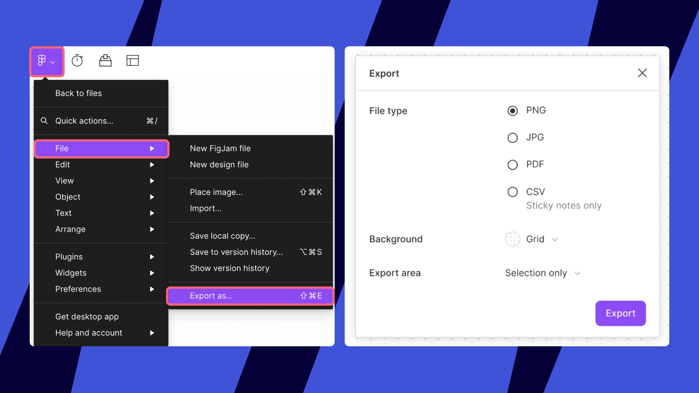
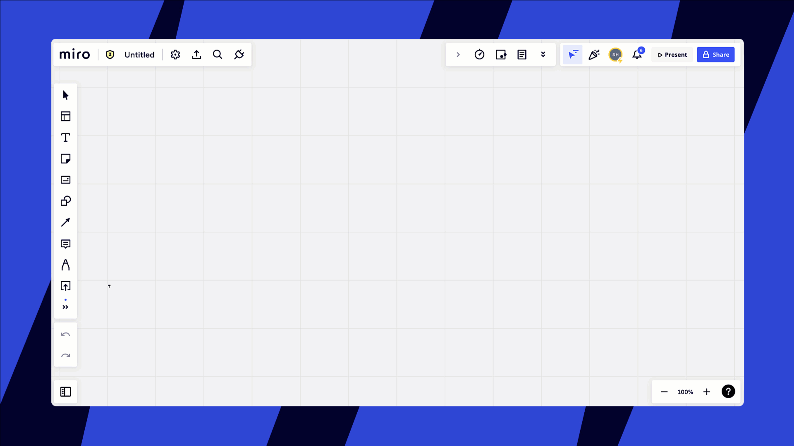

Você pode importar seu conteúdo do FigJam para a Miro para consolidar seu trabalho em uma solução única e versátil. A Miro oferece uma ampla gama de recursos, incluindo mais de cem aplicativos e integrações, centenas de templates prontos e ferramentas de colaboração exclusivas, como [Talktrack](../../using-miro/facilitation-tools/asynchronous-tools/02-talktrack-board-recordings.md) e [Smart Meetings](https://help.miro.com/hc/articles/8530534418066-Miro-Smart-Meetings-Updated-BETA-), para melhorar seu fluxo de trabalho.

:::warning
A edição do conteúdo importado é unidirecional. As alterações feitas no conteúdo na Miro não serão refletidas de volta no FigJam. O conteúdo importado será uma representação estática (por exemplo, imagem ou PDF).
:::

## Exporte seu board do FigJam

Para começar, você precisa exportar o conteúdo do seu board do FigJam. O FigJam permite exportar seus boards em vários formatos.

1. Abra o board do FigJam que deseja exportar.
2. Clique no ícone do menu FigJam (geralmente no canto superior esquerdo).
3. Navegue até **Arquivo > Exportar como**.
4. Na caixa de diálogo **Exportar**, escolha o formato de exportação desejado. As opções incluem **PNG**, **JPG**, **PDF** ou **CSV** (esta opção exporta somente notas adesivas).
5. Selecione uma opção de **Fundo** para sua exportação: Transparente, Sólido ou Grade.
6. Em **Área de exportação**, escolha se deseja exportar o **Board inteiro** ou apenas uma **Seleção** específica de conteúdo.
7. Clique no botão **Exportar**.
8. Escolha um local no seu dispositivo para salvar o arquivo exportado.
   
   *O menu Exportar como do FigJam e as opções de exportação*

## Importe seu conteúdo do FigJam para a Miro

Depois de exportar seu board do FigJam como uma imagem (PNG, JPG) ou PDF, você pode importá-lo para um board da Miro.

1. Navegue até o board da Miro onde você deseja importar o conteúdo do FigJam. Você pode usar um board existente da Miro ou criar um novo.
2. Você tem duas maneiras principais de carregar seu arquivo:
   1. **Arraste e solte:** Basta arrastar a imagem exportada ou o arquivo PDF do seu computador diretamente para o seu board da Miro.
   2. **Ferramenta de carregamento:** Na barra de ferramentas Criação (geralmente no lado esquerdo do seu board da Miro), clique em **Ferramentas, Mídia e Integrações** (o ícone **+**). Pesquise por "carregar" e clique na ferramenta **Carregar**. Escolha **Meu dispositivo**, e depois navegue até o arquivo exportado do FigJam e selecione-o.
3. O arquivo será carregado e aparecerá no seu board da Miro.
   
   *Adicionando a ferramenta Carregar à barra de ferramentas Criação na Miro e carregando um arquivo*

## Recursos adicionais

Para saber mais sobre como aproveitar ao máximo a Miro e seus recursos, confira estes recursos:

- [Formas de adicionar conteúdo aos seus boards da Miro](../../using-miro/working-on-the-board/07-ways-to-add-content.md)
- [Trabalhe de forma mais inteligente, não mais difícil na Miro](../../using-miro/working-on-the-board/21-work-smarter-not-harder.md)
- [Miro Academy](https://academy.miro.com/)

## Perguntas frequentes

Posso trazer conteúdo para a Miro de outras plataformas de colaboração visual?

Sim! A Miro oferece suporte à importação de conteúdo de várias outras ferramentas, incluindo Mural e Lucidchart. Os métodos podem variar dependendo da plataforma.

Quando devo recriar meu conteúdo do FigJam na Miro versus carregar uma imagem estática ou PDF?

Considere o seguinte:

- **Para projetos que ainda estão em andamento** e requerem iteração adicional, recomendamos importar o conteúdo do FigJam como imagem ou PDF para referência e, em seguida, recriar as áreas específicas que precisam de edições e mudanças adicionais usando as ferramentas nativas da Miro. Isso permite que você aproveite ao máximo os recursos da Miro para trabalhos contínuos.
- **Para projetos que estão concluídos**, mas que podem precisar ser consultados no futuro, importar a exportação do FigJam como uma imagem ou PDF é uma boa abordagem. O conteúdo então residirá na Miro como a nova fonte de registro.

E se eu tiver centenas de boards do FigJam e não quiser migrá-los todos manualmente?

Se você tiver um grande número de boards para migrar, entre em contato com seu Gerente de Sucesso do Cliente (se aplicável) ou com o [Suporte da Miro](../../using-miro/tools/troubleshooting/06-contacting-miro-support.md) para obter informações sobre assistência potencial e opções alternativas.
