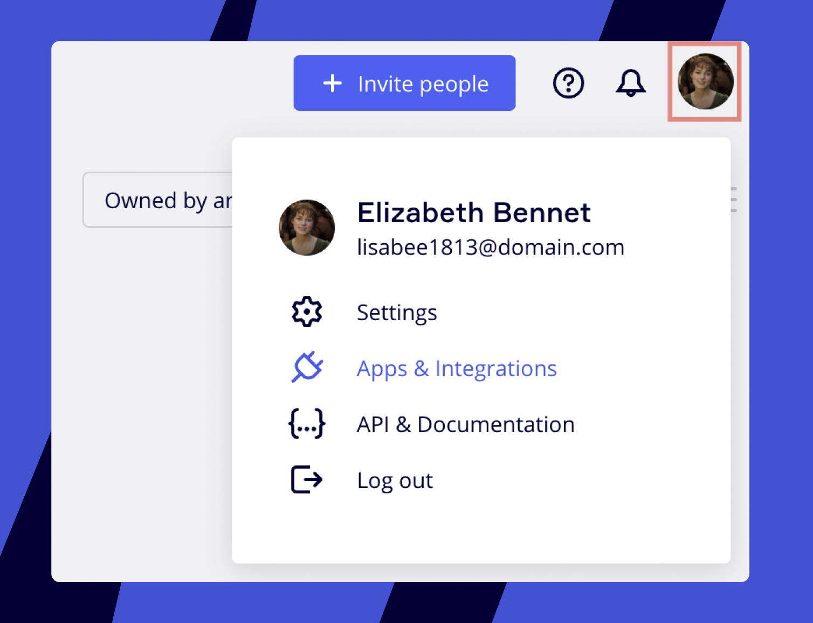
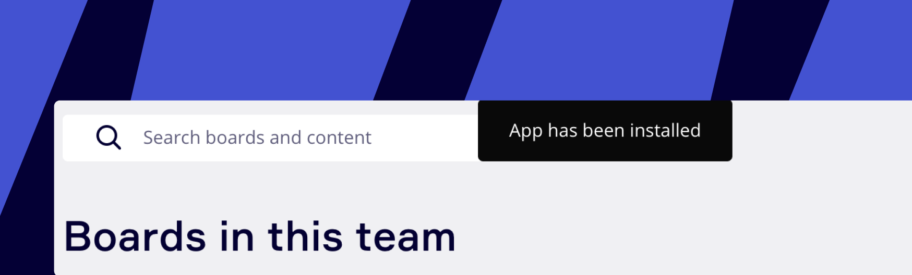
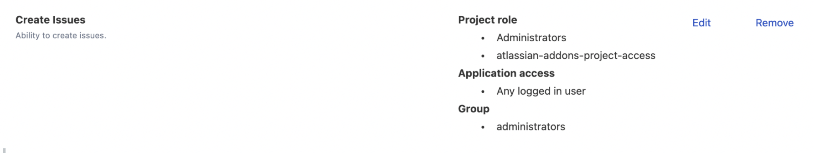

:::warning
Se ocorrerem problemas técnicos, por favor, consulte nosso artigo sobre [Possíveis problemas e como resolvê-los](https://help.miro.com/hc/articles/360017572654).
:::

:::tip
Saiba mais sobre cartões do Jira nos artigos [Perguntas frequentes sobre cartões do Jira](https://help.miro.com/hc/articles/360013463739)
:::

## Conectando Jira e Miro

### Instalação do aplicativo

1. Para ativar a integração, no seu [painel](https://help.miro.com/hc/articles/360017571294-What-is-on-your-dashboard) no canto superior direito, clique no seu avatar > **Integrações e Apps**:
   *Gerenciando seus aplicativos*
2. Encontre "cartões do Jira" na linha de **Pesquisa** e clique no botão azul **Conectar** no canto inferior direito do menu popup.
3. Você verá uma janela para **Adicionar "cartão do Jira"**. Aqui, você precisa confirmar a instalação ou selecionar o time onde deseja instalar a integração (caso seja membro de vários times). Clique em **Adicionar** a integração. No topo do painel, você verá a mensagem de confirmação que o **App foi instalado:**
   
   *A mensagem de confirmação*

### Conectando seu perfil do Jira

1. Clique novamente no seu avatar no painel e vá para **Configurações > Times >** *Nome do seu time* **> Aplicativos e Integrações > Cartões do Jira** e clique em **Conectar:
   ***As configurações da integração*
2. Você será direcionado para a página do Jira para autorizar a conexão. Faça login no Jira e clique em **Aceitar**.

### Conectando instâncias do Jira ao seu time no Miro

Com OAuth 2.0, agora você pode conectar várias instâncias do Jira ao mesmo time e boards. Após autorizar o aplicativo em Configurações, você verá a opção para **Conectar outra instância.**

1. Inicie o Seletor de Cartões do Jira na barra de ferramentas de Criação (pode ser necessário adicionar o aplicativo usando o botão **Mais aplicativos +**).
2. No Seletor, clique em **Configurações**.
3. Você será levado à seção de **Aplicativos e Integrações** das suas configurações. Procure a opção para **Conectar outra instância** e selecione quaisquer instâncias adicionais do Jira que gostaria de conectar.*Configurações de cartões do Jira em uma conta Miro*

Admin do time também podem ver todas as instâncias que os membros do time conectaram:

:::warning
Observe que cada usuário final precisará se autenticar a partir dos boards da Miro com cada instância do Jira conectada se tentar trabalhar com os cartões da instância.
:::

> ✍️ Observe que apenas uma instância pode estar ativa por vez, permitindo que os usuários puxem cartões dela. Cartões existentes de instâncias inativas ainda podem ser trabalhados nos boards da Miro.

### Configurando atualizações em tempo real a partir do Jira

Para obter todos os benefícios em tempo real de nossa sincronização bidirecional, você deve configurar webhooks para as instâncias do Jira que adicionar. Isso garantirá que quaisquer atualizações feitas no Jira sejam propagadas na Miro em tempo real.

1. Abra o Seletor de Cartões do Jira na barra de ferramentas Criação (pode ser necessário adicionar o app usando o botão **Mais apps +**).
2. No Seletor, clique em **Configurações**.
3. Você será levado à seção **Apps e Integrações** das suas configurações.
4. Na seção **Instâncias conectadas**, você deverá ver uma lista de instâncias que adicionou anteriormente.
5. Ao lado de cada instância, há um botão para **Adicionar webhook**. Clicar nele configurará atualizações em tempo real do Jira para o Miro para essa instância.
6. Se desejar remover webhooks dessa instância no futuro, você pode seguir os passos acima e clicar no botão **Remover webhook** que está ao lado das instâncias conectadas para as quais você adicionou um webhook.

:::note
Por favor, note que você deve ser um admin no Miro *e* no Jira para poder adicionar webhooks às suas instâncias.
:::

Depois disso, está pronto! Agora você pode adicionar tarefas do Jira como cartões na lousa. Todas as alterações feitas no Jira se refletem nos cartões do Jira no board e vice-versa.

## Desinstalando o plugin

Vá para as **Configurações do Time > Aplicativos e Integrações > Cartões do Jira** e clique em **Desinstalar para o time.**

:::tip
Não se esqueça de dar uma olhada no artigo principal sobre [como usar os cartões do Jira](https://help.miro.com/hc/articles/360017572434)!
:::
