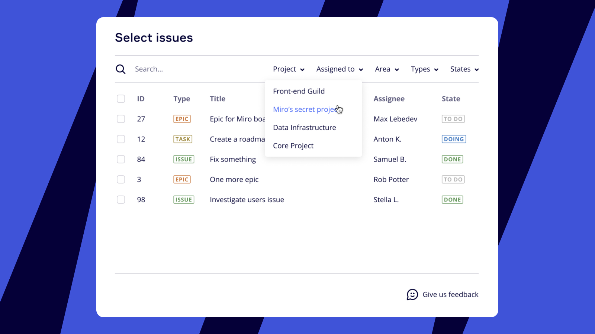

Os Azure Cards permitem que você importe itens de trabalho do Azure Boards (uma parte dos serviços Azure DevOps, anteriormente VSTS – solução em nuvem) para seus boards da Miro. Eles podem se tornar essenciais para suas retrospectivas remotas, dimensionamento de histórias, priorização de backlog, mapeamento de histórias e outras atividades do time. Você também pode usá-los em frameworks de Miro Kanban e mapeamento de histórias de usuário.

Os Azure Cards aprimoram sua experiência na Miro integrando-se diretamente com os Azure Boards, permitindo um gerenciamento de fluxo de trabalho contínuo para diversas atividades do time.

## Principais funcionalidades

A integração dos cartões do Azure oferece várias funcionalidades principais:

- Importe Azure Cards usando o seletor de itens de trabalho do Azure boards no aplicativo. Isso inclui várias opções de classificação.
- Pesquisa de itens de trabalho do Azure boards no seletor no aplicativo.
- Alterações automatizadas e fáceis de ler na visualização do cartão ao aumentar e diminuir o zoom.

:::note
Garanta que seus cartões Azure estejam sempre atualizados com a votação de cartões, o que assegura que os usuários sempre recebam atualizações de cartão, mesmo se [webhooks](../atlassian/14-how-to-set-up-webhooks-for-jira-data-center.md) falharem.
:::

## Configurar a integração do Azure Cards

A configuração é necessária em dois níveis:

1. O aplicativo deve ser adicionado no nível organizacional para todos os times ou no nível de time para times específicos.
2. Após a adição do aplicativo, a integração deve ser conectada e autorizada no nível pessoal para importar os Azure Cards.

Este processo requer permissões administrativas específicas tanto na Miro quanto no Azure DevOps.

:::note
Para configurar com sucesso os Azure Cards com a Miro, **o admin do Azure e o admin da Miro devem ser a mesma conta**.

Embora adicionar Azure Cards exija permissões de Admin da empresa ou do time na Miro **e** permissões de grupo de Admin da Coleção de Projetos no Azure Boards, essas permissões podem ser feitas downgrade após a conclusão da conexão. No entanto, o admin não pode ser removido e deve manter o acesso ao projeto do Azure.
:::

### Adicionar Azure Cards para sua organização ou time

Admins da empresa da Miro podem adicionar cartões Azure para todos os times, enquanto admins do time podem adicioná-los para times específicos que gerenciam. Esta etapa torna o aplicativo Azure Cards disponível para conexão.

:::note
Para conectar os Azure Cards no nível do time, você deve ser um admin do time.
:::

1. Navegue até as **configurações do seu perfil** (clique no ícone de três traços do menu principal e escolha **Configurações do perfil**, ou, no painel, clique no seu avatar no canto superior direito e escolha **Configurações**).
2. Clique em **Aplicativos** e, em seguida, navegue até a guia **Adicionar aplicativos** no lado direito.
3. Digite "Azure Cards" e selecione-o na lista suspensa. Clique em **Adicionar**.
4. Na próxima caixa de diálogo, escolha **Todos os times** ou **Em times específicos** (escolha seu time, se necessário), então clique em **Próximo passo**.
5. Na tela "Revisar e adicionar Azure Cards", clique em **Adicionar**. O aplicativo será adicionado para sua empresa ou time.
6. Vá para a guia **Gerenciar aplicativos**, procure por Azure Cards e clique em **Aprovar**. O aplicativo agora será aprovado no nível da empresa ou do time.
7. Em seguida, conecte sua organização do Azure à Miro. No painel Aplicativos, vá para **Gerenciar aplicativos.**
8. Procure por "Azure Cards" na sua lista de aplicativos e clique em **Configurações.**
9. No painel de configurações do Azure Cards, adicione o URL da sua **instância do Azure** e clique em **Conectar**. Forneça suas credenciais de login do Microsoft Azure.
10. Na caixa de diálogo de autorização, clique em **Aceitar** para concluir a conexão do Azure à Miro.

### Aplicar configurações personalizadas dos cartões Azure para times específicos

Se você precisar de configurações diferentes para times específicos do que a configuração global em nível de empresa, Admins do time podem configurar isso na área **Aplicativos e integrações** do Time.

1. Na página de configurações do seu perfil, clique em **Times**.
2. Clique no time ao qual você deseja aplicar configurações personalizadas.
3. No painel Times, clique em **Aplicativos e integrações**.
4. Encontre **Azure Cards** e clique nele.
5. No painel Configurações do aplicativo, escolha **Aplicar configurações personalizadas** no menu suspenso à direita e conecte a conta do Azure para a qual você deseja ter configurações personalizadas.
6. Autorize a Miro no Azure DevOps com sua conta da Microsoft: clique em **Conectar** ao lado de "Conta da Microsoft" e efetue login na sua conta da Microsoft, permitindo que a Miro a utilize.
7. Insira o **URL da sua organização do Azure** (que pode ser copiado do Azure DevOps) e clique em **Conectar.** A Miro aceitará tanto a URL personalizada da sua instância quanto o endereço geral `https://dev.azure.com/` terminando com o nome da sua instância.
   
   *Adicionar configurações personalizadas do Azure Cards a times específicos*

### Conecte sua conta pessoal do Azure para usar os cartões do Azure

Após um Admin da Miro instalar e aprovar o aplicativo, cada membro do time que deseja usar o Azure Cards deve autorizar pessoalmente a conexão à sua conta do Azure. Isso personaliza o seletor de cartões e permite a importação de todos os itens de trabalho do Azure que o usuário pode acessar.

Você pode encontrar o ícone do Azure Cards na barra de ferramentas de criação. Se o ícone não estiver lá, pode ser necessário procurá-lo:

1. Na barra de Criação, selecione **Ferramentas, mídia e integrações** (**+**).
   O painel **Ferramentas, mídia e integrações** abre.
2. Na guia **Ferramentas**, pesquise e selecione Azure Cards.

Para conectar sua conta:

1. Clique no ícone do Azure Cards na barra de ferramentas. Um pop-up solicitará que você **autorize**.
2. Clique no **botão Autorizar** e clique em **Continuar**. Você será levado para a página Configurações do time > Aplicativos e integrações.
3. Use o painel Configurações do aplicativo para conectar sua conta da Microsoft à Miro e especifique a instância do Azure que você gostaria de usar. Esta URL pode ser copiada do Azure DevOps; a Miro aceita tanto a URL personalizada da sua instância quanto o endereço geral `https://dev.azure.com/` terminado com o nome da sua instância.
   

:::note
Observe que somente admins do time podem configurar a configuração inicial do time ou da empresa. Se você não vir o botão **Conectar** para a URL da Organização do Azure durante a configuração do admin, certifique-se de ter os [direitos de admin do time para o time](../../administration/user-management/06-how-to-manage-admin-roles.md).
:::

## Importar itens de trabalho do Azure para um board da Miro

Depois que o aplicativo Azure Cards estiver configurado e você tiver conectado sua conta pessoal, você poderá importar itens de trabalho do Azure para qualquer board do Miro associado ao time conectado. Há duas maneiras principais de fazer isso:

- Copie o URL do item de trabalho do Azure e cole-o diretamente no board da Miro. O item será automaticamente transformado em um cartão do Azure.
- Use o seletor de Cartão do Azure: Clique no ícone do **Azure Cards** na barra de ferramentas para abrir o seletor.

  *Seletor de cartões do Azure*

  O seletor oferece suporte à pesquisa em todos os campos, permitindo que você encontre um cartão pelo seu título, tipo, status, etc. Você também pode usar uma robusta [pesquisa por palavra-chave](https://docs.microsoft.com/azure/devops/project/search/get-started-search?view=azure-devops#start-your-search-with-a-keyword) fornecida pela Microsoft.

  *Pesquisar Azure Cards no seletor*

  Você pode filtrar cartões por projeto, responsável, tipo, área e status, o que desbloqueia a filtragem avançada de itens de trabalho do Azure diretamente na Miro.

  *Filtrar Azure Cards no seletor*

  Para navegar até o item de trabalho original do Azure, selecione um cartão no board e clique no botão **Fonte** no menu de contexto.

  *O botão de origem do cartão*

  Os cartões Azure podem ser usados como widgets de board autônomos ou como componentes de frameworks interativos de [Kanban](../../using-miro/advanced-tools/02-columns-formerly-kanban.md) e [Mapa de história do usuário](../../using-miro/advanced-tools/07-user-story-mapping.md). Você pode adicionar Azure Cards a esses frameworks arrastando-os.

  *Como trabalhar com Azure Cards no Kanban*

## Crie e edite cartões do Azure diretamente na Miro

A integração bidirecional entre a Miro e o Azure DevOps permite que os times criem novos itens de trabalho do Azure e editem os existentes diretamente de um board da Miro. Você também pode converter cartões e notas adesivas da Miro em cartões do Azure.

### Criar um novo cartão do Azure

Para criar um novo item de trabalho do Azure a partir da Miro:

1. Selecione **Azure Cards** na barra de ferramentas Criação e escolha **Criar item de trabalho** no canto superior direito do seletor.
2. Preencha os campos do cartão, escolha um projeto, tipo de item, responsável e clique em **Criar**. O novo item será criado no seu diretório do Azure DevOps e também no seu board da Miro.

*Criando um cartão do Azure na Miro*

### Converter cartões ou notas adesivas da Miro em cartões do Azure

Para converter um cartão ou nota adesiva existente da Miro em um cartão do Azure:

1. Selecione a nota adesiva ou cartão no board.
2. Clique na opção de conversão (geralmente um ícone do Azure DevOps ou "Converter em item de trabalho do Azure") no menu de contexto do objeto.
3. Defina os parâmetros do cartão (como projeto, tipo de item) na caixa de diálogo e clique em **Converter**. O texto na nota adesiva/cartão será convertido em título do cartão.

> **💡** Economize tempo convertendo em massa notas adesivas ou cartões da Miro em cartões do Azure. Clique e arraste para selecionar todos os objetos que deseja converter e, no menu de contexto, selecione **Converter em itens de trabalho do Azure**.

*Como converter uma nota adesiva em um cartão do Azure*

### Editar um Cartão do Azure

A opção de editar Azure Cards na Miro elimina o incômodo de alternar entre ferramentas. Para editar um cartão:

1. Clique no cartão Azure no seu board da Miro.
2. Clique no **ícone de caneta (editar)** no menu de contexto do cartão. Uma janela pop-up será aberta, permitindo que você edite os campos do item.
3. Clique em **Atualizar** para salvar as alterações. As mudanças também serão refletidas no Azure DevOps.

*A opção de editar um cartão do Azure na Miro*

### Alterar a cor do Cartão do Azure

Para personalizar a aparência dos seus Azure Cards no board:

Para alterar a cor de preenchimento de um cartão, clique no cartão ou cartões e escolha **cor de preenchimento** do menu de contexto. Se você duplicar o cartão ou cartões, todas as cópias subsequentes terão a mesma cor de preenchimento.

## Desinstalar a integração do Azure Cards

Se você não precisa mais da integração dos cartões do Azure, pode desinstalá-la. Desinstalar no nível do time requer permissões de admin do time.

1. Acesse **Configurações do time > Aplicativos e integrações > Azure Cards**.
2. Role para baixo e clique em **Desinstalar para o time.**
3. Para desinstalar o Azure Cards apenas para a sua conta pessoal, clique em **Desinstalar para mim.**

*Desinstale o aplicativo para todo o time ou apenas para você*

## Campos compatíveis do cartão do Azure

Os seguintes campos são compatíveis para Azure Cards na Miro:

- Título
- Projeto
- Tipo
- Status
- Descrição (sem suporte a edição)
- Item de trabalho pai
- Responsável
- Prioridade
- Story points
- Área
- Iteração
- Critérios de aceitação

Sem suporte a campos personalizados.

## Solução de problemas de cartões Azure

Se você encontrar problemas com a integração dos cartões Azure, consulte os problemas comuns e suas soluções abaixo.

URL inválido

O URL que você usou não está correto. Verifique a ortografia e a formatação. Por exemplo, o endereço da Organização do Azure deve terminar com uma barra.

Não é possível acessar o URL da organização do Azure

O URL inserido não existe. Informe a URL existente ou verifique a ortografia. Além disso, verifique o seguinte:

- Certifique-se de que sua organização pode aceitar autorização de terceiros: em **Configurações da organização > Políticas (Segurança)** **>** certifique-se de que "Acesso a aplicativos de terceiros via OAuth" esteja habilitado.
- Sua organização do Azure está em uma rede privada ou o firewall da sua empresa bloqueia conexões a redes externas. Faça as alterações necessárias na configuração do seu firewall e VPN, adicionando nossos domínios à sua lista de permissões: miro.com*, *.miro.com, mirostatic.com*, *.mirostatic.com, realtimeboard.com*, *.realtimeboard.com, *static.miro-apps.com. Se usar um proxy, configure um reverso que nos permita acesso. Certifique-se de preencher o campo **URL do Azure DevOps** nas configurações com o endereço que podemos acessar (o endereço pode ser diferente do endereço real do seu Azure DevOps restrito). Você também pode prolongar o valor do tempo limite no seu servidor proxy.
- Todas as solicitações de integração passam por um balanceador de carga da Amazon, portanto, não é possível fornecer informações de rede específicas pela Miro.

Falha ao criar assinatura de gancho de serviço

O usuário do Azure conectado no momento não tem as permissões necessárias. O usuário do Azure em cujo nome a instância do Azure será conectada à Miro deve ter acesso a estes métodos da REST API:

- [*Criar assinatura de service hook*](https://docs.microsoft.com/rest/api/azure/devops/hooks/subscriptions/create?view=azure-devops-rest-6.0) (requer [escopo](https://docs.microsoft.com/azure/devops/integrate/get-started/authentication/oauth?view=azure-devops#scopes) "*vso.serviceendpoint_manage"*)
- [*Receber metadados sobre projetos (essas informações são usadas para especificar itens de trabalho em eventos de assinatura corretamente)*](https://docs.microsoft.com/rest/api/azure/devops/core/projects/list?view=azure-devops-rest-6.0)
- *Os métodos a seguir também precisam ser acessíveis a todos os usuários que utilizam a integração:*
  - [*Obter itens*](https://docs.microsoft.com/rest/api/azure/devops/wit/work%20items/get%20work%20item?view=azure-devops-rest-6.0)
  - [*Listar itens*](https://docs.microsoft.com/rest/api/azure/devops/wit/work%20items/list?view=azure-devops-rest-6.0)
  - [*Obter tipos de item*](https://docs.microsoft.com/rest/api/azure/devops/wit/work%20item%20types/get?view=azure-devops-rest-6.0)
  - [*Listar tipos de item*](https://docs.microsoft.com/rest/api/azure/devops/wit/work%20item%20types/list?view=azure-devops-rest-6.0)

O usuário **username@microsoft.com** não tem acesso a nenhum projeto no URL da Organização do Azure especificada.

Você não pode acessar nenhum projeto na organização do Azure que está sendo usada. Para importar cartões, você deve ter acesso a eles no lado do Azure Boards. Entre em contato com o titular da organização do Azure e peça para que convide você para a organização do Azure. [Este artigo](https://docs.microsoft.com/azure/devops/organizations/security/look-up-organization-owner?view=azure-devops) pode ajudar você a descobrir o nome do titular da organização.

Falha ao criar assinatura de gancho de serviço: o usuário **username@microsoft.com** não é um titular da Organização. Peça ao titular da organização para configurar esta etapa.

Você deve ser o titular da organização do Azure e o Admin da empresa da Miro para configurar os Cartões Azure na Miro.

A autorização expirou. Reconecte a integração nas configurações do seu time.

A autorização do Azure expirou. Reconecte a integração no nível pessoal, conforme descrito na seção "Conectar sua conta pessoal do Azure para usar os cartões do Azure" acima.

O cartão com o qual você está trabalhando está apresentando um comportamento inesperado.

- Isso pode acontecer se o cartão não estiver sincronizado com a organização do Azure. Por exemplo, se você copiou o cartão de outro board ou está trabalhando em um board que foi movido entre times. Para resolver a situação, adicione novamente o item do Azure ao board.

O número de itens de trabalho retornados excede o limite de tamanho de 200. Altere a consulta para retornar menos itens.

Se receber essa mensagem de erro, significa que você selecionou muitas tarefas para adicionar ao board como cartões. Limite o número de tarefas usando a barra de pesquisa. No momento, quando você abre o seletor, nenhum filtro é aplicado e todas as tarefas dos últimos três meses são exibidas. Toda vez que o seletor tentar exibir mais de 200 tarefas, você receberá esta mensagem de erro.

Não recebo o botão **Conectar** ao tentar conectar minha organização do Azure com a Miro nas configurações da Miro.

Certifique-se de ter direitos de admin do time. Vá para a guia **Usuários ativos** nas configurações do seu time e [promova-se a admin do time](../../administration/user-management/06-how-to-manage-admin-roles.md), se necessário. Isso se aplica à configuração inicial da conexão da Organização do Azure por um admin.

:::note
Se você tiver outros problemas, entre em contato com o [Suporte da Miro](../../using-miro/tools/troubleshooting/06-contacting-miro-support.md).
:::

## Perguntas frequentes sobre os cartões Azure

Aqui estão respostas para algumas perguntas comuns sobre a integração dos cartões Azure.

Quais IPs devem ser permitidos para Azure Cards?

Para que a integração dos cartões Azure funcione corretamente, especialmente em ambientes de rede restritos, pode ser necessário adicionar à lista de permissões os seguintes endereços IP:

- 18.203.61.162
- 54.220.74.201
- 54.216.81.236
- 54.73.153.141
- 52.215.228.26
- 52.16.47.17
- 54.217.180.21

O que acontece com os Azure Cards existentes quando você desconecta e desinstala o aplicativo Azure Cards?

Os cartões permanecem intactos nos boards da Miro sem perda de dados; no entanto, eles param de sincronizar com o Azure, e o botão de origem desaparece.
