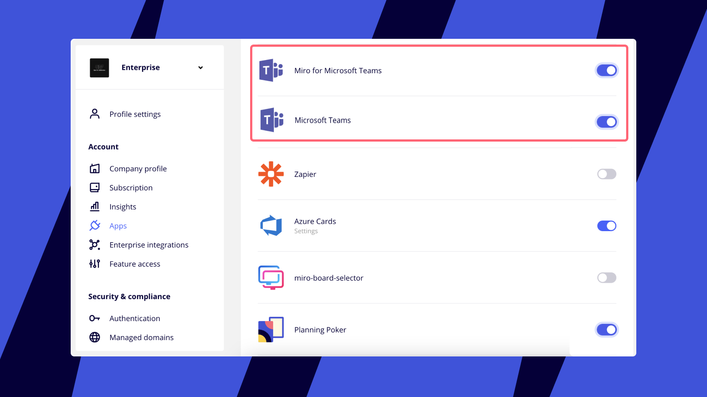

:::note
As configurações de permissão e acesso variam de acordo com o tipo de plano . Para saber mais sobre usuários externos no Microsoft Teams, consulte a [política de aplicativos da Microsoft](https://learn.microsoft.com/microsoftteams/apps-external-users).
:::

Habilite a integração do Miro com o Microsoft Teams para acelerar a colaboração dentro da sua organização. O Miro para Microsoft Teams oferece uma série de experiências que permitem aos usuários receber notificações em tempo real, bem como colaborar em boards da Miro incorporados em reuniões, canais, bate-papos e convites de calendário do Teams.

O Miro também oferece suporte a cartões adaptáveis ​​por meio de desdobramento de links e extensões de mensagens de pesquisa, dando aos usuários mais contexto em boards compartilhados e permitindo o gerenciamento rápido do acesso aos board , tudo isso sem sair do espaço do Microsoft Teams.

:::tip
Saiba mais sobre [a integração do Miro com o Microsoft Teams](..).
:::

<iframe allowfullscreen="" frameborder="0" height="315" src="//www.youtube-nocookie.com/embed/6xab9nSnmAA" width="560"></iframe>
 *Miro para times da Microsoft*

## Gerenciamento de aplicativos

:::warning
Os admins da Microsoft precisarão habilitar a integração do Miro para o Microsoft Teams no catálogo de gerenciamento de aplicativos da Microsoft. Os admins do Miro Enterprise também precisarão habilitar a integração no painel de gerenciamento do aplicativo da Miro .
:::

### Gerenciamento de aplicativos no Microsoft Teams

As configurações podem variar de acordo com a conta. Saiba mais sobre [como gerenciar aplicativos no Microsoft Teams](https://learn.microsoft.com/microsoftteams/manage-apps).

Para garantir que sua organização aproveite ao máximo a integração, instale em massa e fixe o aplicativo da Miro usando [a política de configuração de aplicativo da Microsoft](https://learn.microsoft.com/microsoftteams/teams-app-setup-policies).

### Gerenciamento de aplicativos no Miro

Nas configurações da sua empresa Miro > **Aplicativos**, você verá dois aplicativos do Microsoft Teams:

- Miro para Microsoft Teams (integração de guias) - incorpore o Miro ao Calendário, reuniões do Teams, canais e bate-papos
- Microsoft Teams (integração de bot) - notificações do usuário

Se você desativar o Microsoft Teams (integração de bot), os usuários não receberão mais notificações do Miro no Microsoft Teams.

*Aplicativos do Microsoft* altTeamsalt

## Compreendendo as configurações de acesso ao compartilhamento do board

Ao adicionar um board como uma guia em reuniões, convites de calendário, bate-papos e canais, os usuários podem definir as permissões de compartilhamento apropriadas. Para adicionar um board como uma guia no Microsoft Teams, visite Adicionar o Miro como uma guia no Microsoft Teams. Saiba mais sobre [as configurações de acesso para uma board incorporada](../../integrate-miro-with-other-apps/01-user-permissions-for-boards-embedded-in-third-party-apps.md).

### Configurando as configurações de acesso para sua board

As opções de configuração de acesso seguirão os controles de acesso de toda a organização. Se você restringiu o compartilhamento para incorporações de board no plano Enterprise , essa opção não estará disponível para os usuários. Saiba mais em [Gerenciando a política de compartilhamento Enterprise para integrações incorporadas.](../../../enterprise-administration/managing-apps-on-enterprise-plan/05-how-to-allow-or-restrict-embedding-miro-boards-in-supported-apps.md)

*Exemplo de quando a edição pública é desativada pelo Admin da empresa*
