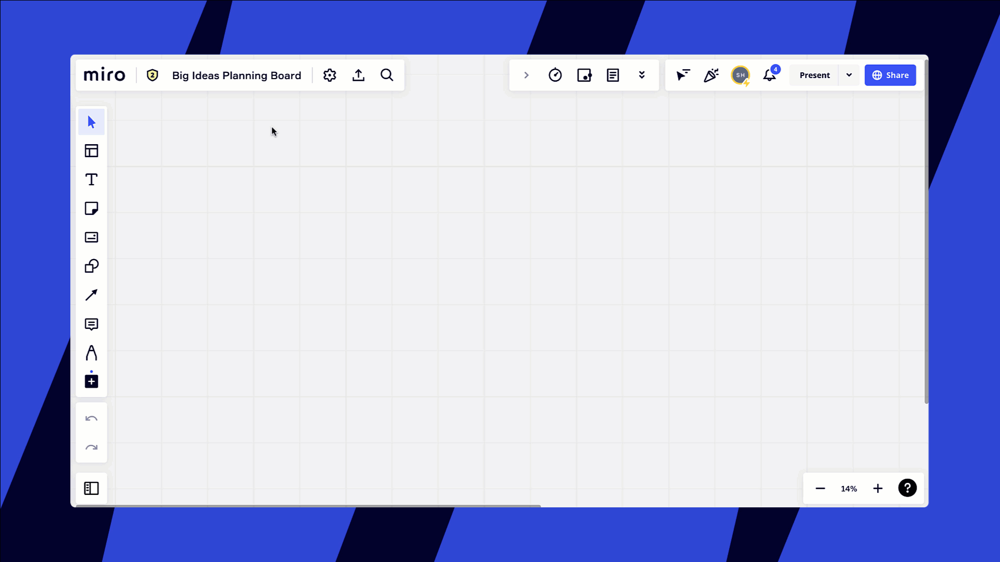

Receba notificações do Slack sobre novos comentários e menções em seus boards e outras alterações relacionadas ao seu perfil, compartilhe facilmente seus boards da Miro no Slack e abra links de board automaticamente. Leia o artigo para saber como conectar seu Slack ao Miro e ter acesso a todos os recursos interessantes.

:::note
Alguns usuários do Slack são aconselhados a se registrarem facilmente no Miro via Slack ao clicar em um link para um board da Miro postado em um canal do Slack. O recurso está atualmente em beta e é gerenciado pelo Slack. Não é necessário que nosso aplicativo seja instalado no espaço de trabalho do Slack.
Os admins do workspace têm a opção de desabilitar completamente o recurso Entrar com o Slack nas configurações do espaço de trabalho do Slack (Configurações de gerenciamento de aplicativos > Configurações de entrar com o Slack). Enterprise Grid Org e seus espaços de trabalho são excluídos desde o lançamento durante o beta.
:::

:::note
Para obter suporte com o aplicativo Slack, envie um e-mail para [slack_integration_support@miro.com](mailto:slack_integration_support@miro.com) ou visite [Como entrar em contato com o suporte da Miro](../../using-miro/tools/troubleshooting/06-contacting-miro-support.md).
:::

## Habilitando o aplicativo

A integração do aplicativo Slack é configurada por um usuário para seu próprio perfil. Para habilitar a integração, abra [as configurações do seu perfil](../../using-miro/managing-your-profile/01-profile-settings.md)Miro .

getting_to_profile_settings.jpg
*Acessando as configurações do perfil no [painel](https://miro.com/app/dashboard/) do Miro*

Mude para a aba **Integrações** , encontre **o Miro Feed (Slack App)** e clique em **Conectar**:

*Conectando o aplicativo Slack*

Outra opção é habilitá-lo diretamente na[aba Notificações](https://miro.com/app/account/profile/notifications/):

*Habilitando o aplicativo Slack na página de notificação*

Você será redirecionado para autorizar no Slack. Insira suas credenciais e entre no Slack.

*Permitindo que Miro acesse o espaço de trabalho*

## Configurando notificações

Personalize o feed que você recebe escolhendo os eventos sobre os quais deseja ser notificado.

Você pode acompanhar os seguintes eventos:

- convidados inscrevam-se
- alguém solicita acesso um time ou a um board
- você está convidado para um projeto
- um board é compartilhado com você
- há um novo comentar no seu board ou uma resposta ao seu comentar em um board
- alguém @menciona você em um comentar ou resposta

Abra a[página Notificações](https://miro.com/app/account/profile/notifications/) e configure suas preferências:

*Configurações de notificações*

Tenha em mente que em alguns casos a notificação será enviada a você *somente se o notificador decidir* enviá-la.

## Reagindo às notificações diretamente no Slack

Quando alguém solicitar acesso ao seu board , você pode conceder diretamente no Slack. Escolha a opção e clique no botão:

*Concedendo acesso a um board no canal do Slack*

## Desdobrando links do board

A versão mais recente do aplicativo Miro Slack expande links para os boards da Miro adicionando board , descrições e miniaturas dos board .

*Nome do board , descrição e miniatura no canal do Slack*

Reinstale sua integração com o Slack para ter acesso ao recurso: vá para Configurações do perfil Miro **> Integrações** e clique em **Sair** ao lado de **Feed Miro (aplicativo Slack)**. Em seguida, clique em **Conectar** e autorize novamente.

:::note
Para reautorizar, talvez seja necessário receber aprovação do admin do Slack Workspace.
:::

Para definir uma miniatura do board , acesse seu board da Miro e abra o cartão de informações do board clicando no título no canto superior esquerdo do board. Na janela pop-up, clique na imagem no canto superior esquerdo e carregar uma imagem do seu dispositivo ou selecione uma seção do board. A miniatura aparecerá no Slack quando você compartilhar o link do board .

*Miniatura do board de configuração*

## Compartilhando um board do Slack

Ao postar um link de board no Slack, você verá uma notificação mostrando os usuários que não têm acesso ao board. Você pode convidá-los facilmente para o board diretamente pelo Slack. Sinta-se à gratuita para [tornar o board público](../../using-miro/sharing-boards/03-sharing-boards-and-inviting-collaborators.md) para que qualquer pessoa com o link possa visualizar/ comentar .

 *Compartilhando um board da Miro de dentro do Slack*

:::tip
Se a opção indisponível para você, reinstale o aplicativo nas configurações ou peça ao seu admin para atualizar o plugin no Slack Marketplace.
:::

## Criando um board do Slack

Você pode usar o atalho do Miro para criar um board no Slack. Pesquise no Miro e escolha **Criar um board**.

*Criando um board do Slack*

Insira um título para o board , selecione uma time Miro e adicione uma mensagem curta para enviar junto com o link para o board recém-criado no Slack.

*Definir parâmetros para um novo board no Slack*

Depois que o board for criado, a mensagem será enviada para o canal/conversa junto com o link do board .

*Uma mensagem será publicada após a criação de um novo board no Slack*

Se alguns membros do canal não tiverem acesso ao board recém-criado, será sugerido que você [compartilhe o board com eles no Slack](#h_007785b5-df52-43e2-9eb0-ccb53b795955).

## Desabilitando o aplicativo

Para desabilitar a integração, acesse **Configurações do perfil > Integrações** e clique em **Sair**:

*Desabilitando o Miro Feed*

Para remover o aplicativo do Slack completamente, abra as configurações do canal **Miro** no Slack e clique em **Configuração**.

*Configuração do aplicativo Miro para Slack*

Você será redirecionado para a página de configurações do aplicativo da Miro . Role para baixo, encontre seu nome na lista de usuários autorizados e clique em **Revogar**.

*Removendo o acesso do Miro ao Slack*

Os admins do espaço de trabalho também verão a opção de excluir o aplicativo de *todo o espaço de trabalho*.

*Removendo o aplicativo do Slack*

## Perguntas frequentes e possíveis problemas

*1. Se um usuário adicionar o Miro ao Slack, o Miro poderá ler os canais dele no Slack?*
- Não, Miro vai apenas vveja informações básicas sobre canais públicos no espaço de trabalho. Isso significa que o Miro poderá ler a lista de nomes de canais e não poderá ler as mensagens dos canais.

2. *Estou recebendo a mensagem "Algo deu errado" ao tentar conectar o Miro Feed para Slack.*
- Verifique se o seu navegador está permitindo pop-ups do domínio miro.com. Pode haver uma página extra solicitando permissões de aplicativo.

3. *Não estou recebendo notificações do Miro-Slack e reinstalar o aplicativo da Miro no Slack não ajuda. Como posso resolver isso?*
- Tente reconectar o Miro e o Slack no lado do Miro (**Configurações do perfil > [Integrações](https://miro.com/app/account/profile/integrations/)**).
