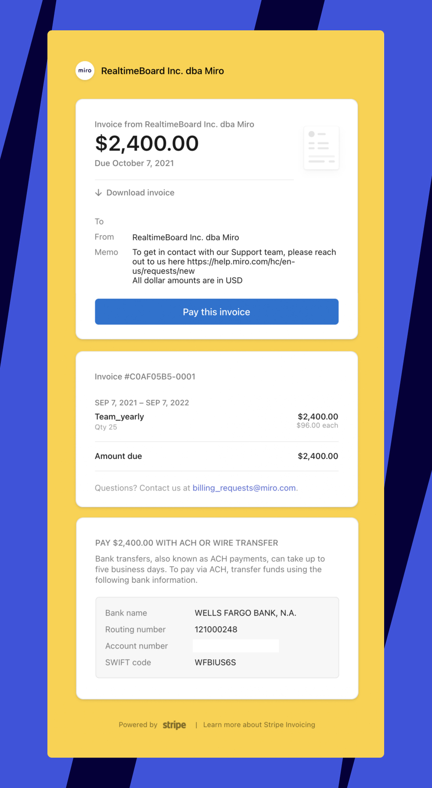

Você pode pagar mensalmente ou anualmente com pagamentos automáticos de cartão de crédito, ou anualmente por meio de faturamento.

## Comparando opções de pagamento e faturamento automatizados

|  |  |  |
| --- | --- | --- |
|  | **Pagamentos automatizados** | Fatura? |
| **planos disponíveis** | plano Starter e Business | plano Starter e Business |
| **Forma de pagamento** | Cartão de crédito | Cartão de crédito  Transferência de crédito ACH  Transferência bancária |
| **Tipo****de** **pagamento** | Automatizado | Fatura |
| **Frequência de pagamento** | Mensal ou anual (cobrado no final do período de cobrança) | Anualmente (pagamento a ser feito dentro de 30 dias da data de emissão da fatura) |
| **licenças** | Não há exigência de licença mínima   Os pagamentos por licenças extras são cobrados [mensalmente](04-miro-billing.md) | plano Starter : mínimo de 10 licenças necessárias  plano de Business : mínimo de 5 licenças necessárias   As faturas para licenças extras são emitidas [trimestralmente](07-understanding-your-invoice.md) |

* O faturamento não está mais disponível em alguns países. Usuários existentes que atualmente pagam via faturamento não serão afetados por essa alteração. Os pagamentos com cartão de crédito continuam disponíveis globalmente.

:::note
Oferecemos suporte a pagamentos 3DSecure para bancos que exigem etapas de autorização adicionais.
:::

## Alternar opções de pagamento

### Mudança de faturamento para pagamentos automatizados

Se você deseja mudar do faturamento anual para pagamentos automatizados, [entre em contato com o suporte da Miro](../../using-miro/tools/troubleshooting/06-contacting-miro-support.md).

### Mudança de pagamentos automatizados para faturamento

Existem duas maneiras de mudar para faturamento:

1. Se estiver pagando com cartão de crédito, você pode alternar entre pagamentos automáticos e faturamento em **Método de pagamento** > **Alterar método de pagamento**. Se você atualmente paga mensalmente, ao alterar seu método de pagamento, também precisará selecionar a opção de pagamento anual e adicionar um número mínimo de 10 licenças para Starter e 5 licenças para Business.
2. Você pode alternar entre pagamentos automatizados e faturamento anual ao [fazer upgrade seu plano de Starter para Business](../manage-your-subscription-and-plan/03-upgrade-your-plan.md).

## Alterações no seu faturamento após a mudança para faturamento

**Se você alterar sua opção de pagamento de pagamentos automatizados para faturamento durante uma assinatura anual**, seu período de cobrança e a data de renovação não serão alterados. Se você aumentar o tamanho da sua time ao mudar para o faturamento, a fatura de ajuste para licenças adicionais seráenviada a você no final do trimestre de faturamento.

**Se você alterar sua opção de pagamento de pagamentos automatizados para faturamento e antes tinha uma assinatura mensal**, sua data de renovação será alterada e você receberá uma fatura pelo tempo adicional na nova assinatura anual. O custo proporcional para licenças adicionais (se você aumentar o tamanho da sua time ) também será incluído na fatura. Todos os pagamentos pendentes atuais (por exemplo, [faturas futuras para licenças adicionadas recentemente](04-miro-billing.md)) serão cobrados do método de pagamento atual (cartão) antes da fatura ser emitida. Caso a cobrança não seja bem-sucedida, o valor dos pagamentos será adicionado à nova fatura.

**Se você fazer upgrade seu plano de Starter para Business**, seu período de cobrança e a data de renovação serão alterados. O valor proporcional ao tempo não utilizado no plano Starter será adicionado como crédito à sua nova fatura.

Se você tiver uma fatura não paga por licençasextras adicionadas, tentaremos cobrá-las em seu cartão durante a fazer upgrade. Se a cobrança não for bem-sucedida, o valor proporcional será adicionado à sua nova fatura.

## Como pagar sua fatura

Configurações de cobrança E-mail de cobrança

Os admins verão um lembrete de pagamento na parte superior do painel. Eles verão o primeiro lembrete 15 dias antes da data de vencimento. Os admins podem pagar uma fatura. Para acessar as faturas:

1. Clique no avatar do seu perfil e depois em **Console de admin**.
2. Na barra lateral esquerda, clique em **Faturamento**.
   A página Visão geral da cobrança é exibida.
3. Clique na aba **Faturas** na parte superior.

Somente admins e admins de cobrança têm acesso às configurações de cobrança e podem pagar uma fatura.

Assim que uma fatura for paga, você receberá um recibo e também poderá [baixar uma fatura pós-pagamento](01-how-to-find-and-download-an-invoice.md) nas configurações de cobrança.

:::warning
Pague a fatura em até 30 dias. Caso contrário, a assinatura expirará e seu acesso aos recursos do plano será restrito.
:::

Clique em **Pagar esta fatura**. Escolha o método de pagamento preferido: cartão de crédito ou transferência bancária. Para pagamentos com cartão de crédito, envie os detalhes do seu cartão de crédito e clique em **Pagar fatura**. Se você quiser pagar via ACH ou transferência bancária, use os dados bancários indicados na fatura.
:::note
Cada assinatura tem um *número de conta bancária exclusivo*.
:::

:::warning
Transferências de crédito ACH estão disponíveis apenas nos EUA.
:::

 
