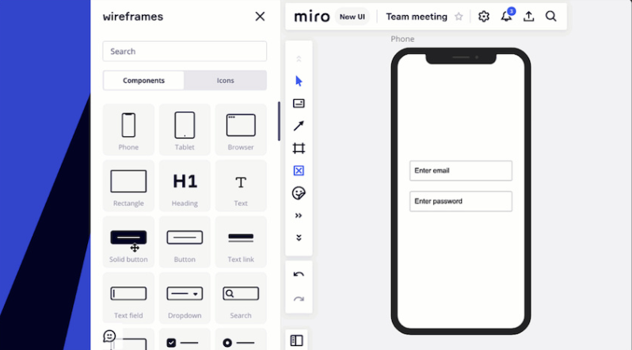

:::note
A Galeria de wireframes está sendo atualizada para a nova Galeria de protótipos. No momento, a Galeria de wireframes está visível apenas para os planos Enterprise que não estão no Beta de Miro Prototyping.

**Mais informações:** Veja [Prototyping library](../miroverse/prototyping/02-prototyping-library.md), [Prototyping overview](../miroverse/prototyping/01-miro-prototypes-overview.md) e [Miro Prototyping (BETA)](../miroverse/prototyping/03-miro-prototypes.md).
:::

A **Galeria de wireframes** está sendo atualizada para uma nova **Galeria de protótipos**, que traz um conjunto de ferramentas mais poderoso e flexível para a criação de telas interativas.

Tudo o que você já criou com a Galeria de wireframes ainda funcionará nos seus boards. Mas alguns componentes antigos e quadros de dispositivos não estarão mais disponíveis na barra de ferramentas e não receberão atualizações futuras.

*A galeria de wireframes legada*

### O que está mudando

- A Galeria de wireframes foi incorporada à Galeria de prototipagem.
- Todos os componentes da Galeria de wireframes agora estão na guia Wireframes da Galeria de prototipagem.
- Ícones estão disponíveis na guia Ícones da Galeria de prototipagem.
- Quadros de dispositivos Mobile, Tablet e Browser foram atualizados e substituídos por Telas de Mobile, Tablet e Desktop.
- As telas e componentes da Galeria de prototipagem agora suportam novas funcionalidades como:
  - Modo de visualização clicável.
  - Geração de telas com IA.
  - Mockups editáveis a partir de capturas de tela.

:::note
*Se você estiver em um **plano Enterprise e ainda não estiver inscrito no Beta do Miro Prototypes**, pode ver ainda por agora a galeria legada.*
:::

### O que isso significa para o seu trabalho

- Seus wireframes existentes estão seguros e continuarão a funcionar.
- Qualquer atualização nos seus wireframes precisará usar a nova **Biblioteca de Prototipagem**.

## Perguntas frequentes

**A galeria de wireframes ainda está disponível?**

Não. Ela foi substituída pela Galeria de protótipos, que inclui a maioria dos mesmos componentes e mais. Se você estiver no plano Enterprise e ainda não estiver inscrito no Beta do Miro Prototypes, pode ser que ainda veja a galeria legada por enquanto.

**O que aconteceu com elementos da UI, como botões e campos de entrada?**

Agora eles estão na **guia Wireframes** da Galeria de protótipos.

**Meus wireframes anteriores ainda funcionarão?**

Sim. Tudo que já está no seu board permanecerá como está. Mas você precisará usar a Galeria de protótipos para garantir que possa continuar adicionando ou editando no futuro.

**O que há de diferente na nova galeria?**

A nova Galeria de protótipos suporta geração por IA, pré-visualizações clicáveis, mockups editáveis a partir de capturas de tela e visuais atualizados — tudo projetado para ajudar os times a irem da ideia ao protótipo mais rapidamente.

**A Galeria de protótipos continuará disponível no plano Free, assim como a Galeria de wireframes está?**

Sim. Ferramentas básicas de wireframe, incluindo os componentes de UI da Galeria de protótipos (anteriormente Galeria de wireframes), continuarão disponíveis em todos os planos. Funcionalidades avançadas, como o modo de pré-visualização interativa e as capacidades otimizadas por IA (por exemplo, gerar a partir de prompt, captura de tela para protótipo, tematização por IA) podem exigir um complemento de protótipos após o término do Beta gratuito.
