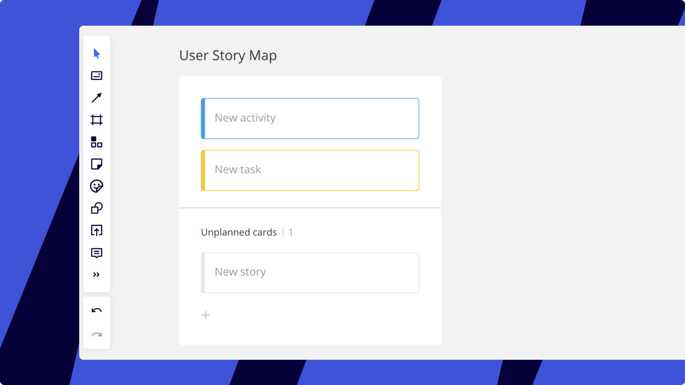

Crie rapidamente um mapa de história do usuário usando nossa framework rápida e flexível! **O mapeamento de histórias de usuário** é um template interativo criado com a ajuda do método inventado por Jeff Patton. Esta ferramenta torna o trabalho com histórias de usuário no desenvolvimento ágil muito mais fácil. É uma versão melhor do backlog que ajudará você a explicar seu produto, priorizar e plano lançamentos.

<iframe allowfullscreen="" frameborder="0" src="https://player.vimeo.com/video/331940875" style="position: absolute; top: 0; left: 0; width: 100%; height: 100%;"></iframe>

> **Disponível em:** versão para navegador, [aplicativo para desktop](../../getting-started/apps-for-devices/05-desktop-app.md), [aplicativo para tablet](../../getting-started/apps-for-devices/11-tablet-app.md), [aplicativo móvel](../../getting-started/apps-for-devices/08-mobile-app.md) (funcionalidade limitada)

### Adicionando mapa de história do usuário

Para obter a ferramenta de mapeamento de história do usuário na barra de ferramentas, abra Aplicativos clicando nas setas, encontre **o Mapa de história do usuário** e instale-o.

.jpg)
*Adicionando o aplicativo User Story Map*

Um novo ícone aparecerá entre os aplicativos, arraste-o para a barra de ferramentas para acesso rápido.

*Ícone de mapeamento de história do usuário na barra de ferramentas*

Há duas maneiras simples de adicionar um mapa de história do usuário ao board:

- Arraste o ícone **de mapeamento da história do usuário** da barra de ferramentas e solte-o no board
- Selecione o ícone **de mapeamento da história do usuário** e clique no board

Mapeamento de histórias do usuário

Para uma melhor experiência, defina o zoom do board para **100%** para criar um mapa da história do usuário .

Use os seguintes atalhos para acelerar o processo de criação:

- **Retorne** para editar um cartão selecionado e criar novos
- **Tab** para criar uma nova atividade, uma tarefa ou uma história
- **Setas** para mover entre os elementos do mapa da história do usuário
- **Escape** para sair do modo de edição de cartão
- **Ctrl** + **←→↑↓** (*para Windows*)/**Cmd** +**←→↑↓** (*para Mac*) para adicionar cartões
- **Ctrl** + **C** e**Ctrl** + **V** (*para Windows*)/**Cmd + C** e **Cmd + V** (*para Mac*) para duplicar um cartão
- **Excluir** para excluir um cartão

### Edição de cartões

Quando um [cartão](../essential-tools/02-cards.md) é enrolado, você só pode editar seu título, mas todas as outras configurações estão disponíveis no menu de contexto: alterar a cor do cartão, adicionar tags, atribuir tarefas aos membros do time, adicionar links e datas. Clique no ícone **Expandir** para adicionar ou ver a descrição do cartão.

Para mais informações sobre edição de cartões, confira [este artigo prático](../essential-tools/02-cards.md).

:::warning
Cartas dentro do USM não podem ser[bloqueadas](../working-on-the-board/17-locking-content-on-the-board.md)e[agrupadas](../working-on-the-board/08-structuring-board-content.md).
:::

*Menu de contexto do cartão*

### Lançamentos

A opção de adicionar lançamentos ajuda a separar as iterações de desenvolvimento do produto. Há duas maneiras de adicionar uma versão:

- No controle pop-up. Clique em "**+**" para adicionar um novo lançamento
- Adicione uma versão acima ou abaixo por meio do menu de contexto. Ele também pode ser movido para baixo, renomeado ou excluído

*Adicionando uma versão*

### cartões do Jira dentro do USM

Você pode inserir facilmente seus [cartões do Jira](../../integrations-apps/atlassian/03-jira-cards.md) na framework de mapeamento de histórias do usuário arrastando-os e soltando-os nas versões específicas.

Você também pode [converter cartões em cartões do Jira](../../integrations-apps/atlassian/03-jira-cards.md). Observe quenão é possível converter cartões localizados na linha **Tarefas** do USM em cartões do Jira.

Jira_cards_in_USM.jpg
*cartões do Jira no USM*
